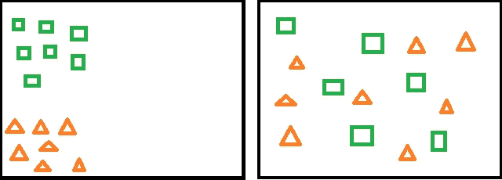
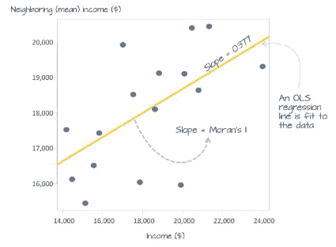
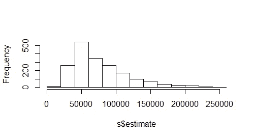
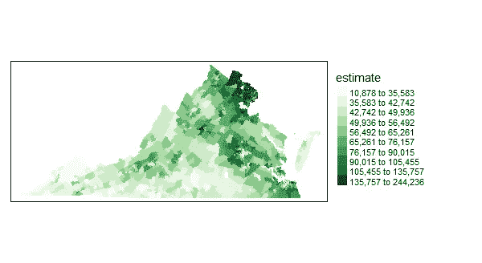
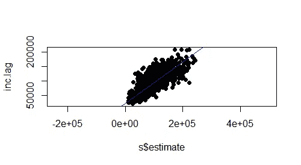
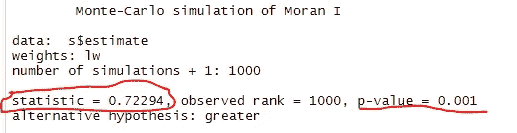

# 空间自相关:邻居影响邻居

> 原文：<https://towardsdatascience.com/spatial-autocorrelation-neighbors-affecting-neighbors-ed4fab8a4aac?source=collection_archive---------22----------------------->

## 了解值和事件的空间聚类


安德鲁·斯图特斯曼在 Unsplash[上的照片](https://unsplash.com?utm_source=medium&utm_medium=referral)

本文的目的是介绍地理空间分析中的一个重要概念——“空间自相关”，重点介绍以下内容:(1)自相关的关键概念；(二)行业应用和(三)在`R`中的实施

> “一切都与其他一切相关。但是近处的东西比远处的东西更有联系”。[瓦尔多·托布勒(1969)的地理第一定律](https://en.wikipedia.org/wiki/Tobler%27s_first_law_of_geography)

为了理解上面的托布勒定律，我们来做一个思维实验。

让我们从诸如 [Zillow](https://www.zillow.com/) 的列表网站中随机挑选一所房子，假设该房子的列表价格为 40 万美元。接下来说，旁边的房子也挂牌出售。现在，如果你要预测第二套房子的价格，给你两个选择，45 万美元和 120 万美元，你会选哪个？

如果你选择了 45 万美元，那么你已经潜意识地知道什么是空间自相关。确实是两个邻居在一些共同特征上的相关性(比如房价)。“Auto”表示自我，“correlation”表示关联。因此，用一种更正式的说法来说，自相关是相邻观测值之间相似性的一种度量，它描述了在给定的空间尺度上某个变量(如人口密度)的观测值彼此相似的程度。或者简单地说，“莫兰 I 统计量是一个变量(比如收入)与其周围值之间关系的相关系数”([来源](https://mgimond.github.io/Spatial/spatial-autocorrelation.html))。

> 请注意，有一个类似的概念称为时间自相关，其中观察(例如，身高，体重等。)与前一时间点的观察值相关。这种时间自相关在[时间序列预测](/time-series-forecasting-from-naive-to-arima-and-beyond-ef133c485f94)中是一个有用的概念。



在这些图中，几何图形在两个方面不同:形状和颜色。左边的块的位置是可预测的，因为相似的东西彼此邻近，因此空间自相关，而右边的形状是不可预测的，因为它们或多或少是随机分布的。

## ***如何量化自相关(The Moran's I)***

只需查看地图，我们就能对某些要素的空间自相关有所预感。然而，有一个正式的方法来定量测量它，莫兰的 I T8 就是一个用于这个目的的统计量。它取-1 和+1 之间的值(如正态相关系数， *r，* would)，同时提供相关的*p*-值作为显著性测试(下面讨论)。正的 Moran's I 表示相似的观察值彼此更接近，而负值表示不相似的值聚集在一起。0 左右的值表示没有自相关，相反，观察值是随机分布的。



i *ncome* 与 i *ncome 的滞后散点图。回归线的*斜率代表莫兰 I 统计量。([来源](https://mgimond.github.io/Spatial/spatial-autocorrelation.html))

## **衡量莫兰 I(蒙特卡罗模拟)的显著性**

一旦对特定数据集测量了莫兰的 I，在观测值随机分布的零假设下，如何知道它是否显著？

测量显著性的一种方法是执行蒙特卡罗测试。该过程分三步完成:(I)首先，观察值(如房价)随机分布在不同的空间单位(如县多边形、栅格像元等)，(ii)然后，计算该随机数据集的莫兰氏 I，(iii)最后，将模拟的莫兰氏 I 与观察到的莫兰氏 I 进行比较。这三步过程重复多次。运行所有模拟后，概率 *p* 计算如下:

((大于观察到的莫兰 I +1 的模拟莫兰 I 的数量)/(模拟 ran + 1 的数量)

比如说，

`*number of simulations = 200*`

`*number of simulated Moran's I that are higher than observed value = 2*`

*然后根据上面的等式，零假设为真的概率:*

`*p = (1+1)/(200+1) = 0.009*`

其中 *p < 0.01* 因此，可以拒绝观测值(如人口、房价)在空间上随机分布的零假设。换句话说，观察到的房价自相关性非常显著。

## **自相关的行业应用**

自相关是空间分析中的一个关键概念，具有广泛的行业应用。其中一些如下:

*   **空间不平等/多样性的衡量标准**:收入、人口、种族等。聚集或均匀分布在某些区域—可以使用 Moran 的 I。
*   它已经被用于识别伦敦城市土壤中稀土元素的污染热点
*   已用于演示感兴趣的变量的不同 [**距离衰减函数**](https://link.springer.com/chapter/10.1007/978-3-642-01976-0_10) (例如，房价作为距市中心距离的函数下降多远？).
*   自相关经常用于许多其他机器学习算法(例如空间回归、分类、聚类分析)以及作为 EDA 一部分的空间数据可视化(例如热图、热点分析)

# R 中的 5 步实现

*步骤 1:安装依赖关系*

```
library(sf)
library(spdep)
library(tigris)
library(acs)
library(tidyverse)
library(tmap)
```

*第二步:获取数据*

我在这个演示中使用的数据是从[美国社区调查](https://www.census.gov/data/developers/data-sets/acs-1year.html)中检索的县/人口普查区级别的家庭收入中值数据集。要访问数据，用户必须发出一个针对 API 密钥的[请求。在我的情况下，一旦提出要求，处理速度相当快。](https://api.census.gov/data/key_signup.html)

```
api="MY API KEY"
api.key.install(key=api)
acs.tables.install()set.seed(1234) # because we are randomizing part of the process# Access the shapefile
s <- get_acs(geography = "tract", variables = "B19013_001", 
                state = c("VA"), geometry = TRUE)
# remove NA values is any
s <- na.omit(s)# select column to work with
s <- subset(s, select=c("estimate"))
```

*第三步:探索性数据分析*

```
# check data skewness
hist(s$estimate, main=NULL)# check for outliers
boxplot(s$estimate, horizontal = TRUE)# plot variable
tm_shape(s) + tm_fill(col="estimate", style="quantile", n=5, palette="Greens") +
tm_legend(outside=TRUE)
```



我感兴趣的变量不完全是我需要的形状，因为似乎有一些异常值。但是这应该适用于这个演示。



这显示了弗吉尼亚州人口普查区的家庭收入中位数的分布情况。收入差异非常明显，可以直观地识别出来。应该有很高的自相关性，但是我们会看到的！

*第四步:建模*

```
# define neighbor
nb <- poly2nb(s, queen=TRUE) # here nb list all ID numbers of neighbors;# assign weights to neighbors
lw <- nb2listw(nb, style="W", zero.policy=TRUE) # equal weights# compute neighbor average
inc.lag <- lag.listw(lw, s$estimate)# plot polygons vs lags
plot(inc.lag ~ s$estimate, pch=16, asp=1)
M1 <- lm(inc.lag ~ s$estimate)
abline(M1, col="blue")# access Moran's coeff
coef(M1)[2]# calculating Moran coeff with one line
I <- moran(s$estimate, lw, length(nb), Szero(lw))[1]
```



这只是一个有空间滞后的家庭收入散点图

*第五步:假设检验*

```
# hypothesis test with moran.test function
moran.test(s$estimate,lw, alternative="greater")# using Monte-Carlo simulation
MC<- moran.mc(s$estimate, lw, nsim=999, alternative="greater")# View results (including p-value)
MC# plot Null distribution
plot(MC)
```



正如所料，莫兰的 I 统计值(0.72)相当高，表明弗吉尼亚州中等家庭收入的空间自相关性显著(见 p 值)

## **结束注释**

了解空间自相关是空间数据分析中的一个重要概念-不仅用于了解数据的空间模式和变化，还用于业务决策。它也是为高级空间显式统计和机器学习算法提供输入的关键统计数据。就实现而言，一旦有了数据，实现起来就相当容易了。我在`R`环境中实现，但是也有一些`Python`库(例如`geopandas`)，然而，在我的经验中，R 更加用户友好，因为使用现有的包可以方便地访问县/人口普查区域规模的数据集。