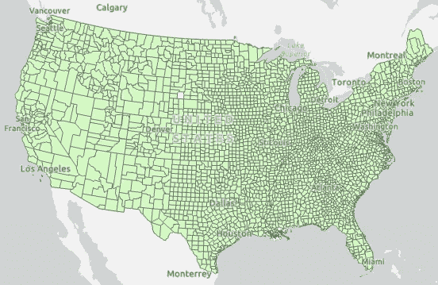

# 在 ArcGIS Pro 中使用 Dask 进行空间数据工程

> 原文：<https://towardsdatascience.com/spatial-data-engineering-using-dask-in-arcgis-pro-1298e67334ac?source=collection_archive---------49----------------------->

照片由 [**安德鲁·尼尔**](https://www.pexels.com/@andrew?utm_content=attributionCopyText&utm_medium=referral&utm_source=pexels) 发自 [**像素**](https://www.pexels.com/photo/assorted-map-pieces-2859169/?utm_content=attributionCopyText&utm_medium=referral&utm_source=pexels)

世界上的数据环境正以指数级的速度增长，这使得执行适当的分析以获得指导和推动各种决策所需的见解和信息变得非常重要。**的问题‘在哪里？’**成为决策制定不可或缺的一部分，因为几乎所有数据点都有地理位置。

为了完成有效的数据分析，在“哪里”，我们需要进行适当的数据工程。数据工程是指对数据进行规划、准备和处理，使其对分析更有用。在本文中，我们将使用 ArcGIS Pro、ArcGIS notebook 并集成一个开源库— [Dask 来执行数据工程。](https://dask.org/)

# 为什么选择 Dask？

[Pandas](https://pandas.pydata.org/) 是在 [Python](https://www.python.org/) 编程语言中用于数据争论和分析的最流行和最受欢迎的数据科学工具之一。由于算法和本地内存限制，熊猫在大数据方面有自己的局限性。

然而，Dask 是一个开源的免费 Python 库。Dask 提供了以最少的重写更自然地扩展 Pandas、 [Scikit-Learn](https://scikit-learn.org/stable/) 和 [Numpy](https://numpy.org/) 工作流的方法。Dask 的用户界面有三(3)种主要类型，即

1.  数组，
2.  包，还有
3.  数据框。

在本文中，我们将主要关注 Dask 数据框架。就性能和可伸缩性而言，可以将 Dask 视为 Pandas 的扩展。更酷的是，你可以在 Dask dataframe 和 Pandas dataframe 之间切换，按需进行任何数据转换和操作。它是 Python 中一个灵活的分布式并行计算库。阅读[更多](https://www.saturncloud.io/s/practical-guide-to-dask/)。

# 准备好 ArcGIS Pro

[**ArcGIS Pro**](https://www.esri.com/en-us/arcgis/products/arcgis-pro/overview) 是来自 [Esri 的最新专业桌面地理信息系统(GIS)应用。](https://www.esri.com/en-us/home)使用 [**ArcGIS Pro**](https://www.esri.com/en-us/arcgis/products/arcgis-pro/overview) ，可以浏览、可视化、分析数据；创建 2D 地图和三维场景；分享你的作品。

要开始数据工程会话，我们需要在 ArcGIS Pro 上进行一些初步操作，包括

*   **在 ArcGIS Pro 中启动新项目和 jupyter 笔记本**
*   **在 ArcGIS Pro 上安装 Dask 库**

**在 ArcGIS Pro 中启动新项目和 jupyter 笔记本:**正确安装后，以下步骤将帮助您启动第一个项目。

ArcGIS 开始页面

创建 Jupyter 笔记本

打开 Jupyter 笔记本

笔记本已创建

步骤描述

**在 ArcGIS Pro 上安装 Dask 库:**python 体验已通过“Conda”包管理器整合到 ArcGIS 中。Conda 的包管理器自动使用 python 库和管理工作环境。让我们弄清楚一些术语的含义。

*   环境:包含“Conda”包集合的文件夹或目录。
*   包:包含 python 软件的压缩文件。
*   Channel:指向存储库的 URL。
*   存储库:包的存储位置。

在 ArcGIS Pro 中安装 Dash 所需的步骤如下所示:

ArcGIS Pro 项目页面的元素:安装过程

ArcGIS Pro 项目页面的元素:安装过程继续

# Dask 的数据工程

由[万花筒](https://unsplash.com/@kaleidico?utm_source=medium&utm_medium=referral)在 [Unsplash](https://unsplash.com?utm_source=medium&utm_medium=referral) 上拍摄的照片

本笔记本描述了下载和准备美国总统选举数据的过程。您将处理缺失值，重新格式化数据类型，并重新构建表的格式。这篇文章的参考资料可以在 [**这里**](https://github.com/codebrain001/Spatial-Data-Engineering-using-Dask-in-ArcGIS-Pro) **找到。**

**加载并准备数据**

要下载和准备选举数据，您将使用 ArcPy、ArcGIS API for Python 以及 Pandas 和 Dask 数据框架。首先，您将导入这些模块来使用它们。然后，您将为美国县选举数据创建一个变量，并使用该变量将数据读入 Dask 数据帧。

**清理数据**

从上面数据集的预览中，可以观察到“state_po”是“state”功能的缩写。为了使数据更清晰，我们必须删除这个多余的特征。

选举数据包括在 ***FIPS、政党和候选人选票*** 字段中缺失数据的记录。这些丢失的数据被称为空值。在正确识别之后，我们必须设法处理带有缺失值的特性。

*   用一个值填充它们
*   移除数据集中的实例

我们在这里使用的处理缺失值的策略是用有效的有代表性的值替换缺失值。这可以通过 Dask 数据帧使用 ***fillna*** 方法实现。

***【FIPS】***和 ***【候选人投票】*** 特征都是数值。在这种情况下，由于数据是连续的，我们可以使用平均值或中值来很好地代表特征的集中趋势。在这种情况下，我们将使用这些特征的平均值来填充缺失值。

我们只剩下了**中缺失的价值观*方*中的**特征。缺失值非常大，这使得我们必须做出正确的选择，用什么来填充它。让我们大致了解一下特性中的独特值。如下所示，这描绘了选举中的投票方。为了得到一个无偏的数据集，我们将用“未记录”来填充缺失值。

**探索和处理数据类型**

在查看数据时，您注意到 ***FIPS*** 字段被视为数值字段，而不是字符串。因此，FIPS 值中的前导零已被删除。得到的 FIPS 值只有四个字符，而不是五个。您将确定有多少记录缺少前导零，并添加或追加缺少的零。

同样，像 ***年*** 这样的字段应该是整数值而不是浮点数据类型。

**重新格式化表格结构**

目前，表中的每条记录对应于一个县的一名候选人和他们的选票。您需要重新格式化该表，以便每个记录对应于每个县，字段显示该选举年不同候选人的选票。使用[数据透视表地理处理工具](https://pro.arcgis.com/en/pro-app/tool-reference/data-management/pivot-table.html)或 [Excel 数据透视表](https://support.office.com/en-us/article/create-a-pivottable-to-analyze-worksheet-data-a9a84538-bfe9-40a9-a8e9-f99134456576)可以做到这一点，但 Python 可能会使自动化和共享更容易。
下面的动画演示了重组表格的步骤:

下面的代码单元格执行这些步骤

**计算附加列:特征工程**

这里，我们将使用更新后的表中的值来添加额外的信息列，例如非主要政党的票数、每个政党的选民百分比等等。每一列都被称为数据集的一个属性。

**地理启用数据**

您最终将在空间分析中使用这些数据。这意味着数据需要包含位置信息，以确定数据在地图上的位置。您将使用现有的地理启用县数据对数据进行地理启用，或者向数据中添加位置。

**加入数据**

您有一个包含选举数据的数据框( ***df*** )和一个包含县几何数据的空间化数据框( ***counties_df*** )。您将把这些数据集合并成一个。

**查询和计算属性**

因为您有 2016 年的投票年龄人口，所以现在可以计算 2016 年的平均投票率(投票率)。该数据框架包括 2010 年至 2016 年的记录，但只有 2016 年的投票年龄人口。在计算投票率之前，您需要创建 2016 年的子集数据框架。

**验证数据**

在继续其他数据准备之前，您应该确认已经成功创建了输出数据。

首先，您将验证投票率的值。您将删除空值，因为这些值代表一个分数(总票数除以投票年龄人口)，您将确认这些值的范围在 0 和 1 之间。

**更新验证数据**

在查看了人口普查局 2016 年的投票年龄人口数据后，您确定这些县的投票年龄人口较低，误差幅度相当大。这可能是这些县投票率高于 100%的原因。

您将使用这些县的误差范围上限来重新计算这些县的选民投票率字段:

*   科罗拉多州圣胡安县:574 人
*   新墨西哥州哈丁县:562 人
*   德克萨斯州爱县:86
*   德克萨斯州麦克马伦县:566 人

这些信息是从[这里的](https://data.census.gov/cedsci/table?q=voting%20age%20population%202016&g=0500000US08111,35021,48301,48311&hidePreview=true&table=DP05&tid=ACSDP5Y2016.DP05&t=Age%20and%20Sex&y=2016&lastDisplayedRow=6&vintage=2016&mode=&moe=true)中提取的。

**将数据框转换为要素类以进行空间分析**

您将使用本脚本开头导入的 ArcGIS API for Python 将空间化数据框导出到要素类。

注意:执行以下单元格可能需要几分钟时间

在页面顶部，单击“数据工程图”选项卡。拖动数据工程图选项卡以显示为其自己的窗口。查看添加到数据工程地图的要素类。

**数据的颜色每次添加到地图时都会有所不同。**

我希望本文能让您体会到数据工程对于 ArcGIS Pro 中空间分析的重要性。感谢您的阅读。

了解更多[**土星云**](https://www.saturncloud.io/s/spatialdataengineering/)

由 [Kelly Sikkema](https://unsplash.com/@kellysikkema?utm_source=medium&utm_medium=referral) 在 [Unsplash](https://unsplash.com?utm_source=medium&utm_medium=referral) 上拍摄的照片