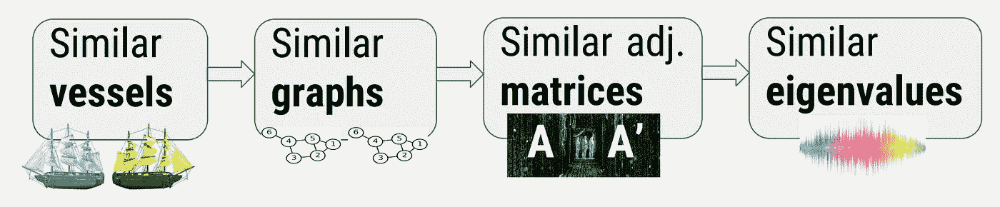

# 空间数据:图形-光谱作为特征

> 原文：<https://towardsdatascience.com/spatial-data-graph-spectrum-as-features-da5d10ec2d68?source=collection_archive---------27----------------------->

一只小鸟在听吉米·亨德里克斯的红房子歌曲，还有一艘船。阿莫斯·霍奇曼的照片。经允许重新发布。

在我的第一篇中型文章中，我将展示一种用图论中的特性丰富空间数据的好方法。这些功能捕获数据中的重要信息，否则很难访问这些信息。

这个想法在 [DataHack IL 2016](https://www.youtube.com/watch?v=xk3Z0zgbS4I&feature=youtu.be&t=297) 中获得了向风奖创新奖，它是 Mor Nitzan、Maria Dyshel、 [Noa Weiss](https://medium.com/u/94ed18c37f4b?source=post_page-----da5d10ec2d68--------------------------------) 和 Guy Keren 的联合作品。

**TL；DR** 空间数据(例如，一段时间内车辆的 GPS 位置)可以用图形表示。这些图形的复杂结构可以压缩成数学对象，即“特征值”。这些特征值易于计算，并且非常有利于区分空间行为(例如，驾驶员的行为)。你可以把那些特征值作为新的特征！

我喜欢这个正在讨论的魔术的一点是:

1.  它可以很容易地应用于许多领域(下面我将给出几个例子)。
2.  它捕捉到数据中真实的行为，否则很难处理。
3.  人们不使用它是因为其中涉及的数学听起来很吓人。但是:
4.  从 Python 和 R 到 Matlab——它在您使用的任何标准 ML/DS 平台上都非常容易使用！您可能甚至不需要导入/加载新的包/库。

让我们开始吧。

# 数据——什么是“空间”？

我们专注于空间数据，这些数据可以是地理空间数据，如来自一队汽车的 GPS 信号，或者当应用程序用户在智能手机上使用该应用程序时的地理位置。它也可以在更抽象的空间中是“空间的”，例如在线用户在网站之间移动，或者模因(或新冠肺炎)如何在社交网络中传播。

作为一个具体的例子，我将把重点放在我们最初想到这个想法的数据上: [Windward](https://wnwd.com/) 数据。

Windward 是一家专注于海事情报的初创公司。他们有很多关于船只的独特数据，但为了简单起见，我们将集中于船只的 GPS 位置，时间分辨率为，比方说，每小时。

想象一下，我们有 10 万艘船只的数据:过去 5 年中每小时的 GPS 定位。即使有如此简单的数据，你也可以设计出许多特征:船速、方向、领海、距海上兴趣点(如海峡、港口等)的距离。)，可以添加领域知识和外部数据(河流、海峡、国家、港口、海洋深度、日光、天气等)。)，但是空间数据有一个重要的方面可能会丢失。它隐藏得很好，很难直接进入。

但是我们一会儿会讲到。让我们先确定我们的目标。

# 目标

我们将专注于一个经典的监督分类问题，但我要介绍的特征也适用于其他任务:它们只是真实现象的非常好的描述符。它们封装了主要信息。

**分类挑战**:有不同类型的海上船只，从微型渔船到超级油轮和散装船。我们的目标是将 100K 艘船只分为 10 种类型。

# 挑战

假设数据是干净的、平衡的，并且有足够的训练数据。每个初学数据的科学家都会很容易地根据每小时的 GPS 位置设计出很酷的要素，但是空间行为中有一个方面很难编码为要素，即使对于专家来说也是如此(这种困难可能是固有的，我将在后面介绍)。

我们用一个直观的例子来解释这个。

想想夏威夷的一艘渔船和意大利的一艘渔船，将它们与一艘大型油轮相比，你会注意到不同之处。渔船往往有一个“母港”,进进出出。也许每天，也许每月——但运动“形状”保持相似。相反，离开港口的油轮通常会以几乎直线的方式驶往目的地并返回。在地图上，夏威夷和意大利的两艘渔船将画出一个星形，而油轮将画出巨大的之字形穿过海洋。

这显然是一个过度简化的问题，但是我希望现在已经清楚我之前提到的是什么类型的信息了:当你看着他们在地图上画出的形状时，很容易区分他们。但是我们怎样才能把这个图编码成一个特征呢？图论来拯救我们了。

# 数学部分

这里我做一个简短的 D 游，简单介绍一些你可能比较熟悉的术语:*图，邻接矩阵，特征值*。我将详细说明一个*图的频谱*及其特性。也就是说，我们不会进入精确、正式的定义(如果你感兴趣，我在下面添加了参考资料)。相反，我会试着复习一般的想法和相关的直觉。

我确实假设了一些关于矩阵特征值的先验知识。如果你不太关心数学，你可以跳到下一节。

**图表。** [图](https://en.wikipedia.org/wiki/Graph_%28discrete_mathematics%29)是由一组*顶点* V(又名节点)和一组*边* E(又名链接)组成的数学对象。每条边是两个顶点之间的链接。边可以是有向的，使得边 eᵢⱼ是从第个顶点*到第*个顶点的边*(但不是反之亦然)，但是为了简单起见，我们将假设一个无向图，其中对于每个边 eᵢⱼ还存在一个边 eⱼᵢ.*

**邻接矩阵。**一种表示图形的方法是用方阵:如果有边 eᵢⱼ，矩阵中的(I，j)项为 1，否则为 0。这个矩阵被称为图的“[邻接矩阵](https://en.wikipedia.org/wiki/Adjacency_matrix)”，它是一个方阵(旁注:它也是拉普拉斯矩阵的平方)。

**特征值。**不用深入定义，我只是提醒你，对于一个正方形 *n×n* 矩阵，特征值是具有代数和几何意义的 *n* 数。每个特征值都有一个特征向量。图的特征值/向量是其邻接矩阵的特征值/向量。

*图的特征值*是图的邻接矩阵的特征值(在文献中存在替代定义，例如使用归一化的拉普拉斯算子，但是它们是相关的)。

图的特征值/向量反映了非常有趣的数学属性(如图的连通性、图的切割、扩展等)，它们在其他领域也得到很好的利用，如物理学(扩散和逾渗理论)、社会网络(中心性测量、模因和病毒的传播)和机器学习(如特征向量中心性测量，如著名的 PageRank 算法)。

**图谱及其性质**。如果我们把特征值按降序排列，串联成一个向量——这个向量就是所谓的“图的谱”。

在图论的其他未决问题中，有一些美丽的现象已经被实验观察到(例如，通过计算机模拟),尽管它们还有待证明。一些最有趣的问题是相关图的谱 **:** 什么时候两个不同的图会有相似的谱？谱完全相同的两个图什么时候会不一样？两个(随机)图有相似谱的概率是多少？

数学家们对图形的相似性/距离和图形的频谱之间的联系知之甚少——其中的东西比看上去的要多。但是我们知道的一点点就足够了。

我们所知道的是

1.  具有完全相同拓扑的两个图，即等于节点的排列(也称为同构)，将具有完全相同的谱。
2.  另一个方向并不总是正确的:有些图完全不同，但却有完全相同的频谱(又名“[同频谱](https://mathworld.wolfram.com/CospectralGraphs.html)”)

**但是我们也有以下两个猜想的经验证据:**

1.  高度相似的图形往往具有相似的光谱。
2.  高度不同的图形往往有非常不同的光谱。

看到我如何使用“相似”、“不同”和“倾向于”而不解释我的确切意思了吗？这是因为确切的定义和实际的推测陈述有些技术性。但这是你应该采纳的主要直觉。

尽管上述猜想仍未被证实——它们被用于实际的算法。这个想法来自于这样一个事实，即图的谱被用于图同构的启发式解决方案[3，4]，那么为什么不用于“几乎同构”呢？在社交网络中，它被成功地用于社交图中的模式检测[5]。

为了我们的目的，我们也要依靠这些推测！

关于图的光谱，我们还有很多不知道的。当我们逐渐在两个图形之间移动时，频谱究竟是如何变化的？它在某种意义上是单调的吗？随机图共谱的概率是多少(见[6])？漂亮的开放式问题，我甚至没有从特征向量的性质开始！

但是我们所知道的一点点足以帮助我们满足今天的需求。

这个技巧来自于图论和复杂性理论交汇处的另一个突出的公开问题:[图同构](https://en.wikipedia.org/wiki/Graph_isomorphism_problem)。给定两个图——不知道验证它们是否同构(即，顶点排列的拓扑相同)有多难。图的相似性问题与图的同构问题密切相关，因此困难可能是固有的。在图同构中，技巧是使用图谱的近似:不同的图谱意味着不同的同构。您可以将频谱视为图形空间到低维向量空间的低冲突散列函数。

换句话说:为了测量图形之间的相似性，我们将图形嵌入到一个 n 维向量空间中。嵌入中的欧几里德距离定义了图形空间上的距离。如果您想更深入地研究，请注意谱的 *l2-* 范数是邻接矩阵的迹的根，它也是拉普拉斯矩阵的 Frobenius 范数 *= sqrt(tr(A))* 。

让我们进行最后一步并降低维数:如果您记得 PCA 中特征值用于降维的用法，这里我们可以做同样的技巧:我们可以只取前 *k* 个特征值(实际上，其余的通常非常接近零，无论如何都可以忽略不计)。

# 总结一下数学:

*   我们通过获取邻接矩阵的特征值将图嵌入到低维空间，也就是谱空间。
*   有(未证实的)现象表明，图之间的相似性在谱空间中也趋于保持(使用 l2 范数)。
*   如同在 PCA 中一样，我们可以只考虑 *k* 个最大特征值，而不会丢失太多信息。

最后，我们可以回到海事数据(或任何您感兴趣的空间数据)。

# 诀窍是:嵌入船作为它的图谱

让我们来关注一艘在海洋中航行的船只。我们为每个这样的容器定义一个图形:

**节点**定义海洋上的节点(例如港口、海峡、海洋中预定义的多边形、[交通分隔方案](https://en.wikipedia.org/wiki/List_of_traffic_separation_schemes)等。).请注意，我们对所有血管使用相同的节点，只有边缘会有所不同。

如果给定的船直接在两个节点之间航行，我们说这两个节点之间有边。(这个定义很好商量，见下文改进)。

现在，最后每艘船都有一个描述其空间行为的图表，我们可以谈论“船的光谱”。

> 船舶→图形→矩阵→光谱→距离。看哪！

我们之前问过:既然我们可以通过观察船只在地图上绘制的形状来在视觉上区分它们，那么我们可以将这种绘制编码为一种特征吗？

现在我们可以用图论来回答这个问题:

> 频谱是将海上船只嵌入到低维向量空间中，捕捉船只的空间行为。

显示魔术背后的逻辑的图表。如果两条血管的空间行为相似，那么它们的特征值也趋于相似。虽然另一个方向不总是正确的，但在实践中，特征值是相似性的一个很好的近似值。图片作者。

# 在现实生活中如何使用？

在现实生活中，你有更多关于每艘船的信息。因此，您实际想要做的是将新的图形特征连接到其他特征。

让我们看看整个过程:

1.  为每个**容器**创建一个图表。
2.  对于每个**图**计算**光谱**。取顶- *k 个*特征值。
3.  使用这些 *k* 特征值作为 *k* 特征(如果有的话，连接到其他特征)。
4.  尽情享受吧！

# 可能的改进

为了简单起见，我描述了基本方法，但是您可以通过使用更微妙或更复杂的版本来改进您的结果:

*   边缘的定义可以根据您的任务进行改进。为了鲁棒性，可以只考虑船只使用超过阈值的边缘。你可以选择无方向、无权重的边，或者尝试使用多边或超边。
*   与其使用邻接矩阵的特征值，不如使用(归一化的)拉普拉斯矩阵的奇异值，甚至加权矩阵的奇异值。[1]
*   为了提高效率，不要计算所有特征值然后取 top- *k，*考虑使用一个只计算 top- *k* 奇异值，例如在 python 中使用 [scipy.sparse.linalg.svds](https://docs.scipy.org/doc/scipy/reference/generated/scipy.sparse.linalg.svds.html) 或[sk learn . decomposition . truncated SVD](https://scikit-learn.org/stable/modules/generated/sklearn.decomposition.TruncatedSVD.html#sklearn.decomposition.TruncatedSVD)。
*   真实的图通常是高度稀疏的。所以不要使用集中了这些特性的 SVD 库，因为这不会改变奇异值，而只会因为失去矩阵的稀疏性而增加计算量。

# 结论

现代数据的互连性让我们别无选择，只能接受图表视角。通过利用图论的力量，我们从复杂的数据中提取了更多的隐藏信息。

上面介绍的技术——使用特征值——应用于生产中真实数据的几个场景中。它改进了分类模型(如上所述)，但在聚类任务、风险模型和其他方面也显示了良好的结果。

有两个“困难”的子问题必须被克服:首先，为每艘船创建一个合理的图表。第二，通过取特征值来嵌入图。

在处理您的数据时，我建议您将任务分成两部分:首先，您如何将您的数据描述为一个或多个图表？第二，由于图是“重”对象，您应该使用哪些图论工具将数据嵌入到低维空间中？

请，[让我知道](mailto:sria.louis@mail.huji.ac.il)如果你使用了这个技巧并且在你的模型中看到了**好的**或**坏的**结果。

# 参考

## **良好的起点**

[1]朱，张平，&威尔逊，R. C. (2005 年 9 月).比较图的图谱研究。在 BMVC。

[2]谱图论，丹尼尔·a·斯皮尔曼——课堂讲稿。

## 图形匹配/同构问题

[3]梅山，S. (1988 年)。加权图匹配问题的特征分解方法。IEEE 模式分析和机器智能汇刊，10(5)，695–703。

[4]徐，李，王，等(2001).快速检索属性图中结构模式的 PCA 方法。IEEE 系统、人和控制论汇刊，B 部分(控制论)，31(5)，812–817。

## 社交网络中的实际应用示例

[5] Leskovec，j .，Singh，a .，& Kleinberg，J. (2006 年 4 月)。推荐网络中的影响模式。亚太知识发现和数据挖掘会议(第 380-389 页)。斯普林格，柏林，海德堡。

## 共谱图

[6]h . hae mers 和 e . Spence(2004 年)。共谱图的计数。*欧洲组合学杂志*， *25* (2)，199–211。