# SAP HANA 支持的空间数据科学

> 原文：<https://towardsdatascience.com/spatial-data-science-powered-by-sap-hana-9d1153afa577?source=collection_archive---------29----------------------->

## 了解如何在 SAP HANA 中加载、准备和分析空间数据

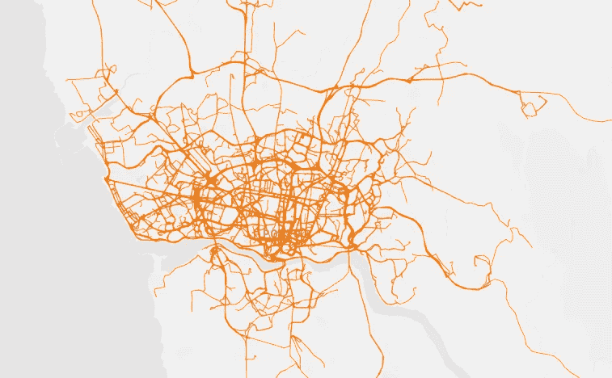

kepler.gl 可视化的滑行轨迹

在数据科学领域，空间数据变得越来越重要。因此，**(地理)空间数据科学**或**高级(地理)空间分析**有望成为 2020 年的[趋势话题之一。由于其将](https://opendatascience.com/the-2020-data-science-dictionary-key-terms-you-need-to-know/)[多模型数据](https://blogs.sap.com/2019/04/03/it-just-keeps-getting-better-sap-hana-as-a-multi-model-processing-engine/)与[嵌入式机器学习](https://help.sap.com/viewer/9dd6030c1fc24f799caff97b07f3668b/2.0.04/en-US/125fad2c076a425097d58ca008463bbb.html)无缝集成，SAP HANA 是这一不断发展的学科的首选平台。

为了支持数据科学家的日常工作，SAP HANA 提供 Python 集成已经有一段时间了。用于机器学习算法的 SAP HANA Python 客户端 API[甚至支持从 Python 调用数据库内 ML 算法。通过这种集成，数据科学家可以完全用 Python 构建机器学习模型，同时将算法应用于数据库，而无需将实际数据传输到客户端。](https://help.sap.com/doc/0172e3957b5946da85d3fde85ee8f33d/2.0.03/en-US/html/hana_ml.html)

**在这篇博客中，我想展示一些基本的地理空间分析以及与 SAP HANA 嵌入式机器学习的集成。我将从数据科学家的角度出发，使用 Jupyter 笔记本进行建模。**

尽管“空间不仅仅是地图”这一事实，但可视化空间分析的结果始终是一个好主意。有各种各样的图书馆在 Jupyter 笔记本中提供地理空间可视化，其中[follow](https://python-visualization.github.io/folium/)是最著名的一个。尽管如此，在使用了其中几个库之后，我决定在这个博客中使用 [kepler.gl](https://kepler.gl/) 。kepler.gl 是用于地理空间分析可视化的开源应用程序，可用于 Jupyter 笔记本。它特别适用于大量数据，并且在编码时具有相当低的接触体验(这是我选择 kepler.gl 的主要原因)。

本例使用的技术

**包括可再现性分析的完整 Jupyter 笔记本可以从 GitHub**T5[**下载。它被设计为在普通 SAP HANA Express 实例上运行。如果你对 Jupyter 笔记本本身有信心，你也可以直接跳到它上面，跳过博客的其余部分。**](https://github.com/mkemeter/public/blob/master/TaxiTrajectories.ipynb)

如果您不喜欢 Python 或者喜欢更详细的描述，我将在下面向您展示最重要的步骤和想法。

# 数据集

在为地理空间分析寻找合适的数据集时，我在 Kaggle 上偶然发现了这个不错的数据集:[https://www.kaggle.com/crailtap/taxi-trajectory](https://www.kaggle.com/crailtap/taxi-trajectory)

数据集包含波尔图市的出租车轨迹，格式为[linestring](https://en.wikipedia.org/wiki/Polygonal_chain)。事实上，它不仅仅包含点数据，这使得它特别有趣。数据本身可以作为 CSV 文件下载，我们将通过 Jupyter 笔记本将其导入 SAP HANA。

为了更好地理解数据的背景，我们还将纳入来自 OpenStreetMap 的兴趣点(POI)数据，因为我们预计出租车的上客位置与高密度的 POI 相关。

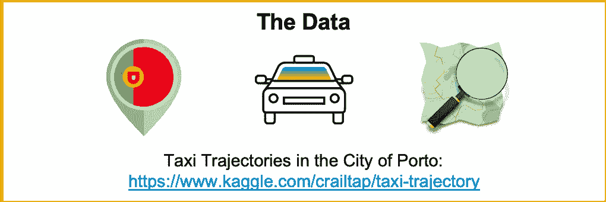

用于此示例的数据

# 设置和配置

从 Jupyter 中的地理空间分析开始，我们需要设置并导入所需的库。这些是我们将使用的主要软件包:

*   [**Pandas**](https://pandas.pydata.org/)**和**[**geo Pandas**](http://geopandas.org/)用于管理 Python 中的数据。虽然大多数人都熟悉熊猫，但 GeoPandas 只为处理空间数据的开发人员所知。可以理解为增强了地理空间能力的熊猫。****
*   ****[**SQLAlchemy**](https://www.sqlalchemy.org/) 用于数据库通信。SQLAlchemy 有一个可用的 SAP HANA 方言。请按照这些说明进行初始设置。****
*   ****[**OSMnx**](https://github.com/gboeing/osmnx) 是一个下载 OpenStreetMap 数据的舒适库。我们将使用这个库将 POI 数据加载到 SAP HANA，如这篇[博客](https://blogs.sap.com/2020/01/20/where-to-not-charge-my-car-openstreetmap-pois-in-sap-hana/)所述。****
*   ****[**kepler.gl**](https://github.com/keplergl/kepler.gl/blob/master/docs/keplergl-jupyter/README.md) 用于可视化地理空间数据。KeplerGL 是一个用于地理空间分析可视化的开源应用程序，已经嵌入到 Jupyter 笔记本中。从数据帧中可视化几何图形本质上是一行程序，您将在后面看到。****
*   ****[**hana_ml**](https://pypi.org/project/hana-ml/) 用于调用数据库内机器学习算法。在这里，您必须小心地为您的 APL 安装选择正确的版本。[这篇博客](https://blogs.sap.com/2018/01/11/installing-the-automated-predictive-library-apl-on-sap-hana-express-2.0)(尤其是 APL4 附录)帮助我为我的 HANA Express 实例设置了正确的版本。****

****所需进口的完整清单****

****值得一提的是，有一些[基于 Jupyter 笔记本的 SQLAlchemy 的内联 SQL 单元格魔术](https://github.com/catherinedevlin/ipython-sql)，我已经使用过了。cell magic 支持将 SQL 语句或多或少地直接写入一个单元格，而无需 Python 开销。****

****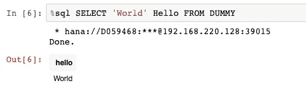****

****SQL 单元格魔术****

****关于 SQL 魔术的更多细节请参考[这篇博客](/jupyter-magics-with-sql-921370099589)。****

# ****保存和增强轨迹数据****

****我们希望将 CSV 文件加载到 Python 中，并保存在 SAP HANA 中以供进一步处理。使用 Pandas 将 CSV 导入数据帧只需一行代码:****

****一旦数据被加载到数据帧中，我们需要直接获取一些数据类型(例如，将时间戳转换为适当的日期时间字段)并过滤掉不包含轨迹数据的行项目。有一定数量的出租车没有或只有一个 GPS 坐标。****

****在 SAP HANA 中保存数据是一个双重过程:****

*   ****首先，我们将**持久化没有地理空间数据类型的平面数据**。****

*   ****其次，我们将从数据库中的文本表示生成地理空间列。****

****初始数据集只是提供一个具有一定数量的点的轨迹列。从[数据描述](https://www.kaggle.com/crailtap/taxi-trajectory)我们知道每隔 15 秒就有一个 **GPS 坐标。包含 10 个 GPS 坐标的行程将持续 150 秒。******

****我们可以从我们的数据集中导出该特征以及其他空间和非空间属性。以下语句将添加行程的起点、终点、持续时间、开始时间、结束时间、距离和平均速度。****

****我们上面使用的 HANA 空间函数如下:****

*   ****[ST_STARTPOINT](https://help.sap.com/viewer/cbbbfc20871e4559abfd45a78ad58c02/2.0.04/en-US/7a2230df787c10149136c5cce00bca87.html)****
*   ****[ST_ENDPOINT](https://help.sap.com/viewer/cbbbfc20871e4559abfd45a78ad58c02/2.0.04/en-US/7a206ce3787c10148b15e814933c0d0d.html)****
*   ****[ST_NUMPOINTS](https://help.sap.com/viewer/cbbbfc20871e4559abfd45a78ad58c02/2.0.04/en-US/7a21a2b2787c1014a45f89c27a231c20.html)****
*   ****[ST_LENGTH](https://help.sap.com/viewer/cbbbfc20871e4559abfd45a78ad58c02/2.0.04/en-US/7a2157fa787c1014a75baed762f031f5.html)****

****我们可以使用增强的属性来检查数据的不一致性。例如，我们会发现一定数量的旅行带有非常(！)平均速度高。在假定无罪的情况下，我们会将此视为“数据质量问题”。****

****我们假设我们现在有一个相当干净的数据集等待我们分析！****

# ****选择正确的空间参考系统****

****你可能已经注意到，我把数据转换成了另一个[空间参考系统](https://en.wikipedia.org/wiki/Spatial_reference_system) (SRS)。在我的代码中，我使用了变量' $srid '，它是我用平面 SRS 预先配置的。切换到平面投影的原因是**与圆形地球计算相比**提高了计算性能。****

****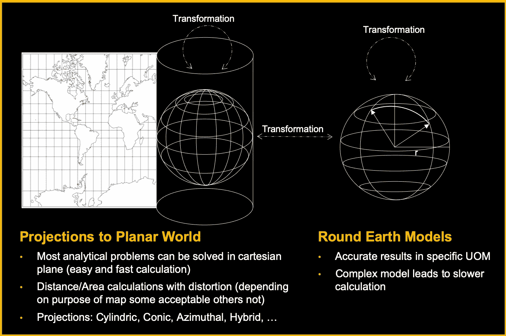****

****资料来源:SAP****

****如今，地图可视化最常用的 SRS 是所谓的 Web 墨卡托投影( [SRID 3857](http://epsg.io/3857) )。我们已经习惯了这样一个事实，格陵兰岛看起来和非洲一样大，而实际上，格陵兰岛的面积只是非洲面积的一小部分。****

****投影的失真随着到赤道的距离而增加。对于 web 地图来说不一定是问题的内容，在进行空间分析时可能会成为问题。对于我的分析，我选择了适用于葡萄牙的带有 [SRID 5018](http://epsg.io/5018) 的 SRS(意味着失真在葡萄牙的区域最小化)。GPS 坐标使用 [SRID 4326](http://epsg.io/4326) ，这是一个绕地球模型，能够以计算能力为代价进行精确计算。****

******那么为什么不干脆选择 3857 呢？所有的网络地图都使用它，最终，葡萄牙比格陵兰岛更接近赤道。为了说明我们在计算中引入的误差，我比较了不同空间参考系统中出租车的平均行驶距离:******

****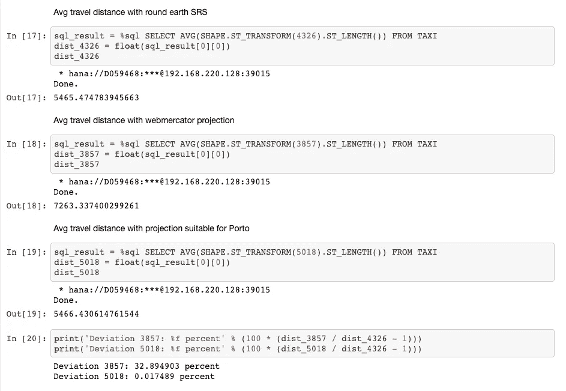****

****原来 SRS 3857 中的平均行驶距离要高出**30%以上(！)**比精确的绕地球计算。与适用于葡萄牙的 SRS 5018 进行同样的比较，误差仅为 0.01%，考虑到我们赢得的性能增益，这是可以维持的。****

******在为您的分析选择空间参考系统时，请始终牢记这一点！******

# ****包括兴趣点数据****

****最近，我发表了一篇关于如何使用 OSMnx 将兴趣点数据从 OpenStreetMap 加载到 SAP HANA 的博客:****

****[在哪里(不)给我的车充电？SAP HANA 中的 OpenStreetMap 兴趣点](https://blogs.sap.com/2020/01/20/where-to-not-charge-my-car-openstreetmap-pois-in-sap-hana/)****

****基本上，我做了同样的事情来检索波尔图的 POI 数据，但有一个有趣的不同点**:我**分析了该区域，而不是查询搜索字符串‘Porto’的 POI 数据，我的轨迹数据覆盖了**。也有一些去里斯本的旅行，我也可能对这些目的地附近的兴趣点感兴趣。我应用了[ST _ convegulhullaggr](https://help.sap.com/viewer/cbbbfc20871e4559abfd45a78ad58c02/2.0.04/en-US/90039a8e8d1e4257a3358d68e0520564.html)来计算所有轨迹上的凸包，并使用生成的多边形通过 OSMnx 查询 poi。******

**快速可视化揭示了凸包的大小。**

**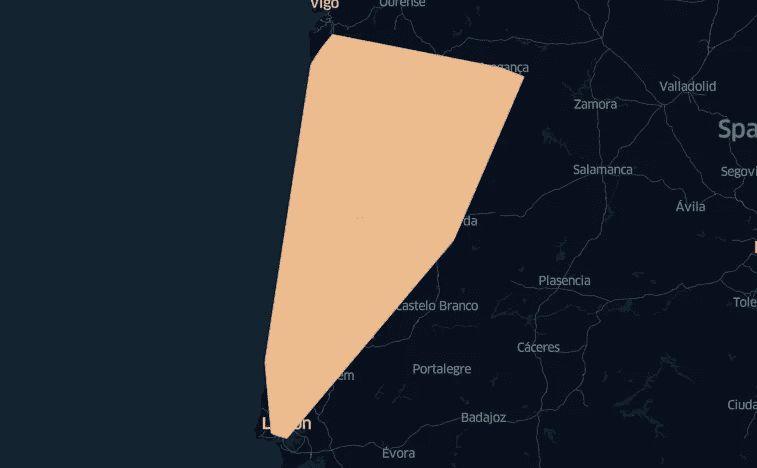**

**用 kepler.gl 生成上面的可视化结果只需要一行代码，其中 DataFrame (df_poi_shape)被传递给地图。执行单元代码时会出现交互式 kepler.gl 客户端。**

**包含多边形的 WKT 表示的数据帧，覆盖了所有轨迹，现在可以传递给 OSMnx。**

**最后，我们将包含兴趣点的地理数据框架存储到一个 HANA 表中(在我的例子中命名为 OSM_POI)。我们可以利用空间连接将这些数据整合到我们的分析中。**

# **添加参考网格**

**对于某些分析(即应用 ML 算法)，可能有利的是**去掉地理空间维度，代之以网格索引**来引用和聚合某些数据点。一个[六边形网格](https://help.sap.com/viewer/cbbbfc20871e4559abfd45a78ad58c02/2.0.04/en-US/c6ed0d41cdf84037925f1df6ed198349.html)比其他网格[有一定的优势](https://hexnet.org/content/hexagonal-geometry#tessellation)(例如矩形)。我们保留了一个横跨 250 个六边形单元的参考网格供以后使用。**

**网格仅覆盖滑行轨迹的起点和终点，这对于我们正在进行的分析是足够的。我们还使用 [ST_CENTROID](https://help.sap.com/viewer/cbbbfc20871e4559abfd45a78ad58c02/2.0.04/en-US/7a2b9111787c1014926c93c8506930b1.html) 添加了每个网格单元的质心。**

# **基础空间分析**

**完成所有准备工作后，我们现在准备好进行一些非常基本的空间分析。计算几个**聚合量**怎么样？**

**对你来说，这看起来不够“空间感”吗？请记住，所有这些测量值(距离、持续时间和速度)都是使用空间数据库功能从原始轨迹数据中获得的。我们刚刚从彻底的数据准备中获益。**

**此外，我们可以快速获取一些样本轨迹，并将其与 POI 数据一起可视化。请注意，kepler.gl 需要转换回 SRID 4326 以及表示为 WKT 或 GeoJSON。为此，我们使用 [ST_TRANSFORM](https://help.sap.com/viewer/cbbbfc20871e4559abfd45a78ad58c02/2.0.04/en-US/e2b1e876847a47de86140071ba487881.html) 和 [ST_ASWKT](https://help.sap.com/viewer/cbbbfc20871e4559abfd45a78ad58c02/2.0.04/en-US/7a169dff787c1014a095b86992806f14.html) (或者 [ST_ASGEOJSON](https://help.sap.com/viewer/cbbbfc20871e4559abfd45a78ad58c02/2.0.04/en-US/7a157dd1787c1014a5d8d88e3811bcc8.html) )。**

**可视化结果，我们还可以发现我们感兴趣的“点”不仅包含点数据，还包含**多边形，如大型医院建筑**。**

**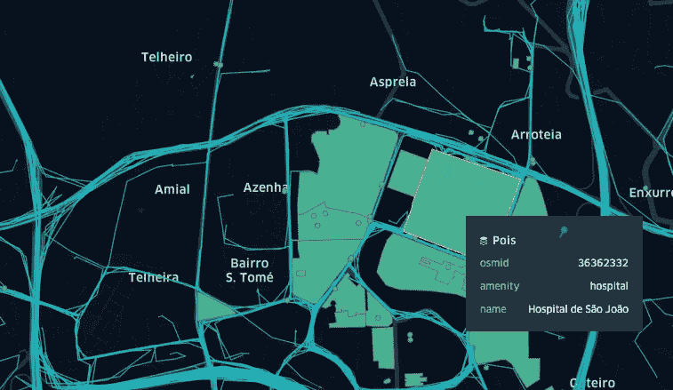**

# **分析提货地点**

**在一个城市，当你看到出租车的上车地点时，你会期望看到一些模式。当然，你会预计到机场的高需求，以及夜间或凌晨的夜生活区的高需求。**

**提货地点并不总是相同的。为了以有意义的方式聚合它们，我们再次应用了一个六边形聚类，它以对数标度计算每个位置聚类**的出租车搭载数量(以使可视化更有意义)。****

**这一次，我们不仅可视化了聚类多边形，还根据拾取的数量给多边形着色。此外，我们还引入了第三维度，并根据拾音器的数量来缩放每个六边形区域的高度。**

**是的，这对于颜色编码来说是多余的。那么我们为什么要这样做呢？**只因为我们能！****

**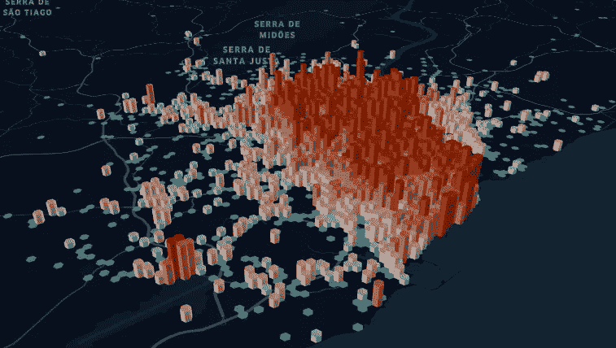**

**我们可以立刻认出波尔图郊区的机场。左边是拾音密度高的区域。然而，**接客率最高的地区就在波尔图**的正中心。**

**我们可以通过使用带有 [ST_INTERSECTS](https://help.sap.com/viewer/cbbbfc20871e4559abfd45a78ad58c02/2.0.04/en-US/7a19e197787c1014a13087ee8f970cce.html) 的空间连接来检索前 3 个单元格和这些单元格中的 poi。**

**我们可以看到，排名靠前的地点是波尔图的历史中心(靠近圣本托站；左单元)以及主火车站(Campanhã右边的牢房)，旁边有一个巨大的出租车站。**

**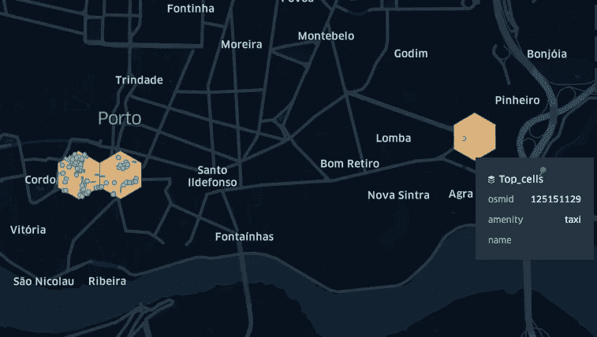**

**到目前为止，我们已经看到了皮卡的总数。当然，如前所述，这其中也有时间因素。某些地区在某些时候可能会有较高的流量。为了分析这种行为，我们引入了第二个宁滨维度。早些时候，我们使用六边形聚类构建了一个**位置宁滨**，现在我们通过聚合同一小时内的所有出租车乘坐次数来添加一个**时间宁滨**。**

**这个数据集可以交给 kepler.gl，它有一个特性可以生成一个随时间变化的**动画**。该视频显示了预期的高峰时间以及圣诞节和新年期间的某些不规则性。**

# **去机场的路线**

**我们认同我们之前的分析，机场在出租车乘坐方面扮演着特殊的角色。这一点也不奇怪。让我们再深入一点，看看接送地点之间的**关系。去某个地方的旅行通常从哪里开始？****

****我们不是基于位置来回答这个问题，而是基于网格**，使用我们之前创建的参考网格。因此，我们想回答的问题是:“当到达某个其他单元时，旅行通常从哪个六边形单元开始？”。以下语句计算参考网格中所有观察到的开始和结束单元格组合的行程数。**

**同样，我们需要更多的转换( [ST_X](https://help.sap.com/viewer/cbbbfc20871e4559abfd45a78ad58c02/2.0.04/en-US/7a290e0d787c10149429b3677c80c5a5.html) ， [ST_Y](https://help.sap.com/viewer/cbbbfc20871e4559abfd45a78ad58c02/2.0.04/en-US/7a295b1d787c1014b19cb803454504b4.html) )来适应可视化框架，这种可视化似乎需要单独的纬度和经度值。**

**这个结果可以用 3D 流可视化**。我们可以很容易地发现，大多数前往机场的航班都是从圣本托站附近出发的。(第二多的是坎帕尼亚的波尔图总站)****

**但是从圣便当站到机场的最佳方式是什么？要回答这个问题，我们可以查看从各个格网单元开始到包含机场的格网单元结束的所有行程的持续时间。**就这么办吧！****

**在数据中，我们可以观察到一些奇怪的行程，我们通过只允许短于车站和机场之间直线距离 2 倍的行程来过滤掉这些行程。在我们的抽象层次上，这对应于各个六边形单元的质心之间的 [ST_DISTANCE](https://help.sap.com/viewer/cbbbfc20871e4559abfd45a78ad58c02/2.0.04/en-US/7a182aa3787c101481f996e3d419c720.html) 。**

**为了可视化，我们**根据总行程持续时间**对轨迹进行着色(绿色表示快；红色慢)。**

**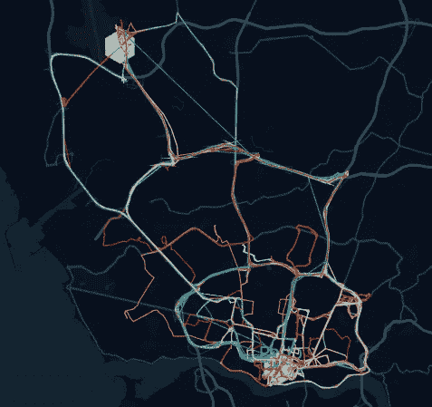**

**我们可以看到有三条道路通往机场。大多数交通使用中间的主干道，而一些(大概是聪明的)司机使用较小的便道。当然，这些行程的距离更长。**然而，许多使用较小通道的出行导致出行持续时间相当短。****

# **预测旅行的持续时间**

**到目前为止，我们已经对底层数据集有了很好的理解。我们主要处理地理空间功能和可视化。我们如何将这些知识整合到机器学习模型中？我们如何调整模型来理解地理空间数据？**

**阶梯一的答案是:**给定正确的预处理，我们的机器学习模型不需要实际理解地理空间数据！**使用我们的参考网格、空间连接和聚合，我们还可以将各个网格单元的 id 作为分类变量输入到我们的模型中。**

**只有我们知道这个 id 代表一个位置，我们可以将它映射回地图上——我们的 ML 模型不必关心那些繁琐的细节。**

**为了预测旅行的持续时间，我们使用 SAP HANA 的[自动预测库](https://help.sap.com/viewer/cb31bd99d09747089754a0ba75067ed2/3.3/en-US/5db34eae84ed44e49ec1f0f78dfb52a1.html) (APL)训练了一个**回归模型**。使用用于机器学习算法的 [Python 客户端 API](https://help.sap.com/doc/0172e3957b5946da85d3fde85ee8f33d/2.0.03/en-US/html/hana_ml.html)可以方便地调用 APL。使用这种方法，**模型训练将被下推到数据库**级别。我们将只向 Python 客户机传输数据，这是审查模型性能所必需的！**

**首先，我们将收集**训练数据**。**

**[HANA 数据帧](https://help.sap.com/doc/0172e3957b5946da85d3fde85ee8f33d/2.0.03/en-US/html/hana_ml.dataframe.html)‘hdf _ trajectories’的外观和**的行为与 Pandas 数据帧**相似，除了**数据不会传输到客户端**，除非‘collect()’被调用。**

**例如，可以用这条语句将前五个条目传输给客户机。**

**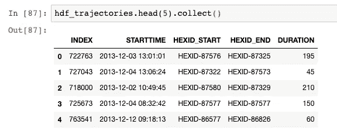**

**我们现在将这个 HANA 数据帧传递给模型训练函数，以训练一个以“持续时间”为因变量的[回归模型](https://help.sap.com/doc/0172e3957b5946da85d3fde85ee8f33d/2.0.03/en-US/html/hana_ml.algorithms.apl.html#module-hana_ml.algorithms.apl.regression)。**

**我们只允许 STARTTIME、HEXID_START 和 HEXID_END 作为输入变量。如前所述，我们的网格单元的 id 不是几何图形。APL 将自动处理时间戳,并生成一天中的小时、一周中的天、一月中的天等特征。**

**在博客的剩余部分，我将重点关注模型任务报告结果本身，而不是可视化它的代码。如果你对更多细节感兴趣，可以看看[全 Jupyter 笔记本](https://github.com/mkemeter/public/blob/master/TaxiTrajectories.ipynb)。**

**模型性能的主要指标是**预测力**和**预测置信度**。下图表明我们训练了一个**稳定模型，该模型具有一定的预测能力**(值为 0 表示猜测；1 将是有远见的)。**

**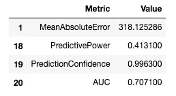**

**哪些因素会影响模型的结果？绘制贡献变量我们可以看到，空间维度的贡献最高。这是明显的，随着持续时间的增加，起点和目标之间的距离越来越远。**

**此外，我们还可以发现，一天中的某个小时贡献第二大，最后，一周中的某一天也是模型的一部分。请注意，我们启用了自动特征选择，这允许模型忽略无贡献的尺寸。**

**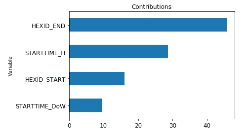**

**对于一天中的一个小时，我们预计会出现交通较慢、出行时间增加的高峰时段。我们可以通过绘制类别显著性来验证这一点。**

**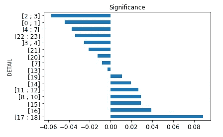**

**上图告诉我们，我们预计下午 5 点到 6 点之间的**最大延迟**(对“持续时间”的积极贡献)，我们预计凌晨 2 点到 3 点之间的**最短行程持续时间**(对“持续时间”的消极贡献)。**

****是啊，有道理！所以，我们的模型是有一定道理的！****

**最后，我们可以使用我们的模型来预测旅行时间。我们已经知道了索本托车站和机场，那么我们还应该选择什么呢？**

**我们的模型表明，2 月 10 日星期一早上 5 点乘坐出租车将持续 966 秒( **~16 分钟**)。**

**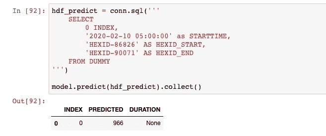**

**同样的行程在下午 5 点将花费我们**到 21 分钟**。**

**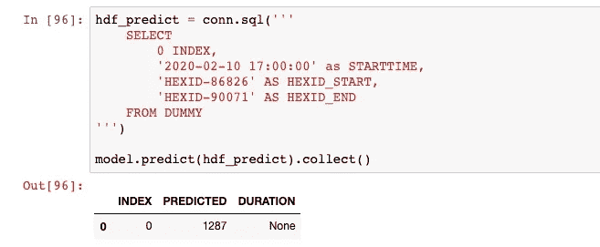**

****这听起来合理吗？让我们将它与一些可靠的来源进行比较，并让我们最喜欢的网络路由服务进行猜测(在撰写本文时，2 月 10 日是一个未来的日期)。****

****

**这实际上与我们的预测非常接近！请记住，我们的预测是基于 2013 年的一些出租车数据，而网络预测是基于数以亿计的智能手机用户提交他们的旅行地理位置和旅行速度。**

**预测出租车的实际目的地怎么样？你可以在我的后续博客中找到更多信息: [*用 SAP HANA 预测出租车目的地*](https://blogs.sap.com/2020/03/25/predicting-taxi-destinations-with-sap-hana/)**

# **摘要**

**首先我得承认我没去过波尔图。在写这篇博客的过程中，我有一种感觉，我应该亲自尝试一下从机场到历史中心的出租车之旅。我肯定把这个加到我的遗愿清单上了。**

****

**由[埃维拉尔多·科埃略](https://unsplash.com/@_everaldo?utm_source=unsplash&utm_medium=referral&utm_content=creditCopyText)在 [Unsplash](https://unsplash.com/s/photos/porto?utm_source=unsplash&utm_medium=referral&utm_content=creditCopyText) 拍摄的照片**

****从技术面来看，我们看到了以下情况:****

1.  **下载和保存地理空间数据集**
2.  **使用基本计算准备和增强地理空间数据集**
3.  **用空间谓词连接数据集**
4.  **创建参考格网以提取地理空间细节**
5.  **在 Jupyter 笔记本中可视化地理空间数据**
6.  **应用机器学习模型来预测实际上不包含任何几何数据类型列的数据集的行驶时间**

**我们所做的事情背后有一个通用的模式，这适用于许多用例:**

> *****准备*** *，* ***增强*** *，* ***抽象*** *，* ***形象化*** *最后但并非最不重要的* ***生成洞察力*** *。***

**这个价值链不一定要由一个人或一个部门来执行。可能同时涉及 **IT、GIS、数据科学、业务部门**。将(地理)空间数据科学集成到 SAP HANA 中，使您能够打破孤岛，并打开数据的**360°全方位视图**，而不是在部门之间移动部分信息。**

**最后一件事:我最喜欢的网络路由服务也有一个自动完成的网络搜索功能。这是我为“波尔图骚 b”得到的第一个建议:**

********

***原载于 2020 年 2 月 24 日 https://blogs.sap.com***。****