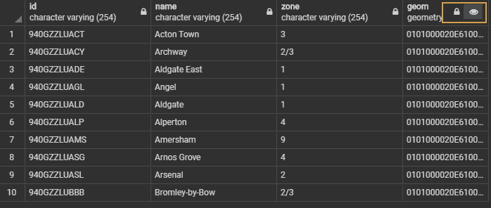
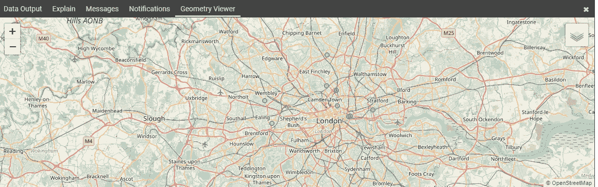
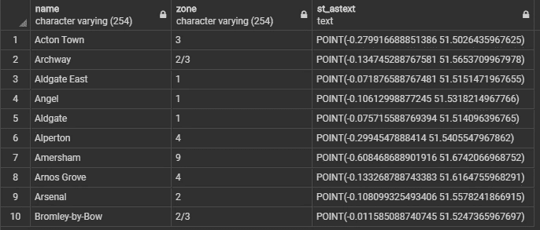
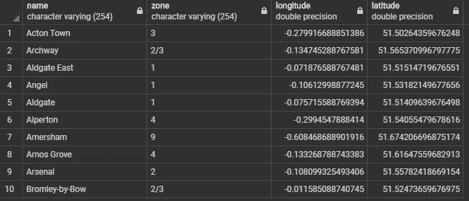
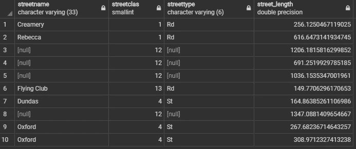

# 使用 PostgreSQL 的空间数据科学:几何

> 原文：<https://towardsdatascience.com/spatial-data-science-with-postgresql-geometries-c00387755700?source=collection_archive---------20----------------------->

## 波斯特吉斯

## PostGIS 几何类型和函数的初学者演练。


罗纳德·杨在 [Unsplash](https://unsplash.com?utm_source=medium&utm_medium=referral) 上的照片

T4:几何是将地理空间数据结合在一起的粘合剂。它们是任何空间数据处理不可或缺的一部分。在本教程中，我将介绍 Postgis 中一些不同类型的几何。我们还将通过真实世界的数据示例触及一些最常用的函数。

在我的上一篇文章中，我解释了如何安装 PostgreSQL 和激活 Postgis 扩展。我们还讲述了如何在 PgAdmin 中快速入门、创建空间数据库和加载空间数据。因此，如果您还没有设置 PostgreSQL 和 PostGIS，您可以以此为起点。

[](/spatial-data-science-with-postgresql-postgis-2f941c8c367a) [## 使用 PostgreSQL/PostGIS 的空间数据科学

### PostgreSQL 和 Python 空间数据入门实用指南。

towardsdatascience.com](/spatial-data-science-with-postgresql-postgis-2f941c8c367a) 

# 几何

在 PostGIS 中，开放地理空间联盟(OGC)和“SQL 的简单特征”规范中指定的所有对象和函数都可用。Postgis 中支持的几何数据类型包括:

```
POINT()LINESTRING()POLYGON((),())MULTIPOINT((),())MULTILINESTRING((),())MULTIPOLYGON(((),()), (()))GEOMETRYCOLLECTION(POINT(),LINESTRING())
```

PostGIS 还扩展了栅格数据类型以及 3d(高度表示为 Z)和 4d(时间通常表示为 M)几何类型。

将空间数据转换为 PostGIS 几何可让您充分利用 PostGIS 中的空间功能。一个新的最受欢迎的特性是 PgAdmin 中内置的几何可视化，我们将在下一节中看到。在本教程中，我们只涉及基本的几何，点，多边形和直线。其他几何图形是这些基本几何图形类型的扩展版本。

## 点

我们从点几何开始，它通常指的是空间中没有大小和宽度的点。让我们看看现实世界数据中的点几何，并在 PostGIS 中探索它的一些方法。

传统的 SQL 查询包含 SELECT 和 From。在下一段 SQL 中，我们返回前面上传的 tfl_stations 数据集的前十行。

```
SELECT id, name, zone, geom 
FROM public.tfl_stations
LIMIT 10;
```



电台表

这个结果，但是，有几何列，如果你点击眼睛，你会看到你的几何渲染如下图。



几何可视化

要获得数据的几何类型，可以使用 **ST_GeometryType(geom)** 来找出。例如，以下 SQL 代码会返回车站数据集的几何数据类型。

```
SELECT ST_GeometryType(geom)
FROM tfl_stations
FETCH FIRST ROW ONLY
```

正如我们所料，这个查询返回 ST_Point。

```
“ST_Point”
```

如果您喜欢将几何图形作为带坐标的文本，也可以使用 **ST_AsText(geom)。**下面的查询返回每个点的坐标。

```
SELECT name, zone, ST_AsText(geom)
FROM tfl_stations
LIMIT 10;
```



ST_AsText

要分别访问坐标，我们可以使用 ST_X 和 ST_Y，如下例所示。

```
SELECT name, zone, ST_X(GEOM) AS Longitude, ST_Y(GEOM) AS Latitude
FROM tfl_stations
FETCH FIRST 10 ROW ONLY
```



圣 X(GEOM)和圣 Y(GEOM)

以下是 PostGIS 中点函数的一些亮点:

*   [ST_MakePoint](https://postgis.net/docs/manual-2.0/ST_MakePoint.html) ， [ST_MakePointM](https://postgis.net/docs/manual-2.0/ST_MakePointM.html) ， [ST_PointFromText](https://postgis.net/docs/manual-2.0/ST_PointFromText.html) ，[ST _ PointFromWKB](https://postgis.net/docs/manual-2.0/ST_PointFromWKB.html)→创建点，这些函数是从不同的数据源构造点的不同类型。
*   [ST_ClosestPoint](https://postgis.net/docs/manual-2.0/ST_ClosestPoint.html) →返回 g1 上最接近 g2 的二维点。这是最短直线的第一点。
*   [ST_Buffer](https://postgis.net/docs/manual-2.0/ST_Buffer.html) →返回一个几何图形，该几何图形表示与该几何图形的距离小于或等于该距离的所有点。

## 线串

线串是两点或多点之间连接的直线。在 PostGIS 中，您可以通过连接点构建线。

我们已经上传了街道数据集，所以让我们查询数据。

```
SELECT streetname, streetclas, streettype, ST_Length(geom) AS STREET_LENGTH
FROM public.streets
LIMIT 10;
```

使用 PostGIS 中的 ST_length，我们只需在数据集中创建一个附加列，使用 PostGIS 中的 ST_Length 计算每条街道的长度。



ST _ 长度

这是什么测量单位？您需要查看数据集的空间参考系统。要查找数据集使用的 SRID，您可以使用 Find_SRID 或圣 SRID 进行查找。我们这里用的是后一种

```
SELECT ST_SRID(geom)
FROM public.streets
LIMIT 1;
```

我们发现我们有 EPSG:26917，它使用米作为度量单位。让我们把街道长度改为公里，因为我们现在知道米是计量单位。

```
SELECT streetname, streetclas, streettype, ST_Length(geom)/1000 AS STREET_LENGTH_KM
FROM public.streets
LIMIT 10;
```

以下是 PostGIS 中线串函数的一些亮点:

*   [ST_LinestringFromWKB](https://postgis.net/docs/manual-2.0/ST_LinestringFromWKB.html) ， [ST_MakeLine](https://postgis.net/docs/manual-2.0/ST_MakeLine.html) →构建线串几何图形。
*   [ST _ shortest line](https://postgis.net/docs/manual-2.0/ST_ShortestLine.html)-返回两个几何图形之间的二维最短直线。
*   [ST_LongestLine](https://postgis.net/docs/manual-2.0/ST_LongestLine.html) —返回两个几何图形的二维最长线点。如果不止一行，函数将只返回找到的第一个最长的行。返回的行总是以 g1 开始，以 g2 结束。该函数返回的直线长度将始终与 st_maxdistance 为 g1 和 g2 返回的长度相同。

## 多边形

多边形由闭合的线串构成。多边形包含所有封闭的区域及其边界，而边界中封闭的线串称为外环

在下一个示例中，我们将使用 PostGIS 中的 ST_Area(geom)函数计算每个建筑物的面积。

```
SELECT theme, ST_Area(geom)
FROM public.buildings
LIMIT 10;
```

以下是 PostGIS 中多边形函数的一些亮点:

*   [ST_MakePolygon](https://postgis.net/docs/manual-2.0/ST_MakePolygon.html) ， [ST_Polygon](https://postgis.net/docs/manual-2.0/ST_Polygon.html) ， [ST_PolygonFromText](https://postgis.net/docs/manual-2.0/ST_PolygonFromText.html) →创建一个多边形几何体。
*   [ST_ExteriorRing](https://postgis.net/docs/manual-2.0/ST_ExteriorRing.html) →返回一个代表`POLYGON`几何体外环的字符串。如果几何图形不是多边形，则返回 NULL。不适用于多重多边形
*   [ST_NRings](https://postgis.net/docs/manual-2.0/ST_NRings.html) —如果几何图形是多边形或多多边形，则返回环的数量。
*   [ST _ Within](https://postgis.net/docs/manual-2.0/ST_Within.html)-如果几何图形 A 完全在几何图形 b 内，则返回 true

## 结论

几何构成了空间数据分析的基本块。在本教程中，我们看到了 PostGIS 中不同类型的几何。通过一些例子，我们还介绍了每种几何类型的基本功能，包括点、多边形和线串。