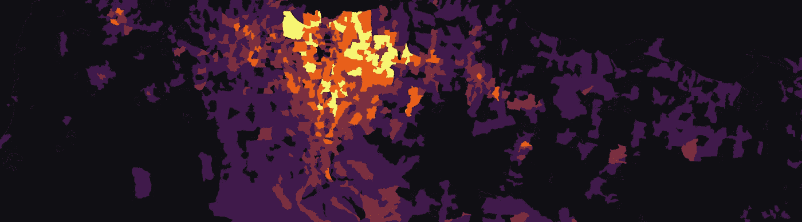
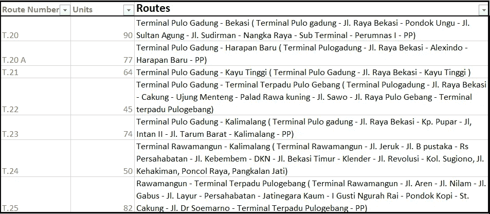
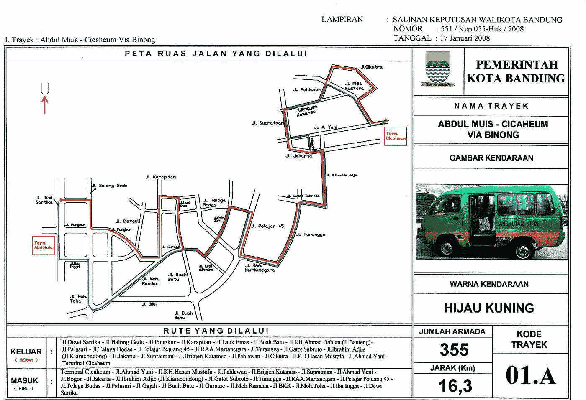
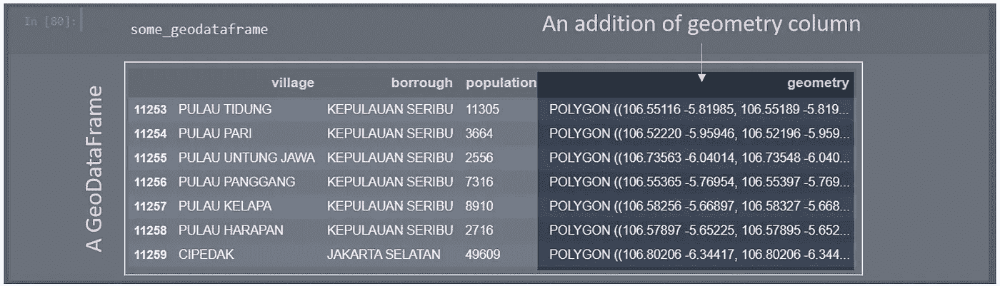
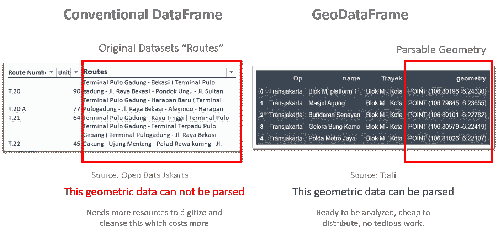
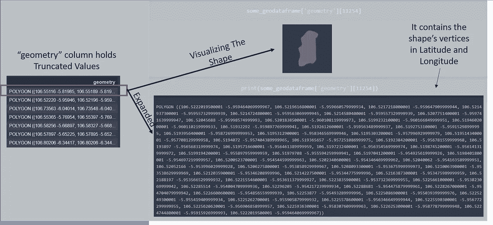
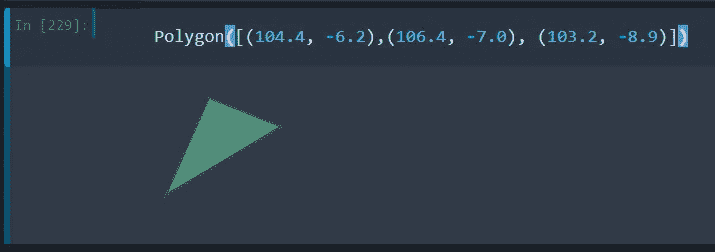
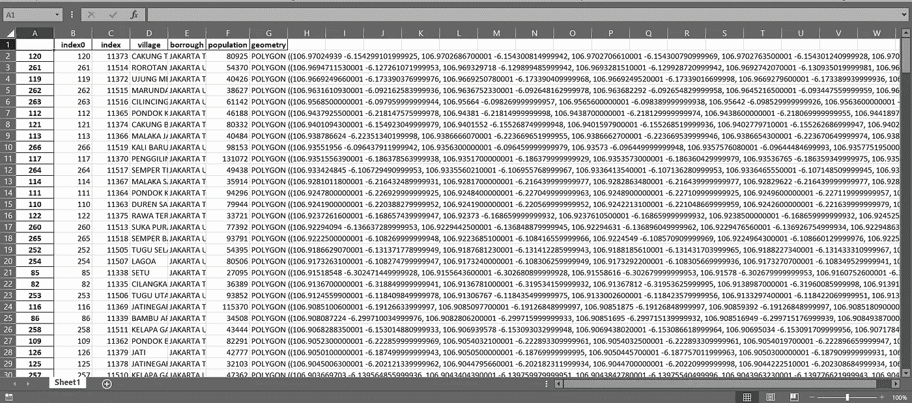
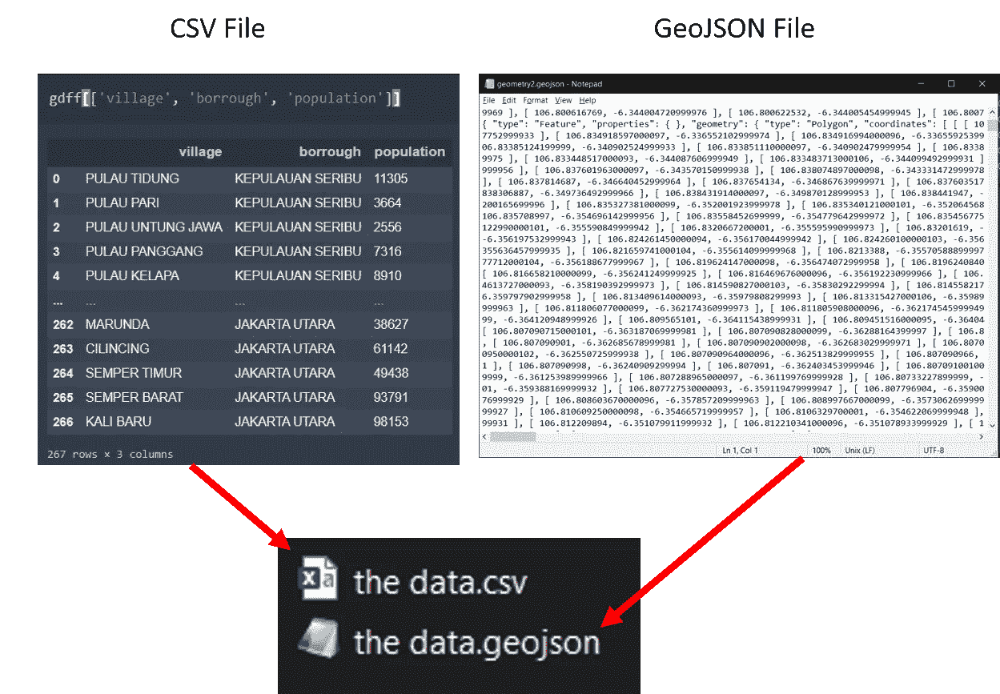

# 印度尼西亚城市规划的空间数据解决方案:了解地理数据框架

> 原文：<https://towardsdatascience.com/spatial-data-solution-for-city-planning-in-indonesia-understanding-the-geodataframe-f50d58e6c9f2?source=collection_archive---------45----------------------->



爪哇岛西北部的人口(图片由作者提供，数据来源:[印尼统计局](https://www.bps.go.id/)

## 为了理解城市的行为和制定更好的政策，首先，我们必须理解城市内部的空间相互作用。如果城市没有包含空间要素的数据，这是不可能的。有些城市的数据集中有空间元素，但不幸的是，有些是不可计算的。这些空间元素必须是可计算的，因为可计算性降低了分析成本并提供了可靠的结果。GeoDataFrame 是一种简单的可计算且直观的“数据格式”,我建议将其作为解决方案，印度尼西亚的城市应该采购此类数据。

# 介绍

地理信息系统(GIS)是城市规划师必备的基本技能。利用 GIS，城市规划者可以管理、发布和分析空间数据。空间数据不同于普通数据，因为空间数据具有有时被人们忽略的空间元素。对“空间”的意识和直觉使城市规划师或地理学家变得强大。

作为一名印度尼西亚城市规划师，我每天都要处理空间数据，这篇文章的灵感来自印度尼西亚雅加达市公布的一个数据集。不得不说，[雅加达市的空间数据仓库](https://tataruang.jakarta.go.id/portal/home/)让我印象深刻！它是结构化的、可读的、可处理的，并且维护良好。你不需要数字化。这是一个很好的空间数据仓库的例子，许多行政区都必须查阅。但是有一个来自雅加达[开放数据门户](https://data.jakarta.go.id/dataset/data-angkutan-umum-dalam-trayek-wilayah-kota-administrasi-jakarta-timur/resource/96fecbf5-d19c-42b1-913b-9ad2e19ce893)的“空间”数据提出了问题(至少对我来说):[公共交通路线](https://data.jakarta.go.id/dataset/data-angkutan-umum-dalam-trayek-wilayah-kota-administrasi-jakarta-timur/resource/96fecbf5-d19c-42b1-913b-9ad2e19ce893)。



雅加达公共交通路线(样本)(来源:[雅加达公开数据](https://data.jakarta.go.id/dataset/data-angkutan-umum-dalam-trayek-wilayah-kota-administrasi-jakarta-timur/resource/96fecbf5-d19c-42b1-913b-9ad2e19ce893))

路线是以人们可以理解的方式描述的，但在地理意义上却无法被计算机解析**。**比如，*在哪里“Jl。拉亚贝卡西"*街？有多长？它是如何弯曲的？几何性质是什么？对于像我这样的数据分析师来说，这令人愤怒。我们必须找到这条街道，在地理信息系统软件中绘制出来，这样我们就可以用计算机做进一步的分析。这个(数字化)过程花费时间，时间就是金钱。毫无准备的数据耗费了分析师的成本，并产生了乏味的工作。

让我们来看另一个例子:一张地图，如下图所示。这应该是一张安格科特(“公共交通——小巴”)路线的地图。



安格科特 01 号公路。a(来源:[万隆开放数据](http://data.bandung.go.id/dataset/data-trayek-angkot-kota-bandung/resource/83ac5130-07ae-4b19-8280-740c19db532c)，[知识共享许可](http://opendefinition.org/licenses/cc-by/))

这不是一张地图*本身，*这是一张图表。“地图”中的几何特性只是一种图解表示。长度和距离不是真正的缩放距离，这就是为什么“地图”没有坐标系/参考。

应该理解包括如上所示的空间数据的尝试。它包含信息，但我们可以做得更多。

现在，我们应该如何通过计算来分析这些空间数据**？如果你处理过很多数据，尤其是空间数据，我相信你一定很明白我在说什么。想象一下数字化和清理数据。这是没有效率的，只有一个人/实体应该做清理工作，而不是每个人都必须做。解决方案很简单，提供标准化、格式化和可解析的空间数据。**

空间数据有如此多的格式。我猜最流行的是 Shapefile。shp)格式是由 Esri 在 90 年代开发的，非常古老！现在是 2020 年，距离 shapefile 时代已经过去了十年，肯定有许多数据和技术被开发出来。在使用 Python 的过程中，我注意到了地理数据框架和我遇到的空间数据问题之间的联系。**因此，本文介绍了另一种地理空间数据——GeoDataFame，以及它如何解决印度尼西亚的空间数据属性问题。**

本文由五部分组成:

1.  **什么是地理数据框架？**(解释什么是地理数据框架以及它与传统电子表格有何不同)
2.  **为什么选择地理数据框架？**(选择地理数据框架的原因，因为它对大多数人来说是直观的)
3.  **存储几何属性**(显示几何数据的表现/形式。我们会在 Python 中使用 Shapely，但是不用担心 Python，你不用懂 Python)
4.  **我们如何存储和分发地理数据框架**(以便熟悉和不熟悉空间数据的人仍能理解数据)
5.  **结束语**(总结和建议我们应该如何开始)

# 什么是地理数据框架？

GeoDataFrame 是 GeoPandas 用作操作对象的空间数据框。当我们使用 GeoPandas 来分析和管理空间数据时，地理数据框架是目标对象。GeoPandas 中地理数据框架的官方解释是

> "一个`[**GeoDataFrame**](https://geopandas.org/reference/geopandas.GeoDataFrame.html#geopandas.GeoDataFrame)`是包含一个`[**GeoSeries**](https://geopandas.org/reference/geopandas.GeoSeries.html#geopandas.GeoSeries)`的表格数据结构."地质公园

什么是地理系列？ [GeoSeries 是包含数据](https://geopandas.org/data_structures.html)几何图形的向量。我们可以把一个向量想象成一个单列的电子表格。它在地理数据框中表示为一个名为“geometry”的列。我总是认为定义是令人困惑的，形象化总是有帮助的。以下是地理数据框架的外观:



地理数据框架(来源:作者，2020 年)

如您所见，地理数据框基本上是一个包含一列几何的电子表格。我想说的是，地理数据框架就像具有几何属性的**行数据。每个要素(每行)都有值和几何属性。例如，如图所示，“Pulau Tidung”的人口为 11305，其几何在几何列中描述。**

当我们绘图或进行空间分析时，这个“几何”列就是正在处理的列。剖析地理数据框架**有 3 个组件**:

*   **数据帧:**这是数据的行和列。我们可以把它想象成一个 Ms. excel 电子表格。这里我们可以统计描述和分析这些特征。例如，哪个村庄的人口最多？每个村庄的人口密度如何？(但不是空间交互)
*   **几何图形**:这是一个包含每行(特征)对应几何图形的列。这就是定义数据的空间元素
*   **坐标参考**:几何图形的地理参考。例如，坐标 x=8，y=15 的点；这里每个 X 和 Y 可以引用的 0 在哪里？通常我们使用 WGS 1984(世界大地测量系统，EPSG 4326)或大多数人知道的经度和纬度。您可以看到，在第一张图中，在“geometry”列中，它保存了经度和纬度值)。



电子表格数据和地理数据框架(图片由作者提供；数据来源: [Trafi，](https://www.trafi.com/) [开放数据 Jakarta)](https://data.jakarta.go.id/dataset/data-angkutan-umum-dalam-trayek-wilayah-kota-administrasi-jakarta-timur/resource/96fecbf5-d19c-42b1-913b-9ad2e19ce893)

## 绘制几何图形

我们还可以绘制几何线并制作地图。在这个例子中，雅加达市的人口。我们可以用 Choropleth 图来代替图表，这样我们可以概括空间关系。


雅加达人口(图片由作者提供，数据来源:[印尼统计局](https://www.bps.go.id/))

# 为什么选择地理数据框架？

**地理数据框架对普通人来说更具可读性。** GeoDataFrame 基本上就是一个表，大家都知道什么是表，所以很直观。不像 Shapefile，我想，不是每个人都知道。

如果您熟悉 python，它基本上是一个熊猫数据帧，带有一个保存几何属性的附加列。我们可以用熊猫的方法来建立地理数据框架。

# 存储几何数据

这个几何列中的值是什么？我们将使用一些 Python 术语，但这并不复杂，因为它非常简单。请容忍我一点。

有 3 种主要的空间数据类型:

*   要点:这是非常直接的。点表示位置和地名。点是一维的，包含一个坐标。(除了多点，它有许多具有相同属性的坐标，但它们不构成线或区域)
*   **多段线:**线或多段线是由一条线连接的坐标集合。我们可以使用折线来描述网络，如管道、道路或铁路网络。
*   **多边形:**多边形是封闭的线，所以它有面积。用于描述行政边界、分区规则、地理分布图的基础。

**所以空间数据基本上就是一堆坐标！**

本质上，折线和多边形由顶点组成。这些顶点是几何列中保存的点的坐标。正如我们在下图中看到的，当一个几何值被展开时，它包含了很多经纬度的坐标，当我们可视化这些顶点时，它就画出了一个形状。



地理数据框架的几何(来源:作者，2020 年)

每个几何体都是 Shapely 的对象，是 Python 的库。Shapely 为了数学的目的研究几何。我们可以进行许多空间分析，例如相交、联合等等。这是一个非常简单的介绍:例如，如果我想创建一个几何对象，我需要做的是向 Python 编写一些命令，如下所示:

```
>> from shapely.geometry import Polygon
>> Polygon([(104.4, -6.2),(106.4, -7.0), (103.2, -8.9)]
```

这将创建一个矩形，因为有 3 个顶点(3 个坐标)。



几何输出(来源:作者，2020)

当然，要定义每个特征的几何形状，我们不能手动放置它。相反，我们可以集成 GPS 等传感器来自动执行任务，或者用一些脚本进行一些转换。

# 我们如何存储和分发地理数据框架？

虽然 shapefile 很受欢迎，但我认为 GeoJSON 更整洁。除了几何图形本身之外，Shapefile 由单独的文件组成，例如投影和属性；而 GeoJSON 只是一个“文本”文件。

满足[OGC 标准](https://www.ogc.org/standards/wfs)的网络服务是必须的，这允许网站和算法远程连接，但有时用户需要普通和流行格式的可下载数据，如*。xlsx* 或*。csv* 。

我推荐几个选项:

*   **另存为 CSV:** 由于空间数据必须可供来自不同背景的多人访问，因此最简单的存储方法是将地理数据框转换为 CSV(逗号分隔值)。通过这种方式，电子表格软件可以解析 CSV，使其成为一种琴谱格式。需要注意的是,“geometry”列将存储为文本，因此要将其转换为几何(shapely)对象，我们需要进一步解析。web 应用程序或一些简单的脚本应该可以完成这项工作。是一个选项，**但我不认为这个选项是首选。**



完整 CSV 文件的示例(来源:作者，2020)

*   **将数据帧保存为 CSV，将几何列保存为单独的 GeoJSON:** 这将生成 2 个文件；CSV 和 GeoJSON。**不用担心 GeoJSOn，它基本上就是一个文本文件。** GeoJSON 是系统或软件间互操作性的一种格式。使用 GeoJSON，许多软件或网站可以解析文本并绘制几何图形。将对 **GeoJSON 对象进行索引，以便其可以与 CSV** 连接。



CSV 和 GeoJSON(来源:作者，2020 年)

# 结束语

我认为应该对数据集中的空间属性有所了解。空间属性与数据框本身一样重要，不应分离。一个电子表格。xlsx 、 *CSV、*等等)必须附带 GeoJSON 格式的几何图形，甚至嵌入 CSV 本身。只要几何属性合适，表格数据格式必须有一个定义每个要素的几何的列。为什么选择地理数据框架、CSV 或 GeoJSON？所以对于那些不常见于空间数据的人来说，对于那些常见于空间数据的人来说，它是人眼可读的。**几何图形必须由坐标组成。**

我认为包含地理数据框架应该会增加许多人的直觉，即要素确实具有空间属性，并且在空间上是可交互的。地理数据框架还使我们能够以高效的方式计算空间数据。首先，**我们可以简单地“只”在每个电子表格中添加一列，即几何列。**