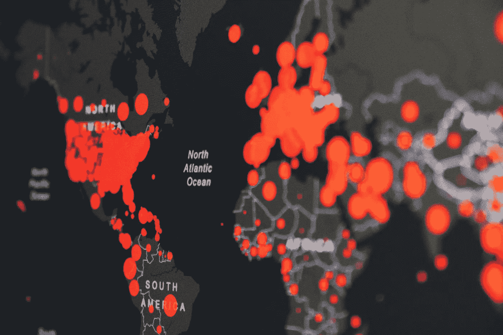

# 核空间插值

> 原文：<https://towardsdatascience.com/spatial-interpolation-with-kernels-cf3616487714?source=collection_archive---------56----------------------->

## 估算地理区域空气质量的个例研究



马丁·桑切斯在 [Unsplash](https://unsplash.com/s/photos/heat-map?utm_source=unsplash&utm_medium=referral&utm_content=creditCopyText) 上的照片

加州最近火了。实际上是火。火产生烟。有很多。

显示不同地区空气质量的热图显然是有用的。构建这样一个热图的建模问题是什么？说真的，创业者都在琢磨这个问题[1]。

我们有空气质量传感器。但不是所有地方。我们希望通过附近传感器的测量来估计稀疏覆盖区域的空气质量。我们称之为*空间插值*。

还有测量误差。传感器质量不一。昂贵的传感器更精确，但也更少。所以他们的报道很少。廉价的传感器要丰富得多。然而，不太准确。

考虑到这些权衡，我们应该结合所有数据(在足够接近的范围内)，而不是选择一些数据。考虑到传感器位置及其变化的误差率。

也可能有异常读数。传感器有时会返回奇怪的结果。或者生病，甚至死亡。它们还会产生有偏差的结果，即那些始终不符合要求的结果。

异常需要检测，以便可以丢弃它们。偏差需要估计，这样才能被纠正。同一传感器频繁出现异常是故障的症状。

这些都很有趣，对吧？也很有用。空间插值也适用于温度、风速、降雨量、湿度等。

让我们开始吃吧。

**问题陈述**

我们的传感器位于 *n* 点( *x* 1、 *y* 1)、…、( *xn* 、 *yn* )。我们将把任何这样的点称为 ij。位置 *ij* 的传感器发出读数 *Sij* 。我们将此读数视为该位置未知真值的讹误版本。我们试图从这些读数中估计该区域中每一点( *x* ， *y* )的 *Txy* 。

**示例**:假设我们在旧金山湾区有两个传感器。一个在旧金山，另一个在圣何塞。我们感兴趣的是估计两者之间的空气质量。(当然，我们只有两个传感器，所以我们的估计可能不会很大。)

可以把这想象成一维空间插值。估计连接旧金山和圣何塞的线路的空气质量。

**内核**:现在我们来讨论内核。在每个装有传感器的位置 *ij* ，我们附加一个内核 *Kij* 。 *Kij* 衡量读数 *Sij* 对 *ij* 附近位置的影响。这种影响随着距离的增加而减弱。形式上，我们将这个权重表示为 *K* (d( *xy* ， *ij* ))。这里 *d* ( *xy* ， *ij* )表示 *xy* 和 *ij* 之间的距离。K( *d* )随 *d* 减小， *K* (0)为 1。对于 *K* ( *d* )的自然选择是 e^- *ad* ，其中 *a* 是控制影响随距离衰减的速率的参数。

**示例**:在我们的 SF-SJ 示例中，假设我们将内核 *K* ( *d* )设置为 1/(a* *d* +1)，其中 *d* 的单位是英里。考虑 *a* = 1。SF 中读数的影响在离 SF 一英里处为=50%,在离 SF 两英里处为=25%。

为什么是这个内核函数，为什么 *a* =1 而不是其他选择？我们很快就会看到，插值对我们在这里做出的决定并不特别敏感。

**第一插补器**

考虑任何一点 *xy* 。考虑在位于 *xy* 附近的传感器处测量的 AQIs { *Sij* }。这些测量值的加权平均值是对 *xy* 处 AQI 的良好估计。越靠近 *xy* 的传感器对估计的影响越大。

更正式地说

*s*^*xy*=*sum*_*ij pij*(*xy*)** sij*

在哪里

*pij*(*xy*)*= K*(*d*(*ij*，*xy*)/*sum _ I ' j ' K(d(I ' j '，xy* ))

这里的 *S* ^ *xy* 表示以这种方式在 *xy* 获得的强度估计值。

**示例**:考虑我们的 SF-SJ 示例，使用我们之前选择的内核函数。假设 SF 和 SJ 相距 50 英里。考虑两者之间的一个点，我们称之为圣马特奥(SM)。我们想从 SF 和 SJ 读数中估计 SM 的 AQI，我们将分别取 160 和 180 AQI。(AQI 是“空气质量指数”的简称。)

```
K(SM,SF) = K(SM,SJ) = 1/(25+1)=1/26
```

由此，我们得到

```
pSF(SM) = pSJ(SM) = ½
```

所以我们估计 SM 的 AQI 是 170，160 和 180 的平均值。

这个例子也揭示了插值对核函数的选择及其参数并不像我们想象的那样敏感。重要的是从核函数值中得到的概率 *pij* ，而不是这些值本身。只要核函数帮助我们估计*相对*对各个附近传感器的读数对插值的影响，我们就很好。

**整合领域知识**

假设我们对各种传感器有所了解。我们可能知道传感器的价格或品牌。根据这些信息，我们也许能够估计它的错误率。更好的是，错误率可能已经从测试中估计出来了。销售优质传感器的公司倾向于这样做，以突出他们的价值主张。

下面是一个简单的启发式扩展 *pij* 来利用这个知识。

*pij = K*(*d*(*ij*，*xy*)****wij***

这里的 *wij* 是一个正权重，表示位置 *ij* 处传感器的质量。更高的价值等同于更高的质量。

这样一来，低质量的传感器对^的影响要小于高质量的传感器。也就是说，在附近位置给出相似读数的多个低质量传感器的累积影响就好像有一个具有相似读数的高质量传感器。这是所希望的。

**例**:假设我们设 wSF = 2，wSJ = 1。我们对旧金山传感器的信任度是圣何塞传感器的两倍。这将概率修改为 pSF(SM) = ⅔，pSJ(SM) = ⅓.因此，我们在 SM 的 AQI 估计值约为 166，更接近 SF 的读数。

**应对异常读数**

传感器有时会给出异常读数。根据定义，这样的读数可能“超出图表范围”如果不加检查，它们可能会严重扭曲其邻域内的插值。显然，我们应该检测异常读数，并忽略它们。

为此，我们将在 *pij* 中添加一个新术语:

*pij = K*(*d*(*ij*，*xy*)**wij*****AIJ***

这里 *aij* 是一个异常折扣权重。如果传感器的读数被认为是正常的，其值接近 1，如果被认为是异常的，其值接近 0。

怎么才能估算出 *aij* ？基本想法很简单。如果大多数邻近的传感器具有相似的读数，并且与 *ij* 的读数相差很大，则 *ij* 的读数可能是异常的。

更详细地说，使用前面描述的公式，基于相邻传感器的读数，获得该传感器的 *S* ^ *ij* 。一定要排除 *ij* 本身对这个公式的贡献。比较 *S* ^ *ij* 和 *Sij* 。如果两者相距甚远，那么 *ij* 处的读数可能是异常的。

考虑到相邻传感器读数的可变性，这可以进一步增强。相邻传感器的读数越相似，该传感器(其读数显著不同)异常的可信度就越高。

有趣的是，这里的建模类似于[3]中描述的建模，特别是去噪图像。在这一点上，这里描述的两层结构很有意思。

**示例**:让我们在 SF-SJ 示例中添加一个新的传感器，位于 SM，两者之间。同样，让我们回到同样信任 SF 和 SJ 传感器。

假设 SM 的传感器读数为 5 AQI，而 SF 和 SJ 的读数分别为 180 和 160 AQI。根据 SF 和 SJ 读数，SM 的 AQI 估计值为 170。170 和 5 很不一样。这就对 SM 读数提出了质疑。

鉴于此，当从三个传感器估计 SF 和 SJ 之间某处的 AQI 时(比如在 Palo Alto ),我们可能想要丢弃 SM 传感器的读数。

**检测时间变化**

传感器可能在一段时间内一直报告相似的读数，然后突然报告非常不同的读数。出事了。如果附近的传感器没有同时报告突变，则无论发生什么都可能是该传感器本地发生的。

使用这样的时间信息和空间信息，我们通常可以增加读数异常的推断的可信度。

**示例**:考虑我们在 SF、SM 和 SJ 的三个传感器。假设我们在过去 5 个小时内每小时测量一次他们的读数，结果如下:

```
Hour         1   2   3   4   5
SF reading  159 163 161 166 157
SM reading  170 168 174 169   **5** SJ reading  181 178 172 178 182
```

显然，通过查看三个传感器在整个持续时间内的读数(不仅仅是在第 5 小时)，我们可以更有把握地说，粗体显示的读数是异常的。

使用这种时间信息还可以帮助评估传感器是否有偏差。考虑上述例子的一个变体。

```
Hour         1   2   3   4   5
SF reading  159 163 161 166 157
**SM reading  129 121 125 122 124** SJ reading  181 178 172 178 182
```

要么是 SM 传感器有偏差，要么是 SM 中确实存在其他问题，导致 SM 中的读数始终低于 SF 和 SJ 中的读数。不管怎样，知道这一点很好。

**延伸阅读**

1.  [air visual 的空气质量数据有多准确？|空中视觉支持中心](https://support.iqair.com/en/articles/3405643-how-accurate-is-airvisual-s-air-quality-data)
2.  [空间插值](http://fatra.cnr.ncsu.edu/~hmitaso/gmslab/papers/mitas_mitasova_1999_2005.pdf)
3.  [马尔可夫随机场和图像处理|作者 Arun ja gota | 2020 年 8 月](/markov-random-fields-and-image-processing-20fb4cf7e10d)