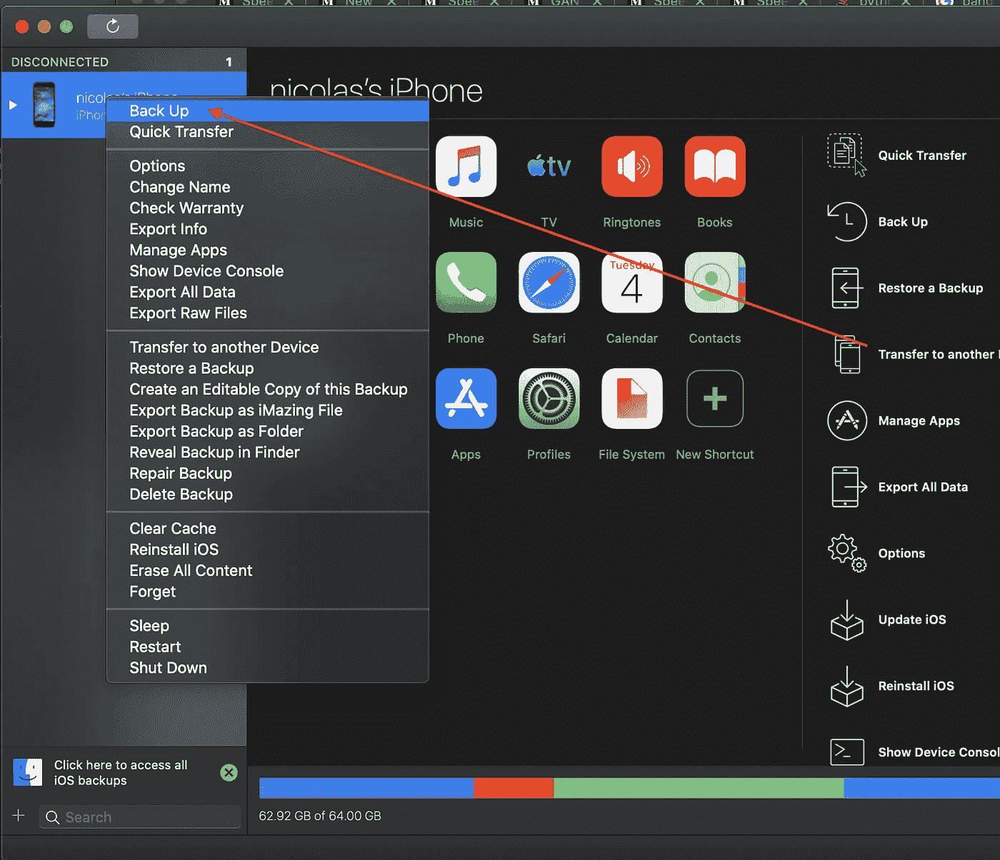
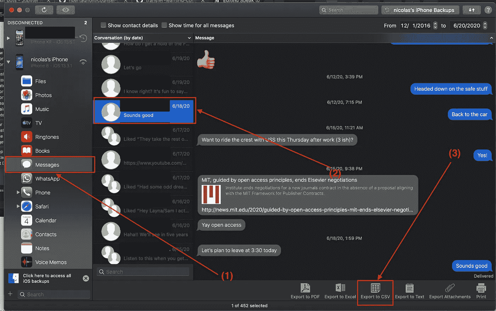
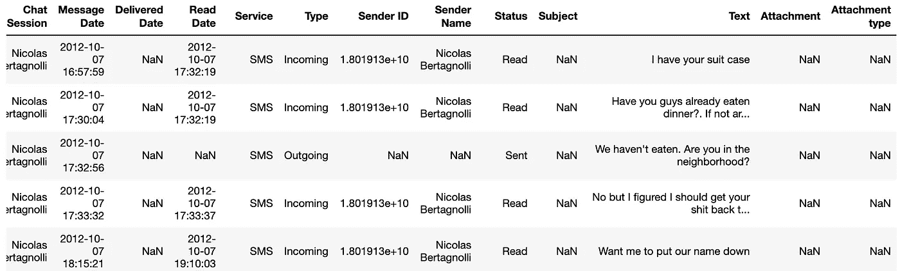
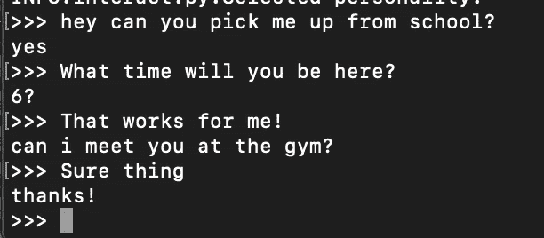
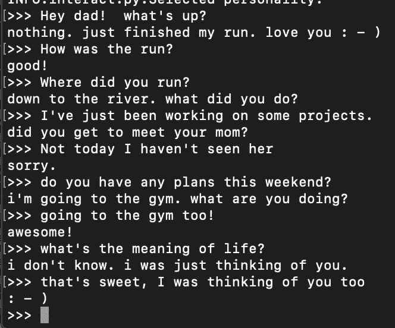
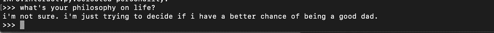

# 用深度学习对死人说话

> 原文：<https://towardsdatascience.com/speak-to-the-dead-with-deep-learning-a336ef88425d?source=collection_archive---------43----------------------->

## 如何训练聊天机器人听起来像任何有电话的人，包括你已故的亲人。


照片由[马尼亚·卡塔林](https://www.pexels.com/@manea-catalin-1839309?utm_content=attributionCopyText&utm_medium=referral&utm_source=pexels)从[派克斯](https://www.pexels.com/photo/snow-covered-pine-trees-and-mountains-4504068/?utm_content=attributionCopyText&utm_medium=referral&utm_source=pexels)拍摄

# 介绍

我是看着科幻小说长大的，在科幻小说中，人们试图将他们的意识植入机器。我总是觉得这些故事很吸引人。有意识是什么意思？如果我把自己的一个完美副本放进一台机器里，哪一个是我？如果生物的我死了，而机械的复制我活了下来，那我死了吗？我仍然喜欢这样的故事，最近一直在阅读格雷格·伊根，如果你认为这些是有趣的问题，我强烈推荐他的书 D [iaspora](https://www.amazon.com/Diaspora-Greg-Egan-ebook/dp/B00E83YOEI/ref=sr_1_1?dchild=1&keywords=diaspora&qid=1592672413&sr=8-1) (只要 3 美元)。

但是我跑题了。以今天的技术，只用几行代码就可以粗略地模拟一个人的说话风格。随着新冠肺炎在世界各地被烧毁，我开始担心我生活中的老年人，并想知道是否有可能在某个地方保留他们的一部分。这篇教程是我微弱的尝试，试图捕捉和保持一个人死后的一些对话方面。

# TLDR

你可以把你的文本带给任何人，用它们来训练一个简单的聊天机器人，只需要几行代码。本教程的所有代码都可以在这里找到。

# 获取数据

在当今世界，人们在网上发布了如此多的东西，你只需稍微搜索一下，就可以找到关于大多数人的海量数据，无论是好是坏。不幸的是，或者说幸运的是，收集老年人数据的现实是，他们没有强大的在线存在。我奶奶没有推特和脸书。如果他们这样做了，他们就不会经常发帖，以至于我无法提取任何有意义的信号。所以我求助于他们的电话。

每个人都有电话。我们一直用它们来交流，它们记录了我们过去的对话和互动。它们是捕捉某人谈话风格初始模型的完美工具。在这个项目中，我将创建一个我父亲的对话短信模型。他让我借他的手机一天，把里面所有的短信都擦掉。对于这些文本，我们将以一种深度对话模型可以理解的方式对其进行格式化，并根据他的短信模式对其进行微调。

# 提取文本

我爸爸和我都有 iPhone，所以本教程将围绕如何从 iPhone 中提取和处理文本。你可以用 iTunes 给你的设备做一个备份，但是查看和操作这个备份有点麻烦。我发现从 iPhone 中提取和处理文本的最好方法是[图像化](http://imazing.o67m.net/E4402),本教程将带你了解如何使用这个工具。您不需要购买 iMazing 来执行此演练。他们有 30 天的免费试用期，应该可以让你通过这个项目没有问题，但如果你最终购买它，这是我的附属链接，所以如果你点击这个链接后购买，我会得到一点回扣:)。如果附属链接对你来说是奉承话，就点击[这个](https://imazing.com/?gclid=CjwKCAjw57b3BRBlEiwA1Imytlg1d5-kQax93PYmE9dnTGXf1tpVU7flwJRXtN5MdKIeTCXbel8S5xoCnQAQAvD_BwE)。它去他们正常的网站，没有回扣。他们永远不会知道是我派你去的。

## 机器人

如果你运行的是 Android，看起来有一些软件选项可以帮助你提取和备份文本。[这个免费的应用程序](https://play.google.com/store/apps/details?id=com.riteshsahu.SMSBackupRestore&hl=en)似乎能帮上忙。我还在这里找到了一个描述如何做的帖子。不幸的是，因为我没有安卓手机，所以我无法测试这些方法。不过，如果你在格式化数据时遇到困难，我很乐意和你聊天，帮你调试。

## 苹果手机

## 步骤 1:使用 iMazing 创建备份

插入你的 iPhone，打开 iMazing。你应该在右上角看到你的手机。右键单击并选择“备份”。这将像在 iTunes 中一样备份您的手机，但在这里您可以轻松地访问和导出您的数据。可能需要五到十分钟才能完成。



## 步骤 2:下载 CSV 格式的数据

备份完成后，我们可以通过以下方式访问短信:

1.  点击信息图标
2.  选择我们想要提取的对话
3.  点击导出到 CSV 按钮



这将提取一个 CSV 格式的所有过去的文本保存在你的手机之间，你和每个人的对话。正如你在下面看到的，CSV 有许多字段，但我们只需要其中的三个用于这个项目**消息日期**、**文本**和**发送者姓名**。



图 3

# 为培训准备数据

我们的任务是构建示例对话来训练我们的聊天机器人。第一件事是载入数据。下面的代码片段会解决这个问题。这段代码非常简单。我们加载 CSV，做一些重命名和数据格式化，以便于使用，瞧。需要注意的一点是，我在 speaker 列的空条目中填入了一个提供的`receiver_name.` iMazing 并不能很好地写下通话中谁是电话的主人。它会将该位置留空。所以无论哪里有丢失的值，我们都可以用拥有手机的人来填充。

随着数据的加载，我们现在需要将来自同一说话者的文本压缩成一行。请注意，在图 3 的数据集的前三行中，我是如何两次发送文本来完成一个想法的。我们需要将所有这些内容汇集在一起，以便我们的数据帧的每一行都是不同的发言人。这将使数据处理更容易。我们可以使用下面的代码来做到这一点:

这有点棘手，让我来解释一下。我们使用`shift()`来复制数据帧，但是偏移一行。然后，我们可以将每一行的发送方名称与其偏移发送方名称进行比较。如果它们不同，那么我们知道我们已经转换了扬声器。我们创建了一个`group_key`来代表这些不同的文本跨度。然后，我们可以根据这个键、日期和发件人姓名进行分组，以获得我们编译的文本范围。

我们需要做的最后一件事是拆分数据。在训练时，有一个小的验证集来获得一种概括的感觉是很有用的。

这里我们得到所有不同的日期，然后将它们分成训练集或验证集。然后，我们将这些分割合并回原始数据帧。这确保了在同一对话中出现的文本不会同时出现在训练集和验证集中。

# 格式化拥抱脸部模型的数据

我们将在这个项目中使用优秀的[拥抱面部对话人工智能](https://github.com/huggingface/transfer-learning-conv-ai)。脸书刚刚发布了 [Blender](https://ai.facebook.com/blog/state-of-the-art-open-source-chatbot/) ，如果你有一台超级计算机，这将是作为你的基本聊天机器人的另一个很酷的选择，但我没有，所以我将坚持使用我可以在有限时间内微调的模型:)。

拥抱脸变形模型的数据格式起初看起来有点混乱，但是它很容易生成。训练数据需要是具有以下签名的 JSON 文件:

```
{
  "train": [
    {
      "personality": [
        "sentence",
        "sentence"
      ],
      "utterances": [
        {
          "candidates": [
            "candidate 1",
            "candidate 2",
            "true response"
          ],
          "history": [
            "response 1",
            "response 2",
            "etc..."
          ]
        }
      ]
    }
  ],
  "valid": ...
}
```

让我们稍微分解一下。较大的 JSON 对象有两个主键。“训练”和“有效”。训练是训练数据，并且是个性、话语对的列表。除了验证集之外，Valid 是相同的。个性是定义说话者个性的句子列表。更多细节请看拥抱脸教程。对于我的模型，我把人格作为我父亲与之交谈的人的名字。候选项部分包含对输入的可能响应的列表。此列表包含对对话历史的一些非最佳响应，其中最后一句是基本事实响应。最后，我们必须定义对话的历史。这是一个字符串列表，其中每个位置包含一个新的话轮。如果你想要另一个如何格式化数据的例子，拥抱脸在资源库中有一个很好的例子，你可以在这里找到。

# 训练模型

拥抱脸的优秀员工为我们组装了一个 docker 容器，因此设置模型培训轻而易举！只需运行`make build`来构建 convai docker 容器，然后运行`make run`以交互模式进入容器。

从容器内部，我们可以训练我们的模型。我们只需从 docker 内部导航到我们的项目文件夹并运行:

```
python3 train.py --dataset_path {data-path}.json --gradient_accumulation_steps=4 --lm_coef=2.0 --max_history=4 --n_epochs=3 --num_candidates=4 --train_batch_size=2 --personality_permutations 2
```

这花了大约 10 个小时在我的 CPU 上训练。它应该在 GPU 上进行训练，但由于整夜运行它对我来说足够方便，我还没有在我的 GPU 上设置它。

# 与死者对话(或者在这种情况下不那么死)

最后一步是与我们的对话代理交互。convai 存储库再次为我们完成了大部分繁重的工作。我用 make 对它做了一个方便的包装，这样我们就可以简单地运行:

```
make interact CHECKPOINT_DIR={path-to-checkpoint} DATA={path-to-training-data}
```

这将打开一个交互式终端，您可以在这里与您新创建的机器人聊天。只需确保您的模型和数据位于 Makefile 所在的目录或子目录中。我所了解到的是，我和我爸爸并没有通过短信进行真正有意义的对话。看起来我们主要是分享一些信息，聊聊我们的一天，或者安排一些事情。模型超级擅长调度。



它不太擅长进行真诚的对话，但它确实准确地捕捉到了我父亲写短信的风格。如果谈话很短，而且是在我们通常会发短信谈论的领域，那感觉仍然像是在和他简短地聊天。



有时候它会让我吃惊。



# 后续步骤

在我们正常的短信交流中，这个聊天机器人有点像我父亲。我打算在接下来的一年里尝试通过文本进行一些更深入的对话，然后在明年秋天重复这个实验。我希望通过更长更复杂的基于文本的对话，我能捕捉到更多的信息。作为一个替代项目，你可以试着训练一个你自己的聊天机器人。有了 you-bot，使用 Twilio 之类的东西来自动化简单的文本对话可能会很有趣。