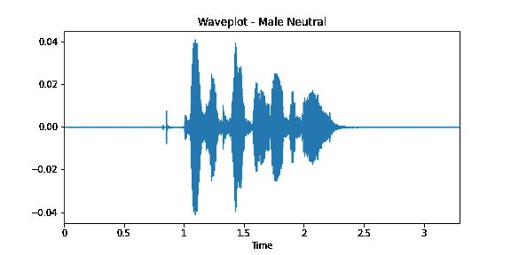
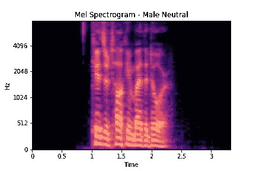
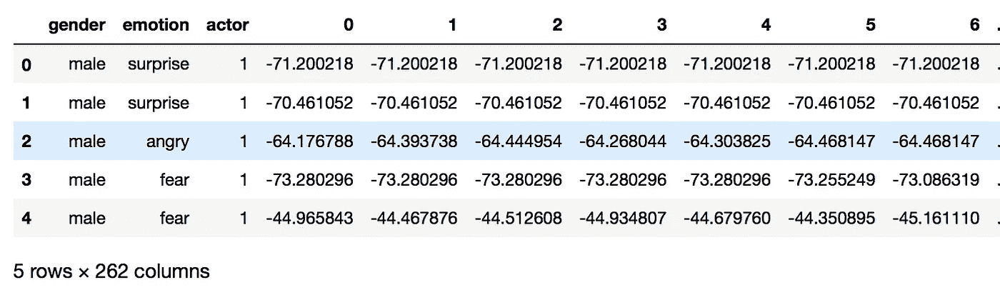
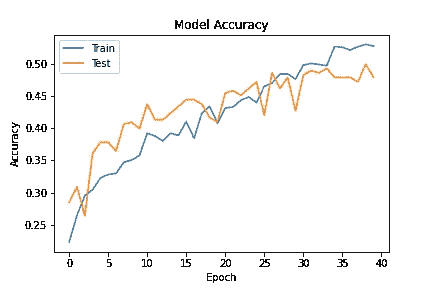
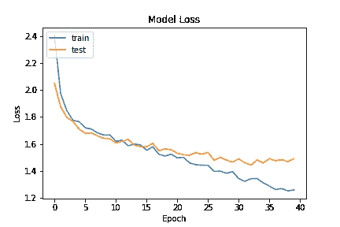
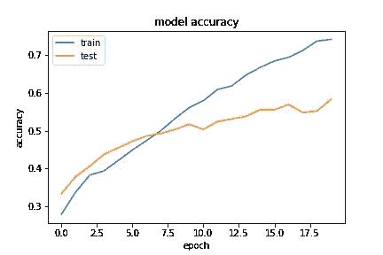
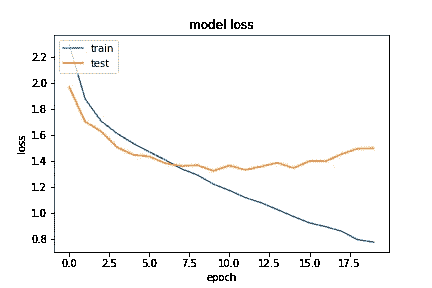

# 基于 RAVDESS 音频数据集的语音情感识别

> 原文：<https://towardsdatascience.com/speech-emotion-recognition-using-ravdess-audio-dataset-ce19d162690?source=collection_archive---------5----------------------->


图片由[腾雅特](https://unsplash.com/@tengyart)在 [Unsplash](https://unsplash.com/) 上拍摄

通过所有可用的感官，人类可以感觉到他们交流伙伴的情绪状态。这种情绪检测对人类来说是自然的，但对计算机来说是非常困难的任务；虽然他们可以很容易地理解基于内容的信息，但访问内容背后的深度是困难的，这就是语音情感识别(SER)要做的事情。它是通过计算机将各种音频语音文件分类为快乐、悲伤、愤怒、中性等不同情绪的系统。语音情感识别可用于医疗领域或客户呼叫中心等领域。我的目标是使用 [Kaggle](https://www.kaggle.com/uwrfkaggler/ravdess-emotional-speech-audio) 上提供的 RAVDESS Audio 数据集来演示 SER。

```
# IMPORT NECESSARY LIBRARIES
import librosa
%matplotlib inline
import matplotlib.pyplot as plt
import librosa.display
from IPython.display import Audio
import numpy as np
import tensorflow as tf
from matplotlib.pyplot import specgram
import pandas as pd
from sklearn.metrics import confusion_matrix
import IPython.display as ipd  # To play sound in the notebook
import os # interface with underlying OS that python is running on
import sys
from sklearn.model_selection import StratifiedShuffleSplit
from sklearn.preprocessing import LabelEncoder
import keras
from keras.models import Sequential
from keras.layers import Conv1D, MaxPooling1D, AveragePooling1D
from keras.layers import Input, Flatten, Dropout, Activation, BatchNormalization, Dense
from sklearn.model_selection import GridSearchCV
from keras.wrappers.scikit_learn import KerasClassifier
from keras.optimizers import SGD
from keras.regularizers import l2
import seaborn as sns
from keras.callbacks import EarlyStopping, ModelCheckpoint
from keras.utils import to_categorical
from sklearn.metrics import classification_report
```

# 电子设计自动化(Electronic Design Automation)

首先，让我们使用 IPython 从数据集中加载并播放一个样本音频文件。显示和 Python 的 librosa 库:

```
# LOAD IN FILE
x, sr = librosa.load('/Users/murielkosaka/Desktop/capstone_project/audio/audio_speech_actors_01-24/Actor_01/03-01-01-01-01-01-01.wav')# PLAY AUDIO FILE
librosa.output.write_wav('ipd.Audio Files/MaleNeutral.wav', x, sr)
Audio(data=x, rate=sr)
```

在这里，我们正在看一个男演员用中性语气说话的音频样本。

接下来让我们使用 *librosa.display.waveplot* 来看看这个音频文件的波形图:

```
# DISPLAY WAVEPLOT
plt.figure(figsize=(8, 4))
librosa.display.waveplot(x, sr=sr)
plt.title('Waveplot - Male Neutral')
plt.savefig('Waveplot_MaleNeutral.png')
```



作者图片

波形图描绘了一段时间内的信号幅度包络，看到情绪的整体形状可以帮助确定哪种特征提取方法(MFCC、STFT、对数-梅尔谱图、过零率、谱形心等)。)用于建模。特征提取在建模中很重要，因为它将音频文件转换成模型可以理解的格式。

在检查了每种情绪样本的波形图后，我决定使用 Log-Mel 频谱图作为特征提取的方法。我们可以使用*librosa . display . spec show:*显示相同样本音频的 Log-Mel 频谱图

```
# CREATE LOG MEL SPECTROGRAM
spectrogram = librosa.feature.melspectrogram(y=x, sr=sr, n_mels=128,fmax=8000) 
spectrogram = librosa.power_to_db(spectrogram)librosa.display.specshow(spectrogram, y_axis='mel', fmax=8000, x_axis='time');
plt.title('Mel Spectrogram - Male Neutral')
plt.savefig('MelSpec_MaleNeutral.png')
plt.colorbar(format='%+2.0f dB');
```



作者图片

# 准备数据

在建模之前，我通过创建音频文件的目录，然后创建一个函数来提取每个文件的情感标签和性别标签(虽然我只对情感分类感兴趣，但我也提取了性别标签，以防我也决定尝试分类性别)，将数据结构化为 Pandas 数据帧，然后最后将提取的标签和相关文件路径放入数据帧 *audio_df。*

```
# CREATE FUNCTION TO EXTRACT EMOTION NUMBER, ACTOR AND GENDER LABEL
emotion = []
gender = []
actor = []
file_path = []
for i in actor_folders:
    filename = os.listdir(audio + i) #iterate over Actor folders
    for f in filename: # go through files in Actor folder
        part = f.split('.')[0].split('-')
        emotion.append(int(part[2]))
        actor.append(int(part[6]))
        bg = int(part[6])
        if bg%2 == 0:
            bg = "female"
        else:
            bg = "male"
        gender.append(bg)
        file_path.append(audio + i + '/' + f)# PUT EXTRACTED LABELS WITH FILEPATH INTO DATAFRAME
audio_df = pd.DataFrame(emotion)
audio_df = audio_df.replace({1:'neutral', 2:'calm', 3:'happy', 4:'sad', 5:'angry', 6:'fear', 7:'disgust', 8:'surprise'})
audio_df = pd.concat([pd.DataFrame(gender),audio_df,pd.DataFrame(actor)],axis=1)
audio_df.columns = ['gender','emotion','actor']
audio_df = pd.concat([audio_df,pd.DataFrame(file_path, columns = ['path'])],axis=1)
```

## 特征抽出

接下来，最重要的是，我使用了 librosa 的*librosa . feature . Mel spectrogram*和 *librosa.power_to_db* 来获得每个音频文件的 log-mel 频谱图值，然后对频谱图值进行平均，并将数据加载到标记为 *df 的新数据帧中。*

```
# ITERATE OVER ALL AUDIO FILES AND EXTRACT LOG MEL SPECTROGRAM MEAN VALUES INTO DF FOR MODELING 
df = pd.DataFrame(columns=['mel_spectrogram'])counter=0for index,path in enumerate(audio_df.path):
    X, sample_rate = librosa.load(path, res_type='kaiser_fast',duration=3,sr=44100,offset=0.5)

    #get the mel-scaled spectrogram (ransform both the y-axis (frequency) to log scale, and the “color” axis (amplitude) to Decibels, which is kinda the log scale of amplitudes.)
    spectrogram = librosa.feature.melspectrogram(y=X, sr=sample_rate, n_mels=128,fmax=8000) 
    db_spec = librosa.power_to_db(spectrogram)
    #temporally average spectrogram
    log_spectrogram = np.mean(db_spec, axis = 0)

    df.loc[counter] = [log_spectrogram]
    counter=counter+1print(len(df))
df.head()
```

因为这在一列下创建了一个值数组，所以我使用 *pd.concat* 将该数组转换成一个列表，并与我之前的数据帧 *audio_df* 连接，并删除必要的列以给出最终的数据帧。



作者图片

# 数据预处理

模型的数据预处理分五步进行:

1.训练，测试分割数据

```
train,test = train_test_split(df_combined, test_size=0.2, random_state=0,
                               stratify=df_combined[['emotion','gender','actor']]) X_train = train.iloc[:, 3:]
y_train = train.iloc[:,:2].drop(columns=['gender'])X_test = test.iloc[:,3:]
y_test = test.iloc[:,:2].drop(columns=['gender'])
```

2.标准化数据-提高模型稳定性和性能

```
# NORMALIZE DATA
mean = np.mean(X_train, axis=0)
std = np.std(X_train, axis=0)
X_train = (X_train - mean)/std
X_test = (X_test - mean)/std
```

3.转换为 Keras 的数组

```
X_train = np.array(X_train)
y_train = np.array(y_train)
X_test = np.array(X_test)
y_test = np.array(y_test)
```

4.目标变量的一键编码

```
# CNN REQUIRES INPUT AND OUTPUT ARE NUMBERS
lb = LabelEncoder()
y_train = to_categorical(lb.fit_transform(y_train))
y_test = to_categorical(lb.fit_transform(y_test))
```

5.重塑数据以包含 3D 张量

```
X_train = X_train[:,:,np.newaxis]
X_test = X_test[:,:,np.newaxis]
```

## 基础模型

对于基线模型，我决定从简单的虚拟分类器开始，该分类器通过尊重训练数据的类别分布来生成预测，并且具有 11.81%的低准确度分数。然后，我尝试了决策树，因为这是一个使用平均 log-mel 光谱图的多分类问题，并获得了 29.17%的准确率。

```
dummy_clf = DummyClassifier(strategy="stratified")
dummy_clf.fit(X_train, y_train)
DummyClassifier(strategy='stratified')
dummy_clf.predict(X_test)
dummy_clf.score(X_test, y_test)clf = tree.DecisionTreeClassifier()
clf = clf.fit(X_train, y_train)
clf.predict(X_test)
clf.score(X_test, y_test)
```

## 初始模型

对于我的初始模型，我训练了一个具有三个卷积层和一个输出层的 1D CNN，并在我的测试集上获得了 48%的准确率，这比我的基线决策树略好(*在此插入悲伤表情*)。

```
# BUILD 1D CNN LAYERS
model = Sequential()
model.add(Conv1D(64, kernel_size=(10), activation='relu', input_shape=(X_train.shape[1],1)))
model.add(Conv1D(128, kernel_size=(10),activation='relu',kernel_regularizer=l2(0.01), bias_regularizer=l2(0.01)))
model.add(MaxPooling1D(pool_size=(8)))
model.add(Dropout(0.4))
model.add(Conv1D(128, kernel_size=(10),activation='relu'))
model.add(MaxPooling1D(pool_size=(8)))
model.add(Dropout(0.4))
model.add(Flatten())
model.add(Dense(256, activation='relu'))
model.add(Dropout(0.4))
model.add(Dense(8, activation='sigmoid'))
opt = keras.optimizers.Adam(lr=0.0001)
model.compile(loss='categorical_crossentropy', optimizer=opt,metrics=['accuracy'])
model.summary()
```



作者图片

## 数据扩充

为了提高我的初始模型的可推广性，我探索了数据增强，但是我没有增强音频文件的图像，而是增强了音频文件本身。利用余金乐在 [Kaggle](https://www.kaggle.com/ejlok1/audio-emotion-part-5-data-augmentation) 上提供的自定义功能，我给原始音频文件添加了噪音、拉伸、速度和音高。音频文件的数据扩充也可以使用 Numpy 和 Librosa 来完成，本文[将对此进行探讨。](https://medium.com/@makcedward/data-augmentation-for-audio-76912b01fdf6)

从上面的代码中可以看出，将数据扩充应用于音频文件并使用特征提取方法(也使用 log-mel 频谱图)，产生了四个数据帧。这四个数据帧以与数据准备步骤相似的方式组合，并遵循与上述相同的预处理步骤。与我的初始模型的 1，440 幅图像相比，数据扩充方法产生了 5，760 幅图像的大得多的训练集。

```
# BUILD 1D CNN LAYERS
model = Sequential()
model.add(Conv1D(64, kernel_size=(20), activation='relu', input_shape=(X_train.shape[1],1)))
model.add(Conv1D(128, kernel_size=(20),activation='relu',kernel_regularizer=l2(0.01), bias_regularizer=l2(0.01)))
model.add(MaxPooling1D(pool_size=(8)))
model.add(Dropout(0.4))
model.add(Conv1D(128, kernel_size=(20),activation='relu'))
model.add(MaxPooling1D(pool_size=(8)))
model.add(Dropout(0.4))
model.add(Flatten())
model.add(Dense(256, activation='relu'))
model.add(Dropout(0.4))
model.add(Dense(8, activation='softmax'))
model.summary()
opt = keras.optimizers.Adam(lr=0.0001)
```

训练一个具有三个卷积层和一个输出层的 1D CNN 得到了略高的 58%的准确度分数(*在此插入另一张悲伤的脸*)。



作者图片

# 后续步骤

在接下来的步骤中，我将探索迁移学习来提高模型的性能。感谢您的阅读！:)完整代码可在我的 [GitHub](https://github.com/mkosaka1/Speech_Emotion_Recognition) 上获得。