# 深度学习的语音增强

> 原文：<https://towardsdatascience.com/speech-enhancement-with-deep-learning-36a1991d3d8d?source=collection_archive---------7----------------------->

## 这个项目旨在建立一个语音增强系统来衰减环境噪音。

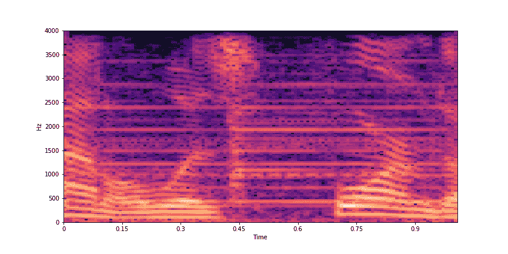

音频有许多不同的表示方式，从原始时间序列到时频分解。表示的选择对于系统的性能至关重要。在时频分解中，频谱图已被证明是音频处理的一种有用的表示方法。它们由代表短时傅立叶变换(STFT)序列的 2D 图像组成，以时间和频率为轴，亮度代表每个时间帧的频率分量的强度。因此，它们似乎是将图像的 CNN 架构直接应用于声音的自然领域。在幅度谱和相位谱之间，幅度谱包含了信号的大部分结构。相位谱图似乎只显示出很少的时间和光谱规律。

在这个项目中，我将使用幅度谱图作为声音的表示(参见下图),以预测噪声模型，并将其减去噪声声谱图。

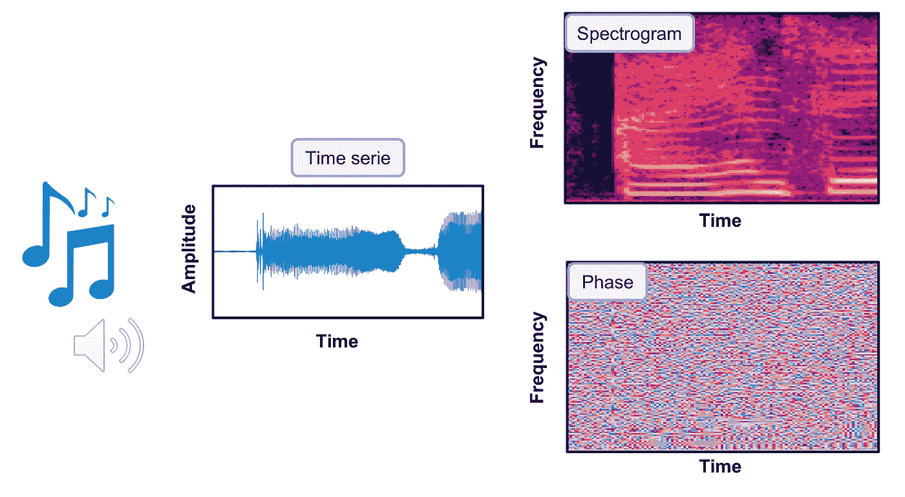

项目分解为三种模式:`data creation`、`training`和`prediction`。该代码可从 Github 库获得:[https://github.com/vbelz/Speech-enhancement](https://github.com/vbelz/Speech-enhancement)

# 准备数据

为了创建用于训练的数据集，我从不同的来源收集了带有干净声音和环境噪音的英语语音示例。

干净的声音主要来自于 [LibriSpeech](http://www.openslr.org/12/) :一个基于公共领域有声读物的 ASR 语料库。我也使用了来自 SiSec 的一些数据。环境噪声从 [ESC-50 数据集](https://github.com/karoldvl/ESC-50)或[https://www.ee.columbia.edu/~dpwe/sounds/](https://www.ee.columbia.edu/~dpwe/sounds/)中采集。

在这个项目中，我关注了 10 类环境噪音:滴答声、脚步声、铃声、手锯声、闹钟声、烟火声、昆虫声、刷牙声、吸尘器声和鼾声。下图展示了这些类(我用来自[https://unsplash.com](https://unsplash.com/)的图片创建了这张图片。)

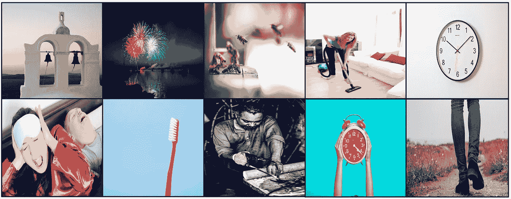

为了创建用于训练/验证/测试的数据集，音频以 8kHz 进行采样，我提取了略高于 1 秒的窗口。我对环境噪声进行了一些数据扩充(在不同时间取窗口会产生不同的噪声窗口)。噪声已经混合到干净的声音中，并随机化噪声级别(在 20%和 80%之间)。最终，训练数据由 10h 的嘈杂语音和干净语音以及 1h 的声音的验证数据组成。

为了准备数据，我建议在与代码文件夹不同的位置创建 data/Train 和 data/Test 文件夹。然后创建下图所示的结构:

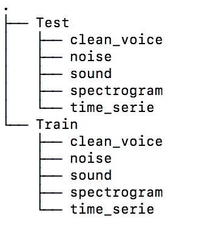

您可以将`noise_dir`、`voice_dir`、`path_save_spectrogram`、`path_save_time_serie`和`path_save_sound`路径名相应地修改到`args.py`文件中，该文件采用程序的默认参数。

将您的噪音音频文件放入`noise_dir`目录，将您的干净语音文件放入`voice_dir`。

在`args.py`中指定你想要创建多少帧作为`nb_samples`(或者从终端传递它作为一个参数)我让 nb_samples 默认为 50，但对于生产，我建议有 40 000 或更多。

然后运行`python main.py --mode='data_creation'`。这将随机混合来自`voice_dir`的一些干净声音和来自`noise_dir`的一些噪音，并将嘈杂声音、噪音和干净声音的频谱图以及复杂相位、时间序列和声音保存到磁盘(用于 QC 或测试其他网络)。它采用在`args.py`中定义的输入参数。STFT、帧长、hop_length 的参数可以在`args.py`中修改(或从终端作为参数传递)，但在默认参数下，每个窗口将被转换为 128 x 128 大小的谱图矩阵。

用于训练的数据集将是嘈杂声音的幅度谱图和干净声音的幅度谱图。

# 培养

用于训练的模型是 U-Net，一种具有对称跳跃连接的深度卷积自动编码器。 [U-Net](https://arxiv.org/abs/1505.04597) 最初是为生物医学图像分割而开发的。这里，U-Net 已被用来对光谱图进行降噪处理。

作为网络的输入，噪声声音的幅度谱图。将噪声输出到模型(含噪语音幅度谱图—干净语音幅度谱图)。输入和输出矩阵都用全局缩放进行缩放，以映射到-1 和 1 之间的分布。

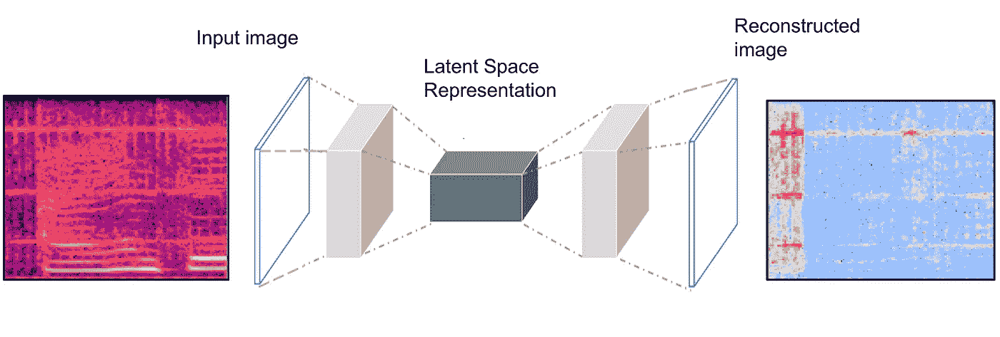

培训期间测试了许多配置。对于优选的配置，编码器由 10 个卷积层组成(具有 LeakyReLU、maxpooling 和 dropout)。解码器是具有跳跃连接的对称扩展路径。最后一个激活层是双曲正切(tanh ),其输出分布在-1 和 1 之间。对于从零开始的训练，初始随机权重用正常初始值设定。

模型用 Adam optimizer 编译，使用的损失函数是 Huber 损失，作为 L1 和 L2 损失之间的折衷。

在现代 GPU 上进行培训需要几个小时。

如果你本地电脑有深度学习计算的 GPU，可以用:`python main.py --mode="training"`进行训练。它将`args.py`中定义的参数作为输入。默认情况下，它将从头开始训练(你可以通过将`training_from_scratch`设为 false 来改变这一点)。您可以从`weights_folder`和`name_model`中指定的预训练重量开始训练。我让`model_unet.h5`使用我在`./weights`训练中获得的重量。通过`epochs`和`batch_size`指定训练的时期数和批量大小。最佳重量在训练期间自动保存为`model_best.h5`。可以调用 fit_generator 在训练时只将部分数据加载到磁盘上。

就我个人而言，我在训练中使用了 Google Colab 提供的免费 GPU。我在`./colab/Train_denoise.ipynb`举了一个笔记本例子。如果您的驱动器上有大量可用空间，您可以将所有训练数据加载到您的驱动器上，并在训练时使用 tensorflow.keras 的 fit_generator 选项加载部分数据。就我个人而言，我的 Google drive 上的可用空间有限，所以我提前准备了 5Gb 的批量加载到驱动器上进行训练。重量会定期保存，并在下次训练时重新加载。

最终我获得了 0.002129 的训练损失和 0.002406 的验证损失。下面是在一次培训中制作的损失图。

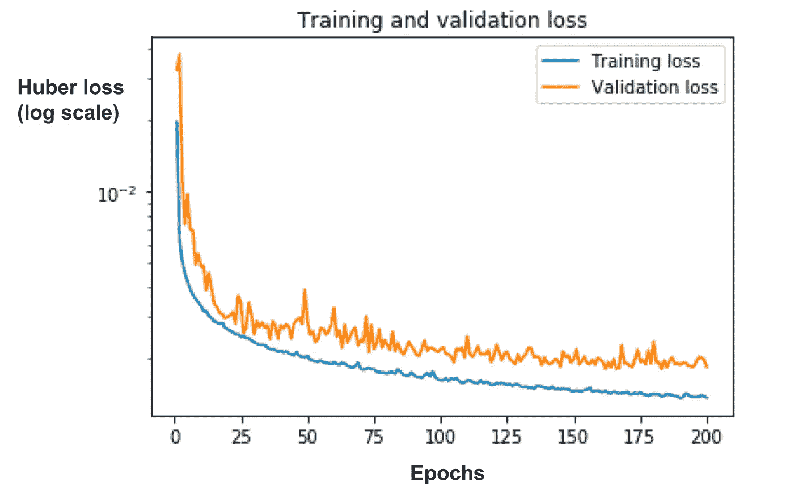

# 预言；预测；预告

为了进行预测，嘈杂的语音音频被转换成略高于 1 秒的窗口的 NumPy 时间序列。每个时间序列通过 STFT 变换转换成幅度谱图和相位谱图。噪声声谱图被传入 U-Net 网络，该网络将预测每个窗口的噪声模型(参见下图)。使用传统的 CPU，一个窗口的预测时间一旦转换成幅度谱图大约是 80 ms。

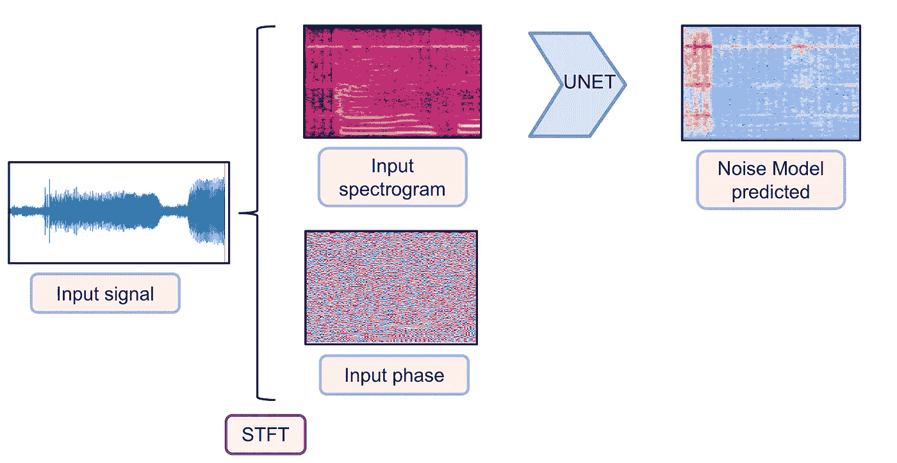

然后，从有噪声的语音频谱图中减去该模型(这里，我应用直接减法，因为它对于我的任务来说是足够的，我们可以想象训练第二个网络来适应噪声模型，或者应用诸如在信号处理中执行的匹配滤波器)。“去噪”的幅度谱图与初始相位相结合，作为反短时傅立叶变换(ISTFT)的输入。我们去噪后的时间序列可以转换成音频(参见下图)。

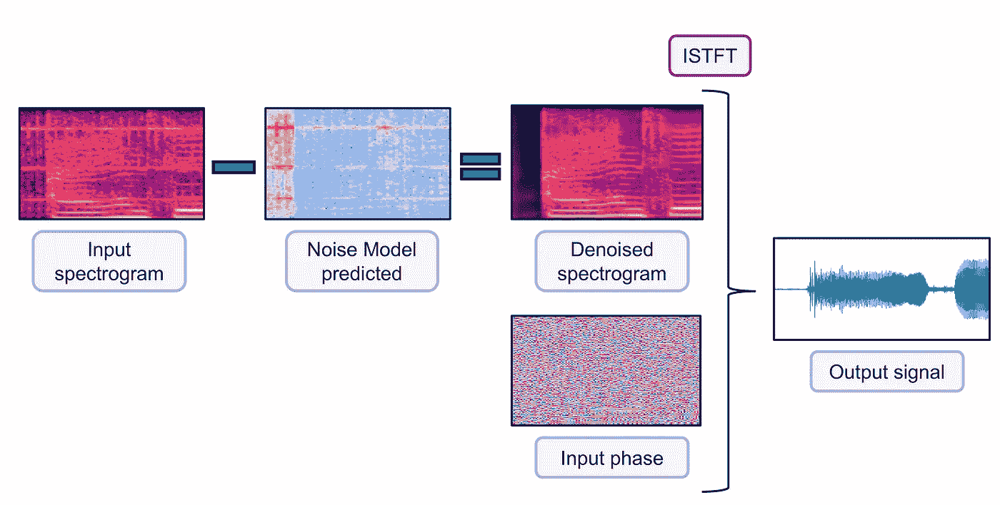

让我们看看在验证数据上的表现！

下面我展示了一些警报/昆虫/真空吸尘器/铃声的验证结果。对于它们中的每一个，我都显示了初始的有噪语音谱图，网络预测的去噪谱图，以及真正干净的语音谱图。我们可以看到，该网络能够很好地概括噪声模型，并产生略微平滑版本的语音频谱图，非常接近真正干净的语音频谱图。

更多验证数据的声谱图去噪示例显示在存储库顶部的初始 gif 中。

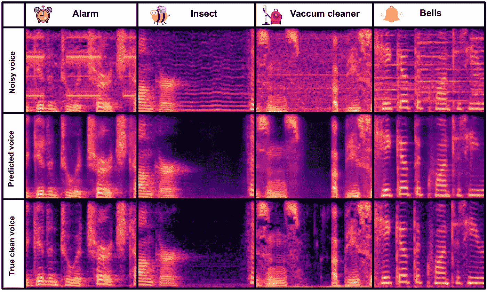

让我们听听转换回声音的结果:

## *报警示例的音频:*

[输入示例报警](https://vbelz.github.io/Speech-enhancement/demo_data/validation/noisy_voice_alarm39.wav)

[预测输出示例报警](https://vbelz.github.io/Speech-enhancement/demo_data/validation/voice_pred_alarm39.wav)

[真实输出示例报警](https://vbelz.github.io/Speech-enhancement/demo_data/validation/voice_alarm39.wav)

## ***昆虫音频示例:***

[输入示例昆虫](https://vbelz.github.io/Speech-enhancement/demo_data/validation/noisy_voice_insect41.wav)

[预测产量示例昆虫](https://vbelz.github.io/Speech-enhancement/demo_data/validation/voice_pred_insect41.wav)

[真实输出示例昆虫](https://vbelz.github.io/Speech-enhancement/demo_data/validation/voice_insect41.wav)

## ***吸尘器音频示例:***

[输入示例吸尘器](https://vbelz.github.io/Speech-enhancement/demo_data/validation/noisy_voice_vaccum35.wav)

[预测产量示例吸尘器](https://vbelz.github.io/Speech-enhancement/demo_data/validation/voice_pred_vaccum35.wav)

[真实输出示例真空吸尘器](https://vbelz.github.io/Speech-enhancement/demo_data/validation/voice_vaccum35.wav)

## ***铃声示例:***

[输入示例铃声](https://vbelz.github.io/Speech-enhancement/demo_data/validation/noisy_voice_bells28.wav)

[预测输出示例铃声](https://vbelz.github.io/Speech-enhancement/demo_data/validation/voice_pred_bells28.wav)

[真实输出示例铃声](https://vbelz.github.io/Speech-enhancement/demo_data/validation/voice_bells28.wav)

下面我展示了转换回时间序列的相应显示:

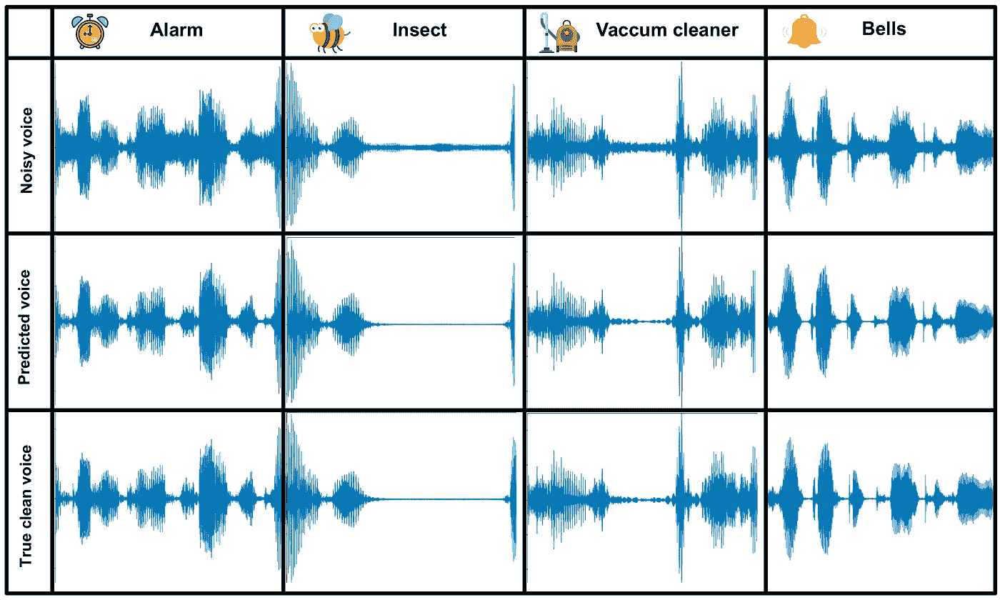

你可以看看我在`./demo_data`文件夹中提供的 jupyter 笔记本`demo_predictions.ipynb`中的这些显示/音频。

下面，我展示的是时间序列域的声谱图去噪 gif(库顶)对应的 gif。

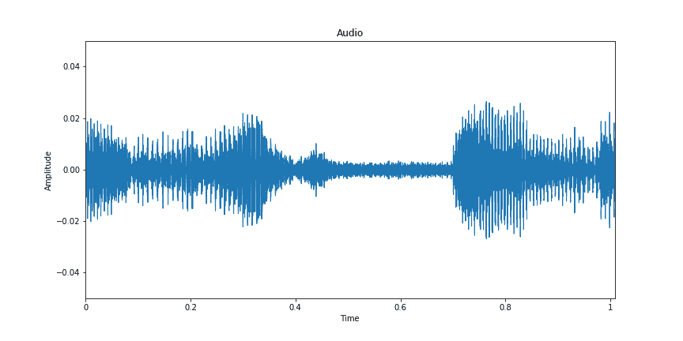

作为极端测试，我应用于一些混合了许多高水平噪音的声音。该网络在去噪方面表现得出奇地好。对 5 秒钟的音频进行降噪的总时间约为 4 秒钟(使用传统 CPU)。

下面是一些例子:

## ***例一:***

[输入示例测试 1](https://vbelz.github.io/Speech-enhancement/demo_data/test/noisy_voice_long_t2.wav)

[预测输出示例测试 1](https://vbelz.github.io/Speech-enhancement/demo_data/save_predictions/denoise_t2.wav)

## *例二:*

[输入示例测试 2](https://vbelz.github.io/Speech-enhancement/demo_data/test/noisy_voice_long_t1.wav)

[预测输出示例测试 2](https://vbelz.github.io/Speech-enhancement/demo_data/save_predictions/denoise_t1.wav)

# 结论

提出了一种用于衰减环境噪声的深度学习语音增强系统。通过使用声音的幅度谱图表示，音频去噪问题被转化为图像处理问题，简化了其分辨率。要去除的噪声已经由 U-Net 建模，U-Net 是具有对称跳跃连接的深度卷积自动编码器。经过训练后，该网络能够模拟 10 类环境噪声。这种方法是不完美的，因为没有对噪声相位谱图进行建模，这在特定情况下可能会降低整体性能。此外，这种方法更适合离线去噪，因为去噪 5 秒的音频目前需要大约 4 秒(使用经典 CPU 进行预测)。尽管如此，这种方法是稳健的，能够推广到许多语音和噪声配置。此外，它可以转移学习到其他语言以外的英语和新类型的噪音。

# 参考

> 扬松、安德里亚斯、埃里克·汉弗莱、尼古拉·蒙特基奥、雷切尔·比特纳、阿帕娜·库马尔和蒂尔曼·韦德。基于深度 U 网卷积网络的歌唱声分离。伊斯米尔 *(2017)。*
> 
> 【https://ejhumphrey.com/assets/pdf/jansson2017singing.pdf】
> 
> ***格赖斯、艾玛德 m .和普拉姆布利、马克 d,《使用卷积去噪自动编码器的单通道音频源分离》( 2017 年)。***
> 
> ***[*https://arxiv.org/abs/1703.08019*](https://arxiv.org/abs/1703.08019)***
> 
> ****Ronneberger O .，Fischer P .，Brox T. (2015) U-Net:用于生物医学图像分割的卷积网络。载于:Navab N .，Hornegger J .，Wells W .，Frangi A. (eds)* 医学图像计算和计算机辅助干预— MICCAI 2015 *。MICCAI 2015。计算机科学讲义，第 9351 卷。施普林格·查姆****
> 
> ***[*https://arxiv.org/abs/1505.04597*](https://arxiv.org/abs/1505.04597)***
> 
> ***K. J .皮扎克。环境声音分类数据集。第 23 届 ACM 多媒体年会论文集*，澳大利亚布里斯班，2015。****
> 
> ***【土井:*[*http://dx.doi.org/10.1145/2733373.2806390*](http://dx.doi.org/10.1145/2733373.2806390)**