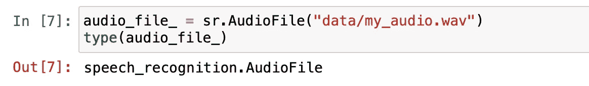

# Python 中的语音识别——初学者完全指南

> 原文：<https://towardsdatascience.com/speech-recognition-in-python-the-complete-beginners-guide-de1dd7f00726?source=collection_archive---------4----------------------->

## 简单的动手演练


由 [Unsplash](https://unsplash.com/@convertkit?utm_source=unsplash&utm_medium=referral&utm_content=creditCopyText) 上的 [ConvertKit](https://unsplash.com/@convertkit?utm_source=unsplash&utm_medium=referral&utm_content=creditCopyText) 拍摄

*欢迎来到 Python 语音识别的完全初学者指南。*

在这篇文章中，我将带你完成一些很棒的实践练习，帮助你对语音识别和机器学习的使用有一些了解。语音识别通过说话代替打字来帮助我们节省时间。它也给了我们与设备交流的能力，甚至不用写一行代码。这使得技术设备更容易接近和使用。语音识别是在现实生活中使用机器学习的一个很好的例子。

另一个语音识别的好例子:Google Meet web 应用程序，你知道你可以通过设置打开字幕吗？当你打开字幕时，后面的一个程序会识别你的讲话，并将其转换为现实生活中的文本。看到它发生得如此之快，真的令人印象深刻。这个 Google Meet 识别器的另一个很酷的功能是它还知道谁在说话。在本演练中，我们将使用 Google 的语音 API。我迫不及待地想向您展示如何构建自己的语音识别器。我们开始吧！

## 目录

*   ***语音识别库***
*   ***识别器类***
*   ***语音识别功能***
*   ***音频预处理***
*   ***加成(不同场景)***


语音识别视觉作者[作者](https://medium.com/@lifexplorer)

# 语音识别库

*   CMU 狮身人面像
*   卡尔迪
*   演讲认知
*   wav2 字母++

**“CMU 狮身人面像**收集了 CMU 20 多年的研究成果。这个库的一些优势:CMUSphinx 工具是专门为低资源平台设计的，设计灵活，专注于实际应用开发而不是研究。”([参考](https://cmusphinx.github.io))

" Kaldi 是一个语音识别工具包，供语音识别研究人员和专业人士使用。"([参考](http://kaldi-asr.org))

**“语音识别**是一个用于执行语音识别的库，支持多种引擎和 API，在线和离线。”([参考](https://pypi.org/project/SpeechRecognition/)

**“wav2 letter++**是一款快速、开源的语音处理工具包，由脸书人工智能研究所的语音团队开发，旨在促进语音识别端到端模型的研究。”([参考](https://github.com/facebookresearch/wav2letter))

从这些库中，我们将使用 speech recognition 库，因为它的入门门槛低，并且与许多可用的语音识别 API 兼容。我们可以通过在终端窗口中运行下面一行来安装*speech recognition*库:

```
pip install SpeechRecognition
```

# 识别器类

SpeechRecognition 库有许多类，但我们将重点关注一个名为 Recognizer 的类。这个类将帮助我们把音频文件转换成文本。要访问 Recognizer 类，首先，让我们导入库。

```
import speech_recognition as sr
```

现在，让我们定义一个变量，并通过调用它来分配 recognizer 类的一个实例。

```
recognizer = sr.Recognizer()
```

现在，让我们将能量阈值设置为 300。您可以将能量阈值视为音频文件的音量。低于阈值的值被认为是无声的，高于阈值的值被认为是语音。这将提高处理音频文件时语音的识别能力。

```
recognizer.energy_threshold = 300
```

SpeechRecognition 的文档推荐使用 300 作为阈值，它非常适合大多数音频文件。此外，请记住，能量阈值会随着识别器侦听音频文件而自动调整。

# 语音识别功能

在这一步中，我们将看到我们的识别器在工作，但是在我们让它工作之前，让我们看看这个实例的一些很酷的功能。语音识别有一个内置的功能，使它能够与现有的许多 API 一起工作:

*   识别 _bing()
*   识别 _ 谷歌()
*   识别 _ 谷歌 _ 云()
*   认可 _ 机智()

**必应识别器**功能使用微软的认知服务。

**谷歌识别器**功能使用谷歌免费的网络搜索 API。

**谷歌云识别器**功能使用谷歌的云语音 API。

**Wit 识别器**功能使用 wit.ai 平台。

我们将使用 *Google Recognizer* 函数，它是 recognize_google()。它是免费的，不需要 API 密钥就可以使用。这个识别器有一个缺点，当您想要处理较长的音频文件时，它会限制您。根据我的经验，我在处理 5 分钟以下的音频文件时没有遇到任何问题。我不建议将此识别器用于长音频文件。有不同的技术来处理较长的音频文件，我计划在另一篇文章中介绍它。

## 例子

```
import speech_recognition as srrecognizer = sr.Recognizer()recognizer.recognize_google(audio_data="my_audio.wav", language="en-US")
```


出错信息

# 音频预处理

前面的例子只是一个没有做任何音频预处理的尝试，正如你所看到的，它导致了一个错误。问题是我们音频文件的数据类型。为了避免这种问题，预处理步骤是必要的。你可以把它想象成我们通常在做数据分析之前做的数据预处理。对于这一步，我们将使用一个特殊的类，称为 AudioFile。

## 音频文件

```
import speech_recognition as srrecognizer = sr.Recognizer()audio_file_ = sr.AudioFile("data/my_audio.wav")type(audio_file)
```



当我们试图在 recognize_google()函数中传递 audio_file 变量时，它不会接受。原因是该函数接受 audiodata，但我们当前的变量类型是 audiofile。为了将其转换为音频数据类型，我们将使用 recognizer 类的内置方法 record。

## 记录方法

下面是如何使用记录方法:

```
with audio_file as source:
  audio_file = recognizer.record(source)
  recognizer.recognize_google(audio_data=audio_file)type(audio_file)
```


数据类型已更新

我们还可以使用记录方法的两个参数。

默认情况下，这两个参数都等于零。在默认模式下，record 方法将从文件的开头开始记录音频数据，直到没有音频为止。但是我们可以通过赋予它们浮点值来改变这一点。

*   **持续时间**:假设我们只想要整个音频文件的前 7 秒，我们必须将持续时间参数设置为 7.0
*   **偏移量**:用于在音频文件的开头切断或跳过指定的秒数。假设我们不想要音频文件的前 1 秒，我们必须将偏移参数设置为 1.0

**持续时间**

```
with audio_file_ as source:
  audio_file = recognizer.record(source, duration = 7.0)
  result = recognizer.recognize_google(audio_data=audio_file)
```


结果

**偏移**

```
with audio_file_ as source:
  audio_file = recognizer.record(source, offset = 1.0)
  result = recognizer.recognize_google(audio_data=audio_file)
```


结果

# 奖金(不同场景)

## 无声音频

```
# Import the silent audio file
silent_audio_file = sr.AudioFile("silent_audio.wav")# Convert the AudioFile to AudioData
with silent_audio_file as source:
  silent_audio = recognizer.record(source)# Recognize the AudioData with show_all turned on
recognizer.recognize_google(silent_audio, show_all=True)
```

## 多个扬声器

这种理解单个音频文件中不同说话者的过程称为说话者二进制化。这是一个很酷的功能，但是不幸的是，这个库中没有这个功能。一个解决方法是为不同的扬声器准备不同的音频文件，使用 for 循环遍历它们。

```
recognizer = sr.Recognizer()# Multiple speakers on different files
speakers = [sr.AudioFile("speaker_0.wav"), sr.AudioFile("speaker_1.wav"), sr.AudioFile("speaker_2.wav")]# Transcribe each speaker individually
for i, speaker in enumerate(speakers):
  with speaker as source:
    speaker_audio = recognizer.record(source)

 print(f"Text from speaker {i}:")
 print(recognizer.recognize_google(speaker_audio,language="en-US"))
```

## 背景噪声

为了处理背景噪声，recognizer 类有一个名为 adjust_for_ambient_noise 函数的内置函数，该函数也接受一个参数 duration。使用该函数，识别器类在从音频开始起的指定持续时间(秒)内监听音频，然后调整能量阈值，以便更容易识别整个音频。

```
# Import audio file with background nosie
noisy_audio_file = sr.AudioFile("noisy_audio.wav")# Adjust for ambient noise and record
with noisy_audio_file as source:
  recognizer.adjust_for_ambient_noise(source, duration=0.5)
  noisy_audio_file = recognizer.record(source)# Recognize the audio
recognizer.recognize_google(noisy_audio_file)
```

# 视频演示

我刚刚在 YouTube 上开始我的旅程，我正在做以下主题的视频演示:机器学习，数据科学，人工智能。尽情享受吧！

感谢你阅读这篇文章，我希望你今天喜欢并学到了一些新东西。欢迎[联系我](https://sonsuzdesign.blog/2020/08/14/speech-recognition-in-python-the-complete-beginners-guide/)如果您在执行代码时有任何问题，我们将非常乐意提供帮助。

> *跟随* [*我的博客*](https://medium.com/@lifexplorer) *和* [*走向数据科学*](https://towardsdatascience.com/) *留下灵感。*

## 相关内容

[](/extracting-speech-from-video-using-python-f0ec7e312d38) [## 使用 Python 从视频中提取语音

### 使用 Google 语音识别 API 的简单实用项目

towardsdatascience.com](/extracting-speech-from-video-using-python-f0ec7e312d38) [](/building-a-speech-translator-in-python-8ff190212b49) [## 用 Python 构建语音翻译器

### 使用谷歌翻译 API 将你的演讲翻译成多种语言

towardsdatascience.com](/building-a-speech-translator-in-python-8ff190212b49)