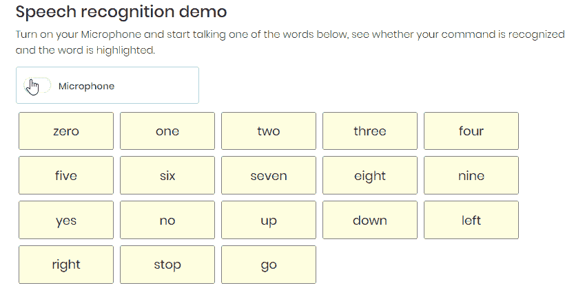

# 使用 Tensorflow.js 进行语音识别

> 原文：<https://towardsdatascience.com/speech-recognition-with-tensorflow-js-2f55c104e809?source=collection_archive---------35----------------------->

## 利用语音命令识别技术在浏览器中引入语音控制


图片来自 [Pixabay](https://pixabay.com/?utm_source=link-attribution&utm_medium=referral&utm_campaign=image&utm_content=2598422) 的 [Kaufdex](https://pixabay.com/users/Kaufdex-2137215/?utm_source=link-attribution&utm_medium=referral&utm_campaign=image&utm_content=2598422)

像亚马逊 Alexa 和谷歌 Home 这样的语音助手已经变得广泛流行，它们允许用户通过使用语音识别快速完成任务。

由于语音识别技术的改进，Tensorflow.js 发布了一个 JavaScript 模块，可以识别口头命令。

在本文中，我们将使用一个预先训练好的 Tensorflow.js 模型进行迁移学习。让我们建立一个可以识别你的语音命令的应用程序。



点击下面的链接亲自尝试一下:

[](https://bensonruan.com/speech-recognition-with-tensorflow-js/) [## 采用 TensorFlow.js - Benson 技术的语音识别

### 在本文中，我们将使用预训练的 TensorFlow.js 模型进行语音识别。让我们构建一个应用程序…

bensonruan.com](https://bensonruan.com/speech-recognition-with-tensorflow-js/) 

我们现在可以用声音无接触地控制电脑，这难道不令人惊奇吗？Tensorflow.js 真正将人工智能带入浏览器。让我们深入代码，一步一步地向您展示如何用 tensorflow.js 构建这个语音识别应用程序。

# 履行

## #步骤 1:包含 tensorflow.js

只需在 html 文件的<头>部分包含`tfjs` 和`speech-commands models`的脚本。

```
<script src="[https://unpkg.com/@tensorflow/tfjs](https://unpkg.com/@tensorflow/tfjs)"></script><script src="[https://unpkg.com/@tensorflow-models/speech-commands](https://unpkg.com/@tensorflow-models/speech-commands)"></script>
```

## #第二步:列出命令词

**HTML—index.html**

在 html 主体中添加一个

占位符

```
<div id="candidate-words"></div>
```

添加一个复选框来控制打开/关闭麦克风，我已经使用纯 css 定制了复选框，看起来像一个移动开关。

```
<label class="form-switch">
<input type="checkbox" id="audio-switch">
<i></i> Microphone</label>
```

**Javascript—speech _ command . js**

tfjs 语音命令库支持 20 项词汇，包括:“零”、“一”、“二”、“三”、“四”、“五”、“六”、“七”、“八”、“九”、“上”、“下”、“左”、“右”、“开始”、“停止”、“是”和“否”，此外还有“背景噪声”和“未知”。页面加载后，将单词追加到列表中。

```
wordList = ["zero","one","two","three","four","five","six","seven","eight","nine", "yes", "no", "up", "down", "left", "right", "stop", "go"];$.each(wordList, function( index, word ) {
 if (!word.startsWith('_')){
  $("#candidate-words").append('<span id='word-${word}'>${word}</span>');
 }
});
```

## #步骤 3:加载模型

当麦克风开关(复选框)打开(选中)时，首先调用函数`loadModel()`加载预先训练好的模型，然后调用函数`startListening()`启动语音命令识别。

当麦克风开关(复选框)关闭(未选中)时，调用功能`stopListening()`断开麦克风。

```
if(this.checked){
 if(!modelLoaded){
  loadModel();
 }else{
  startListening();
 }
}
else {
 stopListening();
}
```

函数 loadModel()加载预先训练好的语音命令模型，调用`speechCommands.create`和`recognizer.ensureModelLoaded`的 API。调用 create 函数时，必须提供音频输入的类型。
两个可用选项是‘浏览器 _ 快速傅立叶变换’和‘软件 _ 快速傅立叶变换’。
— BROWSER_FFT 使用浏览器的原生傅立叶变换。
— SOFT_FFT 使用傅立叶变换的 JavaScript 实现(尚未实现)。

```
function loadModel(){
    recognizer = **speechCommands.create("BROWSER_FFT")**;  
    Promise.all([
        **recognizer.ensureModelLoaded()**
      ]).then(function(){
        **words = recognizer.wordLabels()**;
        modelLoaded = true;
        startListening();
      })
}
```

## #步骤 4:启动语音识别

函数 startListening()调用`recognizer.listen` API 开始监听语音命令。listen()函数接受两个参数:
1。识别单词时调用的回调函数。
2。具有可调字段的配置对象，例如
—include spectrogram
—probability threshold(当且仅当所有单词的最大概率得分大于该阈值时，才会调用回调函数)
— includeEmbedding

分数的输出包含对应于 recognizer.wordLabels()的概率分数。下面的代码将分数转换成一个(分数，单词)对列表。

请注意，麦克风只能通过 **https** 协议访问

```
function startListening(){
    **recognizer.listen(({scores})** => {
        scores = Array.from(scores).map(**(s, i) => ({score: s, word: words[i]})**);
        scores.sort((s1, s2) => s2.score - s1.score);
        $("#word-"+scores[0].word).addClass('candidate-word-active');
    }, 
    {
        **probabilityThreshold**: 0.70
    });
}
```

最后，要关闭麦克风，调用 recognizer.stopListening API

```
function stopListening(){
    **recognizer.stopListening**();
}
```

# GitHub 知识库

您可以通过下面的链接下载上述演示的完整代码:

[](https://github.com/bensonruan/Speech-Command) [## 本森阮/言语指挥

### 使用 javascript 库 tensorflowjs 的浏览器中麦克风的语音命令识别器…

github.com](https://github.com/bensonruan/Speech-Command) 

# 结论


阿尔瓦罗·雷耶斯在 [Unsplash](https://unsplash.com?utm_source=medium&utm_medium=referral) 上拍摄的照片

2020 年的 Tensorflow.js 由于其全面的线性代数核心和深度学习层，已经成为所有机器学习 JavaScript 项目的面包和黄油。从这篇文章中，我希望你能从中得到乐趣，并鼓励你更多地了解这个库。

感谢您的阅读。如果你喜欢这篇文章，请在脸书或推特上分享。如果你有任何问题，请在评论中告诉我。在 [GitHub](https://github.com/bensonruan/) 和 [Linkedin](https://www.linkedin.com/in/benson-ruan/) 上关注我。