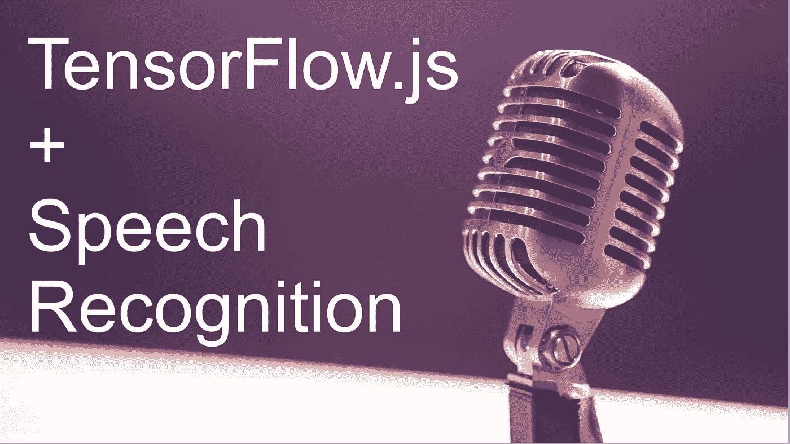
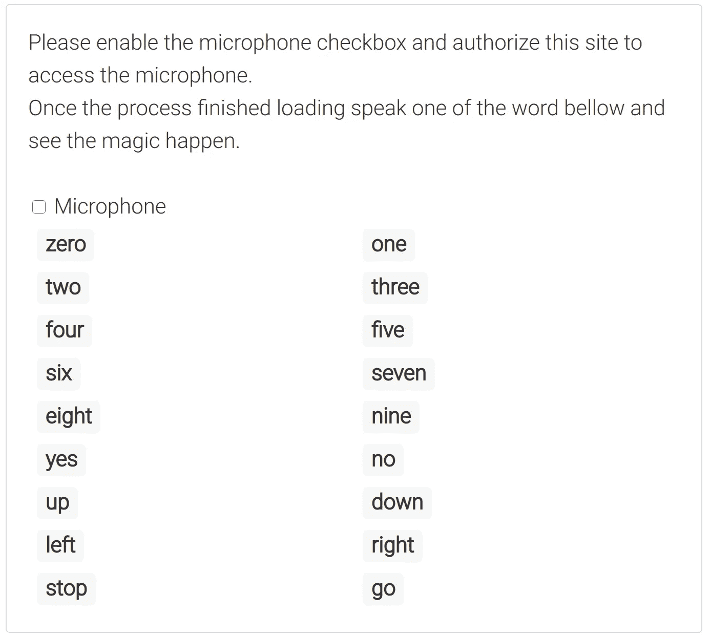

# 使用 TensorFlow.js 进行语音识别

> 原文：<https://towardsdatascience.com/speech-recognition-with-tensorflow-js-66608355376e?source=collection_archive---------48----------------------->

## 语音识别

## 使用 TensorFlow.js 构建一个小型语音识别示例



马特·博茨福德在 [Unsplash](/?utm_source=unsplash&utm_medium=referral&utm_content=creditCopyText) 上的照片

当我们通常谈论 AI、深度学习、机器学习时，我们会自动想到 Python、R 或 C++，但 JavaScript 呢？嗯……事实证明，Python 中最受欢迎的机器学习库之一也可用于 JavaScript，我们正在谈论 [Tensorflow](https://www.tensorflow.org/) ，今天我们将对该库做一个简短的介绍，我们将一起构建一个有趣的项目。

# Tensorflow.js 是什么，可以用来做什么？

[TensorFlow.js](https://www.tensorflow.org/js) 是一个由 Google 开发的 JavaScript 库，用于在浏览器和 Node.js 中训练和部署机器学习模型。它是 Python 的流行 ML 库 [TensorFlow](https://www.tensorflow.org/) 的姊妹库。

TensorFlow.js 不仅仅是一个玩具库，它是严肃的商业，性能令人惊讶，尤其是在通过 WebGL 使用硬件加速时，但我们应该用它来训练模型吗？也许不是，即使你可以获得很好的性能，它的 Python 版本甚至更快，当使用 Python 时，你会发现更多的库来支持你的代码，如 Numpy 和 Pandas。除了学习资料，TensorFlow.js 的内容没有 TensorFlow 多。

现在，这并不意味着您不应该使用 TensorFlow.js，相反，我认为它是一个用于部署和运行 ML 模型的很好的库，这也是我们将在本文的剩余部分重点关注的内容。

# 使用 TensorFlow.js 部署示例模型

正如我们所说，TensorFlow.js 是一个强大的库，我们可以处理许多不同的事情，如图像分类、视频处理和语音识别等。今天，我决定研究一个基本的语音识别示例。

我们的代码将能够通过麦克风监听并识别用户在说什么，至少几个词，因为我们对我使用的示例模型有一些限制。但与其解释，我认为如果我们先看到它的实际应用会很酷:



不幸的是，我不能在介质上运行代码，但你可以在这里访问现场演示

很酷吗？我知道这可能有点不稳定，而且仅限于几个词，但如果您使用正确的模型，可能性是无穷的。说够了，让我们开始编码吧。

我们需要做的第一件事是安装库并获得我们的模型。为了安装 TensorFlow.js，有几个选项可以查看[这里是](https://www.tensorflow.org/js/tutorials/setup)，为了简单起见，我们将从 CDN 导入。

```
<script src="https://cdn.jsdelivr.net/npm/@tensorflow/tfjs@2.0.0/dist/tf.min.js"></script>
<script src="https://unpkg.com/@tensorflow-models/speech-commands"></script>
```

然后我们将使用一些 HTML 来显示单词列表:

```
<div class="demo">
    <div>
        <label class="form-switch">
            <input type="checkbox" id="audio-switch">
            Microphone
        </label>
        <div id="demo-loading" class="hidden">Loading...</div>
    </div>
    <div id="sp-cmd-wrapper" class="grid"></div>
</div>
```

到目前为止，没有什么奇怪的，我们有我们的复选框，一个加载元素和一个包装元素，我们将使用它们来呈现单词列表，所以让我们接下来这样做:

```
const wrapperElement = document.getElementById('sp-cmd-wrapper');
for (let word of wordList) {
    wrapperElement.innerHTML += `<div id='word-${word}'>${word}</div>`;
}
```

为了让演示开始工作，我们需要单击麦克风复选框，让我们在那里设置一个事件监听器来触发加载和监听过程。

```
document.getElementById("audio-switch").addEventListener('change', (event) => {
    if(event.target.checked) {
        if(modelLoaded) {
            startListening();
        }else{
            loadModel();
        }
    } else {
        stopListening();
    }   
});
```

当复选框改变其值时，我们有 3 种不同的可能性，用户启用了复选框而模型未被加载，在这种情况下，我们使用`loadModel()`函数，但是如果模型已经被加载，我们触发监听过程。如果用户禁用了复选框，我们将停止访问麦克风。

让我们回顾一下每个函数的实现:

## 负载模型()

`loadModel()`负责创建识别器实例和加载模型。当模型被加载时，我们将能够通过`recognizer.wordLabels()`得到模型被训练的标签列表。这将有助于以后评估模型。

```
async function loadModel() { 
    // Show the loading element
    const loadingElement = document.getElementById('demo-loading');
    loadingElement.classList.remove('hidden');

    // When calling `create()`, you must provide the type of the audio input.
    // - BROWSER_FFT uses the browser's native Fourier transform.
    recognizer = speechCommands.create("BROWSER_FFT");  
    await recognizer.ensureModelLoaded()

    words = recognizer.wordLabels();
    modelLoaded = true;

    // Hide the loading element
    loadingElement.classList.add('hidden');
    startListening();
}
```

## 开始监听()

`startListening()`将在模型加载或用户启用麦克风后被调用，将负责访问麦克风 API 并评估模型以查看我们能够识别哪个单词。这听起来很复杂，但由于 TensorFlow 只有几行代码。

```
function startListening() {
    recognizer.listen(({scores}) => {

        // Everytime the model evaluates a result it will return the scores array
        // Based on this data we will build a new array with each word and it's corresponding score
        scores = Array.from(scores).map((s, i) => ({score: s, word: words[i]}));

        // After that we sort the array by scode descending
        scores.sort((s1, s2) => s2.score - s1.score);

        // And we highlight the word with the highest score
        const elementId = `word-${scores[0].word}`;
        document.getElementById(elementId).classList.add('active');

        // This is just for removing the highlight after 2.5 seconds
        setTimeout(() => {
            document.getElementById(elementId).classList.remove('active');
        }, 2500);
    }, 
    {
        probabilityThreshold: 0.70
    });
}
```

超级容易！现在是最后一个函数。

## 停止列表()

`stopListening()`将停止访问麦克风并停止评估。

```
function stopListening(){
    recognizer.stopListening();
}
```

就这样，这就是在 web 上构建第一个语音识别示例所需的全部内容。

# 把所有的放在一起

```
<script src="https://cdn.jsdelivr.net/npm/@tensorflow/tfjs@2.0.0/dist/tf.min.js"></script>
<script src="https://unpkg.com/@tensorflow-models/speech-commands"></script><script type="text/javascript">
    let recognizer;
    let words;
    const wordList = ["zero","one","two","three","four","five","six","seven","eight","nine", "yes", "no", "up", "down", "left", "right", "stop", "go"];
    let modelLoaded = false;

    document.addEventListener('DOMContentLoaded', () => {
        const wrapperElement = document.getElementById('sp-cmd-wrapper');
        for (let word of wordList) {
            wrapperElement.innerHTML += `<div class='col-3 col-md-6'><div id='word-${word}' class='badge'>${word}</div></div>`;
        };

        document.getElementById("audio-switch").addEventListener('change', (event) => {
            if(event.target.checked) {
                if(modelLoaded) {
                    startListening();
                }else{
                    loadModel();
                }
            } else {
                stopListening();
            }   
        });
    });

    async function loadModel() { 
        // Show the loading element
        const loadingElement = document.getElementById('demo-loading');
        loadingElement.classList.remove('hidden');

        // When calling `create()`, you must provide the type of the audio input.
        // - BROWSER_FFT uses the browser's native Fourier transform.
        recognizer = speechCommands.create("BROWSER_FFT");  
        await recognizer.ensureModelLoaded()

        words = recognizer.wordLabels();
        modelLoaded = true;

        // Hide the loading element
        loadingElement.classList.add('hidden');
        startListening();
    }

    function startListening() {
        recognizer.listen(({scores}) => {

            # Everytime the model evaluates a result it will return the scores array
            # Based on this data we will build a new array with each word and it's corresponding score
            scores = Array.from(scores).map((s, i) => ({score: s, word: words[i]}));

            # After that we sort the array by scode descending
            scores.sort((s1, s2) => s2.score - s1.score);

            # And we highlight the word with the highest score
            const elementId = `word-${scores[0].word}`;
            document.getElementById(elementId).classList.add('active');

            # This is just for removing the highlight after 2.5 seconds
            setTimeout(() => {
                document.getElementById(elementId).classList.remove('active');
            }, 2500);
        }, 
        {
            probabilityThreshold: 0.70
        });
    }

    function stopListening(){
        recognizer.stopListening();
    }
</script><div class="demo">
    Please enable the microphone checkbox and authorize this site to access the microphone.
    <br />
    Once the process finished loading speak one of the word bellow and see the magic happen.
    <br /><br />
    <div>
        <label class="form-switch">
            <input type="checkbox" id="audio-switch">
            Microphone
        </label>
        <div id="demo-loading" class="hidden">Loading...</div>
    </div>
    <div id="sp-cmd-wrapper" class="grid"></div>
</div>
```

# 结论

TensorFlow.js 是一个强大的库，非常适合部署 ML 学习模型。今天我们了解到，只需几行代码，我们就能够加载一个模型并开始生成结果。与大多数 ML 解决方案一样，它与模型和数据一样好。

如果你有可以使用 TensorFlow.js 的好想法，或者如果你知道任何我可以用来构建下一个项目并在博客上展示的好模型，请在评论中告诉我。

一如既往的感谢阅读！