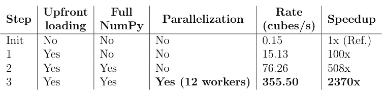
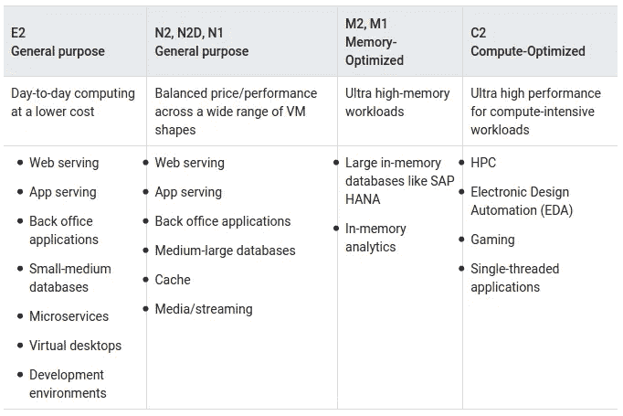
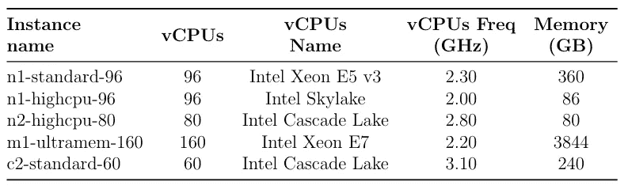
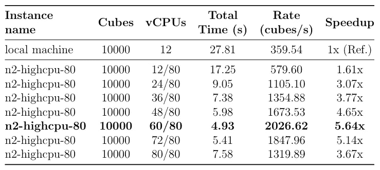
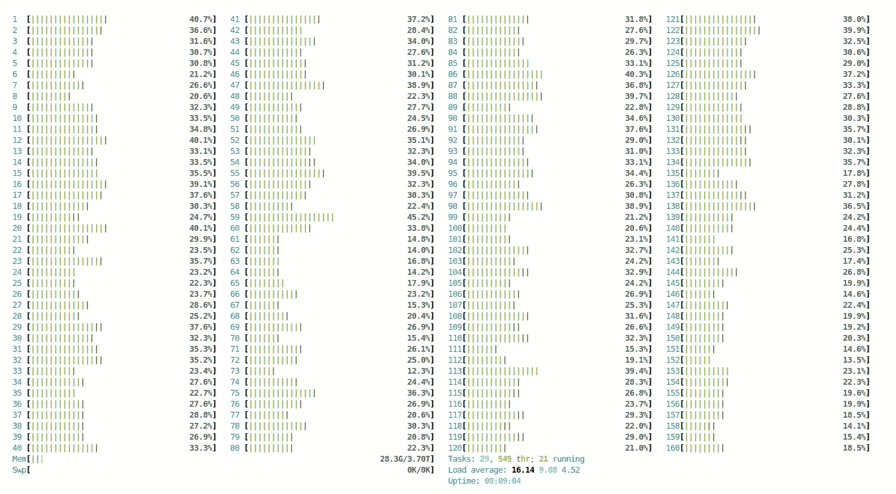
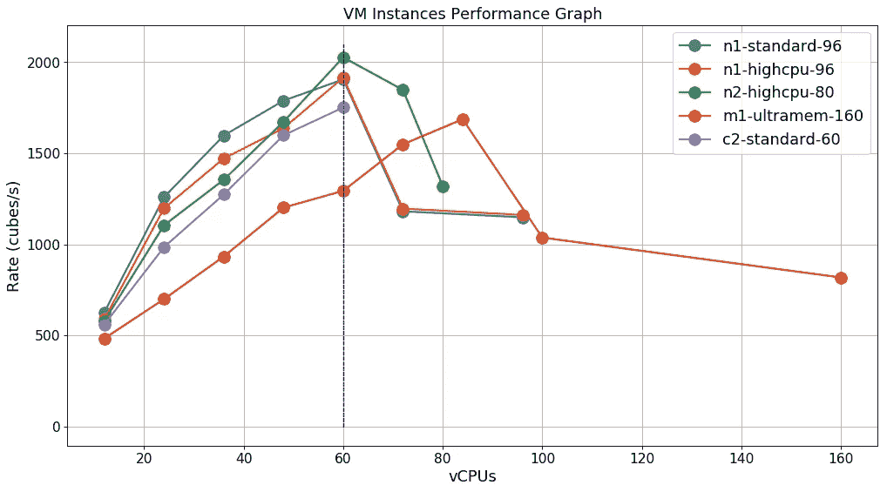

# 机器学习的速度立方

> 原文：<https://towardsdatascience.com/speed-cubing-for-machine-learning-a5c6775fff0b?source=collection_archive---------52----------------------->

## 第 1 集:如何优化 Python 代码、CPU 和 I/O 利用率以及云中的部署。


莱纳斯·艾肯斯塔姆在 [Unsplash](https://unsplash.com?utm_source=medium&utm_medium=referral) 上的照片

# 介绍

在机器学习项目的某个阶段，您可能想要克服本地机器的限制(内核数量、内存等。)，无论你是想生成大量数据来馈入深度学习网络，还是想尽快训练你的算法。在本文中，我们将带您踏上一段旅程，分享我们发现的困难和解决方案，从幼稚的实现到更高级的技术，利用云中可能存在的各种计算资源。我们希望这将帮助您有效地管理和提高您的机器学习项目的生产率。

# 生成大量数据(比如…很多！)

在我们的实验中，我们希望能够在几分钟内生成大量(比如说 **1，000，000**)**的数据块，作为一些生成性对抗网络(GANs)的输入。如果你没听说过 GANs，可以在这里【1】阅读我的入门文章[。](https://95ba6910-ffb9-46f0-bab4-8431d2e31772.filesusr.com/ugd/dcd9aa_6ca686087fd04f04bd20b5f71a1f5ceb.pdf)**

我们正在讨论的块将是维度 n=100 的**立方体**(即*1，000，000 个数据点)。这一特定数量的 1 *兆体素*(体积的数据点)被选择来匹配生成假脸的当前艺术状态，这可以在网站[*thispersondoesnotexist.com*](https://www.thispersondoesnotexist.com)上看到。这里使用的技术被称为*style gan2*【2】(GANs 的一个变种)，其中生成的图像大小为 1024 x 1024，因此数量级为 1 *兆像素*。*

为了反映来自真实世界的一些数据准备，额外的约束将应用于构建我们的立方体。它们将从数据帧中导出，并且将是堆叠 *numpy* 数组的结果。为了简单起见，这些数据帧将具有随机值。

> **这里的目标是尽可能快地创建立方体！**

第一步将在我们的本地机器上完成，其规格在*表 1 中描述。如你所见，这已经是一个相当不错的设置了。*


表 1:我们本地机器的规格。

# 输入数据

我们首先生成大小为 1000 x 1000 的 100 个数据帧，由于使用了`numpy.random.rand`函数，这些数据帧包含随机浮点(四舍五入到 10 位小数)。然后使用`pandas.DataFrame.to_csv`功能将数据帧保存到磁盘。每个 csv 文件大约 13 Mo。

对于每个立方体，我们将不得不使用所有的数据帧来从中提取一个随机子集。使用`pandas.read_csv`函数，读取所有数据帧需要 20.87 秒，因此每秒 4.79 个文件。这是非常慢的**。根据记录，如果我们想要构建 100 万个立方体，按照这个速度，需要**超过 240 天**！**

**让我们考虑使用 *parquet* 文件格式来保存我们的数据帧，而不是使用 csv 格式。使用 *fastparquet* 引擎【3】，每个保存的拼花文件现在只有 8 Mo。如果你想了解更多的拼花文件格式，可以查看官网[这里](https://parquet.apache.org/documentation/latest/)【4】。这一次，读取全部 100 个数据帧只需要 6.57 *s* (或 15.21 files/s)！这代表了 3.2 倍的加速。第一批结果汇总在*表 2* 中。**

****

**表 2:CSV 与 parquet 的读取速度比较(100 个文件)。**

# **建造我们的第一个立方体**

****

**由[马克斯·亨克](https://unsplash.com/@henkiboy?utm_source=medium&utm_medium=referral)在 [Unsplash](https://unsplash.com?utm_source=medium&utm_medium=referral) 上拍摄的照片**

**使用一些约束，以下步骤将适用于构建一个立方体:**

1.  **对于每个数据帧，我们提取包含前 100 行和 100 个随机列的子数据帧，**
2.  **每个子数据帧然后被转换成尺寸为 100×100 的 *numpy* 数组，**
3.  **将 *numpy* 数组堆叠起来，形成一个立方体。**

```
*# CREATING THE CUBES FROM FILES (READ IN A LOOP)***import** numpy **as** np
**import** pandas **as** pdncubes = 100
dim = 100**for** n **in** range(ncubes):
    cube = np.zeros(shape=(dim, dim, dim))
    *# 'files_list' is the list of the parquet file paths*
    **for** i, f **in** enumerate(files_list):
        df = pd.read_parquet(f)
        df = df.head(dim)
        rnd_cols = random.sample(range(1, df.shape[1]), dim)
        df = df.iloc[:, rnd_cols]
        layer = df.to_numpy()
        cube[i, :, :] = layer
```

**获得一批 100 个立方体的总时间约为 661 秒(几乎 11 分钟)，因此速率为 **0.15 个立方体/秒**。**

**我相信你已经发现了这里的错误。事实上，对于每个立方体，我们每次都读取相同的 100 个拼花文件！实际上，您肯定不希望遍历这些文件。关于**数据** **结构**的下一个改进将会解决这个问题。**

# **提高速度—步骤 1:数据结构**

****

**照片由 [Fezbot2000](https://unsplash.com/@fezbot2000?utm_source=medium&utm_medium=referral) 在 [Unsplash](https://unsplash.com?utm_source=medium&utm_medium=referral) 上拍摄**

**因为我们不想在循环中读取每个立方体的拼花文件，所以最好只提前执行一次这个任务。因此，我们可以构建一个字典`df_dict`，将文件名作为键，将数据帧作为值。这个操作非常快，而且字典只有 7.33 秒。**

**现在，我们将编写一个函数来创建一个立方体，利用这个字典已经读取了数据帧并将其存储为自己的值。**

```
*# FUNCTION CREATING A CUBE FROM A DICTIONARY OF DATAFRAMES***def** create_cube(dimc, dict_df):
    cube = np.zeros(shape=(dimc, dimc, dimc))
    **for** i, df **in** enumerate(dict_df.values()):
        df = df.head(dimc)
        rnd_cols = random.sample(range(1, df.shape[1]), dimc)
        df = df.iloc[:, rnd_cols]
        layer = df.to_numpy()
        cube[i, :, :] = layer
    **return** cube
```

**这一次，创建 100 个立方体只需要 6.61 秒，速率为 **15.13 个立方体/秒**。与不使用数据帧字典的先前版本相比，这代表了 100 倍的加速。创建我们这一批 100 万个立方体现在只需要将近 20 个小时，而不是最初的 240 天。**

**现在，我们仍然使用数据帧来构建我们的立方体，也许是时候使用**full**NumPy 来提高我们的速度了。**

# **提高速度——第二步:NumPy Rocks！**

****

**[Hanson Lu](https://unsplash.com/@hansonluu?utm_source=medium&utm_medium=referral) 在 [Unsplash](https://unsplash.com?utm_source=medium&utm_medium=referral) 上的照片**

**以前使用数据帧字典的想法很有趣，但可以通过从一开始就构建一个从 parquet 文件派生的`numpy.ndarray`来改进，我们将沿着列对其进行子采样以创建我们的立方体。让我们首先创建这个大男孩:**

```
*# CREATING THE RAW DATA (NUMPY FORMAT)*arr_data = np.zeros(shape=(100, 1000, 1000))
*# 'files_list' is the list of the parquet file paths*
**for** i, j **in** enumerate(files_list):
    df = pd.read_parquet(j)
    layer = df.to_numpy()
    arr_data[i, :, :] = layer
```

**然后，我们必须相应地修改我们的`create_cube`函数，并实现一个完整的向量化:**

```
*# FUNCTION CREATING A CUBE FROM RAW DATA (FULL NUMPY VERSION)***def** create_cube_np(dimc):
    rnd_cols = random.sample(range(1, 1000), dimc)
   * # First 100 rows, 100 random columns (vectorization)*
    cube = arr_data[:, :100, rnd_cols]
    **return** cube
```

**使用这个新版本，我们能够在 1.31 秒内创建 100 个立方体，因此有一个不错的速率 **76.26 立方体/秒**。**

**现在，我们可以进入下一步，以更快的速度前进。你猜对了，是时候进行**并行化**了！**

# **提高速度—步骤 3:并行化**

****

**由[马克-奥利维尔·乔多因](https://unsplash.com/@marcojodoin?utm_source=medium&utm_medium=referral)在 [Unsplash](https://unsplash.com?utm_source=medium&utm_medium=referral) 上拍摄的照片**

**在 Python【5】【6】中有几种方法可以执行[并行化。这里，我们将使用原生的`multiprocessing` Python 包和`imap_unordered`函数来执行异步作业。我们计划利用本地机器上的 12 个内核。](https://docs.python.org/3/library/multiprocessing.html)**

```
*# PARALLELIZATION***from** multiprocessing.pool **import** ThreadPoolproc = 12  *# Number of workers*
ncubes = 100
dim = 100**def** work(none=None):
    **return** create_cube_np(dim)**with** ThreadPool(processes=proc) **as** pool:
    cubes = pool.imap_unordered(work, (None for i in range(ncubes)))
    **for** n **in** range(ncubes):
        c = next(cubes)  *# Cube is retrieved here*
```

**这里导入了`ThreadPool`包(而不是通常的`Pool`包)，因为我们希望**确保以下**:**

*   **留在同一个进程中，**
*   **避免在进程间传输数据，**
*   **通过使用仅 *numpy* 操作绕过 Python 全局解释器锁(GIL)(大多数 *numpy* 计算不受 GIL 影响)。**

**在这篇漂亮的[博客文章](https://nathangrigg.com/2015/04/python-threading-vs-processes)【7】中，你可以了解更多关于 Python 中多重处理和多线程的区别。**

**使用这种*多线程*方法，我们只需要 0.28 秒就可以创建一批 100 个立方体。我们达到了非常好的速率 **355.50 立方/秒**，因此与第一个版本相比，速度提高了 2370 倍(*表 3* )。关于我们的 1，000，000 个立方体，生成时间已经下降了**不到一个小时**。**

****

**表 3:立方体的本地生成，速度结果。**

**现在，是使用**云**中的虚拟机实例*飞行*的时候了！**

# **提高速度—步骤 4:云**

****

**由 [SpaceX](https://unsplash.com/@spacex?utm_source=medium&utm_medium=referral) 在 [Unsplash](https://unsplash.com?utm_source=medium&utm_medium=referral) 上拍摄的照片**

**如果说机器学习即服务( *MLaaS* )，排名前 4 的云解决方案分别是:微软 Azure、亚马逊 AWS、IBM Watson 和谷歌云平台(GCP)。在这项研究中，我们选择了 GCP，但任何其他供应商都可以完成这项工作。您可以在许多不同的虚拟机实例中选择或定制您自己的配置，您将能够在笔记本电脑中执行您的代码。**

**你想问自己的第一个问题如下:**

> **"我想创建什么样的实例来满足我的计算需求？"**

**基本上，你可以找到三种类型的机器:通用、内存优化或计算优化(*表 4* )。**

****

**表 4:不同工作负载的机器类型建议。**

**计算 *numpy* 。 *ndarray* 从*步骤 2* 开始，拼花文件首先被存储到云中的一个桶中。然后，在不同的 VM 实例上进行几次测试(*表 5* ，保持与*步骤 3* 中相同的多线程代码，并逐步增加 vcpu(worker)的数量。一台虚拟机的结果示例在*表 6* 中给出。**

****

**表 5:一些虚拟机实例的选择。**

****

**表 6:针对“*N2-high CPU-80”*实例的速度结果。**

**在连接到虚拟机的*终端*中，您还可以使用`htop` *linux* 命令(*图 1* )来可视化 vCPUs 的活动。**

****

**图 1:我们 160 个内核协同工作的情况(“m1-ultramem-160”实例)。**

# **结论**

****

**图 2:所有测试的虚拟机实例的性能。**

**查看*图 2* ，除了 *m1-ultramem-160* 实例(这是最昂贵的)之外，其他所有实例都执行得相当好，但是遵循相同的模式。该比率几乎随着工作人员数量的增加而线性增加，并在 60 个 vCPUs 时达到峰值。超过这个限制，速率会急剧下降，很可能是因为多线程的*开销*。**

**在我们的选择中，**胜出者**是 *n2-highcpu-80* 实例(第二便宜)，达到了 **2026.62 cubes/s** 的速率，几乎是**每秒 20 亿个数据点**。按照这个速度，我们可以在仅仅 **8 分钟**内生成 100 万个立方体。**

> **我们最初的目标成功实现了！**

**整个实验表明，不仅代码很重要，硬件也很重要。我们在本地机器上以 0.15 立方/秒的速率开始，使用**云**达到了非常快的速率 **2027 立方/秒**。这比**13500 倍加速**还要多！**

**这仅仅是开始…我们可以通过使用更先进的技术和基础设施来升级。这是为第二集准备的。**

# **参考**

**[1] [N. Morizet，生成式对抗网络导论(2020)，Advestis Tech Report](https://95ba6910-ffb9-46f0-bab4-8431d2e31772.filesusr.com/ugd/dcd9aa_6ca686087fd04f04bd20b5f71a1f5ceb.pdf) 。**

**[2] [T. Karras *等人*，StyleGAN (2019)的图像质量分析与改进，NVIDIA Research](https://research.nvidia.com/publication/2019-12_Analyzing-and-Improving) 。**

**[3][【fastparquet】正式文件(2020)](https://fastparquet.readthedocs.io/en/latest/) 。**

**[4][阿帕奇拼花地板官方文档(2020)](https://parquet.apache.org/documentation/latest/) 。**

**[5] [多处理——基于进程的并行性(2020)，Python 标准库](https://docs.python.org/3/library/multiprocessing.html)。**

**[6] " [雷"框架正式文件(2020)](https://docs.ray.io/en/latest/index.html) 。**

**[7]n . Grigg，阐释 Python 多线程与多处理(2015)，来自 nathangrigg.com 的博客文章。**

# **关于我们**

**[**Advestis**](https://www.advestis.com/) 是一家欧洲合同研究组织(CRO)，对统计学和可解释的机器学习技术有着深刻的理解和实践。Advestis 的专长包括复杂系统的建模和时间现象的预测分析。
*领英*:[https://www.linkedin.com/company/advestis/](https://www.linkedin.com/company/advestis/)**