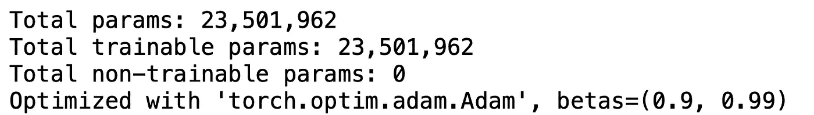

# 批量归一化折叠加速推理

> 原文：<https://towardsdatascience.com/speed-up-inference-with-batch-normalization-folding-8a45a83a89d8?source=collection_archive---------25----------------------->

## 如何删除批处理规范化层，使您的神经网络更快。

## 介绍

批量标准化是一种技术，它负责标准化每一层的输入，以使训练过程更快、更稳定。实际上，这是一个额外的层，我们通常在计算层之后和非线性之前添加。

它包括 2 个步骤:

*   通过先减去其平均值μ，然后除以其标准偏差σ来归一化该批次。
*   进一步缩放因子γ并移位因子β。这些是批量归一化层的参数，在网络不需要数据的均值为 0 且标准差为 1 的情况下需要这些参数。

由于批处理规范化对训练神经网络的效率，它现在被广泛使用。但是在推理的时候有多大用处呢？

一旦训练结束，每个批次归一化层都拥有一组特定的γ和β，以及μ和σ，后者是在训练期间使用指数加权平均值计算的。这意味着在推断过程中，批量标准化是对前一层的结果进行简单的线性变换，通常是卷积。

由于卷积也是线性变换，这也意味着两种运算可以合并成一个线性变换！

这将删除一些不必要的参数，但也减少了推理时要执行的操作的数量。

## 在实践中如何做到这一点？

借助一点数学知识，我们可以很容易地重新排列卷积的项，以考虑批量标准化。

稍微提醒一下，对于输入 *x* ，批量归一化操作之后的卷积操作可以表示为:

因此，如果我们重新安排卷积的 **W** 和 **b** 来考虑批量归一化的参数，则:

我们可以删除批处理规范化层，但仍然有相同的结果！

> **注意**:通常情况下，在批量标准化层之前的层中没有偏差。这是无用的，也是参数的浪费，因为任何常数都将被批量标准化所抵消。

## 效率如何？

我们将尝试两种常见的架构:

*   带批次标准的 VGG16
*   ResNet50

仅仅为了演示，我们将使用 [ImageNette 数据集](https://github.com/fastai/imagenette)和 PyTorch。两个网络都将被训练 5 个历元，以及在参数数目和推理时间方面有什么变化。

## 1.VGG16

先来训练 VGG16 个历元(最终精度无所谓):

然后显示其参数数量:

单幅图像的初始推断时间为:

现在，如果我们应用批量归一化折叠，我们有:

并且:

所以去掉 8448 参数甚至更好，几乎快了 0.4 ms 的推断！最重要的是，这是完全无损的，在性能方面完全没有变化:

让我们看看它在 Resnet50 的情况下是如何表现的！

## 2.Resnet50

同样，我们从训练它 5 个时期开始:

参数的初始数量是:

而推断时间是:

使用批量标准化折叠后，我们有:

并且:

现在，我们删除了 26，560 个参数，更令人印象深刻的是，推断时间减少了 1.5 毫秒！并且仍然没有任何性能下降。

因此，如果我们可以在不降低性能的情况下减少推理时间和模型的参数数量，为什么我们不能一直这样做呢？

## 希望这篇博文对你有所帮助！如果有不清楚的地方，请随时给我反馈或问我问题。

## 此处提供代码:

 [## 纳坦胡本斯/法斯特赖

### FasterAI:一个用 FastAI 库制作更小更快模型的库。-纳坦胡本斯/法斯特莱

github.com](https://github.com/nathanhubens/fasterai) 

## 参考资料和进一步阅读材料:

*   [批量规格化论文](https://arxiv.org/pdf/1502.03167.pdf)
*   [DeepLearning.ai 批量归一化课](https://www.youtube.com/watch?v=tNIpEZLv_eg&t=1s)