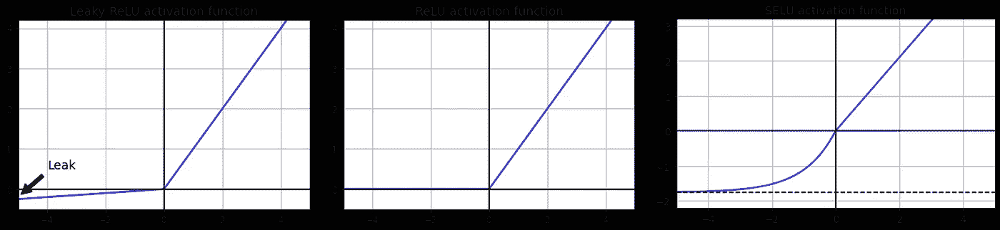
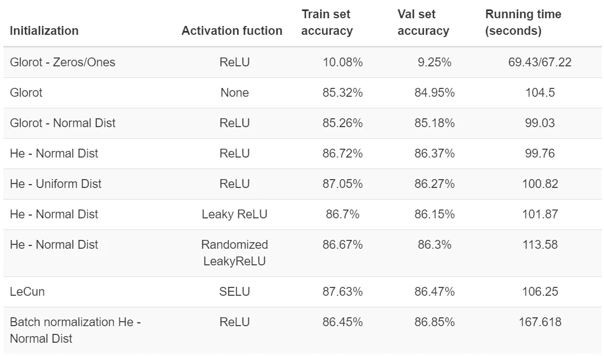
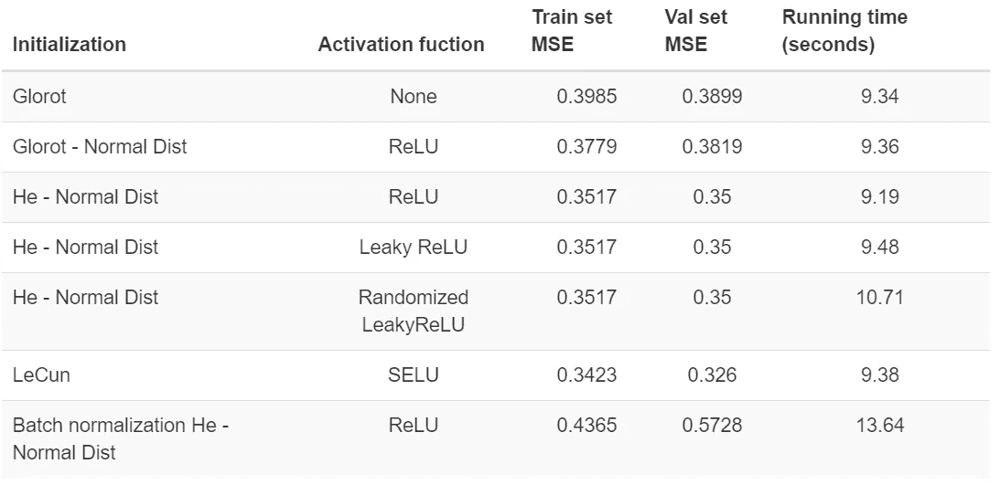
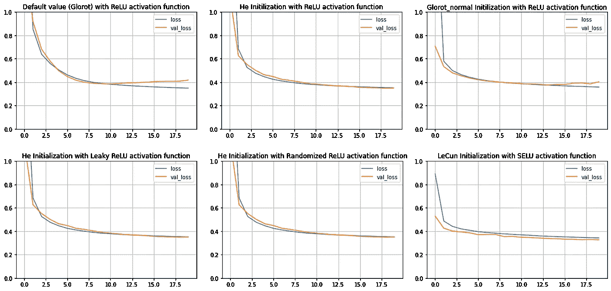
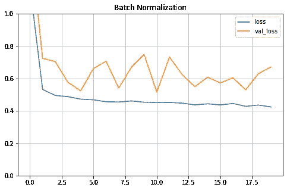

# 加速训练并提高深度神经网络的性能

> 原文：<https://towardsdatascience.com/speed-up-training-and-improve-performance-in-deep-neural-net-5732274d51a2?source=collection_archive---------44----------------------->

## 为 DNN 实现足够的初始化、激活功能和批量归一化/梯度剪裁


作者图片

T 训练一个大而深的神经网络是一项耗时耗力的任务，也是 20-30 年前 DNN 不受欢迎的主要原因。随着几种提高训练速度的技术被发现，深度学习重新回到了人们的视线中。那么使用哪种技术，如何以及何时使用哪种技术呢？在这里讨论一下吧！

*时尚 MNIST 和加州住房数据集将分别用作分类&回归的示例。*

# 1.应用初始化

初始化是用于加快神经元网络训练时间(以及提高性能)的第一批技术之一。在人工神经网络(ANN)中，不同神经元之间存在着大量的连接。当前层中的一个神经元连接到下一层中的几个神经元，并附着到前一层中的各个神经元。如果两个神经元比另一对更频繁地交互，它们的连接(即权重)将比另一对更强。

然而，人工神经网络的一个问题是，如果在训练开始时没有指定权重，连接可能会以太小或太大的值开始，从而使它们太小或太大，无法在网络中进一步使用。换句话说，网络会陷入**消失梯度**或**爆炸梯度**的问题。

因此，如果从训练开始就将权重设置为合适的随机值，就可以避免这些问题。 *Xavier 初始化*或 *Glorot 初始化*技术是由 [Glorot 和 Bengio](http://www.jmlr.org/proceedings/papers/v9/glorot10a/glorot10a.pdf) 提出的，然后显著解除了这些不稳定问题。

在该策略中，神经元之间的连接权重将使用均值=0、方差σ= 2/(fan_in+fan_out)的正态分布随机初始化，其中 fan _ in 是输入神经元的数量，fan _ out 是输出神经元的数量。

除了 **Glorot** (在 Keras 中默认使用)之外，还有另外 2 种流行的初始化技术: **He** 和 **LeCun** 。

让我们用`Fashion MNIST`数据集检查不同的初始化技术对模型性能和训练时间的影响。

```
# Take a look at the dataset
plt.figure(figsize=(10, 10)) 
for row in range(5): 
    for col in range(5): 
        index = 5 * row + col 
        plt.subplot(5, 5, index + 1)
        plt.imshow(X_train_full[index], cmap="binary",
                   interpolation="nearest") 
        plt.axis('off') 
        plt.title(y_train_full[index], fontsize=12) 
plt.show()
```


以下是时尚 MNIST 的示例，其中预测值是一组代表图像的[28，28]形状的值；目标值是 10 种衣服和鞋子(用 0 到 9 表示)

首先，让我们从一个由 5 个隐藏层和 300，100，50，50，50 个神经元组成的网络上 Keras 的默认设置开始。

```
tf.random.set_seed(50) 
np.random.seed(50) 
model_default = keras.models.Sequential() model_default.add(keras.layers.Flatten(input_shape=[28, 28])) 
for n_layers in (300, 100, 50, 50, 50): 
    model_default.add(keras.layers.Dense(n_layers, 
                                         activation ='relu')) 
model_default.add(keras.layers.Dense(10, activation='softmax'))model_default.compile(loss="sparse_categorical_crossentropy",
                      optimizer=keras.optimizers.SGD(lr=1e-3), 
                      metrics=["accuracy"]) 
start_time = time.time() 
history = model_default.fit(X_train_full, y_train_full, epochs=20,
                            validation_split=0.1) 
print("--- %s seconds ---" % (time.time() - start_time))
```

结果

```
# Show the highest accuracy epoch 
Epoch 20/20 1688/1688 [==============================] - 5s 3ms/step - loss: 0.4185 - accuracy: 0.8526 - val_loss: 0.4256 - val_accuracy: 0.8518 
--- 99.03307843208313 seconds ---
```

训练集在 99.3 秒内达到 85.26%的准确率，Val 集达到 85.18%。如果没有设置`activation ='relu'`(即隐层没有激活函数)，准确率分别为 85.32%和 84.95%，训练需要 104.5 秒。

将其与全 0 和全 1 的权重初始化进行比较:

```
# Zeros initialization Epoch 20/20 1688/1688 [==============================] - 3s 2ms/step - loss: 2.3026 - accuracy: 0.1008 - val_loss: 2.3028 - val_accuracy: 0.0925 
--- 69.43926930427551 seconds ---# Ones initialization Epoch 20/20 1688/1688 [==============================] - 3s 2ms/step - loss: 2.3026 - accuracy: 0.1008 - val_loss: 2.3028 - val_accuracy: 0.0925 
--- 67.2280786037445 seconds ---
```

两种情况下的性能都差得多，并且实际上，该模型从第 5 个时期开始就停止提高精度。

现在，让我们试试`He Initialization`，在 Keras 中通过向隐藏层添加`kernel_initializer="he_normal"`参数来启用。

结果

```
# Show the highest accuracy epoch 
Epoch 20/20 1688/1688 [==============================] - 5s 3ms/step - loss: 0.3780 - accuracy: 0.8672 - val_loss: 0.3924 - val_accuracy: 0.8637 
--- 99.76096153259277 seconds ---
```

精确度确实提高了，但是运行时间比 **Glorot 初始化**慢了半秒。

关于初始化技术中**正态分布**和**均匀分布**的性能也有讨论，但确实没有一种技术表现出比另一种更好的性能。`init = keras.initializers.VarianceScaling(scale=2.,mode='fan_avg',distribution='uniform')`的结果对该数据集没有改善(训练集准确率:87.05%，值集:86.27%，运行时间 100.82 秒)

# 2.与正确的激活功能相处

选择不合适的激活函数是导致模型性能差的原因之一。`sigmoid`可能是个不错的选择，但我更喜欢用 **SELU、ReLU 或 ReLU 变体**来代替。

先说 **ReLU** 吧。简单来说，如果值大于 0，函数返回值本身；否则它返回 0。这种激活计算起来很快，但作为回报，将会出现停止输出除 0 以外的任何值的情况(即神经元死亡)。这个问题通常发生在学习率较大的情况下。



作者图片

这个问题的一些解决方案是使用 ReLU 的替代版本: **LeakyReLU、随机化 LeakyReLU 或缩放 ReLU (SELU)** 。

带有**泄漏的路**:

```
if x>0: 
   return x 
else: 
   return ax
```

其中 a 是给定 x <0\. a is usually set at 0.01, serving as a small leak (that’s why this technique is called LeakyReLU). Using a helps to stop the dying problem (i.e. slope=0).

In the case of **随机泄漏率**时 x 的斜率，a 是在给定范围内随机选择的。这种方法可以减少过拟合问题，但是由于额外的计算需要更多的运行时间。

DNN 的一个出色的激活函数是**缩放的 ReLU (SELU)** 。

```
if x>0: 
   return Lambda*x 
else: 
   return Lambda*(alpha*exp(x)-alpha)
```

在此函数中，每层输出的平均值为 0，标准差为 1。注意使用此激活功能时:

*   必须和`kernel_initializer="lecun_normal"`一起使用
*   输入要素必须标准化
*   神经网络的结构必须是顺序的

让我们在`fashion MNIST`数据集上尝试不同的激活函数。

**泄漏的结果**

```
# Show the highest accuracy epoch 
Epoch 20/20 1688/1688 [==============================] - 5s 3ms/step - loss: 0.3791 - accuracy: 0.8670 - val_loss: 0.3910 - val_accuracy: 0.8615 
--- 101.87710905075073 seconds ---
```

**随机化泄漏结果**

```
# Show the highest accuracy epoch 
Epoch 20/20 1688/1688 [==============================] - 6s 3ms/step - loss: 0.3779 - accuracy: 0.8667 - val_loss: 0.3918 - val_accuracy: 0.8630 
--- 113.58738899230957 seconds ---
```

SELU**的结果**

```
# Show the highest accuracy epoch 
Epoch 19/20 1688/1688 [==============================] - 5s 3ms/step - loss: 0.3526 - accuracy: 0.8763 - val_loss: 0.3755 - val_accuracy: 0.8647 
--- 106.25733232498169 seconds ---
```

**SELU** 似乎比 ReLU 及其变种的性能稍好，但速度较慢(如预期)。

> **如果神经网络在低学习速率下表现相对较好，ReLU 是给定最快训练时间的最佳选择。在深度 NN 的情况下，SELU 是一个极好的尝试。**

关于这些激活功能的详细说明可以在这里找到: [ReLU](http://www.jmlr.org/proceedings/papers/v9/glorot10a/glorot10a.pdf) 、 [LeakyReLU、随机化 LeakyReLU](https://arxiv.org/abs/1505.00853) 和 [SELU](https://arxiv.org/abs/1706.02515)

# 3.批量标准化

为了确保消失/爆炸梯度问题不会在训练期间再次发生(因为初始化和激活功能有助于在训练开始时减少这些问题)，实施**批量标准化**。

批量归一化零点对每个输入进行居中和归一化，然后使用 1 个参数向量进行缩放和 1 个参数向量进行平移来缩放和平移结果。此技术评估当前小批量上输入的$均值$和$标准差$并在训练集的所有小批量上重复此计算。均值和标准差是在训练期间估计的，但仅在训练后使用。

输入平均值的向量和输入标准偏差的向量将成为不可训练的参数(即反向传播不可触及的)，并用于计算训练结束时的移动平均值。随后，这些最终参数将用于归一化新数据以进行预测。

如果使用**批量标准化**，输入数据在训练前不需要标准化。

```
tf.random.set_seed(50) 
np.random.seed(50)model_default = keras.models.Sequential() model_default.add(keras.layers.Flatten(input_shape=[28, 28])) 
for n_layers in (300, 100, 50, 50, 50):
    model_default.add(keras.layers.BatchNormalization())
    model_default.add(keras.layers.Dense(n_layers, 
                                         activation ='relu',
                                  kernel_initializer="he_normal")) 
model_default.add(keras.layers.Dense(10, activation='softmax'))model_default.compile(loss="sparse_categorical_crossentropy",                       
                      optimizer=keras.optimizers.SGD(lr=1e-3),                       
                      metrics=["accuracy"])  
start_time = time.time() 
history = model_default.fit(X_train_full, y_train_full, epochs=20, 
                            validation_split=0.1) 
print("--- %s seconds ---" % (time.time() - start_time))
```

结果

```
# Show the highest accuracy epoch 
Epoch 20/20 1688/1688 [==============================] - 8s 5ms/step - loss: 0.3799 - accuracy: 0.8645 - val_loss: 0.3571 - val_accuracy: 0.8685 
--- 167.6186249256134 seconds ---
```

显然，在**批量标准化**中训练较慢，因为在训练过程中需要更多的计算，但相比之下，模型收敛更快，因此达到相同的性能需要更少的时期。

# 4.渐变剪辑

由于**批量归一化**不建议与递归神经网络一起使用，**梯度裁剪**是 RNN 的替代选择。

关于[渐变裁剪](https://arxiv.org/abs/1211.5063)的细节

# 时尚 MNIST 数据集分类结果汇总



# 加州住房数据集回归任务的结果摘要



训练集和验证集的均方误差



# 关于这一部分的最后想法🔆

*   对于大多数情况，Glorot 初始化是一个很好的起点。初始化技术有时比 Glorot 执行得更好(在上述分类示例中较慢，而在回归示例中较快)。
*   如果优先考虑运行时间，ReLU 或 Leaky ReLU 是很好的选择。
*   如果使用高学习率，应避免 ReLU。
*   对于复杂的数据集和深度神经网络，SELU 是一个很好的选择，但可能会在运行时间上有所取舍。然而，如果神经网络的架构不允许*自规范化*，则使用 ELU 而不是 SELU。
*   SELU 和批处理规范化不能应用于 RNN。梯度裁剪是 RNN 批量标准化的替代策略。

源代码可以在[这里](https://github.com/geniusnhu/DNN-Improvement/blob/master/Improve_DNN_performance.ipynb)获得

*参考:*

1.  x .格洛特和 y .本吉奥(2010 年)。理解训练深度前馈神经网络的困难。PMLR
2.  何刚，张，徐，任，孙(2015)。深入研究整流器:在 ImageNet 分类上超越人类水平的性能。2015 年 IEEE 计算机视觉国际会议(ICCV)论文集
3.  Geron，A. (2019)。使用 Scikit-Learn、Keras 和 TensorFlow 进行机器学习。奥莱利媒体公司，
4.  徐，王，陈，李，米(2015)。卷积网络中校正激活的经验评估。2020 年 5 月 5 日从[https://arxiv.org/abs/1505.00853](https://arxiv.org/abs/1505.00853)取回。
5.  Klambauer，g .，Unterthiner，t .，Mayr，a .，& Hochreiter，S. (2017 年)。自标准化神经网络。神经信息处理系统进展 30 (NIPS 2017)