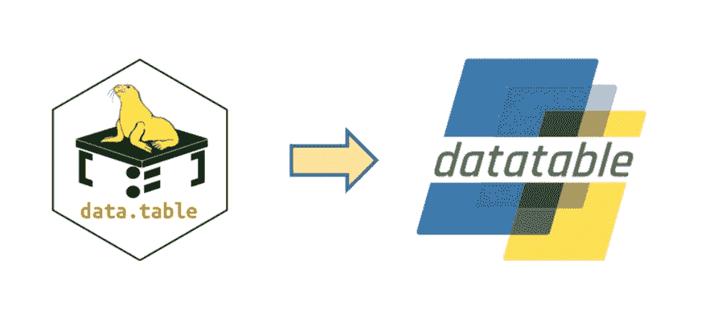
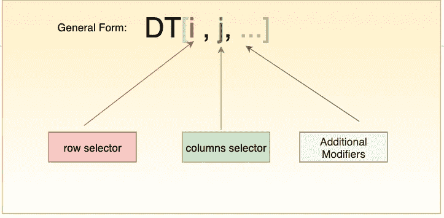
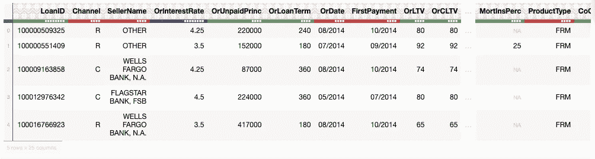
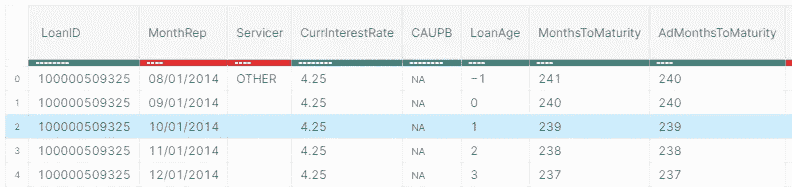
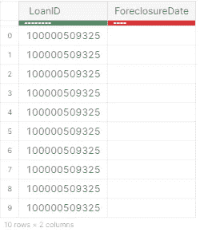
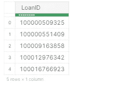
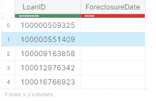
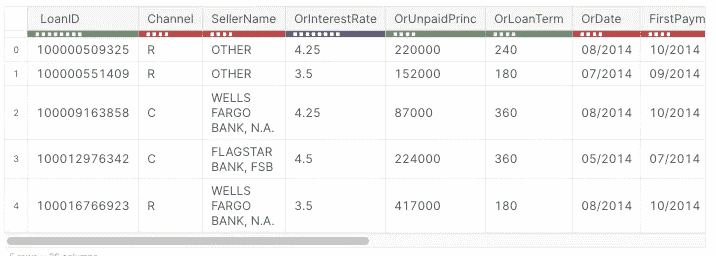
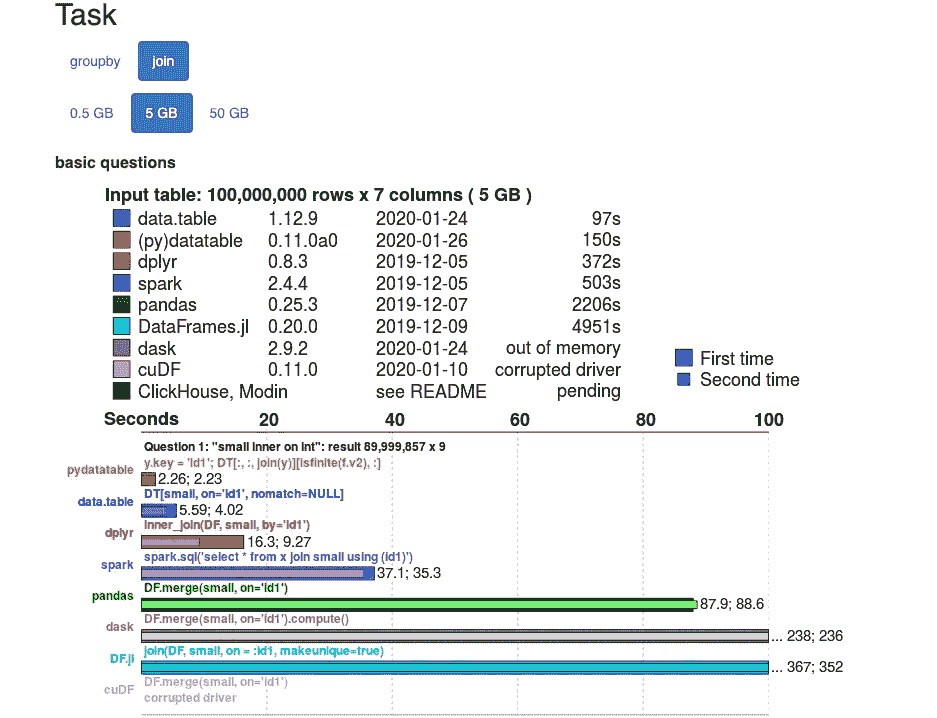
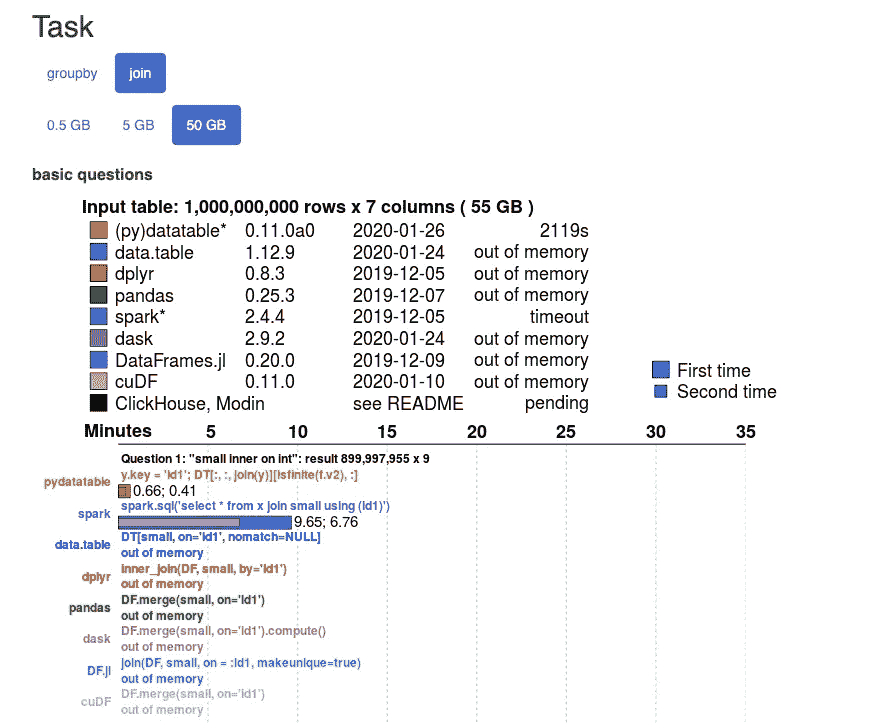

# 使用 Python 的数据表包加速您的数据分析

> 原文：<https://towardsdatascience.com/speed-up-your-data-analysis-with-pythons-datatable-package-56e071a909e9?source=collection_archive---------8----------------------->


由 [Unsplash](https://unsplash.com?utm_source=medium&utm_medium=referral) 上的 [chuttersnap](https://unsplash.com/@chuttersnap?utm_source=medium&utm_medium=referral) 拍摄

前阵子，我在 Python 的**数据表**库上写了一篇[的文章。本文概述了 datatable 包，其重点是大数据支持和高性能。文章还在某些参数上比较了 datatable 和 pandas 库的性能。这是本系列的第二篇文章，具有双重目标:](/an-overview-of-pythons-datatable-package-5d3a97394ee9)

*   在本文中，我们将通过一个银行贷款场景，使用房利美数据集的子集，尝试理解与 datatable 的数据冲突。我们将学习如何管理贷款级别的数据，获得基本的洞察力，探索性的数据分析
*   其次，我们将回顾开源数据科学中流行的各种类似数据库的工具的一些基准。

> 强烈建议在阅读本文之前先阅读第一部分。

# 数据表:快速概述



[**Python datatable**](https://datatable.readthedocs.io/en/latest/?badge=latest)是一个库，实现了广泛的(且不断增长的)操作二维数据框的操作符。它主要关注:**大数据支持、高性能、内存和内存外数据集，以及多线程算法**。Datatable 强大的 API 与 data.table 的类似，它努力提供更友好和直观的 API 体验，并提供有用的错误消息来加速问题的解决。

数据表的一些显著特征是:

*   高效的多线程算法
*   节约内存
*   内存映射的磁盘数据集
*   本机 C++实现
*   完全开源

## 主数据表语法

在 datatable 中，所有这些操作的主要载体是受传统矩阵索引启发的方括号符号。



其中， **i** 是行选择器， **j** 是列选择器，`...`表示附加的修饰符。目前可用的修改器有`by()`、`join()`和`sort()`。这个工具包与熊猫非常相似，但更侧重于速度和大数据支持。

> [**入门指南**](https://datatable.readthedocs.io/en/v0.10.1/quick-start.html#) 是熟悉数据表的好地方。它包含关于如何开始使用 datable 的深入信息和示例。

让我们直接进入案例研究，让我们的手变脏。

# 案例研究:贷款违约预测


蒂埃拉·马洛卡在 [Unsplash](https://unsplash.com/s/photos/mortgage?utm_source=unsplash&utm_medium=referral&utm_content=creditCopyText) 上拍摄的照片

**联邦国民抵押贷款协会** ( **FNMA** )，俗称 [**房利美**](https://www.fanniemae.com/portal/index.html) **，**是一家政府支持的公司，成立于 1938 年声名狼藉的[](https://en.wikipedia.org/wiki/Great_Depression)*大萧条时期。房利美首先从一级贷款机构(富国银行、美国银行等)购买抵押贷款，然后在债券市场将其作为证券出售。然而，房利美购买的所有贷款都没有偿还，一些借款人实际上违约了。这是一个经典的例子，我们可以使用机器学习来预测房利美收购的贷款是否会丧失抵押品赎回权。*

## *资料组*

*数据集来自[房利美的单户家庭贷款表现数据](http://www.fanniemae.com/portal/funding-the-market/data/loan-performance-data.html) (SFLP)，房利美保留所有权利。对于完整的原始数据集，你需要在房利美的网站上注册。在撰写本文时，可用的最新数据集来自`2019.`第三季度，然而，本文使用的是 2014 年第三季度的数据集，可从[此处](https://app-freddie-mac.s3.amazonaws.com/fannie-mae/2014Q3.zip)下载。*

*下载的数据集包含两个名为 **Acquisition.txt** 和 **Performance.txt:** 的文件*

*   ***获取数据**:包含每个借款人的个人信息，包括个人的债务收入比、信用评分和贷款金额等。*
*   ***性能数据**:包含有关贷款支付历史的信息，以及借款人最终是否拖欠贷款。*

*关于这两个文件内容的其他信息也可以在网站上以*

*   *[词汇表](https://s3.amazonaws.com/dq-blog-files/lppub_glossary.pdf)*
*   *[包含采集和性能文件中各列的文件布局](https://s3.amazonaws.com/dq-blog-files/lppub_file_layout.pdf)*

## *目标*

*我们的目标是从这些数据中预测那些最有可能拖欠抵押贷款的借款人。为了开始分析，我们将使用 **Python datatable** 来获得从基本 EDA 和数据争论开始的基本见解。*

**整个代码可以从笔记本上访问:* [**用 Python 的数据表**](https://www.kaggle.com/parulpandey/speed-up-your-data-munging-with-python-s-datatable) 加速你的数据管理*

## *1.在数据集中读取*

*   ***导入数据表包***

```
*import datatable as dt*
```

*   ***加载数据集***

*接下来，我们将使用 datatable 的`fread`函数读取采集和性能文件。上面的`fread()`功能既强大又极快。它可以自动检测和解析大多数文本文件的参数，从。压缩档案或网址，阅读 Excel 文件，等等。*

*现有数据没有列标题，我们需要从[列](https://s3.amazonaws.com/dq-blog-files/lppub_file_layout.pdf)文件中手动输入。*

```
*col_acq = ['LoanID','Channel','SellerName','OrInterestRate','OrUnpaidPrinc','OrLoanTerm','OrDate','FirstPayment','OrLTV','OrCLTV','NumBorrow','DTIRat','CreditScore','FTHomeBuyer','LoanPurpose','PropertyType','NumUnits','OccStatus','PropertyState','Zip','MortInsPerc','ProductType','CoCreditScore','MortInsType','RelocationMort']col_per = ['LoanID','MonthRep','Servicer','CurrInterestRate','CAUPB','LoanAge','MonthsToMaturity','AdMonthsToMaturity','MaturityDate','MSA','CLDS','ModFlag','ZeroBalCode','ZeroBalDate','LastInstallDate','ForeclosureDate','DispositionDate','ForeclosureCosts','PPRC','AssetRecCost','MHRC','ATFHP','NetSaleProceeds','CreditEnhProceeds','RPMWP','OFP','NIBUPB','PFUPB','RMWPF',  'FPWA','SERVICING ACTIVITY INDICATOR'] df_acq = dt.fread('../input/Acquisition_2014Q3.txt',columns=col_acq)
df_per = dt.fread('../input/Performance_2014Q3.txt', columns=col_per)*
```

*让我们检查两个框架的形状。*

```
*print(df_acq.shape)
print(df_per.shape)
--------------------------------------------------------------------
(394356, 25)
(17247631, 31)*
```

*   ***查看采集和性能数据框的前几行。***

*与**熊猫**不同，`.head()`功能显示一帧的前 10 行，尽管您可以在括号中指定要显示的行数*

```
*df_acq.head(5)*
```

**

```
*df_per.head(5))*
```

**

*进度条的颜色表示数据类型，红色表示字符串，绿色表示`int`，蓝色表示`float`。*

# *2.数据预处理*

*在**性能数据集**中，我们只对 **LoanID** 和**止赎日期**列**感兴趣，因为这将为我们提供借款人标识号以及他们最终是否违约。***

*   ***选择特定的列***

*因此，让我们只选择`LoanID`和`ForeclosureDate`列，并丢弃其余的*

```
*df_per = df_per[:,['LoanID','ForeclosureDate']]
df_per.head(5)*
```

**

*   ***删除重复实体***

*贷款 ID 包含重复的实体。让我们也摆脱他们。*

```
*dt.unique(df_per[:,"LoanID"]).head(5)*
```

**

*   ***分组***

*让我们用独特的`Loan IDs`将画面分组。这将确保我们的数据集中只存在唯一的贷款 id。*

```
*df_per = df_per[-1:,:, dt.by(dt.f.LoanID)]
df_per.head(5)*
```

**

> **[***f 表达式***](https://datatable.readthedocs.io/en/latest/f-expressions.html) *支持算术运算以及各种数学和聚合函数。***

*   ****加入收购和业绩框架****

**现在让我们通过使用`LoanID`列执行内部连接来合并`Acquisition`和`Performance`帧。让我们将产生的数据框架命名为`df.`，这个框架由`ForeclosureDate`列组成，我们将使用它作为我们的目标变量。让我们将该列重命名为`Will_Default`以避免任何混淆。**

```
**df_per.names = ['LoanID','Will_Default']
df_per.key = 'LoanID'
df= df_acq[:,:,dt.join(df_per)]**
```

*   ****格式化目标列****

**`Will Default`列由日期组成。例如，如果借款人已经偿还了贷款，那么就要提到偿还贷款的日期。但是，如果贷款尚未偿还，则该字段留空。让我们用“0”替换空白值，即贷款从未支付，并用一些值作为“1”填写。这意味着借款人没有违约，即在某个日期偿还了贷款。**

```
***# Replacing the dates in the Will_Default column with '0' and null values with 1*
df[:,'Will_Default'] = df[:, {'Will_Default': dt.f['Will_Default']==""}]
df.head(5)**
```

****

**最后，让我们看看处理过的数据集的形状。**

```
**df.shape
-------------------------------------------------------
(394356, 26)**
```

**dataframe 有 **394356** 行和 **26** 列，包含有关贷款利率、支付日期、财产状态和每个财产邮政编码的最后几个数字等信息。从这里开始，数据就可以输入到用于训练目的的模型中。人们也可以将其转换成熊猫数据帧、CSV 文件或二进制文件。jay 文件如下:**

```
***df.to_pandas()*
*df.to_csv("out.csv")*
*df.to_jay("data.jay")***
```

# **类似数据库的运营基准**

**今天，数据科学生态系统中存在许多类似数据库的工具。为了比较它们的性能，已经创建了一个[基准](https://h2oai.github.io/db-benchmark/),它定期运行这些软件包的最新版本，并自动更新。这对包的开发者和用户都是有益的。你可以在 Matt Dowle 在 H2OWorld 2019 NYC conference 上发表的 [*数据处理效率*幻灯片](https://jangorecki.gitlab.io/r-talks/2019-12-26_Mumbai_Efficiency-in-data-processing/Efficiency-in-data-processing.pdf)和[演讲中了解更多关于该项目的信息。](https://www.youtube.com/watch?v=fZpA_cU0SPg)**

## **阅读基准**

**您可以单击选项卡，查看您拥有的数据的大小和正在执行的操作的类型。然后，您会看到各种工具的并排比较，以及任务所用的时间。例如，下面是在 5 GB 和 50GB 数据集上执行的' **join** '函数的基准测试，可以看出，datatable 运行得非常好。**

*   ****5GB 数据集****

****

*   ****50 GB 数据集****

****

**如需了解更多任务和其他详细信息，请随时查看该页面:**

**[**类似数据库的 ops 基准**](https://h2oai.github.io/db-benchmark/)**

**[](https://h2oai.github.io/db-benchmark/) [## 类似数据库的运营基准

### 该页面旨在对开源数据科学中流行的各种类似数据库的工具进行基准测试。它定期与…运行

h2oai.github.io](https://h2oai.github.io/db-benchmark/)** 

# **结论**

**在处理大数据时，datatable 包确实大放异彩。[由于强调大数据支持](https://datatable.readthedocs.io/en/latest/index.html)，datatable 提供了许多好处，并且确实可以缩短在数据集上执行数据争论任务所需的时间。Datatable 是一个开源项目，因此它对贡献和合作开放，以改进它并使它变得更好。**

# **参考资料和有用的资源**

**以下是一些有助于理解和了解更多关于 datatable 特性的资源:**

1.  **[**官方文档**](https://datatable.readthedocs.io/en/latest/)**

**[*原发布于 H2O.ai*](https://www.h2o.ai/blog/speed-up-your-data-analysis-with-pythons-datatable-package/)**