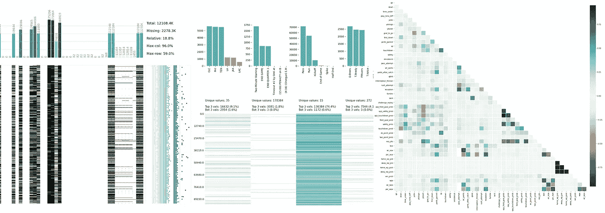
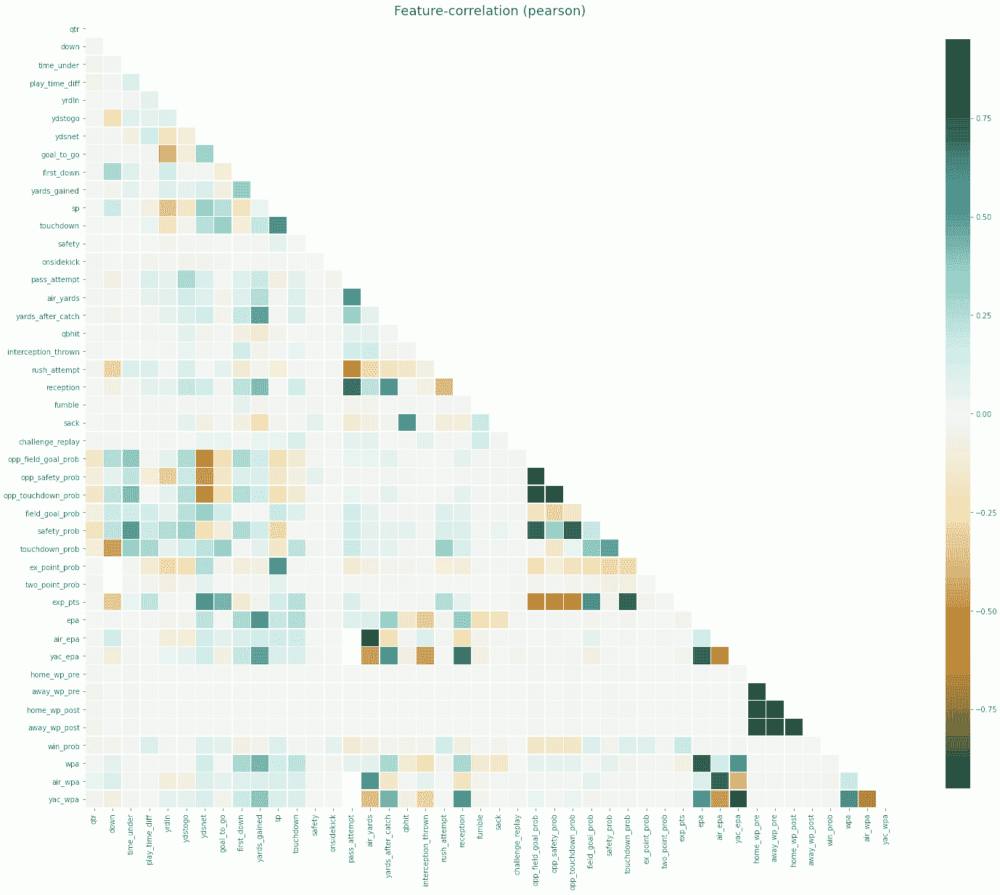
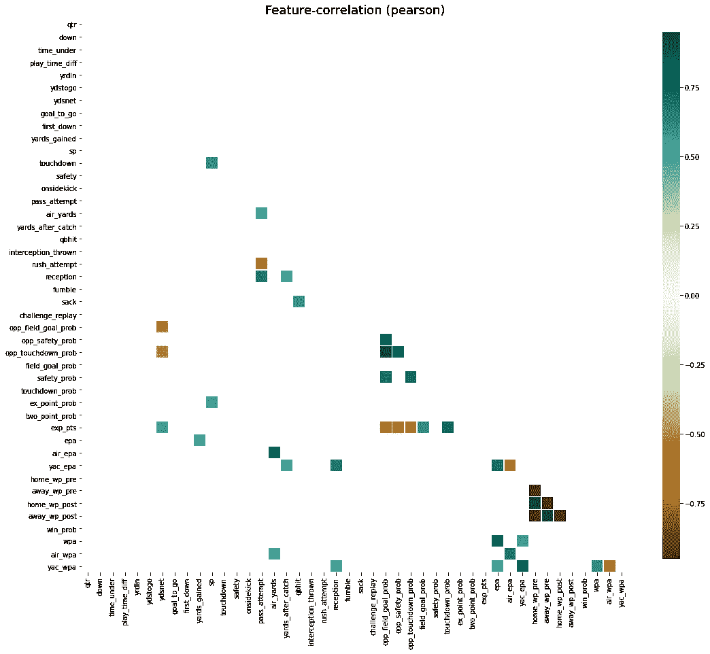
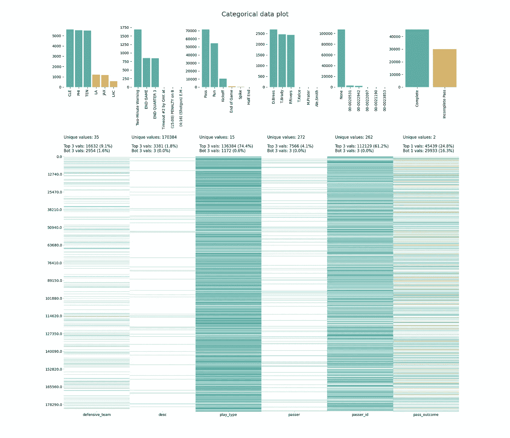

# 使用 klib 加速您的数据清理和预处理

> 原文：<https://towardsdatascience.com/speed-up-your-data-cleaning-and-preprocessing-with-klib-97191d320f80?source=collection_archive---------10----------------------->

## 定制和非常容易应用的功能，具有合理的默认值



作者图片

***TL；博士***
[klib](https://github.com/akanz1/klib)软件包提供了许多非常容易应用的函数，具有合理的默认值，可以在几乎任何数据帧上使用，以评估数据质量，获得洞察力，执行清理操作和可视化，从而使 Pandas 数据帧的工作变得更加轻便和方便。

在过去的几个月里，我实现了一系列函数，这些函数我经常用于几乎任何数据分析和预处理任务，而不管数据集或最终目标是什么。

这些功能只需要任何大小和任何数据类型的 Pandas 数据框架，并且可以通过简单的一行调用来访问，以深入了解您的数据，清理您的数据框架并可视化要素之间的关系。这取决于你是否坚持明智的，但有时是保守的，默认参数或定制的经验，调整他们根据你的需要。

这个包并不意味着提供一个 Auto-ML 风格的 API。相反，它是一个函数的集合，每当您开始处理一个新的项目或数据集时，您都可以——并且可能应该——调用它。不仅仅是为了你自己对你正在处理的事情的理解，也是为了制作你可以展示给主管、客户或其他任何人的图表，以获得更高层次的数据表示和解释。

# 安装说明

使用 pip 安装 klib:

```
pip install --upgrade klib
```

或者，要安装 conda run:

```
conda install -c conda-forge klib
```

以下是我在面对新数据集时反复应用的工作流程和一套最佳实践。

# 快速大纲

*   评估数据质量
*   数据清理
*   可视化关系

本指南中使用的数据是在 Kaggle 上找到的 [NFL 数据集](https://www.kaggle.com/maxhorowitz/nflplaybyplay2009to2016)的略经删节的版本。你可以在这里下载它或者使用任何你想使用的数据。

# 评估数据质量

在开始处理数据集之前确定数据质量至关重要。实现这一点的一个快速方法是使用 klib 的缺失值可视化，调用起来很简单，如下所示:


缺失值的默认表示

这个单一的情节已经向我们展示了许多重要的东西。首先，我们可以识别所有或大部分值缺失的列。这些是要剔除的对象，而缺失值较少的对象可能会受益于插补。

其次，我们经常可以看到缺失行的模式跨越许多要素。在考虑放弃潜在的相关特性之前，我们可能想先消除它们。

最后，顶部和右侧的附加统计信息为我们提供了关于阈值的有价值的信息，我们可以使用这些信息来删除有许多缺失值的行或列。在我们的示例中，我们可以看到，如果我们删除超过 30 个缺失值的行，我们只会丢失几个条目。同时，如果我们排除缺失值大于 80%的列，那么四个受影响最大的列也将被删除。

*关于性能的一个快速提示:尽管已经检查了大约 200 万个条目，每个条目有 66 个特征，但创建情节只需要几秒钟。*

# 数据清理

有了这种认识，我们就可以开始清理数据了。使用 klib，这就像调用 *klib.data_cleaning()* 一样简单，它执行以下操作:

*   **清理列名:** 这通过格式化列名，将 CamelCase 拆分为 camel_case，删除特殊字符以及前导和尾随空格，并将所有列名格式化为*小写 _ 和 _ 下划线 _ 分隔的*来统一列名。这还会检查并修复重复的列名，从文件中读取数据时有时会遇到这种情况。
*   **删除空列和虚拟空列:** 您可以使用参数 *drop_threshold_cols* 和 *drop_threshold_rows* 来根据您的需要调整删除。默认情况下，删除 90%以上的值缺失的列和行。
*   **删除单值列:** 顾名思义，这将删除每个单元格包含相同值的列。当您只查看单个年份时，如果包含“年份”等列，这将非常方便。其他的例子是“下载日期”或对所有条目都相同的指示符变量。
*   **删除重复的行:** 这是一个直接删除完全重复的行的方法。如果您正在处理重复增加价值的数据，请考虑设置 *drop_duplicates=False。*
*   最后，通常也是最重要的，特别是为了**减少内存**，从而加快工作流程中的后续步骤， *klib.data_cleaning()* 也优化了数据类型，如下图所示。

```
Shape of cleaned data: (183337, 62) - Remaining NAs: 1754608

Changes:
Dropped rows: 123
     of which 123 duplicates. (Rows: [22257, 25347, 26631, 30310, 33558, 35164, 35777, ..., 182935, 182942, 183058, 183368, 183369])
Dropped columns: 4
     of which 1 single valued. (Column: ['play_attempted'])
Dropped missing values: 523377
Reduced memory by at least: 63.69 MB (-68.94%)
```

您可以使用参数 *show=None* 、 *show="changes "或 show="all"* 来更改输出的详细程度。请注意，内存减少表示一个非常保守的值(即比实际实现的减少要少)，因为它只执行浅层内存检查。深度内存分析会降低大型数据集的运行速度，但是如果您对大小的“真实”减少感兴趣，您可以使用如下所示的 *df.info()* 方法。

```
df.info(memory_usage='deep')dtypes: float64(25), int64(20), object(21)
memory usage: 256.7 MB
```

正如我们所看到的，pandas 为每个 float 和 int 分配了 64 位的存储空间。此外，有 21 列是“object”类型，这是一种非常低效的数据存储方式。在数据清理之后，**的内存使用量下降到只有 58.4 MB，几乎减少了 80%！**这是通过在可能的情况下将 *float64* 转换为 *float32* 以及将 *int64* 转换为 *int8* 来实现的。此外，还使用了 dtypes *字符串*和*类别*。可用参数如 *convert_dtypes、类别*、 *cat_threshold* 等允许您根据自己的需要调整功能。

```
df_cleaned.info(memory_usage='deep')dtypes: category(17), float32(25), int8(19), string(1)
memory usage: 58.4 MB
```

最后，我们看一下列名，它们在原始数据集中实际上已经被很好地格式化了。然而，**在清理过程之后，你可以依靠小写和下划线连接的列名**。虽然不建议避免歧义，但现在允许你使用 *df.yards_gained* 而不是 *df["Yards。获得了“]* ，这在进行快速查找或第一次探索数据时非常有用。

```
Some column name examples:
Yards.Gained --> yards_gained
PlayAttempted --> play_attempted
Challenge.Replay --> challenge_replay
```

最后，总结一下:我们发现，不仅列名被整齐地格式化和统一了，而且特性也被转换成了更有效的数据类型。使用相对温和的默认设置，只删除了 123 行和 4 列，其中一列是单值的。这给我们留下了一个轻量级数据帧的形状:(183337，62)和 58 MB 的内存使用。

# 相关图

一旦完成了初始数据清理，查看特征之间的关系是有意义的。为此，我们使用函数 **klib.corr_plot()** 。将 *split* 参数设置为*【pos】**【neg】**【high】*或*【low】*，并可选地将每个设置与一个*阈值*相结合，允许我们更深入地挖掘并突出最重要的方面。



相关图

一眼看去，我们可以发现一些有趣的关系。类似地，我们可以很容易地放大任何给定阈值以上的相关性，比如说|0.5|。这不仅让我们能够在以后的分析中发现可能会引起麻烦的特征，还让我们看到在我们的数据中有很多高度负相关的特征。如果有足够的领域专业知识，这可能是一些特性工程的一个很好的起点！



高绝对相关图

此外，使用相同的函数，我们可以查看特征和所选目标之间的相关性。目标列可以作为当前数据帧的列名提供，作为一个单独的 pd。系列、名词短语或简单的列表。


与目标/标签的相关性图

就像以前一样，可以使用各种参数进行定制，如删除注释、更改关联方法或更改色彩映射表，以匹配您喜欢的风格或公司标识。

# 分类数据

在本指南的最后一步中，我们快速了解一下可视化分类列的功能。函数 **klib.cat_plot()** 允许显示每列中与频率相关的顶部和/或底部值。这使我们对数据集中的值的分布有了一个概念，当考虑在应用一次热编码或类似函数之前将不太频繁的值合并到一个单独的类别中时，这非常有帮助。在本例中，我们可以看到，对于列“play_type ”,大约 75%的条目由三个最常见的值组成。此外，我们可以立即看到“Pass”和“Run”是目前最常见的值(75k 和 55k)。反过来，这个情节也向我们展示了“desc”是由 170384 个独特的字符串组成的。



分类数据图

klib 包包括许多更有用的数据分析和清理函数，更不用说一些定制的 sklearn 管道，您可以使用 FeatureUnion 轻松地将它们堆叠在一起，然后在 GridSearchCV 或类似的中使用。因此，如果您想走捷径，只需调用 klib.data_cleaning()并将结果数据帧插入管道。很可能，你已经得到了一个很不错的结果！

# 结论

所有这些函数都有助于非常方便的数据清理和可视化，并且提供了比这里描述的更多的特性和设置。它们绝不是万能的解决方案，但对您的数据准备过程非常有帮助。klib 还包括各种其他函数，最著名的是 **pool_duplicate_subsets()** ，用于汇集不同特征的数据子集，作为一种降维的方法， **dist_plot()** ，用于可视化数字特征的分布，以及 **mv_col_handling()** ，它提供了一个复杂的 3 步过程，试图识别具有许多缺失值的列中的任何剩余信息，而不是简单地立即删除它们。

[](/data-preparation-with-klib-ec4add15303a) [## 使用 klib 进行数据准备

### 快速简单的功能需要高效的数据准备

towardsdatascience.com](/data-preparation-with-klib-ec4add15303a) 

> 注意:请让我知道你接下来想看到什么，以及你觉得缺少哪些功能，或者在下面的评论中，或者在 [GitHub](https://github.com/akanz1/klib) 上发表一个问题。如果你想看一些关于丢失值的处理，子集池或者定制的 sklearn 管道的例子，也请告诉我。