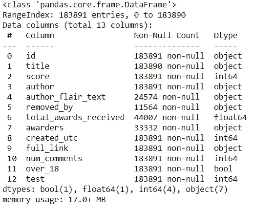
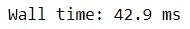
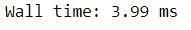
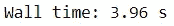
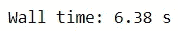
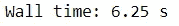
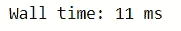
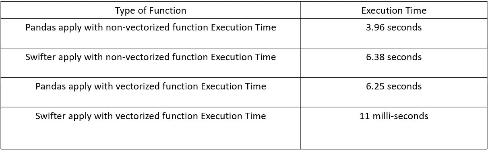

# 用 Swifter 加速你的熊猫处理

> 原文：<https://towardsdatascience.com/speed-up-your-pandas-processing-with-swifter-6aa314600a13?source=collection_archive---------11----------------------->

## 不要让你的数据处理花费你太长时间


Marc-Olivier Jodoin 在 [Unsplash](https://unsplash.com?utm_source=medium&utm_medium=referral) 上拍摄的照片

作为一名 Pythonist 数据科学家，您的日常工作将涉及大量使用 Pandas 包的数据处理和特性工程。从分析数据到创建新功能再到获得洞察力，迫使您重复执行许多不同的代码。问题是你的数据越大，完成每一行代码的时间就越长。

在这篇文章中，我想向你展示一个简单的包来加快你的熊猫处理速度，这个包叫做 [Swifter](https://github.com/jmcarpenter2/swifter) 。让我们开始吧。

# 下前支索

Swifter 是一个软件包，它试图以最快的可用方法有效地将任何函数应用于 Pandas 数据框或系列对象。它与 Pandas 对象集成在一起，因此我们只能将此包用于 Pandas 对象，如数据框或系列。

让我们试着看看更快的行动。为了做好准备，我们需要安装 Swifter 包。

```
#Installing Swifter via Pip
pip install swifter#or via conda
conda install -c conda-forge swifter
```

如果你没有最新的熊猫包，建议你把包升级到最新版本。这是因为在 Swifter 模块中使用的 pandas 扩展 api 是 Pandas 的新增功能。

```
#Update the Pandas package via pip
pip install -U pandas#or via conda
conda update pandas
```

当所有需要的包准备就绪，我们可以继续尝试更快。在本文中，我将使用来自 [Kaggle](https://www.kaggle.com/unanimad/dataisbeautiful) 的 Reddit 评论数据集。从这里，我们将所有的包导入到我们的笔记本中，并像往常一样从 CSV 中读取数据集。

```
#Import the package
import pandas as pd
import swifter#read the dataset
df = pd.read_csv('r_dataisbeautiful_posts.csv')
```



这是我们的数据集。现在，假设我想将分数乘以 2，减去 1(这只是我在这里使用的一个随机方程)。然后我会把它放在另一栏。在这种情况下，我可以使用熊猫对象属性中的 apply 函数。

```
%time df['score_2_subs'] = df['score'].apply(lambda x: x/2 -1)
```



熊猫申请执行时间

对于 Pandas 的 apply 属性，对每个数据执行函数的时间大约需要 42.9 ms。这一次，我们将使用 Swifter，看看执行这个函数需要多少时间。

```
#When we importing the Swifter package, it would integrated with Pandas package and we could use functional attribute from Pandas such as apply%time df['score_2_swift'] = df['score'].swifter.apply(lambda x: x/2 - 1)
```



更快的应用执行时间

正如我们在上面看到的，Swifter 处理数据的速度比普通的 Pandas apply 函数要快。

# 更快的矢量化功能

从文档中可以看出，Swifter 应用函数的速度比 Pandas 函数快 100 倍。然而，这只适用于我们使用矢量化形式的函数的情况。

假设我创建了一个函数来计算 num_comments 和 score 变量。当评论数为零时，我会加倍评分。虽然不是，但分数会保持不变。然后我会在此基础上创建一个新的专栏。

```
def scoring_comment(x):
    if x['num_comments'] == 0:
        return x['score'] *2
    else:
        return x['score']#Trying applying the function using Pandas apply
%time df['score_comment'] = df[['score','num_comments']].apply(scoring_comment, axis =1)
```



熊猫应用非矢量化函数执行时间

执行该功能大约需要 3.96 秒。让我们看看性能，如果我们使用更快。

```
%time df['score_comment_swift'] = df[['score', 'num_comments']].swifter.apply(scoring_comment, axis =1)
```



更快地应用非矢量化函数执行时间

正如我们在上面看到的，使用 Swifter 比普通的 Pandas 应用功能需要更长的时间。这是因为具有非向量化功能的 Swifter 将实现 dask 并行处理，而不依赖于 Swifter 处理本身。那么，如果把函数改成向量化函数，性能如何呢？让我们试一试。

```
Import numpy as np#Using np.where to implement vectorized function
def scoring_comment_vectorized(x):
    return np.where(x['num_comments'] ==0, x['score']*2, x['score'])#Trying using the normal Pandas apply
%time df['score_comment_vectorized'] = df[['score', 'num_comments']].apply(scoring_comment_vectorized, axis =1)
```



熊猫申请矢量化函数执行时间

使用普通的 apply 函数执行我们的矢量化函数大约需要 6.25 秒。让我们看看使用 Swifter 的性能。

```
%time df['score_comment_vectorized_swift'] = df[['score', 'num_comments']].swifter.apply(scoring_comment_vectorized, axis =1)
```



更快的应用和矢量化的函数执行时间

矢量化函数的执行时间现在只需 11 毫秒，与普通的 apply 函数相比节省了很多时间。这就是为什么当我们用 Swifter 处理数据时，建议使用矢量化函数。

如果你想跟踪刚刚发生的执行时间，我会在下面的表格中给你一个总的总结。



# 结论

我只是向你展示 Swifter 如何加速你的熊猫数据处理。当我们使用矢量化函数而不是非矢量化函数时，Swifter 的效果最好。如果你想了解更多关于 Swifter 和可用 API 的信息，你可以查看[文档。](https://github.com/jmcarpenter2/swifter/blob/master/docs/documentation.md)

# 如果你喜欢我的内容，并想获得更多关于数据或作为数据科学家的日常生活的深入知识，请考虑在这里订阅我的[时事通讯。](https://cornellius.substack.com/welcome)

> 如果您没有订阅为中等会员，请考虑通过[我的推荐](https://cornelliusyudhawijaya.medium.com/membership)订阅。