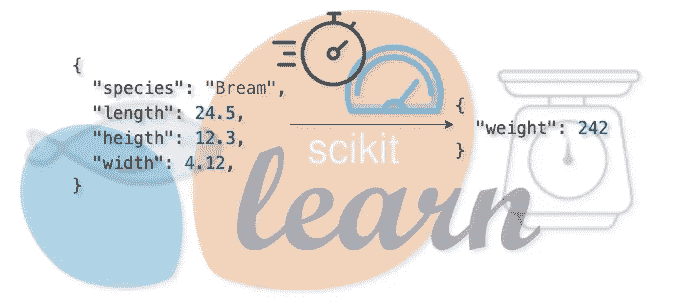

# 加速 sklearn 模型管道，以极低的延迟提供单一预测

> 原文：<https://towardsdatascience.com/speeding-up-a-sklearn-model-pipeline-to-serve-single-predictions-with-very-low-latency-a7fd89c36d4?source=collection_archive---------52----------------------->

## *编写你自己的 sklearn 函数，(现在是最终版本)第 3 部分*

如果你以前使用过 sklearn，你肯定遇到过在使用数据帧或数组作为你的转换器和估算器的输入之间的挣扎。两者各有利弊。但是一旦你部署了你的模型，例如作为一项服务，在许多情况下它将服务于单一的预测。 [Max Halford 展示了一些很好的例子](https://maxhalford.github.io/blog/speeding-up-sklearn-single-predictions/)关于如何改进各种 sklearn 变压器和估算器，以服务于单次预测，额外提升性能和低毫秒范围内的潜在响应！在这篇短文中，我们将推进这些技巧，开发一个完整的管道。

几个月前 [Max Halford](https://medium.com/u/aff4365c3dba?source=post_page-----a7fd89c36d4--------------------------------) 写了一篇[很棒的博文](https://maxhalford.github.io/blog/speeding-up-sklearn-single-predictions/)，他描述了我们如何修改 sklearn 转换器和估计器，以更高的速度处理单个数据点，本质上是使用一维数组。当您构建 sklearn 模型管道时，它们通常同时处理 numpy 数组和 pandas 数据帧。数组通常提供更好的性能，因为许多计算的 numpy 实现是高性能的，并且通常是矢量化的。但是使用列名来控制转换也变得更加棘手，而数组没有列名。如果您使用 pandas dataframes，您可能会得到更差的性能，但是您的代码可能会更具可读性，并且列名(即特性名)与大多数转换器的数据保持一致。在数据探索和模型训练期间，您最感兴趣的是批量转换和预测，但是一旦您将训练好的模型管道部署为服务，您可能还会对单个预测感兴趣。在这两种情况下，服务用户将发送如下所示的有效载荷。



稍微有用的插图—作者使用 [draw.io](http://draw.io) 制作的图像

假设有一个服务，我们根据一些尺寸度量来估计鱼的重量(参考后面介绍的鱼市场数据集)，那么一个请求可能如下所示:

```
{
    "species": "Bream",
    "length": 24.5,
    "heigth": 12.3,
    "width": 4.12,
}
```

或者可选地`["Bream", 24.5, 12.3, 4.12]`，并且模型可以返回如下的权重估计:

在他的博客中，Max Halford 展示了如何将`transform_single`和`predict_single`方法添加到变压器和估算器中，以更高的性能执行单数据点处理。根据管道的复杂程度，节省的绝对时间可能并不多。但是更长的响应时间会增加服务基础设施的整体延迟，而短时间会给应用程序带来压力，特别是如果它在关键路径内。我们最终还将能够节省基础设施成本，因为我们可以在更小的硬件上运行您的服务，即更小、更少的 pod。此外，避免数据帧强制将释放服务实例上的内存。最后但并非最不重要的是，我们节省了时间，我们可以在更复杂的转换和模型上花费时间——这让每个数据科学家都很高兴！

## 创建基本变形金刚

但是缩短响应时间的代价是什么呢？我们可以通过看一个例子来探索这一点，这里没有广告类继承，而是作为如何工作的草图:

```
barebones_transformer = BarebonesTransformer()barebones_transformer.fit(data)
barebones_transformer.transform_single([1.0, 2.5])
```

一方面，我们有失去训练和推理/预测奇偶性的风险。这是什么意思？正如我们在上面看到的，我们的数据在转换过程中基本上有两种不同的代码路径:单个预测的代码路径将仅用于单个数据点的推断，而不是在训练期间，在训练期间，我们通常成批转换，即数据帧或数组。因此，我们需要付出额外的努力来确保两条转换路径导致相同的转换，从而导致相同的结果。例如，这可以通过添加一些额外的单元测试来实现。

另一方面，我们可能会丢失 sklearn 正在内部进行的一些验证，也就是说，当父方法`transform`被调用时。因此，我们需要确保在将有效载荷传递给模型之前对其进行适当的验证，以防止模型意外崩溃。

同样的想法也适用于估计器和`predict`方法。最后，这就像通过卡车(加上保险)发送一封信，它是可行的，是一个安全的选择，但它可能是过度的，骑自行车的邮递员可能更合适、更快。


不同有效载荷的不同运输类型——图片由作者使用 [draw.io](http://draw.io) 完成

如果我们对这两个缺点都满意，那么如果我们花一些时间来操作单个数据点的现有转换器，我们可以为每个请求节省一些时间。

现在，既然我们已经看到了如何实现这一点，那么让我们使用一些 toy day 和 sklearn 的`SimpleImputer`(一种用于估算缺失数据的转换器，例如使用平均值)来评估 pandas 和基于 numpy 的方法的性能。我们将使用非常健壮的 [pd.isna](https://pandas.pydata.org/pandas-docs/stable/reference/api/pandas.isna.html) 来检查 1d 数组中缺失的值:

```
import pandas as pd
import numpy as npnp.random.seed(47723)# truncate decimals for better printing
np.set_printoptions(precision=3, suppress=True)
pd.set_option('precision', 3)n = 1000
data = pd.DataFrame({
    'num1': np.random.normal(0, 1, n),
    'num2': np.random.normal(0, 1, n)
})# remove 10% of the data
data[np.random.rand(*data.shape) > 0.9] = np.nandata.head()
##     num1   num2
## 0  0.897 -1.626
## 1  1.370  0.279
## 2    NaN -0.652
## 3  1.379 -0.164
## 4  0.450    NaN
```

`SimpleImputer`将拟合的插补值存储在`self.statistics_`(按照[惯例](https://scikit-learn.org/stable/developers/develop.html#estimated-attributes)拟合值总是以下划线结尾):

```
from sklearn.impute import SimpleImputersimple_imputer = SimpleImputer(strategy='mean')
simple_imputer.fit_transform(data)
## array([[ 0.897, -1.626],
##        [ 1.37 ,  0.279],
##        [ 0.071, -0.652],
##        ...,
##        [-0.233,  0.741],
##        [ 0.071, -0.627],
##        [-1.056, -0.622]])
simple_imputer.statistics_
## array([0.071, 0.016])
```

我们可以用这些值在我们的`transform_single`中填充缺失值:

## 为最小变压器计时

现在让我们评估一下性能改进。我们将利用`timeit`和一些简单的辅助函数来测量毫秒计时:

```
from timeit import timeitdef time_func_call(call: str, n: int = 1000):
  t = timeit(call, globals = globals(), number=n) / n
  t_ms = np.round(t * 1000, 4)
  return t_mstime_func_call('barebones_simple_imputer.transform(data)')
## 3.0503
time_func_call('barebones_simple_imputer.transform_single([1.2, np.nan])')
## 0.0701
```

我们将定义另一个助手函数，它比较并输出多个函数调用的时间:

```
from typing import Listdef time_func_calls(calls: List[str]):
    max_width = np.max([len(call) for call in calls])
    for call in calls:
        t_ms = time_func_call(call)
        print(f'{call:{max_width}}: {t_ms:.4f}ms')
    return
```

我们现在可以将此应用于数据帧和数字数组形式的多个和单个数据点:

因此单数据点转换优于其他实现。让我们快速检查一下`OneHotEncoder`，另一个非常有用的转换器，它用虚拟变量对分类变量进行编码。我们还将再次定义一些玩具数据:

```
n = 3000data = pd.DataFrame({
    'cat1': np.random.choice(['a', 'b', 'c'], n),
    'cat2': np.random.choice(['x', 'y'], n)
})data.head()
##   cat1 cat2
## 0    a    x
## 1    b    x
## 2    b    y
## 3    a    x
## 4    b    y
```

`OneHotEncoder`将学习到的类别存储在`self.categories_`中的一个列表中，我们可以从中提取并使用它来编码分类变量:

```
barebones_one_hot_encoder = BarebonesOneHotEncoder(sparse=**False**, handle_unknown='ignore')
barebones_one_hot_encoder.fit_transform(data)
*## array([[1., 0., 0., 1., 0.],*
*##        [0., 1., 0., 1., 0.],*
*##        [0., 1., 0., 0., 1.],*
*##        ...,*
*##        [0., 0., 1., 0., 1.],*
*##        [1., 0., 0., 1., 0.],*
*##        [0., 1., 0., 1., 0.]])*barebones_one_hot_encoder.categories_
*## [array(['a', 'b', 'c'], dtype=object), array(['x', 'y'], dtype=object)]*barebones_one_hot_encoder.transform_single(['b', 'x'])
*## array([0, 1, 0, 1, 0])*
```

让我们再次评估不同案例的基准:

编码器现在只需要 0.02 毫秒，而不是 0.5 毫秒，提高了大约 25 倍。现在，让我们将这些放在一起，测量公共管道的整体性能改进。我们将获取一些名为[鱼市场数据集](https://www.kaggle.com/aungpyaeap/fish-market)的数据集，其中包含鱼的尺寸测量和分类，我们希望在其中预测它们的重量。

数据如下所示:

```
x.head()
##   species  length1  length2  length3  height  width
## 0   Bream     23.2     25.4     30.0  11.520  4.020
## 1     NaN     24.0     26.3     31.2  12.480  4.306
## 2   Bream     23.9     26.5     31.1  12.378  4.696
## 3   Bream     26.3     29.0     33.5  12.730  4.455
## 4   Bream     26.5     29.0     34.0  12.444  5.134
y.head()
## 0    242.0
## 1    290.0
## 2    340.0
## 3    363.0
## 4    430.0
## Name: weight, dtype: float64
```

如果我们想对我们的数据进行插补和一次性编码，我们需要使用`ColumnTransformers`将转换分派到正确的列。因此，我们需要对它做一些小的修改，以便能够使用`transform_single`方法:

*   执行`transform_single`类似于`transform`，用于 ex。使用[自我。_iter](https://github.com/scikit-learn/scikit-learn/blob/0fb307bf39bbdacd6ed713c00724f8f871d60370/sklearn/compose/_column_transformer.py#L235-L270)
*   用`transform_single`实现一个身份转换器，可以传递它来处理剩余的，即剩余的列

## 建立快速管道

如果我们想在管道中使用基本的转换器和估算器，我们也必须修改管道本身，通过添加一个类似于[预测](https://github.com/scikit-learn/scikit-learn/blob/0fb307bf39bbdacd6ed713c00724f8f871d60370/sklearn/pipeline.py#L382-L408)的`predict_single`，它使用转换器的`transform_single`方法并调用模型的`predict_single`，正如 Max 在他的帖子中所描述的。

我们现在可以构建我们的管道。我们将用最常见的值估算分类变量，用平均值估算数值(这里不是最聪明的估算方法，因为两者之间存在很强的关系，条件平均值或最近邻法会更好)。然后，我们将对分类变量进行一次性编码，并根据数据训练一个线性模型。

现在，让我们将管道应用于我们的数据，对单个预测的性能进行基准测试:

让我们最后评价一下，这两个预测是相同的。运行`predict`仍然使用成熟的 sklearn 代码路径，与我们的轻量级`{transform,predict}_single`方法相反:

```
batch_predictions = barebones_pipeline.predict(x)
batch_predictions[0:5]
## array([285.874, 418.604, 363.433, 417.214, 459.909])single_predictions = [barebones_pipeline.predict_single(x_i) for x_i in x.to_numpy()]
single_predictions[0:5]
## [285.873, 418.603, 363.433, 417.214, 459.909]np.all(np.isclose(batch_predictions, single_predictions, atol = 0.0001))
## True
```

## 结论

我们发现，对于单次预测(2.4 毫秒到 0.1 毫秒)，我们可以将流水线速度提高 20 到 25 倍。但是我们添加的转换越多，加速就越有价值，权衡也就越清晰。我们已经看到了如何使用定制的转换器或调整现有的转换器来加速单个数据点转换和预测，代价是在工程上花费了额外的时间(尤其是在转换更复杂的情况下)，以及在训练-推理奇偶校验、单元测试和数据验证上花费了额外的精力。

## 备注:分析变压器

如果你试图找到你的变压器的瓶颈，我推荐使用[线路分析器](https://nyu-cds.github.io/python-performance-tuning/03-line_profiler/)和[内存分析器](https://scikit-learn.org/stable/developers/performance.html#memory-usage-profiling)。它们可能在整个管道上都是不可监督的(您必须将所有单独的功能传递给它)，但是在单独的转换器上是可监督的。您可以通过以下方式神奇地使用分析器:

或者没有魔法:

【https://blog.telsemeyer.com】最初发表于[](https://blog.telsemeyer.com/2020/08/13/speeding-up-a-sklearn-model-pipeline-to-serve-single-predictions-with-very-low-latency/)**。**