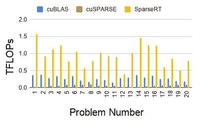

# 通过非结构化稀疏性加速深度学习推理

> 原文：<https://towardsdatascience.com/speeding-up-deep-learning-inference-via-unstructured-sparsity-c87e3137cebc?source=collection_archive---------41----------------------->

照片鸣谢:麻省理工开放式课程 6.172

为大型神经网络提供服务可能非常昂贵。神经网络的大小似乎与它们的有用程度相关，这当然没有帮助。(典型的例子:GPT-3)

一种自然的冲动是通过作弊让神经网络变小。在宋寒 2016 年的开创性深度压缩论文(据谷歌称，该论文已被引用约 4000 次)中，他提出了两种抄近路的方法:量化和修剪。量化旨在减少权重和激活中的比特数。修剪的目的是保留有用的权重，并将其余的权重设置为零。两者都成为了活跃的研究领域。注意量化和修剪是非常正交的方法。它们可以而且应该结合在一起。

我们在这里主要讨论修剪。自 2016 年以来的 4 年中，许多修剪研究都集中在结构化修剪上。为什么要结构化剪枝？在剪枝中将无用的权重设置为零后，我们只剩下一个稀疏的权重矩阵。人们很快就意识到，当前的商用硬件/软件堆栈不喜欢非结构化稀疏(也称为随机稀疏)模式，其中非零值可以在矩阵中的任何位置。相反，当前的硬件/软件喜欢结构化计算。

典型的结构化计算是一个密集的矩阵乘法，它已经被一群真正聪明的人优化得一团糟。在英特尔 CPU 上，人们可以预期大约 90%的硬件失败是由 MKL 造成的。在 Nvidia GPUs 上，人们也可以期待接近屋顶线的性能。非结构化稀疏矩阵相乘是一种截然相反的情况。通常，现有的最新技术实现只能实现(远远)少于 10%的硬件 FLOPs。

因此，结构化剪枝旨在通过在稀疏模式中引入一些结构(通常以块的形式)来达到某种中间状态。块稀疏证明是非常有效的。OpenAI 的块稀疏 GPU 内核可以通过稀疏率实现几乎线性的加速比，并且使用硬件的效率几乎与密集矩阵乘法一样高。

不幸的是，人们普遍观察到，与非结构化修剪相比，结构化修剪会导致相当严重的精度下降。这是相当直观的，因为我们对在修剪过程中可以保留的权重施加了约束。不幸的是，它不是作为某种形式的正则化，而是几乎总是降低性能。最近的研究表明，与宋寒 4 年前使用的方法类似，简单的基于幅度的非结构化剪枝方法仍然可以在不同的任务之间一致地实现最先进的稀疏率/精度损失权衡。

如果我们能够加速非结构化稀疏矩阵乘法，那不是很好吗？

在我最近关于 arXiv:[https://arxiv.org/abs/2008.11849](https://arxiv.org/abs/2008.11849)的论文中，我提出了一个名为 SparseRT 的代码生成器来应对这个挑战。事实证明，聪明的编译策略实际上可以在编译时完成大量稀疏矩阵乘法的工作，从而在执行时加速运行时间。特别地，如果在编译时知道稀疏矩阵的稀疏模式，那么可以专门针对该稀疏模式进行优化，实际上是为该特定稀疏矩阵定制程序。

我表明，在 90%的稀疏度下，许多深度学习操作如 1x1 和 3x3 卷积可以在 GPU 上加速 2 到 3 倍。这对于加速深度学习推理是可以接受的，在深度学习推理中，人们通常不关心编译一个模型需要多长时间。下图显示了 20 个深度学习问题在 90%稀疏度下的加速。

值得注意的是，SparseRT 附带了一系列免责声明:

免责声明 1:它只适用于推断(目前)。人们也尝试在训练场景中使用非结构化稀疏性。然而，在这种情况下，权重矩阵的稀疏结构倾向于动态改变。此外，SparseRT 目前不支持深度学习所需的大量稀疏梯度计算(通常采用采样密集-密集矩阵乘法的形式，而不是稀疏矩阵乘法。)

免责声明 2:它不能使用张量核。这篇论文展示了 fp32 的结果，有些人会认为这是一种过时的深度学习推理数据格式。SparseRT 在 GPU 上支持 fp16 和矢量指令，通常可以提供比运行 fp32 的 SparseRT 更快的速度。然而，很难用张量核这样的密集矩阵乘法加速器来协调非结构化稀疏性。不过也不是完全没有希望，张量核支持未来应该会有。

我还应该提到在这个方向上正在进行的其他巨大努力，特别是谷歌/斯坦福的一个团队所做的努力:https://arxiv.org/abs/2006.10901[。](https://arxiv.org/abs/2006.10901)

**酷。SparseRT 能实现多大的端到端加速？**

这篇论文本身关注的是单一运算(稀疏的 1x1 和 3x3 卷积)。可以理解，端到端的结果对大多数从业者来说更感兴趣。这些都很棘手，因为端到端推理依赖于其他东西，而不是快速的 1x1 和 3x3 卷积。例如，在 MobileNets 上，一旦 1x1 卷积的速度提高了三倍，深度方向的卷积就会成为瓶颈。在 BERT 上，一旦涉及权重矩阵的矩阵乘法变得很快,(密集的)自我关注单元就成为瓶颈。当然，人们还需要融合元素式层等。这些棘手的细节可能是英伟达和英特尔拥有整个工程师团队开发 TensorRT 和 OpenVINO 的原因。

当然，所有这些优化都与 SparseRT 的方法兼容，它可以实现非常好的端到端加速。我将在更多的博客文章和后续文章中介绍详细的结果。仅给出加速的感觉:SparseRT 可以在 Jetson Nano 上实现 2 倍于 TensorRT 的端到端加速，在 MobileNets 上实现一半精度，稀疏度为 90%，这通常意味着 1.5 -2 %的精度损失。这使得 Jetson Nano 具有与 Jetson TX2 相同的推理吞吐量，但只有后者的三分之一(！)的价格。

**直到下一次…**