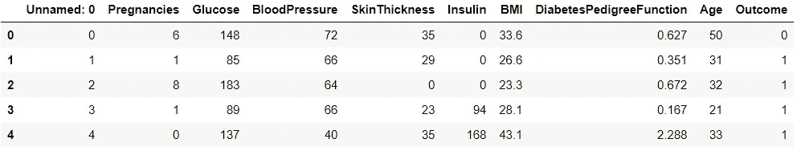
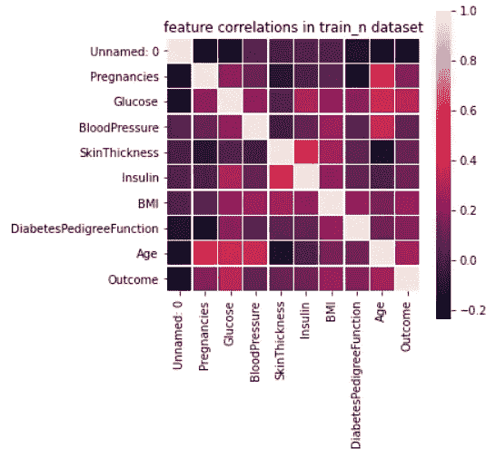
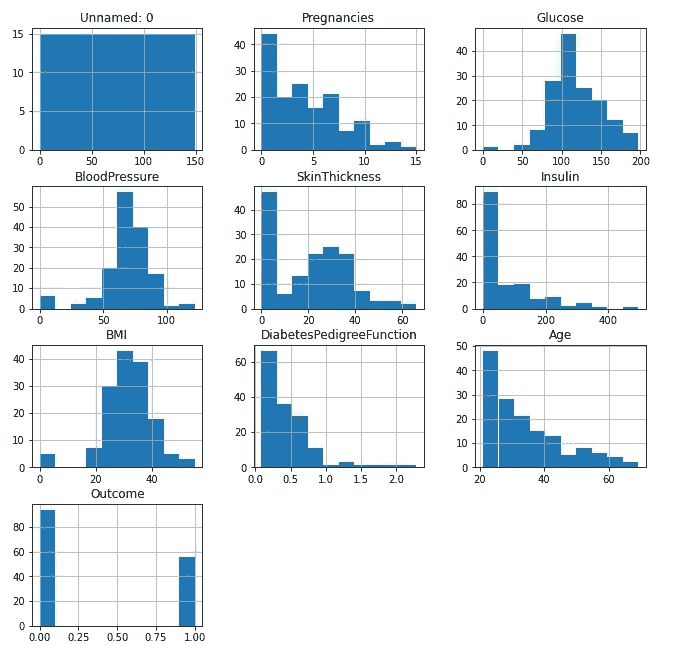
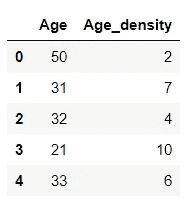
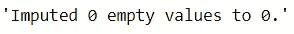
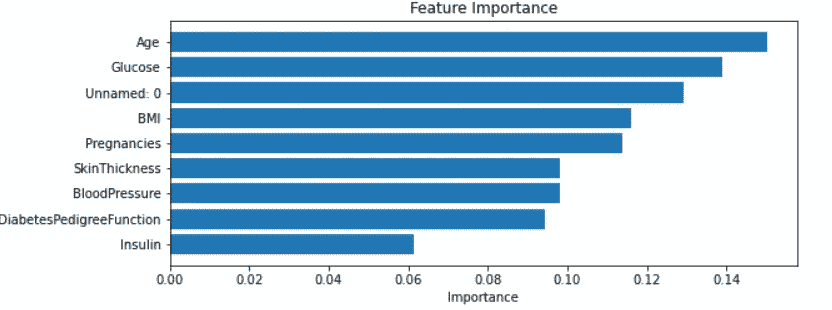
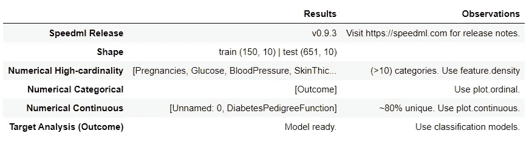

# Speedml:加速机器学习

> 原文：<https://towardsdatascience.com/speedml-speeding-up-machine-learning-5dccbf21effd?source=collection_archive---------44----------------------->

## 用于快速启动机器学习项目的 Python 包


克里斯·利维拉尼在 [Unsplash](https://unsplash.com?utm_source=medium&utm_medium=referral) 上的照片

机器学习为系统提供了自动学习和从经验中改进的能力。有大量的机器学习算法可用，要测试它们以便为数据集或问题陈述找到最佳模型真的很难。除此之外，我们需要在模型中处理数据之前准备好数据。我们需要分析数据，找出模式、异常等。这些数据。简而言之，在机器学习模型中进一步处理数据之前，我们需要对数据进行完整的探索性数据分析。

SpeedML 通过提供不同的功能来加速机器学习的过程，这使得探索性数据分析成为一项简单的任务。我们只需要导入 SpeedML，就可以创建各种各样的图，清理数据，添加和删除功能等。

SpeedML 导入并正确初始化已经在其中定义的流行 ML 包，包括 pandas、numpy、sklearn、xgboost 和 matplotlib。

在本文中，我们将了解如何使用 SpeedML 来分析数据，并为机器学习模型做准备。

# **安装 SpeedML**

像任何其他 python 库一样，我们将使用下面给出的命令来加速 ml。

```
pip install speedml
```

# 导入所需的库

我们将导入 speedml 来执行探索性数据分析和其他可视化。

```
from speedml import Speedml
```

在本文中，我们将使用 [PIMA 印度糖尿病数据集](https://www.kaggle.com/uciml/pima-indians-diabetes-database)。我已经分割了数据集，并分别保存在训练和测试文件中。让我们用我们的数据初始化 speedml，看看我们如何解决它。

# 正在初始化 speedml

```
sml = Speedml('dia_train.csv', 'dia_test.csv',target='Outcome')
```

这将创建我们的实例，我们将使用它进行进一步的分析。我们将从探索性的数据分析和可视化开始。

# 探索性数据分析

我们只需要为每个函数运行一行代码，让我们检查一下我们正在使用的数据的属性。

```
#data sample
sml.train.head()
```



我们正在使用的数据集。(来源:图片由作者提供)

```
#Heatmap
sml.plot.correlate()
```



显示不同属性之间相关性的热图。(来源:图片由作者提供)

```
#Distribution Plot
sml.plot.distribute()
```



所有属性的分布图。(来源:图片由作者提供)

类似地，我们可以创建连续的、顺序的等图。接下来，我们将了解如何操作数据并根据我们的需求更改数据。

```
#Finding Feature density
sml.feature.density('Age')
sml.train[['Age', 'Age_density']].head()
```



密度函数。(来源:图片由作者提供)

```
#Impute data
sml.feature.impute()
```



归罪。(来源:图片由作者提供)

```
#Feature Importance
sml.plot.importance()
```



功能重要性。(来源:图片由作者提供)

像 drop、crosstab、fillna、extract 这样的函数对于处理数据是最有用的，可以使用 sml 实例直接调用。

让我们朝着创建小型 EDA 报告的方向迈出最后一步，该报告将告诉我们正在处理的问题类型以及关于数据的一些其他重要信息。

```
sml.eda()
```



EDA 报告。(来源:图片由作者提供)

在这里，我们可以清楚地看到，我们正在处理一个分类问题以及测试和训练数据集的形状。我们还可以看到数据基数和数据类型。

在本文中，我们看到了如何使用 Speedml 来加速启动机器学习的过程，以及与 EDA 和可视化相关的各种功能。Speedml 易于使用，并且大多数函数都可以通过一行代码调用，省时省力。

# 在你走之前

***感谢*** *的阅读！如果你想与我取得联系，请随时通过 hmix13@gmail.com 联系我或我的* [***LinkedIn 个人资料***](http://www.linkedin.com/in/himanshusharmads) *。可以查看我的*[***Github***](https://github.com/hmix13)**简介针对不同的数据科学项目和包教程。还有，随意探索* [***我的简介***](https://medium.com/@hmix13) *，阅读我写过的与数据科学相关的不同文章。**