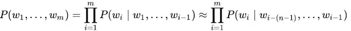
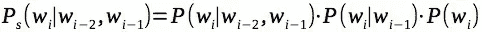
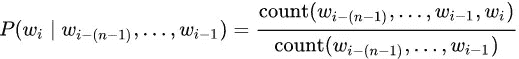
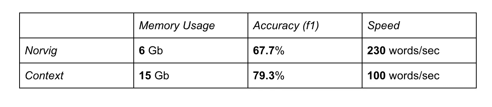
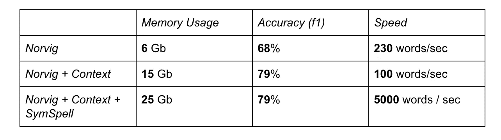
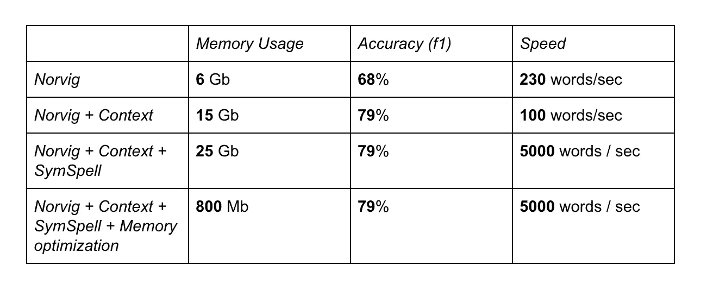
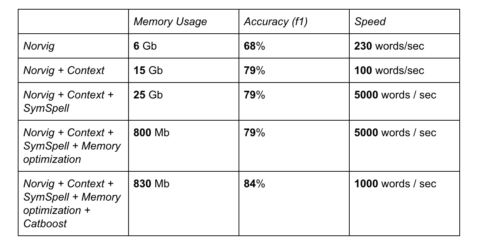
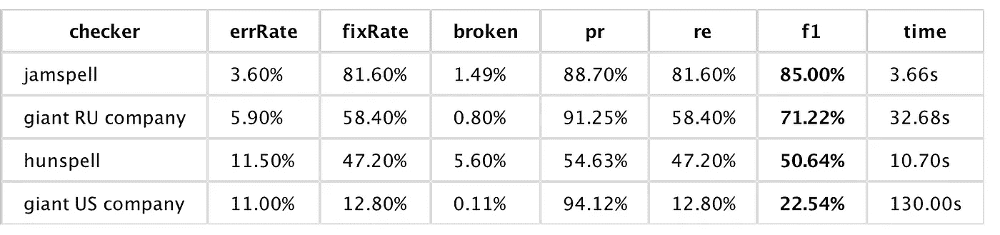
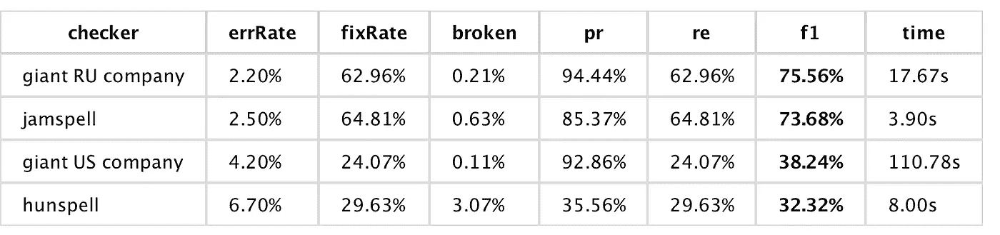
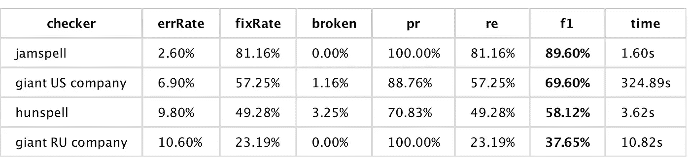

# 拼写校正:如何做一个准确快速的校正器

> 原文：<https://towardsdatascience.com/spelling-correction-how-to-make-an-accurate-and-fast-corrector-dc6d0bcbba5f?source=collection_archive---------7----------------------->


来源:https://unsplash.com/photos/wRgNwR9CZDA

脏数据导致模型质量差。在现实世界的 NLP 问题中，我们经常会遇到有很多错别字的文本。结果，我们无法达到最好的分数。尽管这可能很痛苦，但在拟合之前应该清理数据。

我们需要一个自动拼写校正器，它可以修复错别字，同时不破坏正确的拼写。

但是如何才能实现这一点呢？

让我们从一个 [Norvig 的拼写校正器](https://norvig.com/spell-correct.html)开始，反复增加它的功能。

# 诺尔维格方法

Peter Norvig(谷歌研究部主任)描述了以下拼写纠正方法。

> 我们就拿一个词，蛮力的进行所有可能的编辑，比如删除，插入，转置，替换，拆分。例如，单词 **abc** 可能的候选单词有:**ab AC BC BAC CBA ACB a _ BC ab _ c aabc abbc acbc adbc aebc**等。
> 
> 每个单词都被添加到候选列表中。我们第二次对每个单词重复这个过程，以获得具有更大编辑距离的候选词(对于有两个错误的情况)。
> 
> 每个候选人都用一元语言模型进行评估。对于每个词汇，词频是基于一些大的文本集合预先计算的。将出现频率最高的候选词作为答案。

# 添加一些上下文

第一个改进—添加了 n 元语言模型(3 元)。让我们不仅预计算单个单词，而且预计算单词和一个小上下文(3 个最近的单词)。让我们估计某个片段作为所有 n-grams 的 n-size 的乘积的概率:



为了简单起见，让我们将大小为 n 的 n-gram 的概率计算为所有低阶 gram 的概率的乘积(实际上[有一些平滑技术](https://jon.dehdari.org/teaching/uds/lt1/ngram_lms.pdf)，如 Kneser–Ney-它们提高了模型的准确性，但让我们稍后再讨论它，参见下面的“提高准确性”段落):



为了从出现频率中获得 n-gram 的概率，我们需要归一化频率(例如，将 n-gram 的数量除以 n-gram 的数量，等等。):



现在，我们可以使用我们的扩展语言模型来估计候选人的上下文。

句子概率可以这样计算:

```
**def** predict(self, sentence):
    result = 0
    **for** i **in** range(0, len(sentence) - 2):
        p2 = self.getGram3Prob(sentence[i], sentence[i + 1], sentence[i + 2])
        p3 = self.getGram2Prob(sentence[i], sentence[i + 1])
        p4 = self.getGram1Prob(sentence[i])
        result += math.log(p2) + math.log(p3) + math.log(p4)
    **return** result
```

n 元概率是这样的:

```
**def** getGram1Prob(self, wordID):
    wordCounts = self.gram1.get(wordID, 0) + SimpleLangModel.K
    vocabSize = len(self.gram1)
    **return** float(wordCounts) / (self.totalWords + vocabSize)

**def** getGram2Prob(self, wordID1, wordID2):
    countsWord1 = self.gram1.get(wordID1, 0) + self.totalWords
    countsBigram = self.gram2.get((wordID1, wordID2), 0) + SimpleLangModel.K
    **return** float(countsBigram) / countsWord1

**def** getGram3Prob(self, wordID1, wordID2, wordID3):
    countsGram2 = self.gram2.get((wordID1, wordID2), 0) + self.totalWords
    countsGram3 = self.gram3.get((wordID1, wordID2, wordID3), 0) + SimpleLangModel.K
    **return** float(countsGram3) / countsGram2
```

现在我们有了更高的精确度。然而，模型变得非常庞大，一切都变得非常缓慢。对于 600 Mb 的训练文本，我们得到:



# 提高速度——对称方法

为了提高速度，让我们使用 SymSpell 的一个想法。想法相当优雅。我们可以预先计算所有的删除错别字(以及由删除产生的其他错别字)，而不是每次遇到不正确的单词时都生成所有可能的编辑。更多详情可以在[原文](https://medium.com/@wolfgarbe/1000x-faster-spelling-correction-algorithm-2012-8701fcd87a5f)中阅读。

显然，我们无法达到与原始版本一样高的速度(因为我们使用语言模型并查看上下文，而不仅仅是单个单词)，但我们可以显著提高性能。代价是额外的内存消耗:



# 改善内存消耗

为了获得尽可能高的精度，我们需要一个大的数据集(至少几千兆字节)。在 600 mb 文件上训练 n-gram 模型会导致大量内存消耗(25 Gb)。一半大小由语言模型使用，另一半由符号拼写索引使用。

如此高的内存使用率的一个原因是我们不存储纯文本，而是存储频率。例如，对于以下 5 个单词的文本:
*a b c a b*，我们存储以下频率:

> **a**=>2
> **b**=>2
> **c**=>1
> **a b**=>2
> 2**b**=>1
> **c**=>1
> **a b**=>1

另一个原因——哈希表数据结构内存开销大(哈希表用在 python *dict* 或者 c++ *unordered_map* 内部)。

为了压缩我们的 n-gram 模型，让我们使用在[高效最小完美散列语言模型](http://www.lrec-conf.org/proceedings/lrec2010/pdf/860_Paper.pdf)论文中描述的方法。让我们使用一个[完美散列](https://en.wikipedia.org/wiki/Perfect_hash_function) ( [压缩、散列和置换](http://cmph.sourceforge.net/chd.html))来存储 n 元文法计数。完美散列是保证没有冲突的散列。如果没有碰撞，就可能只存储值(计数频率)而不是原始的 n 元文法。为了确保未知单词哈希不匹配现有的哈希，我们将使用一个已知单词的布隆过滤器。我们还可以使用非线性量化将 32 位长的计数频率打包成 16 位值。这不会影响最终指标，但会减少内存使用。

量化:

```
**static const** uint32_t MAX_REAL_NUM = 268435456;
**static const** uint32_t MAX_AVAILABLE_NUM = 65536;

uint16_t PackInt32(uint32_t num) {
    **double** r = **double**(num) / **double**(MAX_REAL_NUM);
    assert(r >= 0.0 && r <= 1.0);
    r = pow(r, 0.2);
    r *= MAX_AVAILABLE_NUM;
    **return** uint16_t(r);
}

uint32_t UnpackInt32(uint16_t num) {
    **double** r = **double**(num) / **double**(MAX_AVAILABLE_NUM);
    r = pow(r, 5.0);
    r *= MAX_REAL_NUM;
    **return** uint32_t(ceil(r));
}
```

计数频率提取:

```
**template**<**typename** T>
TCount GetGramHashCount(T key,
                        **const** TPerfectHash& ph,
                        **const** std::vector<uint16_t>& buckets,
                        TBloomFilter& filter)
{
    **constexpr int** TMP_BUF_SIZE = 128;
    **static char** tmpBuff[TMP_BUF_SIZE];
    **static** MemStream tmpBuffStream(tmpBuff, TMP_BUF_SIZE - 1);
    **static** std::ostream out(&tmpBuffStream);

    tmpBuffStream.Reset();

    NHandyPack::Dump(out, key);
    **if** (!filter.Contains(tmpBuff, tmpBuffStream.Size())) {
        **return** TCount();
    }

    uint32_t bucket = ph.Hash(tmpBuff, tmpBuffStream.Size());

    assert(bucket < ph.BucketsNumber());

    **return** UnpackInt32(buckets[bucket]);
}
```

*首先，我们检查密钥是否存在于布隆过滤器中。然后我们得到基于完美哈希桶数的计数。*

为了压缩符号索引，让我们使用一个[布隆过滤器](https://en.wikipedia.org/wiki/Bloom_filter)。布隆过滤器是一种节省空间的概率数据结构，用于测试元素是否是集合的成员。让我们将所有删除散列放入一个 bloom 过滤器，并使用这个索引来跳过不存在的候选项。

这是符号拼写算法的第二步。这里我们取候选单词，这些单词是通过从原始单词中去掉一个或多个字母而生成的，并检查每个单词是否包含在索引中。*删除 1* 和*删除 2* 是布隆过滤器。

```
TWords CheckCandidate(const std::wstring& s)
{
    TWords results; **if** (Deletes1->Contains(w)) {
        Inserts(w, results);
    }
    **if** (Deletes2->Contains(w)) {
        Inserts2(w, results);
    }
}**void** TSpellCorrector::Inserts(**const** std::wstring& w, TWords& result) **const** {
    **for** (size_t i = 0; i < w.size() + 1; ++i) {
        **for** (**auto**&& ch: LangModel.GetAlphabet()) {
            std::wstring s = w.substr(0, i) + ch + w.substr(i);
            TWord c = LangModel.GetWord(s);
            **if** (!c.Empty()) {
                result.push_back(c);
            }
        }
    }
}

**void** TSpellCorrector::Inserts2(**const** std::wstring& w, TWords& result) **const** {
    **for** (size_t i = 0; i < w.size() + 1; ++i) {
        **for** (**auto**&& ch: LangModel.GetAlphabet()) {
            std::wstring s = w.substr(0, i) + ch + w.substr(i);
            **if** (Deletes1->Contains(WideToUTF8(s))) {
                Inserts(s, result);
            }
        }
    }
}
```

经过优化后，模型大小显著减小，降至 800 Mb:



# 提高准确性

为了提高准确性，让我们添加几个机器学习分类器。第一个将被用来决定单词是否有错误。第二个是回归变量，将用于候选人排名。这个分类器部分地起到了语言模型平滑的作用(它将所有的 gram 作为单独的输入，并且分类器决定每个 gram 有多大的影响)。

对于候选人排名，我们将训练一个具有以下特征的 [catboost](https://catboost.ai/docs/concepts/loss-functions-ranking.html) (梯度提升决策树)排名模型:

*   字频率
*   n 克频率，每克独立(2，3)
*   距离为 3，4 的邻近单词的频率
*   n 元模型预测
*   编辑候选词和源词之间的距离
*   编辑距离更远的候选人数量
*   单词长度
*   一个干净的静态字典中的单词存在

```
from catboost import CatBoostparams = {
        'loss_function': 'PairLogit',
        'iterations': 400,
        'learning_rate': 0.1,
        'depth': 8,
        'verbose': False,
        'random_seed': 42,
        'early_stopping_rounds': 50,
        'border_count': 64,
        'leaf_estimation_backtracking': 'AnyImprovement',
        'leaf_estimation_iterations': 2,
        'leaf_estimation_method': 'Newton',
        'task_type': 'CPU'
    }model = CatBoost(params, )
    model.fit(trainX, trainY, pairs=trainPairs, group_id=groupIDs, eval_set=evalPool, verbose=1)
```

对于误差预测，我们将训练一个二元分类器。让我们使用为原始单词的每个单词计算的相同特征，并让分类器决定该单词是否有错误。这将提供一种根据上下文检测错误的能力，即使是字典中的单词。

```
from catboost import CatBoostClassifiermodel = CatBoostClassifier(
    iterations=400,
    learning_rate=0.3,
    depth=8
)

model.fit(trainX, trainY, sample_weight=trainWeight, verbose=**False**)
```

这进一步提高了准确性，但是，这不是免费的，我们会降低性能。尽管如此，对于大多数应用来说，这种性能已经足够了，精度通常更重要。



# 评价

为了评估一个模型，我们需要一些数据集。我们可以基于干净的文本生成人为的错误。我们也可以使用公共数据集——其中之一是 [SpellRuEval](http://www.dialog-21.ru/en/evaluation/2016/spelling_correction/) 数据集。让我们检查两个人工数据集和一个真实数据集的准确性。我们将使用一些来自大型 IT 公司的替代拼写检查器进行比较。这里，jamspell 是我们的拼写检查器，我们得到了以下指标:

## 茹，人工，文学



## RU，real，互联网帖子



## 人工新闻



*   errRate — *执行自动更正后文本中剩余的错误数*
*   fixRate — *已修复错误的数量*
*   破损— *破损的正确单词数*
*   pr，re，f1 — *精度，召回，f1 分数*

# 进一步的步骤

提高准确性的后续步骤—收集大量带有错误和已更正文本的并行文本语料库(分别用于移动和桌面平台),并训练专用的错误模型。

另一种提高准确性的可能方法是添加动态学习选项。我们可以边修正边在飞行中学习，或者我们可以进行两遍修正。在第一次通过时，模型将学习一些统计数据，并在第二次通过时进行实际校正。

此外，神经网络语言模型(双向 LSTM 或 BERT)可以提供一些额外的准确性提升。它们在直接方法(LSTM 误差分类器、序列-2-序列 LSTM 模型、使用 BERT 输出作为候选排序权重)中工作得不好，但是它们的预测可能作为排序模型/误差检测器中的特征是有用的。

以下是一些我们无法实现的方法的细节(这并不意味着它们无法实现——这只是我们的经验)。

## 用 BERT 法选择最佳候选人

我们训练伯特，并试图用它来预测最佳候选人。

```
from transformers import RobertaConfig, RobertaTokenizerFast, RobertaForMaskedLM, LineByLineTextDataset, DataCollatorForLanguageModelingconfig = RobertaConfig(
    vocab_size=52_000,
    max_position_embeddings=514,
    num_attention_heads=12,
    num_hidden_layers=6,
    type_vocab_size=1,
)dataset = LineByLineTextDataset(
    tokenizer=tokenizer,
    file_path=TRAIN_TEXT_FILE,
    block_size=128,
)from transformers importdata_collator = DataCollatorForLanguageModeling(
    tokenizer=tokenizer, mlm=True, mlm_probability=0.15
)from transformers import Trainer, TrainingArgumentstraining_args = TrainingArguments(
    output_dir="~/transformers",
    overwrite_output_dir=True,
    num_train_epochs=3,
    per_gpu_train_batch_size=32,
    save_steps=10_000,
    save_total_limit=2,
)trainer = Trainer(
    model=model,
    args=training_args,
    data_collator=data_collator,
    train_dataset=dataset,
    prediction_loss_only=False,
)trainer.train()
```

对于屏蔽词预测任务，它比 n-gram 语言模型工作得更好(BERT 模型的准确率为 30 %, n-gram 模型的准确率为 20%),但是在从候选词列表中选择最佳词时，它的表现更差。我们的假设是，这是由于伯特不知道编辑距离或与原词匹配的事实。我们相信添加 BERT 预测作为 catboost 排名模型的一个特征可以提高准确性。

## 使用 LSTM 作为错误分类器

我们试图使用 LSTM 作为错误检测器(来预测 word 是否有错误)，但我们最好的结果是与常规 n 元语言模型错误预测器+手动试探法相同。而且训练时间要长得多，所以我们决定暂时不用。这是一个得分最高的模型。输入是单词级的**手套**嵌入，在同一个文件上训练。

```
Model: "functional_1"
_________________________________________________________________
Layer (type)                 Output Shape              Param #   
=================================================================
input_1 (InputLayer)         [(None, 9, 200)]          0         
_________________________________________________________________
bidirectional (Bidirectional (None, 9, 1800)           7927200   
_________________________________________________________________
dropout (Dropout)            (None, 9, 1800)           0         
_________________________________________________________________
attention (Attention)        (None, 1800)              1809      
_________________________________________________________________
dense (Dense)                (None, 724)               1303924   
_________________________________________________________________
dropout_1 (Dropout)          (None, 724)               0         
_________________________________________________________________
batch_normalization (BatchNo (None, 724)               2896      
_________________________________________________________________
dense_1 (Dense)              (None, 2)                 1450      
=================================================================
Total params: 9,237,279
Trainable params: 9,235,831
Non-trainable params: 1,448
_________________________________________________________________
None
```

# 结论

我们从非常简单的模型开始，迭代地增加它的功能，最终我们得到了一个强大的、产品级的拼写检查器。然而，这并不是终点，在通往我们的目标——做世界上最好的拼写检查器——的漫长道路上还有很多步骤。

# 链接

*   [项目网站](https://jamspell.com/)
*   [Github 回购](https://github.com/bakwc/JamSpell)