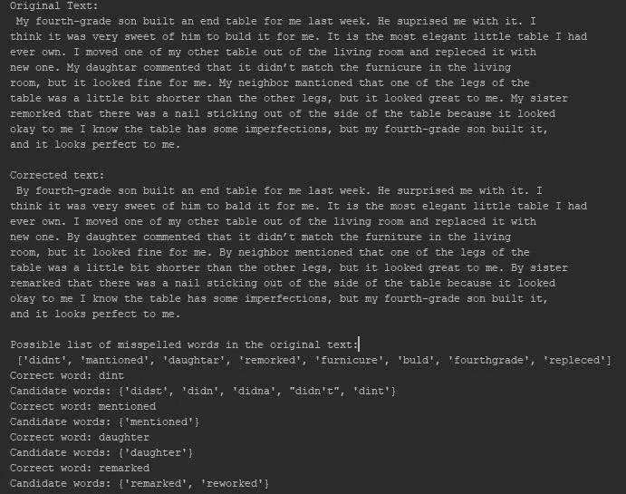
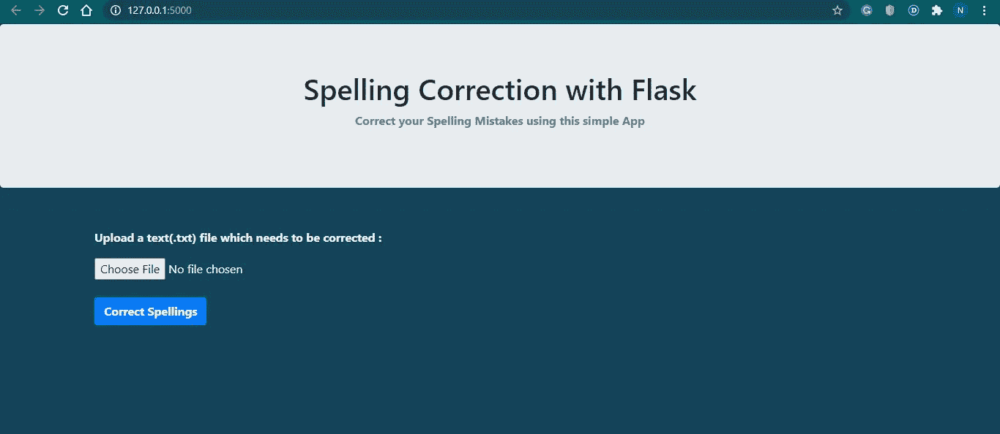
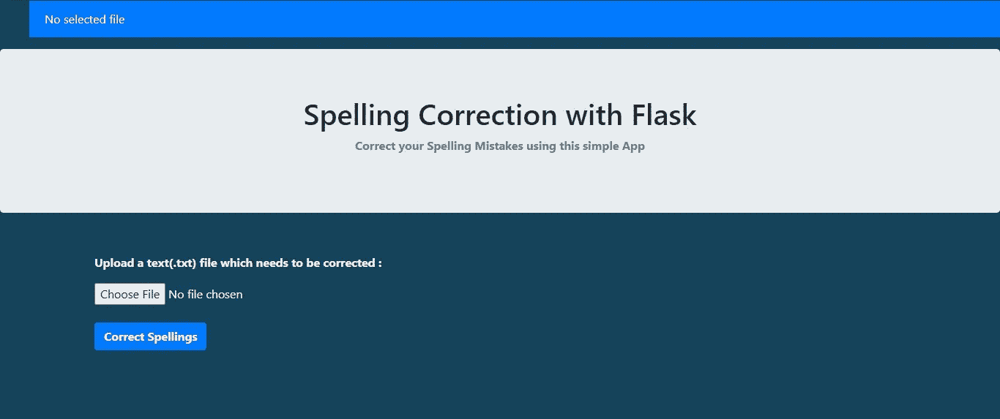
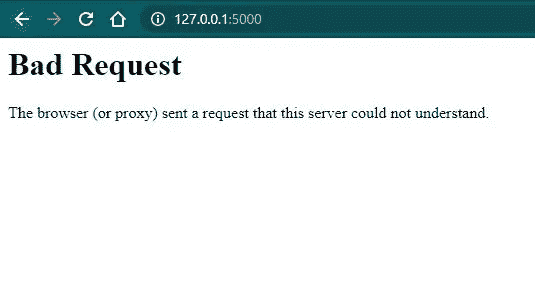
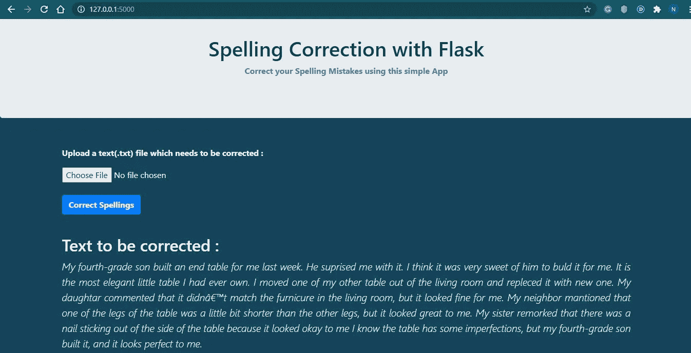
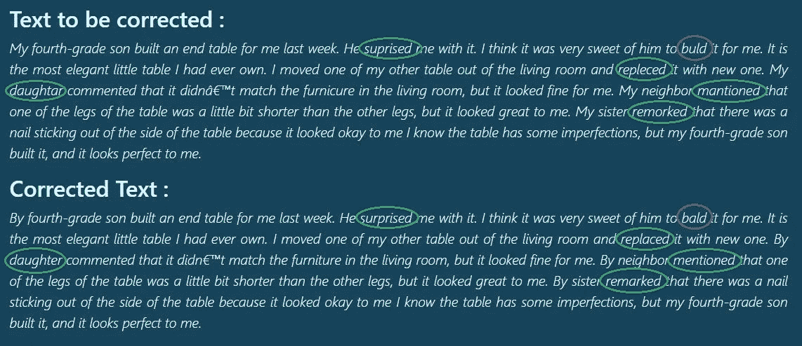
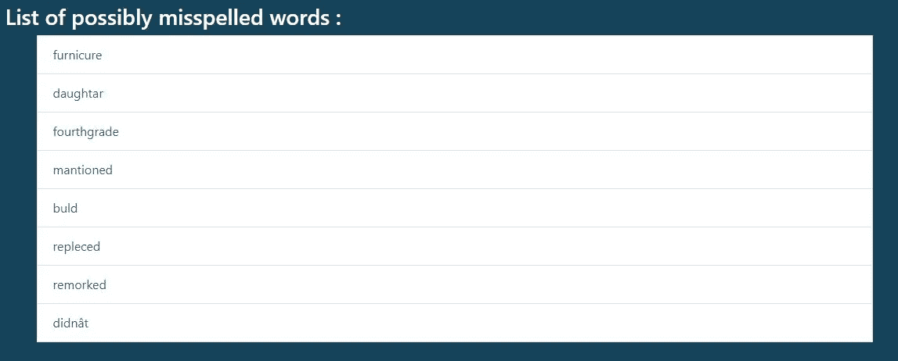
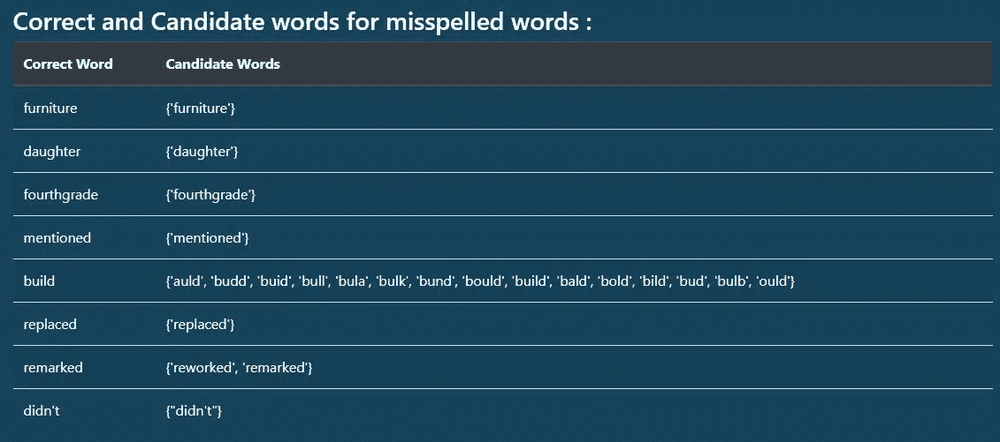
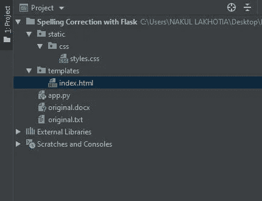

# 使用 TextBlob & pyspellchecker 的拼写纠正应用程序

> 原文：<https://towardsdatascience.com/spelling-rectification-app-using-textblob-pyspellchecker-cb3ad0504fc7?source=collection_archive---------16----------------------->

## 使用 Python 轻松纠正拼写错误


来源:桑迪·米勒在 [Unsplash](https://unsplash.com?utm_source=medium&utm_medium=referral) 上拍摄的照片

在你的搜索引擎上输入“斯坦福大学”，你会注意到它为你提供了“斯坦福大学”的搜索结果。你必须意识到，几乎每次搜索引擎都会为你提供正确的搜索结果，不管你的搜索查询中是否有拼写错误。

**这是如何实现的？**

这是有可能的，因为搜索引擎在将你的请求发送给服务器之前会使用“拼写纠正”算法，这样服务器就会返回你想要的结果。拼写纠正是任何现代搜索引擎的必备功能。

这只是一个自然语言处理*如何以及在哪里被用来纠正拼写错误的例子。拼写纠正有助于你产生高质量的内容，可用于电子邮件、文档、社交媒体、文章(甚至是媒体)等。*

在本文中，我们将学习使用类似于[**text blob**](https://textblob.readthedocs.io/en/dev/quickstart.html)**、**[**pyspellchecker**](https://pyspellchecker.readthedocs.io/en/latest/)**&**[**Flask**](https://flask.palletsprojects.com/en/1.1.x/)的模块，用 Python 创建一个离线**拼写纠正应用程序**。

## **要遵循的步骤:**

1.  用 python 创建一个拼写纠正程序
2.  将程序集成到 Flask 应用程序中

在进入编码部分之前，让我们先简单了解一下这些模块。如果你已经熟悉这些模块，你可以直接跳到下一节。

> **根据维基百科，Flask** 是一个用 [Python](https://en.wikipedia.org/wiki/Python_(programming_language)) 编写的微型 [web 框架](https://en.wikipedia.org/wiki/Web_framework)。它被归类为微框架，因为它不需要特殊的工具或库。它没有数据库抽象层、表单验证或任何其他组件，而现有的第三方库提供了通用功能。
> 
> **根据官方文档，TextBlob** 是一个用于处理文本数据的 Python (2 和 3)库。它提供了一个一致的 API 来处理常见的自然语言处理任务，比如词性标注、名词短语提取、情感分析等等。
> 
> **根据官方文档，pyspellchecker** 是一种简单的拼写检查算法，它使用一种 [Levenshtein 距离](https://en.wikipedia.org/wiki/Levenshtein_distance)算法来查找距离原始单词 2 编辑距离内的排列。然后，它将所有排列(插入、删除、替换和换位)与词频列表中的已知单词进行比较。那些在频率列表中更频繁出现的单词更有可能是正确的结果。它支持多种语言，包括英语、西班牙语、德语、法语和葡萄牙语。

## 1.用 Python 创建一个拼写纠正程序

在将程序集成到 Flask 应用程序之前，最好先创建并测试我们的程序。所以让我们从编码开始吧。

**1.1-安装 text blob&pyspellchecker:**可以使用' *pip install textblob* '和'*pip Install pyspellchecker*'命令。我使用 PyCharm IDE 开发 flask 应用程序。 ***要在 PyCharm*** 中轻松安装库，请遵循以下[步骤](https://www.jetbrains.com/help/pycharm/installing-uninstalling-and-upgrading-packages.html)。

**1.2-写程序:**下面是纠正拼写错误的程序，向下滚动了解程序的工作原理。

使用 TextBlob & pyspellchecker 进行拼写纠正的 Python 程序

*   我们导入模块——text blob、pyspellchecker、re(regex)
*   使用“with”关键字，我们打开一个包含有拼写错误的文本的文件，读取它，将字符串内容转换为 textblob 对象，就像 python 字符串一样。我们使用 textblob 类的 **correct()方法**并打印正确的文本。

> TextBlob 的拼写修正是基于 Peter Norvig 的[**如何写一个拼写修正器**](http://norvig.com/spell-correct.html)。没有办法确切知道(例如，“lates”应该更正为“late”或“latest”或“lattes”还是…？)，这表明我们使用概率。给定原始单词 *w* ，我们正试图从所有可能的候选单词中找到正确的单词，以最大化 *c* 是预期校正的概率。它大约有 70%的准确性

*   要纠正拼写，我们不能仅仅依靠 textblob 的正确方法，因为它有 70%的准确率。所以我们使用 **pyspellchecker** 来获得所有拼写错误的单词、它们对应的正确单词和候选单词的列表。在找到拼写错误的单词之前，我们使用 regex 删除文本中的所有标点符号。
*   最后，我们重写文本文件，用新的校正文本替换旧的不正确文本。

上面的程序不仅能让你纠正拼写错误，还能为你提供拼写错误的单词及其对应的候选单词列表。

## 程序的输出:



拼写更正. py 的输出

## 2.将程序集成到 Flask 应用程序中

现在是时候将上面的代码集成到 Flask 中来开发一个 web 应用程序了，我们可以在这里**上传任何东西。txt '文件**,点击“纠正拼写”按钮，在我们的网页上生成正确的文本。它还会显示拼写错误的单词列表和一个显示正确的&候选单词的表格。用户界面看起来有点像这样(使用你的 web 开发技能和创造力来设计你自己的网站) :



Web 应用程序的主页

**2.1-安装 Flask:** 我们使用" *pip install flask "命令来安装 Flask，或者按照这些[步骤](https://www.jetbrains.com/help/pycharm/installing-uninstalling-and-upgrading-packages.html)在 PyCharm* IDE 中轻松安装库。

**2.2-创建 app.py:** 让我们一行一行地检查代码

*   [1–6]我们导入所有必要的库——flask、textblob、pyspellchecker、regex、getpass(获取计算机的用户名)和 os。
*   [7–11]我们的应用程序必须能够从您计算机的任何位置上传文本文件，因此在将文件上传到服务器后，我们将其保存在我们的桌面上，稍后在桌面上打开文件进行处理。为此，我们需要计算机系统的用户名来访问桌面上的文件，其路径通常是

```
*C:/Users/’+username+’/Desktop/{filename.txt}*
```

*   [12–16]我们**初始化我们的 flask 应用**，设置 24 位密钥，配置文件扩展名(以便将文件类型限制为。txt)，并将上传文件夹配置到上述路径。
*   [17]然后我们**为我们的 web 应用程序的默认页面“index.html”定义应用程序路径**。装饰器告诉我们的`@app`，每当用户在给定的`.route()`访问我们的应用程序域( *localhost:5000 用于本地服务器)*，执行`index()`函数。Flask 使用 Jinja 模板库来渲染模板。在我们的应用程序中，我们将使用模板来呈现将在浏览器中显示的 HTML。
*   [24–43]我们**打开 index()方法**，在这里我们完成了大部分编码工作。因为我们的应用程序从上传文件中获取输入，所以我们需要做一些基本的检查，看用户上传的文件是否有效。我们检查用户是否没有上传任何文件就点击了上传按钮，我们检查文件类型必须是。txt '，否则应用程序中止并从服务器返回响应——“400:错误请求”



当你点击“纠正拼写”按钮而没有上传文件-错误“没有选择的文件”



当您上传的文件类型不是。txt"-错误请求(中止烧瓶应用程序)

*   [44–64]如果上传的文件有效，我们首先使用**“file . save()”**方法将文件保存在“桌面”文件夹中。接下来的所有步骤都来自我们前面已经看到的拼写纠正 python 程序。
*   **【a】**是包含原文的字符串变量。 **"correct"** 是一个字符串变量，包含已更正的文本。**“拼错[]”**是包含所有拼错单词的列表，**“list 1[]”**是包含拼错单词对应的正确单词的列表。**“list 2[]”**是包含与返回的正确单词对应的所有候选单词的列表。
*   [66]然后我们**返回带有上述所有变量的模板**‘index . html’。
*   [69–70]最后，我们运行 flask 服务器。**“app . run()”**被调用，web 应用程序被本地托管在*【localhost:5000】上。*使用**“threaded = true”**时，每个请求都在一个新线程中处理。您的服务器可以同时处理多少个线程完全取决于您的操作系统以及它对每个进程的线程数量的限制。

## 输出:



当上传有效文件时



TextBlob 的准确率为 70%

> 在上图中，您可以看到“ **buld** ”被 Textblob 更正为“ **bald** ”，这与上下文无关。即使 textblob 返回正确的单词来代替拼写错误的单词，我们也不能完全依赖 textblob 来纠正所有的拼写错误。这就是为什么我们使用“ **pyspellchecker** ”来获得正确的候选单词。



拼写错误的单词列表



与上面拼写错误的单词相对应的正确单词和候选单词表

**2.3-项目结构:**

该项目保存在一个名为“用 Flask 拼写纠正”的文件夹中。我们运行“app.py”。运行该文件时，我们的应用程序托管在本地服务器的端口 5000 上。

> 运行“app.py”后，您只需在 web 浏览器上键入“localhost:5000”即可打开您的 web 应用程序



烧瓶应用程序的项目结构

*   这是我们在上面创建的 Flask 应用程序
*   **模板** —该文件夹包含我们的“index.html”文件。渲染模板时，这在 Flask 中是强制的。所有 HTML 文件都放在这个文件夹下。
*   **静态** —该文件夹包含“css”文件夹。Flask 应用程序中的静态文件夹用于保存 CSS 和 JavaScript 文件。

> **注意:**你可以从下面我的 GitHub 库的链接中查看 **'index.html'** 文件。

就是这样！！

您的个人**“离线拼写纠正应用”**可用于撰写电子邮件、文章、论文、社交媒体帖子、项目文档等。

参考我的 [**GitHub 代码**](https://github.com/NakulLakhotia/Spelling-Rectifier-Web-App)

***注意*** *:本文中已经提到了您开始工作所需的所有资源及其链接。希望你好好利用:)*

我希望这篇文章能让你对尝试像 web 应用程序开发这样的新事物感兴趣，并帮助你增加知识。如果你喜欢读这篇文章，请与你的朋友和家人分享。谢谢你的时间。

看看下面这篇关于情绪分析的文章吧！！

[](https://bit.ly/31LlLKF) [## Python 中的情感分析:TextBlob vs Vader 情感 vs 天赋 vs 从头构建…

### 情感分析是最广为人知的自然语言处理(NLP)任务之一。本文旨在给出…

bit.ly](https://bit.ly/31LlLKF)