# 用 Go 探索蓝牙 LE

> 原文：<https://towardsdatascience.com/spelunking-bluetooth-le-with-go-c2cff65a7aca?source=collection_archive---------14----------------------->

## 使用 Go 挖掘蓝牙 LE 广告

在过去的几周里，我一直在一个项目上研究蓝牙 LE(低能耗),并一直愉快地摆弄着它。蓝牙有一个相当大而复杂的规范，仅仅是核心规范(目前版本 5.2)本身就有 3256 页长，这仅仅是核心规范。其他信息无处不在，存在于各种文档、补充文档、在线注册表和网站中。在里面找到你想要的东西简直是一场寻宝游戏！


感觉是这样的(鸣谢[https://en.wikipedia.org/wiki/File:Caving1.jpg](https://en.wikipedia.org/wiki/File:Caving1.jpg)

我特别关注了蓝牙 LE，它是面向物联网设备的蓝牙的节能版本，而不是传统的蓝牙，也称为蓝牙 BR/EDR(基本速率/扩展数据速率)。我正在使用 BLE 研究近程信标，但那有点像钻进了兔子洞，我开始挖掘其他类型的 BLE 设备。我对它非常感兴趣，我甚至写了一个简单的 Go 工具来帮助我进行洞穴探险！

# 对 BLE 的简单介绍

BLE 的原始技术是由诺基亚开发的短程超低功率无线电技术，名为 Wibree。2007 年，诺基亚与蓝牙特别兴趣小组(SIG)达成协议，Wibree 成为蓝牙规范的一部分。经过几年的争论，蓝牙 LE(低能耗)于 2010 年作为蓝牙核心规范 4.0 的一部分被引入。

蓝牙核心规范谈到了两种无线技术——BR/EDR(或经典蓝牙)和 BLE(在一些文献中也称为蓝牙智能——市场营销用语，不要问为什么)。一般蓝牙设备可以是*单模*(仅限经典蓝牙或 BLE)或*双模*(经典蓝牙和 BLE 均可)。

一般来说，BLE 设备可以通过两种方式进行外部通信— *广播*和*连接*。这个想法很简单。在广播中，通信只是单向的。*广播器*将向任何能够接收传输数据的物体单向发送数据。另一方面，*观察器*重复扫描广播数据。

标准广播广告分组具有 31 个八位字节的有效载荷，并且可以具有可选的扫描响应有效载荷，其大小也是 31 个八位字节。广播是强大的，但也有它的缺点——它缺乏安全或隐私保护。(我在这篇文章中选择使用术语 octet，以便更清楚地表明我指的是类似于`0xFF`的东西，它是 8 位的单位。)

连接提供永久性的双向数据传输(至少在断开连接之前)。在连接模式中，*中央*发起连接，而*外设*接受连接。此后，相应地，中央设备成为主*设备*，而外围设备成为从*设备*。

在混合使用模式中，设备开始时是一个观察者，负责扫描广播公司，一旦找到所需的设备，它将启动连接，并停止扫描。同样，一旦广播者接受连接，它将停止广播。

我在这篇文章中所要描述的只是广播传播，也就是 BLE 广告。

现在清楚了，我们开始吧！

# 和 BLE 一起去

为了这个项目，我选择了 Go。有很多其他的选择，包括流行的 Python 的`bluepy`，但是 Go 对我来说更好。Go 有几个选择，特别是 PayPal 的一个包，但不幸的是，它已经几年没有保持了。最后终于有了一个叫`go-ble/ble`的包。为了这篇文章的目的，我将使用我自己的项目的分支[，它包含了一些对我的洞穴探险有用的小修改。](https://github.com/sausheong/ble)

我还在上面制作了一个工具，名为 [BlueBlue](https://github.com/sausheong/blueblue) ，帮助我可视化 BLE 的广告。这是它看起来的样子。

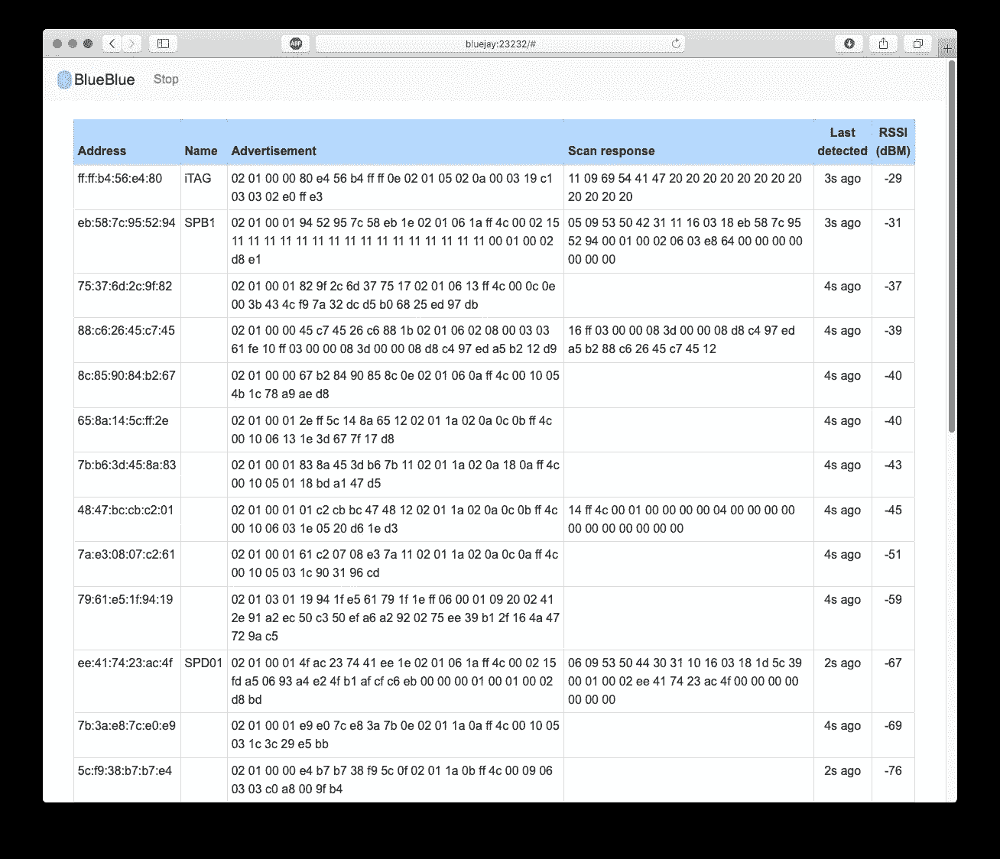

BlueBlue，BLE 洞穴探险的必备工具

实际的代码只有几行代码，但是为了可视化和可用性，我构建了一堆其他的东西。我们来快速看一下扫码。

这是`scan`函数，它无限循环地扫描 BLE 广告，只要我没有通过设置`stop`变量为真来停止它。这是一个派生的 goroutine，可以无限期运行。使用的主要函数是`ble.Scan`，它接受一个处理函数，每次检测到 BLE 广告时都会调用这个函数。

每次检测到广告，我都会创建一个`Device` struct 来存储它，然后添加到一个 Go map 中，以地址为键，以 struct 为值。这有效地创建了在我的扫描仪(我可信赖的 Pi4)附近发现的所有 BLE 设备的地图。

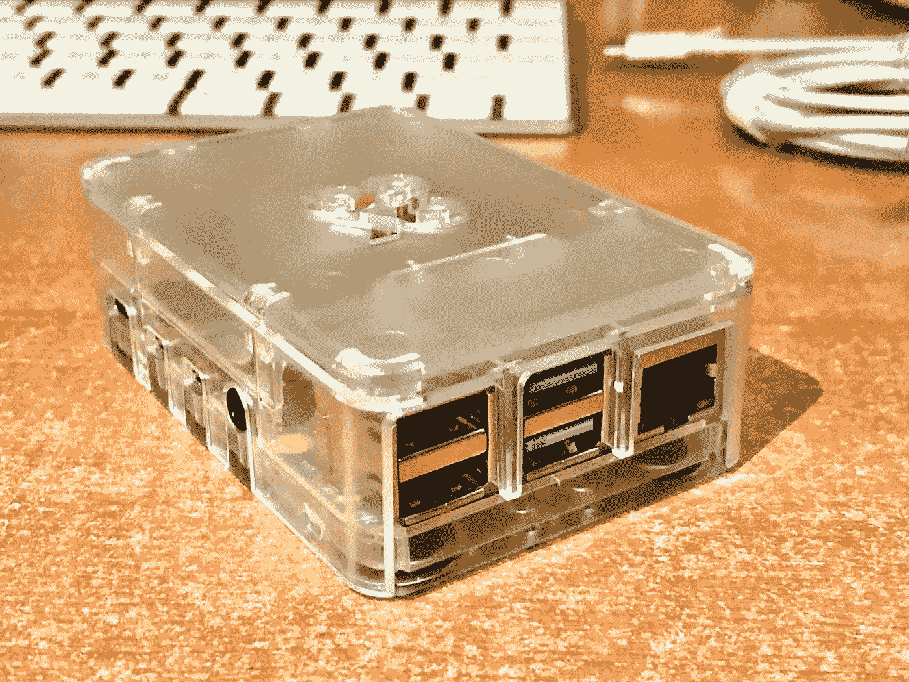

我信任的 Pi4

我使用的 map 不是并发安全的，所以我在写入它之前使用一个`sync.RWMutex`来锁定它(并在我完成之后解锁它)。这是为了防止竞态条件，竞态条件只会使应用程序崩溃。

之后，我简单地将这张地图显示为网页，然后每秒刷新一次页面。

其余的代码简单地包装它，在 Go web 应用程序中显示找到的设备列表。它没什么特别的，但是它很好用。

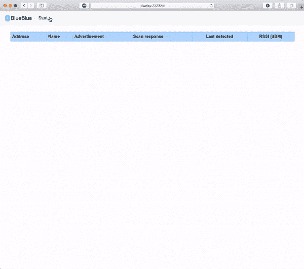

BlueBlue 在行动

请注意广告和扫描响应八位字节，这些是我们稍后将深入研究的数据。你可能还会注意到，我在下面使用的数据与截图中的数据并不完全一致，这是因为数值发生了变化，而且我也使用了不同的设备。

如果你对完整的 BlueBlue 代码感兴趣，你可以在 https://github.com/sausheong/blueblue 找到它。

# 接近信标

邻近信标是 BLE 设备的常见应用。邻近信标是一种小型设备，它不断地向附近(因此是邻近的)接收器广播有限的一组数据。BLE 非常适合这一点，因为它是低能耗、低成本的。邻近信标的一些常见用途包括邻近营销(位置敏感的目标营销)、资产跟踪、室内导航和最近的(与新冠肺炎作战)、联系追踪和社交距离。

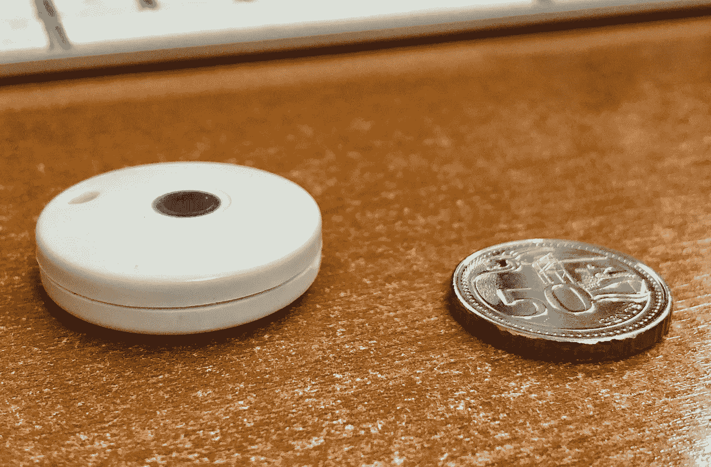

一个简单的 BLE 灯塔(显示在一枚新加坡 50 美分硬币旁边)

它们是最简单的 BLE 设备之一，非常适合第一次洞穴探险。因为我的项目，我们买了一些接近信标来玩，我有一个样品。

让我们戴上洞穴潜水头盔，直接跳入水中吧！

## 广告

BLE 的广播数据将在`ble`包中触发一个事件，我们可以用我们的处理程序捕获这个事件。`HCI_LE_Advertising_Report`事件表示一个或多个设备已响应主动扫描或在被动扫描期间广播了广告。这是从 BlueBlue 获取的 LE 广告报告事件的原始数据。

```
02 01 00 01 94 52 95 7c 58 eb 1e 02 01 06 1a ff 4c 00 02 15 fd a5 06 93 a4 e24 fb 1a fc fc 6e b0 00 0 00 6b 00 01 00 02 d8 c2
```

这是一串十六进制数字，现在看起来毫无意义，让我们来分解一下。将你的蓝牙核心规范(当然是象征性的)翻到第 4 卷，E 部分(主机控制器接口功能规范)，7.7.65.2 部分。对于我正在使用的 5.2 版规范，这应该在第 2382 页。这非常清楚地告诉我们这个事件的形式。

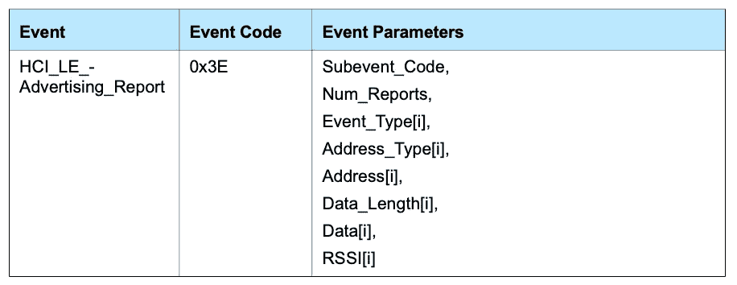

从规格可以看出:

*   `02`—`HCI_LE_Advertising_Report`事件的子事件代码
*   `01`——报告数量
*   `00` —事件类型，可连接和可扫描的无向广告(`ADV_IND`)
*   `01` —地址类型，随机设备地址
*   `94 52 95 7c 58 eb` —地址(`eb:58:7c:95:52:94`)
*   `1e` —数据长度(十进制 30)
*   `02 01 06 1a ff 4c 00 02 15 fd a5 06 93 a4 e2 4f b1 af cf c6 eb 00 00 00 6b 00 01 00 02 d8` —有效载荷、广告数据
*   `c2` — RSSI(十进制 194，`194 - 256 = -62 dBM`)

第一个八位字节`0x02`是`HCI_LE_Advertising_Report`的子事件代码，因此这是一个固定代码。报告的数量通常为 1，但如果有多个报告，则其余字段会重复。在这种情况下，这个信标只有 1 个，所以很简单。

事件类型有 4 种不同的可能值，通常指定设备是否可以连接，广告是否是定向的，以及广告是否是扫描响应。在这种情况下，这里的代码(`0x01`)告诉我们，我扫描的信标可以连接到，广告是无向的(`ADV_IND`)。

接下来是地址类型，它可以是 4 个不同值中的一个，它们都是指设备的地址。不同的类型是指地址是否固定:

*   公共设备地址(`0x00` )—向 IEEE 注册的全球固定地址，永不改变
*   随机设备地址(`0x01` ) —每次设备启动时生成的随机数，或者在设备的整个生命周期内保持不变的随机数。
*   私有可解析地址(`0x02` ) —由身份解析密钥和随机数生成的地址，可以经常更改以避免设备被识别和跟踪
*   私有不可解析地址(`0x03` )—只是一个随机数(不常用)

在这个信标的例子中，它只是一个由制造商分配的私有地址。这也是最常见的值。

接下来的 6 个二进制八位数是地址本身，但是是反过来的(`94 52 95 7c 58 eb`)。蓝牙规范规定数据以小字节顺序传输，所以你应该对此有很多期待。

其后是描述有效载荷数据长度的八位字节。有效载荷最多可以是 31 个八位字节(或`0x1f`)。在这个信标的情况下，它是 30 个八位字节的`0x1e`。

接下来的 30 个八位字节当然是有效载荷，也就是广告数据本身。我们稍后将讨论这个问题，但让我们看看最后一个八位字节，它是 RSSI(接收信号强度指标)。

这是对近距离信标最有用的值，因为这是我们将用来转换为距离的值。值的范围在-127 dBM 到 20 dBM 之间，但一般来说大多在-95 到-30 dBM 之间。在这种情况下，我们有十进制的 194。我们只需要从中减去`0xff`或 256，得到-62 dBM。

## 广告有效载荷

广告有效载荷是我们所追求的。通常，格式是这样的:

*   第一个八位字节—长度
*   第二个八位字节—广告数据类型
*   广告的其余部分(根据长度)是实际数据

广告数据类型指定广告中的数据类型。在通用接入模式(GAP)蓝牙网站的[中可以找到可能的值列表。](https://www.bluetooth.com/specifications/assigned-numbers/generic-access-profile/)

在有效载荷中可以有几个广告。让我们看看这里的这个:

```
02 01 06 1a ff 4c 00 02 15 fd a5 06 93 a4 e2 4f b1 af cf c6 eb 00 00 00 6b 00 01 00 02 d8
```

我们来分解一下。第一套是:

*   `02` —长度(2 个八位字节)
*   `01` —广告数据类型为标志
*   `06` —二进制为`110`的旗帜

这些标志可在蓝牙核心规范的[附录中找到(此处使用版本 7)。](https://www.bluetooth.com/specifications/bluetooth-core-specification/)

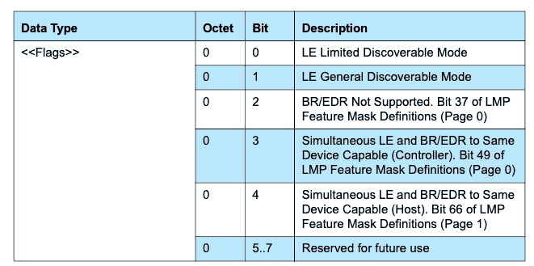

蓝牙核心规范第 7 版(第 12 页)附录中的标志

在我们的例子中，`110`表示它处于 LE 通用可发现模式，不支持 BR/EDR(即经典蓝牙)。

第二套是:

*   `1a` —长度(26 个八位字节)
*   `ff` —广告数据类型是制造商特定的数据
*   `4c 00 02 15 fd a5 06 93 a4 e2 4f b1 af cf c6 eb 00 00 00 6b 00 01 00 02 d8` —制造商特定数据

特定于制造商的数据广告数据类型正如它所说的那样，由制造商来定义该数据是什么。然而，前 4 个八位字节应该是由蓝牙 SIG(特殊兴趣组)分配的[公司标识符。在这种情况下`0x004C`(是的，它是反过来的)是苹果的公司标识符。](https://www.bluetooth.com/specifications/assigned-numbers/company-identifiers/)

这就是有趣的地方。当然，苹果生产的许多产品都有蓝牙功能。但是在 [iBeacon 规范](https://developer.apple.com/ibeacon/)中，我们知道如果接下来的 2 个八位字节是`0x0215`，那么它遵循 iBeacon 规范。当然，你可以看到确实如此。

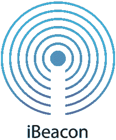

让我们稍微转换一下思路，跳到 iBeacon 格式。iBeacon 格式非常简单，只有 4 段数据:

*   邻近 UUID (16 个八位字节)
*   主号码(2 个八位字节)
*   次要编号(2 个八位字节)
*   测量功率(1 个八位字节)

在这种情况下，我们发现接下来的 16 个八位字节是近似 UUID `fd a5 06 93 a4 e2 4f b1 af cf c6 eb 00 00 00 6b`，接下来的 2 个八位字节是主要数字`00 01`，接下来的 2 个八位字节是次要数字`00 02`，最后一个八位字节是测量功率`d8`或十进制的 216。

如果你认为邻近 UUID 是用来唯一识别(毕竟 UUID 的意思是全球唯一标识符)的信标，那么你会惊讶地发现，它实际上是相反的。为特定部署(或客户)部署的所有 iBeacons 应该是相同的！这是由 iOS 本身强制执行的，除非您知道 UUID，否则不允许您扫描信标。具有讽刺意味的是，虽然 iOS 不允许你访问 iBeacon UUID，但你可以使用其他任何东西访问它，只要你能获得制造商的具体数据！

那么我们怎样才能唯一地识别信标呢？建议的方法(因为苹果不能强迫开发者)是[使用主要和次要号码](https://developer.apple.com/ibeacon/Getting-Started-with-iBeacon.pdf)。诚然，这不是一个坏主意，因为仅用次要编号中的 2 个二进制八位数，您就可以部署 2 个⁶ = 65，536 个设备！如果将这两者结合在一起，就是 2 = 4，294，967，296 或大约 42 亿台设备。

但是等等。还有更多。

## 扫描响应

BLE 设备也可以通过回复扫描响应来响应扫描请求。扫描响应包含广告数据之上的附加数据。虽然不是所有的 BLE 设备都有扫描响应，但在我们的例子中，信标发送了一个，我们也在 BlueBlue 上捕捉到了它。

```
05 09 53 50 42 31 11 16 03 18 eb 58 7c 95 52 94 00 01 00 02 06 03 e8 64 00 00 00 00 00 00 00
```

幸运的是，这种格式与广告数据非常相似——第一个八位字节是长度，接下来是数据类型，然后是数据本身。让我们来分解一下我们的扫描响应。

*   `05` —长度(5)
*   `09` —类型是完整的本地名称
*   `53 50 42 31`—“sp B1”(ASCII)
*   `11` —长度(十进制 17)
*   `16` —类型是服务数据(16 位 UUIDs)
*   `03 18 eb 58 7c 95 52 94 00 01 00 02 06 03 e8 64 00 00 00 00 00 00 00` —服务数据

因为类型是具有 16 位 UUID 的服务数据，所以服务 UUID 是前 2 个八位字节，即`0x1803`(是的，它再次被颠倒)，并且服务的剩余数据是`eb 58 7c 95 52 94 00 01 00 02 06 03 e8 64 00 00 00 00 00 00 00`。

那么，您能对服务数据做些什么呢？首先，服务数据的前 2 个八位字节是 16 位服务 UUID(如所示类型)，即`0x1803`。如果您查看蓝牙 SIG 的 [GATT 服务列表](https://www.bluetooth.com/specifications/gatt/services/)，您可能会注意到这是链路丢失服务。

然而，这个信标并没有真正的链接丢失服务，它只是一个便宜的信标，花费几美元，我们从中国制造商那里买的。制造商基本上使用这个服务 UUID，但是存储不同的数据。至于是什么样的数据，这个是来自厂商的数据表。

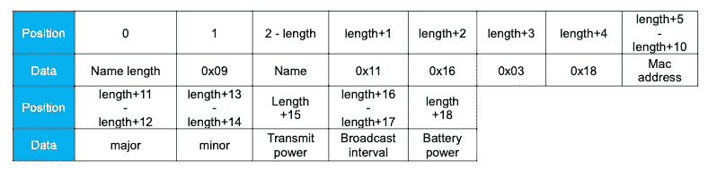

*   `eb 58 7c 95 52 94`——这是信标的地址，但令人惊讶的是这不是反过来的(我不知道为什么)！
*   `00 01` —这是主要编号(来自 iBeacon 格式)
*   `00 02` —这是次要编号(也来自 iBeacon 格式)
*   `06` —这是发射功率(在另一个表中)表示发射功率为 0 dBM
*   `03 e8` —这是以毫秒为单位的广播间隔(十进制 1，000)。因此这意味着广播间隔为 1 秒
*   这是电池电量(十进制 100)，我想这意味着电池电量仍然是 100%(我才用了几个星期)
*   `00 00 00 00 00 00 00` —我假设剩下的只是填充符

没那么糟糕。有大量的数据，我们学到了很多关于信标的知识。让我们看看别的。

# 资产标签

市场上有一种特殊的设备，只需几美元，就可以用来追踪或标记你的物品。如果你放错了地方，你可以用这个标签找到它。你能用它的东西包括车钥匙，钱包，甚至宠物和孩子！这背后的想法是，如果你标记的东西丢失了，你只需使用手机上相应的应用程序，让它大声发出哔哔声。反过来也可以，标签上有一个按钮，当你按下时，手机会发出声音。它可以非常方便。

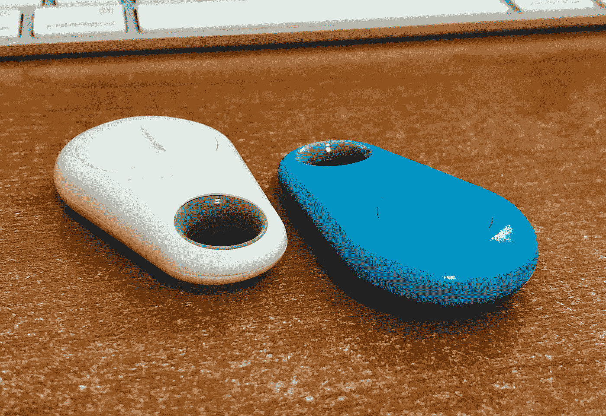

我的 iTags(鸣谢张秀雄)

## 广告

在第一次潜入信标后，这应该更熟悉了。这是乐广告报道播出的广告:

```
02 01 00 00 80 e4 56 b4 ff ff 0e 02 01 05 02 0a 00 03 19 c1 03 03 02 e0 ff be
```

让我们经历同样的分解。

*   `02`—`HCI_LE_Advertising_Report`事件的子事件代码
*   `01` —报告数量
*   `00` —事件类型，可连接和可扫描的无向广告(ADV _ 印度)
*   `00` —地址类型是公共设备地址
*   `80 e4 56 b4 ff ff` —地址(反过来，地址是`ff:ff:b4:56:e4:80`)
*   `0e` —数据长度(十进制 14)
*   `02 01 05 02 0a 00 03 19 c1 03 03 02 e0 ff` —广告
*   `be` — RSSI(十进制 190，190–256 =-66 dBM)

前 3 个二进制八位数应该很熟悉。地址类型是公共地址，这意味着它应该是固定地址。现在我们来看地址(`ff:ff:b4:56:e4:80`)。如果您查看地址的 U/L 位[，第一个八位字节的第二个最低有效位(LSB)是 1](https://medium.com/swlh/scanning-for-mobile-devices-through-wi-fi-using-pi-zero-w-8099be08cc1e) (第一个八位字节是`0xFF`，因此它们都是 1)，这意味着这是一个 LAA，这意味着它实际上不是一个由 IEEE 管理的范围。

数据长度不言自明，RSSI 的计算方法与上面相同，为-66 dBM。现在我们来看看广告数据。

## 广告有效载荷

这是来自广播广告的广告有效载荷。

```
02 01 05 02 0a 00 03 19 c1 03 03 02 e0 ff
```

让我们像以前一样分解它，从第一盘开始。

*   `02` —数据长度(2)
*   `01` —广告数据类型为标志
*   `05` —标志以位为单位，所以翻译成二进制就是(0101)。由此我们可以看出这是 LE 受限发现模式，BR/EDR 不支持。

让我们继续下一盘。

*   `02` —数据长度(2)
*   `0a` —广告数据类型为发射功率电平(TX 功率电平)
*   `00` —这是发射功率水平的值(0)。有了这个值，你可以计算路径损耗(或路径衰减)。计算路径损耗的公式为:

```
path loss = Tx Power Level - RSSI
```

在我们的例子中，这将是:

```
path loss = 0 - (-66) = 66 dB
```

这是下一组。

*   `03` —数据长度(3)
*   `19` —广告数据类型为外观
*   `c1 03` —(十进制 961)通过与 GATT 特征的核对，我们可以看到所列的外观是键盘的外观

我们现在到了最后一盘。

*   `03` —数据长度(3)
*   `02` —广告类型为 16 位服务 UUID 不完整列表
*   `e0 ff` —这是 16 位服务 UUID 值

“不完整列表”的广告类型实质上意味着该服务 UUID 仅仅是可用的少数服务之一。然而，制造商选择不广播全部内容(出于各种原因，主要是为了节省电池电量)。如果你想知道其他人，你可以连接到设备上找到答案。

## 扫描响应

iTAG 也发送扫描响应。

```
11 09 69 54 41 47 20 20 20 20 20 20 20 20 20 20 20 20
```

答案非常简单

*   `11` —数据长度(17 位)
*   `09` —类型是完整的本地名称
*   `69 54 41 47 20 20 20 20 20 20 20 20 20 20 20 20` —这是 ASCII 中的“iTAG”，后面跟着一串空格

这些都在扫描响应中。

这看起来很短，实际上大多数有趣的行为只发生在我们连接的时候。我在这里不讨论如何连接到它，那将是另一个故事，所以让我们看看别的东西。

## 苹果铅笔

在我测试 BlueBlue 的时候，碰巧我的 Apple Pencil 也在附近，有趣的是，当我开始使用这支铅笔时，它就出现了。也就是说，当我拿起它使用时，它就开始做广告了。


我的苹果铅笔 1

但是它没有扫描响应。这是广告。

## 广告

现在我们已经用两种不同的设备做了两次，这应该很快。

```
02 01 00 01 e2 1e 4d 3c a8 48 1e 02 01 06 1a 09 41 70 70 6c 65 20 50 65 6e 63 69 6c 00 00 00 00 00 00 00 00 00 00 00 00 00 e4
```

*   `02`—`HCI_LE_Advertising_Report`事件的子事件代码
*   `01` —报告数量
*   `00` —事件类型，可连接和可扫描的无向广告(ADV_IND)
*   `01` —地址类型为随机设备地址
*   `e2 1e 4d 3c a8 48` —地址(反过来，地址是`48:a8:3c:4d:1e:e2`)
*   `1e` —数据长度(十进制 30)
*   `02 01 06 1a 09 41 70 70 6c 65 20 50 65 6e 63 69 6c 00 00 00 00 00 00 00 00 00 00 00 00 00` —广告
*   `e4` — RSSI(十进制 228，228–256 =-28 dBM，我把它举得离我的 Pi4 很近)

## 广告有效载荷

这是来自广播广告的广告有效载荷。

```
02 01 06 1a 09 41 70 70 6c 65 20 50 65 6e 63 69 6c 00 00 00 00 00 00 00 00 00 00 00 00 00
```

让我们像以前一样分解它，从第一盘开始。

*   `02` —数据长度(2)
*   `01` —广告数据类型为标志
*   `06` —标志以位为单位，所以翻译成二进制就是(`0110`)。由此我们可以看出这是 LE 通用可发现模式，BR/EDR 不支持。

让我们继续下一盘。

*   `1a` —数据长度(26)
*   `09` —类型是完整的本地名称
*   `41 70 70 6c 65 20 50 65 6e 63 69 6c 00 00 00 00 00 00 00 00 00 00 00 00 00` —这个简单的单词写着“Apple Pencil ”,后面跟着许多`00`

我用我的第一代 Apple Pencil 和第二代 Apple Pencil 都试过这个，它只在第一代上有效。一个有趣的观察——每次 Apple Pencil 被激活(通过移动它或将其 Lightning 连接器连接到 Lightning 端口)，它都会广播一个不同的地址！每次我把 Lightning 连接器插到 Lightning 端口上，BlueBlue 都会弹出一个新的 Apple Pencil，这总是让我笑破肚皮。

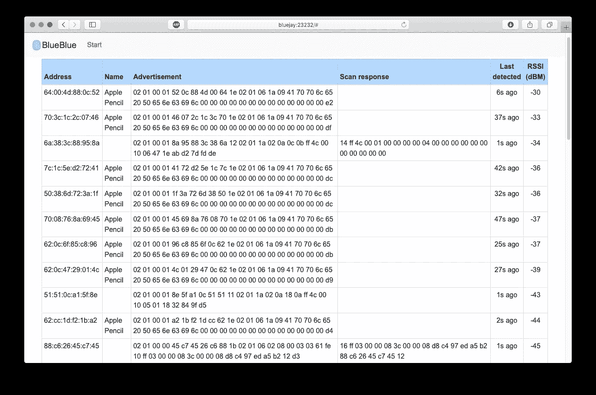

# 欧姆龙 7 系列腕带血压计(型号 BP654)

我不会深入探讨程序员和高血压之间的关系，但是如果你正在阅读这篇文章，你可能知道这是真的。所以毫不奇怪，我碰巧附近有一个也触发了蓝蓝。

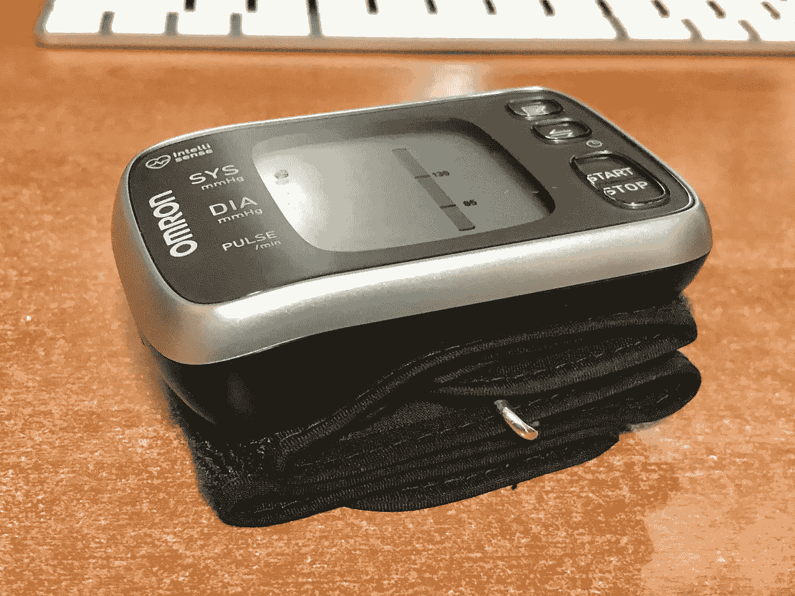

我的血压计(鸣谢:张秀雄)

实际上，血压计只会在按下数据传输按钮时发出广告。

## 广播广告

让我们看看广播广告。这是从 BlueBlue 捕捉到的。

```
02 01 00 01 00 d0 7a 08 07 d1 18 02 01 06 11 06 1b c5 d5 a5 02 00 bd b1 e1 11 a2 c9 80 39 be ec 02 0a 00 bf
```

这种崩溃不足为奇。

*   `02`—`HCI_LE_Advertising_Report`事件的子事件代码
*   `01` —报告数量
*   `00` —事件类型，可连接和可扫描的无向广告(ADV_IND)
*   `01` —地址类型为随机设备地址
*   `00 d0 7a 08 07 d1` —反向地址(`d1:07:08:7a:d0:00`)
*   `18` —数据长度(十进制 24)
*   `02 01 06 11 06 1b c5 d5 a5 02 00 bd b1 e1 11 a2 c9 80 39 be ec 02 0a 00` —广告有效载荷
*   `bf` — RSSI(十进制 191，191–256 =-65 dBM)

## 广告数据

好了，让我们更深入地了解广告有效载荷。

*   `02 01 06` — ( `0110` ) — LE 通用可发现模式，不支持 BR/EDR。
*   `11` —数据长度(十进制 17)
*   `06`—128 位服务 UUIDs 的不完整列表
*   `1b c5 d5 a5 02 00 bd b1 e1 11 a2 c9 80 39 be ec`—128 位服务 UUID

我们再次看到了一个不完整的服务 UUID。就像之前一样，这告诉我们，如果我们连接，会有更多的服务可用，这只是其中之一。但是 16 位和 128 位的服务 UUIDs 有什么区别呢？

当然，16 位服务 UUIDs 更短，正因为如此，它节省了传输它们的功率(这也是为什么不是所有的服务都被广告的原因)。蓝牙 SIG 有一个官方 16 位服务 UUIDs 列表，你可以付费为自己或公司创建一个。

*   `02` —数据长度
*   `0a` —发射功率水平
*   `00` —发射功率电平为 0

## 扫描响应

由此得到的扫描响应非常简单，本质上只是设备的名称。

```
1e 09 42 4c 45 73 6d 61 72 74 5f 30 30 30 30 30 31 31 39 31 31 30 37 30 38 37 41 44 30 30 30
```

*   `1e` —数据长度(十进制 30)
*   `09` —类型是完整的本地名称
*   `42 4c 45 73 6d 61 72 74 5f 30 30 30 30 30 31 31 39 31 31 30 37 30 38 37 41 44 30 30 30` —翻译为“BLEsmart_000001191107087AD000”

仅此而已。

# 很有趣！

在过去的几周里，我看到了以前从未见过的东西，这给了我一种奇怪的惊奇和发现的感觉。你应该试试！