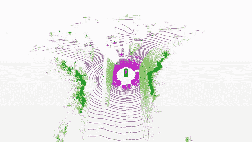
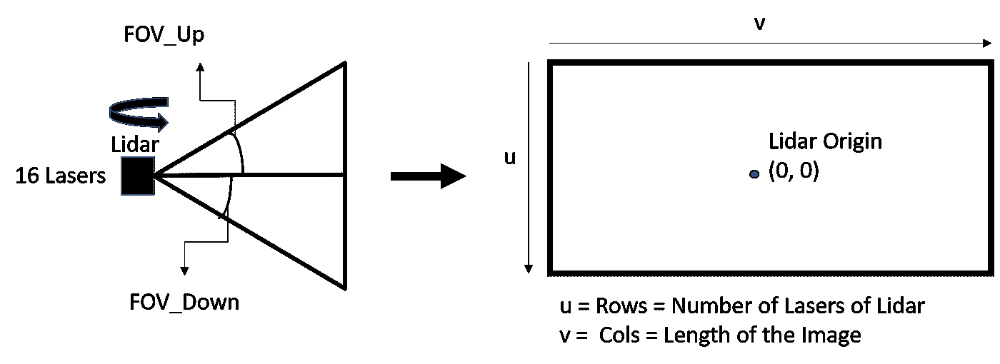
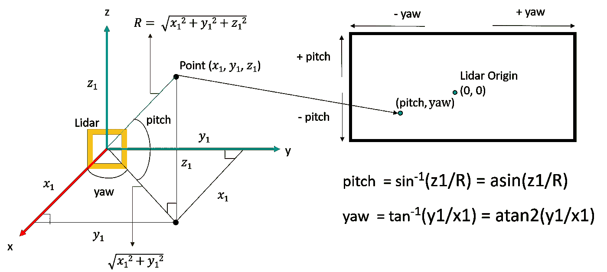
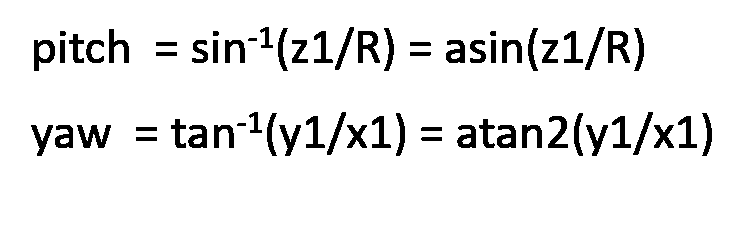
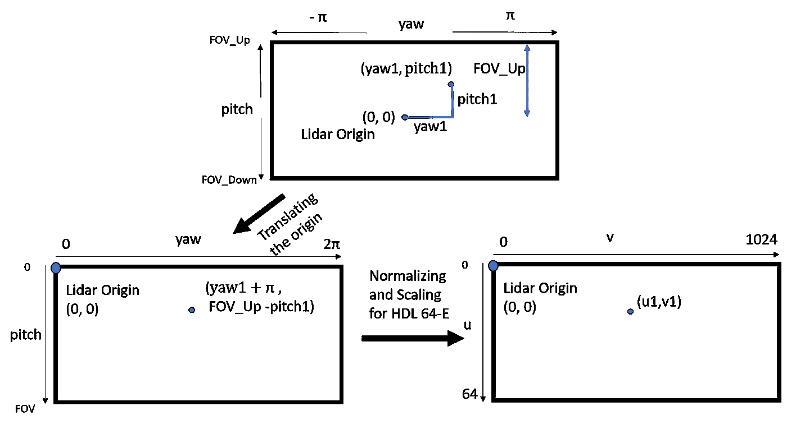
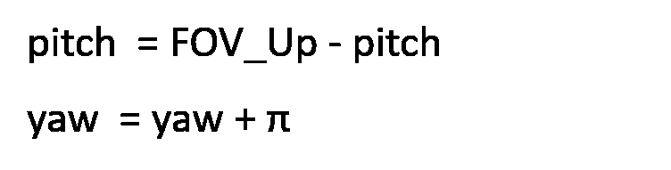
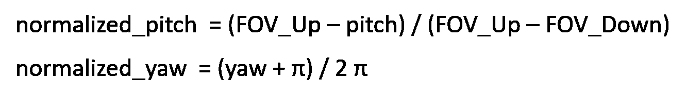
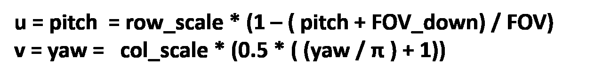
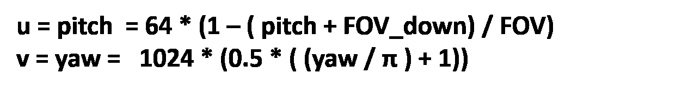
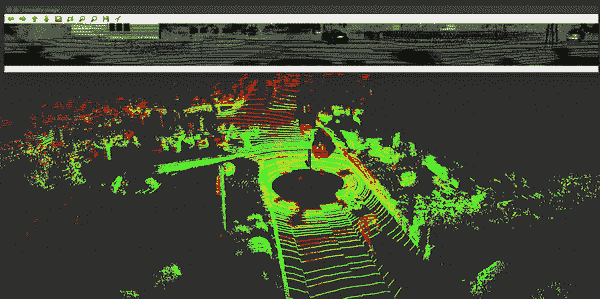

# 点云的球面投影

> 原文：<https://towardsdatascience.com/spherical-projection-for-point-clouds-56a2fc258e6c?source=collection_archive---------8----------------------->

大家好，这是我的第一个媒体帖子，我希望让大家参与到最后。在这篇文章中，我将谈论如何使用球面投影将 3D 点云投影到图像中。我也写了同样的代码，可以在我的 GitHub 库[这里](https://github.com/anirudhtopiwala/OpenSource_Problems/tree/master/Spherical_View_Projection)找到。所以让我们开始吧！！！

球形投影或前视图投影只不过是将 3D 点云数据表示成 2D 图像数据的一种方式，因此本质上，它也充当降维方法。球面投影越来越多地用于不同的深度学习解决方案中，用于处理点云。

语义分割(作者: [SemanticKitti](http://semantic-kitti.org/)

应用最广泛的领域之一是对点云中的物体进行分类和分割。这可以在各种出版物中看到，如 [PointSeg](https://arxiv.org/abs/1807.06288) 、[squeeze g、](https://arxiv.org/abs/1710.07368) [SalsaNet](https://www.groundai.com/project/salsanet-fast-road-and-vehicle-segmentation-in-lidar-point-clouds-for-autonomous-driving/1) 等等。将点云表示为图像的最大优点是，它将过去十年中对 2D 图像所做的所有研究都开放给了 3D 点云。例如，不同的最先进的网络，如 [FCN](https://people.eecs.berkeley.edu/~jonlong/long_shelhamer_fcn.pdf) 、 [U-Net](https://arxiv.org/abs/1505.04597) 、 [Mask-RCNN](https://arxiv.org/abs/1703.06870) 、[和 fast-RCNN](https://arxiv.org/abs/1506.01497)现在可以扩展到点云数据，这是许多研究人员正在努力实现的目标，特别是在自动驾驶领域。

# **直观解释**

为了理解这一点，让我们深入了解激光雷达是如何形成一点云扫描的。让我们考虑下图所示的 16 激光雷达的情况。

左图显示了由 16 个激光器组成的激光雷达。由激光雷达的第一个和最后一个激光器形成的最大和最小视角由 FOV _ 上和 FOV _ 下指示。右边的矩形是当我们将激光雷达形成的空心圆柱体投影到平面上时得到的。(作者:阿尼鲁德·托皮瓦拉)

16 个激光器中的每一个都以固定的角度定向，这取决于垂直角分辨率，FOV _ 上(上部视场)和 FOV _ 下(下部视场)。每个激光雷达都有一个发射和接收单元。这些点是通过计算每个激光从物体反射后的飞行时间而形成的。这 16 束激光旋转 360 度形成一个点云。

> 因此，这将导致的几何形状是一个**空心圆柱体**，激光雷达位于其中心。当我们从一个垂直于圆柱体主轴的轴将这个空心圆柱体投影到一个平面上时，我们得到一个图像。这种图像称为球面投影图像。

# **现在让我们用一些数学来解决技术问题吧！！**

(作者:阿尼鲁德·托皮瓦拉)

我们的目标是找到所有(x，y，z)点的投影图像的像素坐标。这可以通过使用[球面坐标系](https://en.wikipedia.org/wiki/Spherical_coordinate_system)来实现。看上图，我们可以看到，如果+ive x 轴是激光雷达的前视图，那么云的每个点都会与 xy 平面形成一个倾角*角度* **，*俯仰*** 和*角度* ***，偏航*** 与 xz 轴。这里我们要把空心圆柱体投影到 zy 平面上形成图像。利用基本的三角学，我们可以得到每个点的俯仰和偏航值。由于原点位于图像的中心，这些偏航和俯仰值构成了投影图像的每个像素位置。因此，通过计算每个点的偏航和俯仰，我们可以完整地形成投影图像。在这一点上，我还想指出，俯仰值的范围将从[FOV 向上，FOV 向下]，因为它是激光指向的最大和最小角度，偏航值的范围将从[-π，π]，因为这是由 atan2 函数给出的范围。

虽然我们现在有了投影图像，但是由于两个问题，我们仍然不能使用它。首先，我们需要将原点平移到图像的左上角，如下所示。这是因为，在计算机视觉中，标准是原点在图像的左上角。第二，我们需要根据使用的激光雷达的类型来缩放图像。这两个步骤如下所示:

(作者:阿尼鲁德·托皮瓦拉)

## 1.翻译原文

这是一个简单的翻译起源问题。查看上图，我们可以通过向偏航轴添加π角来将原点移动到图像的左边缘，而通过从 FOV_Up 中减去俯仰角来将原点移动到图像的顶部。因此，新方程变成:

## 2.标准化和缩放

> 这一步骤是必要的，因为对于不同类型的激光雷达，投影图像的大小会有所不同，主要目的是在投影图像中拟合尽可能多的点。

正如我们在这篇博文中观察到的，整个过程是关于降维的，因此，我们会丢失数据是事实。这里的想法是以这样一种方式形成图像维度，即我们能够从图像中的云中捕捉最相关的点。因此，我们可以从逻辑上看到，激光雷达的**个激光应该相当于投影图像的宽度**。这样，图像的每一行将与从激光雷达的每个激光器获得的点相关。该值称为 row_scale 因子，乘以归一化的俯仰轴。例如，[威力登 HDL 64-E 激光雷达](https://velodynelidar.com/products/hdl-64e/)有 64 个激光器，因此，投影图像的宽度应该通过将该值乘以俯仰轴来设置为 64。

**图像的长度构成了偏航角分辨率。该参数可以调整以适应尽可能多的点**。图像的这个长度也称为 col_scale，乘以归一化的偏航轴，得到最终的图像尺寸。同样，对于 HDL 64-E，最大水平分辨率为 0.35 度。因此，在最坏的情况下，我们将至少得到每个激光器(360/0.35 = 1028)个点。在深度学习和卷积网络中，图像大小优选为 2 的幂。因此，1024 的长度将适合图像中的最大点数，我们将把这个值乘以偏航轴。

因此，64X1024 的图像尺寸对于 HDL 64-E 来说是理想的。可以对[威力登 VLP-16](http://velodynelidar) 进行类似的计算，其中最佳图像尺寸为 16x1024。

归一化等式现在可以重写为:

如果总的 FOV = FOV _ 上+ABS(FOV _ 下)，那么(u，v)的最终方程通过一些值的重新排列可以写成:

对于威力登 HDL 64-E 激光雷达，同样的方程可以改写为:

> 这样，借助上面的方程，我们就可以把云的每个点(x，y，z)投影到它对应的球面投影(u，v)上。

# 将点信息编码到图像中

一旦我们获得了云的每个点的(u，v)像素，我们需要对其进行舍入以获得最接近的整数，并将点信息编码到其中。通常，在每个像素处添加 5 个关键值，即 X、Y、Z、R 和 I。这里，(X，Y，Z)是点的坐标，R 是该点与激光雷达的欧氏距离或范围，I 是强度。Range 是我们计算的唯一值，因为对于激光雷达形成的云的每个点，X、Y、Z 和 I 值已经存在。因此，我们得到的最终图像尺寸是:

> **图像尺寸=激光雷达的激光数量*投影图像的长度* 5(五个通道是 X、Y、Z、R、I)**

# 现在是你期待已久的部分..结果！！！

使用上面得到的公式，我写了一个 c++代码，可以在这里找到。这段代码使用 [PCL](http://pointclouds.org/) 库来加载点云，使用 [openCV](https://opencv.org/) 来可视化所形成的球面图像的每个维度。为了测试我的实现，我使用了来自 SemanticKitti 的数据集。下面 gif 的上半部分显示了由下半部分显示的点云形成的球形图像的亮度值。

> 概括地说，由于该数据集中使用的激光雷达是威力登 HDL 64-E，形成的球形图像的尺寸是 64 * 1024* 5。

上半部分是形成的球形图像的强度维度，下半部分是输入点云。(作者:阿尼鲁德·托皮瓦拉)

## 一些重要观察结果:

> 1.球形图像的每一行对应于从激光雷达的每个激光器获得的点。这里，图像中最低的一行对应于激光雷达中最低的激光，这是激光雷达附近最近的环，如上面的 gif 所示。
> 
> 2.形成的球形图像本质上是圆形的，这意味着你将能够观察到当物体从左侧离开图像时，它们可能会在图像的右侧重新出现。
> 
> 3.图像中的物体可以用人眼识别。意思是，如果你看图像，很容易区分汽车、自行车、建筑物、道路等等。如果它可以被人眼区分，那么在这样的图像上训练的深度网络就有很大的机会能够给出良好的分割和分类结果。
> 
> 4.此投影中丢失的点是那些与激光雷达中心具有相同俯仰角和偏航角但距离值不同的点。因此，只有连接激光雷达中心和该点的射线上的一个点会在投影图像中被捕获。

结果的清晰视频可以在这里找到[。](https://www.youtube.com/watch?v=1vSI_j435Vs)

## 总之，球面投影是以图像形式表示点云数据的一个非常强大的工具。使用它可以帮助我们将过去十年在图像空间所做的所有研究扩展到点云数据，因此在机器人和自动驾驶汽车领域有着各种各样的应用。

我对这个主题以及计算机视觉和深度学习领域的其他主题的任何建议或头脑风暴会议都持开放态度，所以请随时与我联系[！！！](https://anirudhtopiwala.com/)