# 辛辣的浓缩咖啡:热磨，冷捣以获得更好的咖啡

> 原文：<https://towardsdatascience.com/spicy-espresso-grind-hot-tamp-cold-36bb547211ef?source=collection_archive---------32----------------------->

## 在研磨和准备过程中找到温度技巧，释放美味

多年来，人们已经尝试在研磨咖啡豆之前对其进行预热。他们发现了一些对味道和提取的影响，但不是一个确定的更好的味道。一些人也尝试过冷冻豆子，但是对其中的机制还没有了解。之前的实验都有不足之处，因为它们没有完全捕捉到一个关键变量:温度。

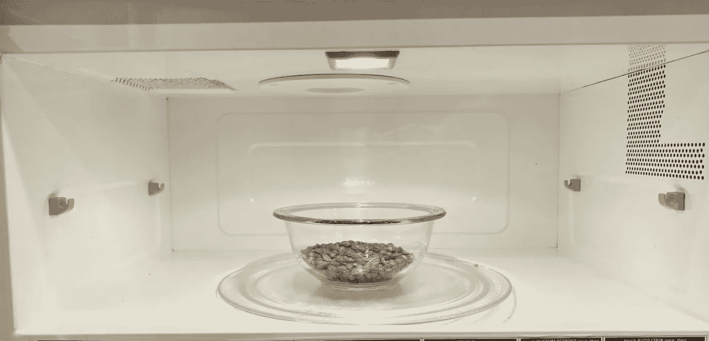

以前的实验没有记录研磨后的温度；他们主要关心的是研磨前的豆子温度。我开始记录研磨前、研磨后和预冲咖啡的温度。我发现在研磨之前预热咖啡豆，如果之后将粉末冷却到室温，会大大提高命中率，这个过程我称之为辛辣研磨。它是辣的，因为它是热的，但不会像辛辣的食物一样留在你的舌头上。我们可以通过冷却冰箱里的粉末来让它变得更有趣。

在这项工作中，我将展示以前的工作和其他有助于这项技术的发现。我相信这很简单，任何人都可以轻松地尝试，我希望他们会找到类似的结果。

# 以前的工作

关于研磨温度，在商用机器中努力保持研磨机冷却，因为已知热研磨机会对咖啡豆产生影响。研磨机越热，研磨出来的东西就越热。这种变化将导致咖啡师不得不整天调整他们的饮料，以适应温度的变化。

关于提取，已经进行的工作表明，较冷的咖啡渣比较热的咖啡渣提取得更多，并且较冷的咖啡渣比较热的咖啡渣流动得更快。通常，咖啡师会通过调整时间、音量或研磨来达到一致性。

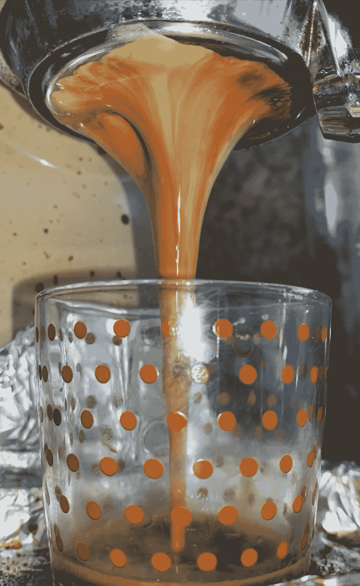

2007 年，一位家庭咖啡师偶然将咖啡豆放在了他温热的咖啡机上，并发现了研磨前预热咖啡豆的影响。他发现浓缩咖啡比没有预热咖啡豆时味道更顺滑。

2019 年， [James Hoffman 在观察了 2015 年](https://www.jameshoffmann.co.uk/weird-coffee-science)[锦标赛](https://sprudge.com/sous-vide-coffee-129649.html)中使用的一种真空罐预热豆子后，尝试了微波加热豆子，认为这一过程可以增加提取量。

2020 年，YouTube 上的[Sprometheus](https://www.youtube.com/watch?v=PnWyAeFh02I)对研磨前冷冻或加热的咖啡进行了多次 TDS 和提取测量。然而，他在拍摄之前没有记录地面的温度，因此他混淆了预研磨温度和预拍摄温度这两个变量。他没有使用无底的过滤器，所以不知道不同的温度是否会导致流量和通道的不同。他的实验是一致的，但是没有发现味觉的巨大变化。

2018 年，复合咖啡研究了[研磨机温度如何影响提取](https://compoundcoffee.com/experiments/30_Experiment-157-Grinder-temperature-and-extrac)，虽然他们的结果无法进行统计显著性测试(样本量< 30)，但他们的结果很有趣。我不是说较小的尺寸不好，但我不认为它们应该用于零假设检验。作者没有用图表表示他们的数据，但为了方便起见，我在下面列出了:左边是未排序的样本，右边是每个样本的最佳提取进行了比较。考虑到每个样本彼此不相关，比较的最佳方式是最好与最好、第二好与第二好。

即使缺少足够大的样品尺寸，结果也表明在研磨机上没有加热元件的情况下提取率更高。然而，这个故事还有更多；复合咖啡还收集了咖啡渣的温度，因此绘制萃取温度与咖啡渣温度的关系图给出了不同的观点。较低的温度似乎可以提供更好的提取，但他们在酿造前没有冷却粉末，所以不知道哪个变量会导致更多的提取。

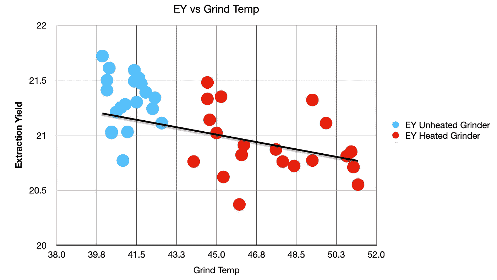

此外，[复合咖啡研究了冷冻咖啡豆对萃取的影响](https://compoundcoffee.com/experiments/25_Does-Grinding-Frozen-Coffee-Bean-Impact-Taste)。他们冷冻咖啡豆，然后磨碎，用几种方法煮出浓缩咖啡。同样，这是一个小样本，但如果我们将它们制成图表并进行分类，那将会非常有趣。

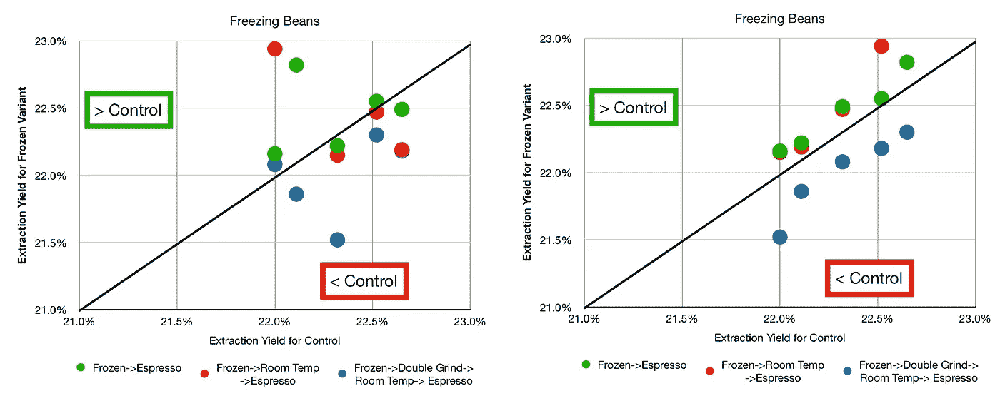

排序后在一个图表上绘制所有样本表明，冷冻对提取有轻微的好处，但不清楚它是否真的有统计学意义或只是一个暂时现象。

# 绩效指标

我使用了两个指标来评估过滤器之间的差异:最终得分和咖啡萃取。

最终得分是 7 个指标(强烈、浓郁、糖浆、甜味、酸味、苦味和余味)记分卡的平均值。当然，这些分数是主观的，但它们符合我的口味，帮助我提高了我的拍摄水平。分数有一些变化。我的目标是保持每个指标的一致性，但有时粒度很难确定。

使用折射仪测量总溶解固体量(TDS ),该数值与咖啡的输出重量和输入重量相结合，用于确定提取到杯中的咖啡的百分比。

# 地面温度的初步调查结果

换了一种新的烤肉后，我发现了冷却研磨的窍门。我磨了 90g 咖啡，立马拉了一个镜头，也没那么爽。提取有相当多的通道和喷雾。出于某种原因，我测量了地面的温度，因为我读到过地面的温度。我拍摄的下一张照片非常好，但唯一的差异是 2.3 摄氏度。第一张照片是在 26 摄氏度，第二张是在 23.7 摄氏度，因此我开始记录拍摄前的地面温度和拍摄前的温度。

## 上午对下午

我很好奇地面温度是否对味道有影响。查看过去一年的所有数据，我没有体温，但我有一天中时间的记录。所以我拿着恒机咖啡、烘焙咖啡和断续(或普通)浓缩咖啡，对比了上午和下午最好的照片。还涉及到其他变量，但这为理论提供了一个有趣的窗口，即下午的地面比早上更温暖，因此拍摄也不会提取。在过去一年的大部分镜头中，我的研磨和酝酿之间有一段时间让研磨物冷却。

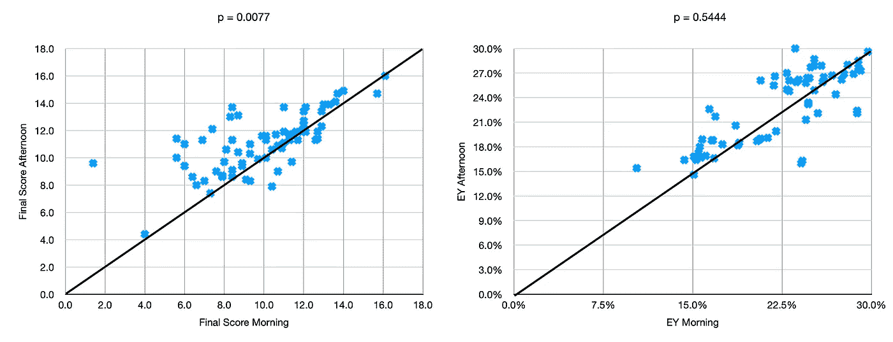

至少根据我的数据，我下午的投篮更好。我怀疑这是由于温度差异，但变量没有被跟踪，所以它是未知的。

# 实验

我计划做这个咖啡豆加热[实验](https://towardsdatascience.com/@rmckeon/coffee-data-sheet-d95fd241e7f6)已经有一段时间了，有了合适的避难所，我有时间和耐心，因为我知道测试会很长。我对新测试的疑问总是这样的技术是否会改善拍摄，是否会改善我最好的拍摄，即[断奏咖啡拍摄](https://medium.com/overthinking-life/staccato-espresso-leveling-up-espresso-70b68144f94)。

**辣磨**:微波至 60C 左右，立即研磨，静置至室温。我这样做是没有计划的。我通常会研磨咖啡，然后过一段时间再冲泡，因为通常我会筛滤咖啡来制作一个断续的镜头。我所有的咖啡渣都储存在密封的容器里，我没有发现用这种方式研磨会降低质量，尽管这与普通咖啡的想法相反。我没有足够大的数据集来知道预热咖啡豆的最佳温度。

我叫它辣磨是因为和辣一样，刚开始是辣的，放在柜台上慢慢凉下来。目的是不使用磨床上的热磨粒。

# 加热豆类预研磨

关于加热豆，以前的工作没有分开温度，所以我有。我用微波炉将咖啡豆加热到 60 到 90 度。然后我用研磨机研磨它们，我让咖啡豆在密封的罐子里冷却到室温。我用了一辆金快车来拉镜头。

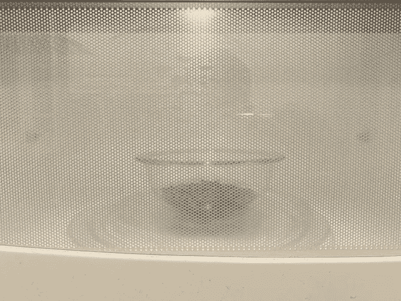

此外，我测量了拉后的温度，并在拉后四分钟喝了酒。我在喝酒前搅拌一下，以确保没有东西沉淀下来。我发现等几分钟让饮料冷却会改善味道，在这些实验完成后，我会让饮料冷却到相同的温度，而不是设定的时间。

为了准备拍摄，我做了一个[的断奏浓缩咖啡](/staccato-tamping-improving-espresso-without-a-sifter-b22de5db28f6)镜头，中间有一个[纸过滤器](/the-impact-of-paper-filters-on-espresso-cfaf6e047456)。我用纸过滤器(PFF)在精细层和粗糙层之间做了一些断续的浓缩咖啡照片。我知道这些镜头比普通的浓缩咖啡镜头更复杂，但它们都比普通镜头好。这种温度处理减少了断续捣实浓缩咖啡和断续浓缩咖啡之间的味道差异。

关于准备的最后一点，我没有把便携式过滤器放入机器，直到我拉起镜头之前，这样机器的温度将在提取之前最低限度地提高咖啡渣的温度。

我目前的数据集涵盖了三次烘烤，我发现味道有了很大的改善。然而，我没有显示统计显著性所需的样本数量，因为我只有不到 30 个。似乎并不依赖于投入产出比。

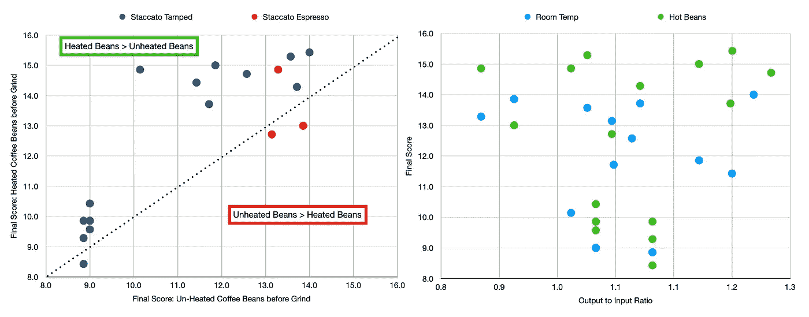

从提取上来说，更高的提取和辣磨似乎没有什么联系。两种分布都是相互混合的。对于输出与输入的比率，提取已经非常高了。对于更高的比率，还有第二组提取数字，这是因为我完成了第一次 1:1 拍摄，然后我加权并测量第二位出来的 TDS。然后，我计算了 3:1 的比例拍摄，因为许多人拉更长的镜头。

因为我在记录温度，所以我观察了消费时的拍摄温度，以及这个变量是否对我的味觉体验有影响。至少对于这个小样本来说，温度与味道没有关联。即使被烘焙分解，味道和饮料温度之间似乎也没有明显的联系。

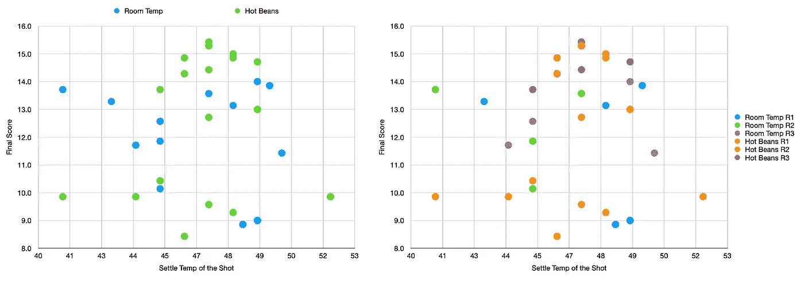

R1 =烤 1，R2 =烤 2，R3 =烤 3

# 辣味分布

我定期筛选咖啡来制作不连续的浓缩咖啡，通过筛选，我可以获得完整颗粒尺寸分布的小样本。中档有所改变，更多的研磨料留在了粗档。通常我一次筛 45 到 60 克，速度是 3g/分钟(重量除以总筛时间)。

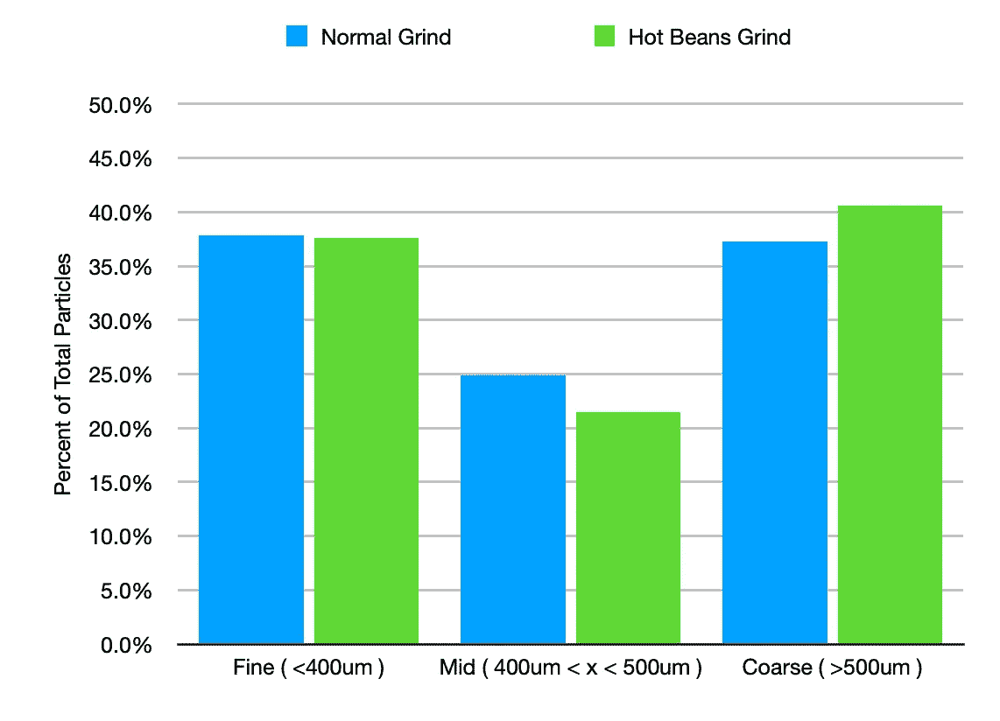

研磨前预热咖啡豆只是改变了颗粒分布还是做了更多的事情？如果我们从加热过的咖啡豆中取出过筛后的粉末，然后将它们混合在一起，形成和原来未加热的咖啡豆一样的分布，会怎么样呢？如果弹丸味道类似于未加热的豆丸，该测试将表明加热豆仅改变颗粒分布，而没有其他变化。

我发现不管颗粒分布如何，味道都是一样的，这意味着加热不仅仅是不同的地面分布。这不是一个决定性的测试，但结果不是我所期望的。我想知道，不管怎样，仅仅用同样的研磨筛选和改造一个镜头是否会给出一个更好的镜头。筛选和加热是两个变量，在下面的小样本中，我不清楚哪一个导致了味道的改善。

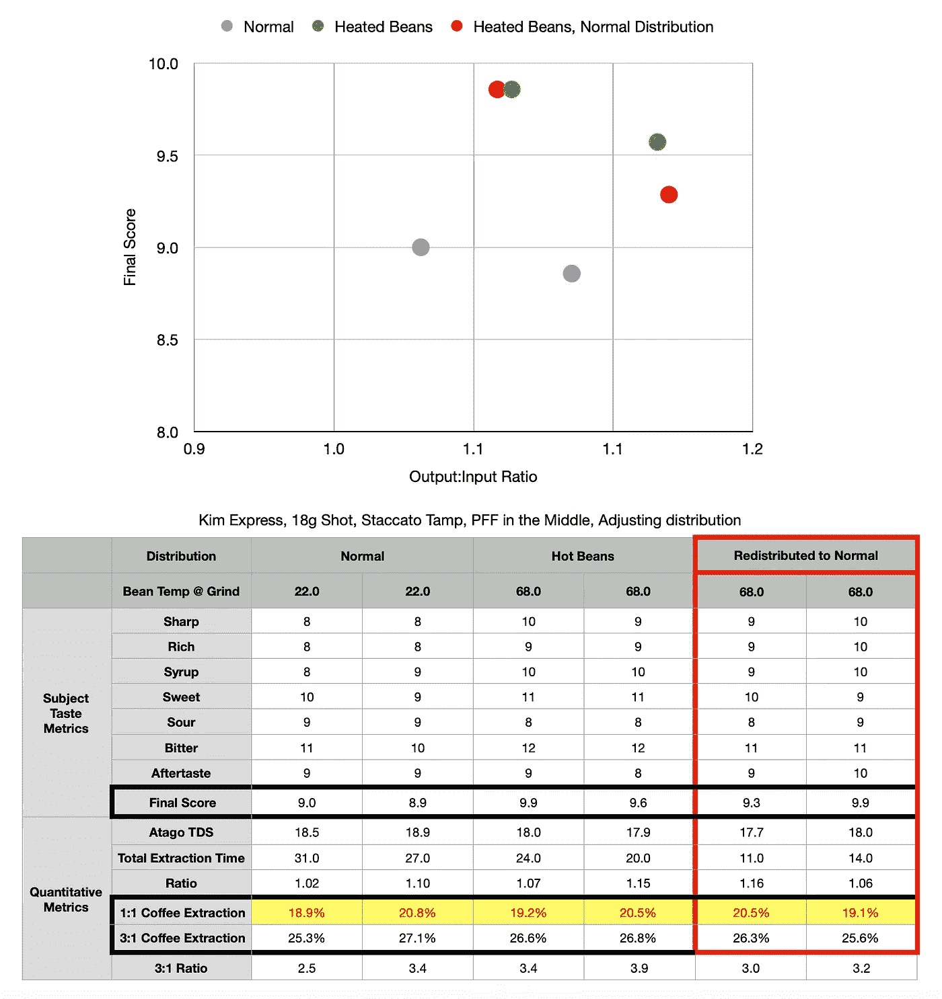

这里主要的洞穴是:

1.  每个变体只有 2 个样品。
2.  仅使用了三个筛子，并且粉末分布比这更复杂。[然而，其他研究](https://speakerdeck.com/bge/barista-camp-2015-christian-klatt-heating-in-grinders?slide=24)表明，当涉及热量时，颗粒分布的主要变化是从 400 微米到 500 微米的颗粒向更粗的颗粒转移。我在上面看到过类似的。

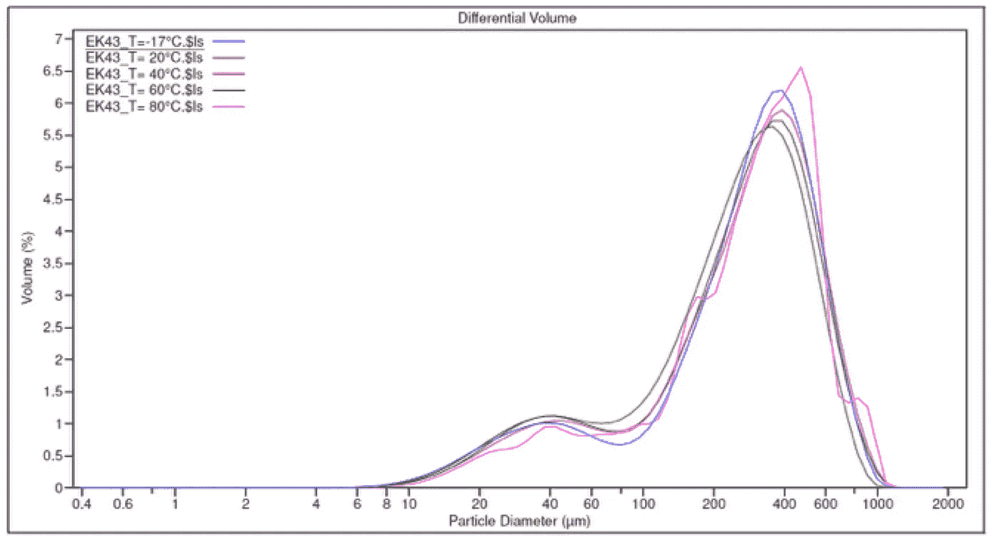

克里斯蒂安·克拉特 2015 演示:[https://speakerd . S3 . Amazon AWS . com/presentations/e 0019999d 9224146 BF 3 f 9 f 9 DFD 483679/BC15 _ CK . pdf](https://speakerd.s3.amazonaws.com/presentations/e0019999d9224146bf3f9f9dfd483679/BC15_CK.pdf)

# 冷冻豆子

我把一些豆子冷冻到零下 17 度，然后把它们从冰箱里直接磨碎。研磨后的温度为 26 摄氏度(当时的室温为 23 摄氏度)，因此研磨机在研磨过程中对它们进行了预热。我发现味道并不比基线好，也没有提取更高。然而，一个奇怪的发现是，如果我在拍摄前在冰箱里冷却咖啡渣，味道会有所改善。

# 特辣:热豆，冷磨

那么，为什么不用热的豆子研磨，用冷的地面冲泡呢？我开始用普通温度的咖啡豆研磨，我发现冷却咖啡豆可以改善味道。以下是我遵循的步骤:

1.  用微波炉将咖啡加热到 60 度到 90 度之间(对于 80 克左右的咖啡豆，这是在微波炉上加热 1 分钟)。
2.  立即研磨(研磨后的温度为 36℃)。
3.  将粉末和过滤器放入冰箱的密封容器中。
4.  让我们冷静一两个小时。人们可以用冰箱来加速这个过程。
5.  启动浓缩咖啡机。
6.  取出研磨物，准备好一杯咖啡(普通咖啡、不连续浓缩咖啡、不连续浓缩咖啡，有或没有纸质过滤器(PFF))。
7.  将准备好的篮子放回冰箱，直到机器准备好(这反映了我使用没有温度控制的 Kim Express)。
8.  开枪吧。

我注意到味道有所改善。提取没有太大的变化。提取似乎是最大限度的，但一些不同的东西正在被提取。也许咖啡中不好的部分没有被提取出来，更多好的部分被提取出来，我不知道。按化合物对杯子里的东西进行分解将有助于回答这个问题，但我没有气体色谱仪或光谱仪。

我的样本大小对于我的数据需求来说不够大，但是我觉得我正在推动可能的边界。回顾过去的工作，它们都是足够简单的实验，但轻微的调整，如跟踪地面温度，似乎是发现惊人的浓缩咖啡的关键调整。

我喜欢辣磨的原因是，任何有微波炉和冰箱的人都可以相对轻松地尝试一下。所以我希望听到任何尝试一些辣磨的人。

如果你愿意，可以在 Twitter 和 YouTube 上关注我，我会在那里发布不同机器上的浓缩咖啡视频和浓缩咖啡相关的东西。你也可以在 [LinkedIn](https://www.linkedin.com/in/robert-mckeon-aloe-01581595?source=post_page---------------------------) 上找到我。

# 我的进一步阅读:

[断续浓缩咖啡:提升浓缩咖啡](https://medium.com/overthinking-life/staccato-espresso-leveling-up-espresso-70b68144f94)

[用纸质过滤器改进浓缩咖啡](/the-impact-of-paper-filters-on-espresso-cfaf6e047456)

[浓缩咖啡中咖啡的溶解度:初步研究](/coffee-solubility-in-espresso-an-initial-study-88f78a432e2c)

[断奏捣固:不用筛子改进浓缩咖啡](/staccato-tamping-improving-espresso-without-a-sifter-b22de5db28f6)

[浓缩咖啡模拟:计算机模型的第一步](https://medium.com/@rmckeon/espresso-simulation-first-steps-in-computer-models-56e06fc9a13c)

[更好的浓缩咖啡压力脉动](/pressure-pulsing-for-better-espresso-62f09362211d)

[咖啡数据表](https://towardsdatascience.com/@rmckeon/coffee-data-sheet-d95fd241e7f6)

[匠咖啡价格过高](https://medium.com/overthinking-life/artisan-coffee-is-overpriced-81410a429aaa)

[被盗浓缩咖啡机的故事](https://medium.com/overthinking-life/the-tale-of-a-stolen-espresso-machine-6cc24d2d21a3)

[浓缩咖啡过滤器分析](/espresso-filters-an-analysis-7672899ce4c0)

[便携式浓缩咖啡:指南](https://medium.com/overthinking-life/portable-espresso-a-guide-5fb32185621)

[克鲁夫筛:分析](https://medium.com/overthinking-life/kruve-coffee-sifter-an-analysis-c6bd4f843124)