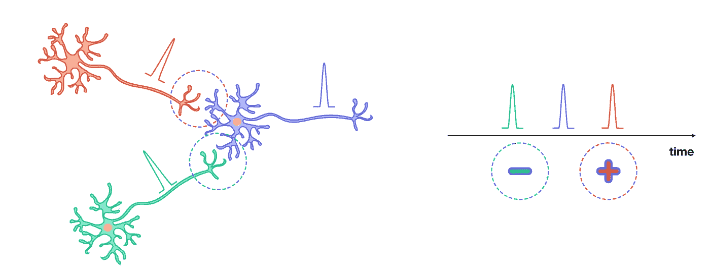

# 脉冲神经网络

> 原文：<https://towardsdatascience.com/spiking-neural-networks-558dc4479903?source=collection_archive---------16----------------------->

## 是什么让这些生物现实神经元对计算感兴趣？

照片由[哈尔·盖特伍德](https://unsplash.com/@halgatewood) 上的 [Unsplash](https://unsplash.com/)

在硬件神经形态计算中，脉冲神经网络是最广泛采用的脑启发计算模型。然而，它们在软件人工神经网络中没有遇到很大的兴趣，所述软件人工神经网络使用以单一、静态和连续值激活为特征的神经元。是什么让这些生物现实神经元对计算感兴趣？

脉冲神经网络(SNN)首先出现在计算神经科学中，作为模拟生物神经元行为的一种尝试。这导致了泄漏积分点火(LIF)模型，将神经元活动描述为接收到的尖峰电压的积分和对环境的微弱耗散(泄漏)。当它的电压达到一个阈值时，神经元会自己发出一个尖峰信号。随着大脑的进一步启发，神经元的输入和输出可以被编码为它接收和发出的尖峰脉冲的时间或速率。这种类型的信息编码对错误非常鲁棒，因为检测不到一两个尖峰不会导致平均尖峰率的显著错误。

尽管他们已经在那里呆了一段时间，但 SNN 并没有在深度学习社区中遇到很大的兴趣。这最初是由于缺乏有效的训练算法来进行监督学习。事实上，为了应用通常使用的学习算法，例如具有反向传播的梯度下降，需要为神经元输出定义连续值的可微分变量(尖峰不是)。虽然这可以通过计算尖峰到达时间或其速率来实现，但这增加了计算复杂性，从而使它们在深度神经网络中的实现不太吸引人。

另一方面，脉冲神经元广泛用于神经形态计算，其中 SNN 已经使用电子和光学系统实现。神经形态计算包括在硬件中构建神经网络，其中物理设备神经元通过物理设备突触连接。神经形态计算的主要动机是由分布式架构提供的能量效率，该架构避免了存储器和 CPU 之间的能量贪婪的数据洗牌。尖峰神经元的使用方向相同，并促使 IBM (TrueNorth)、Intel (Loihi)和清华天极(Tsinghua Tianjic)建造了第一台由数百万个尖峰神经元组成的神经形态计算机。

## **脉冲神经网络的优势**

脉冲神经网络之所以有趣，有几个原因。首先，由于速率编码对噪声非常鲁棒，因此可以使用非常弱的信号来传输信息。第二，他们为**无监督学习**带来新的学习算法。事实上，尖峰神经元**允许生物启发的局部学习规则**的实施，如赫比学习和**尖峰时间相关可塑性** (STDP)。如果突触连接的两个神经元的活动似乎相关，这些学习规则就会恢复到增强突触的权重，否则就会降低权重。因此，它允许网络实时学习和自我学习。使用电子神经形态硬件的无监督学习的首次演示可以追溯到 2012 年，获得了 MNIST 数据库的最先进的识别率[1]。最近，使用全光学神经形态平台实现了无监督学习，证明了对简单模式的识别，从而证实了尖峰神经元的兴趣[2]。

尖峰时间相关可塑性学习规则。如果突触后神经元(紫色)在接收到来自突触前神经元(红色)的锋电位后出现锋电位，那么这些事件之间很可能存在因果关系，它们之间的突触(红紫色)得到加强。相反，如果突触前神经元的锋电位(绿色)在突触后神经元的锋电位之后到达，则突触(绿色-紫色)权重降低。(自己的工作)

最后，由于他们使用的时空信息编码，脉冲神经网络为**利用网络动力学进行学习**提供了可能性。例如，脉冲串的同步允许从同步模式中解码网络输出。这种动态现象存在于大脑中，并允许它用较少数量的神经元进行计算。使用同步的**高效学习的首次演示已经在使用**自旋电子神经元**【3】的神经形态计算中得到演示，从而证明了人工神经网络的动态神经元模型的重要性。**

神经形态平台现在面临着扩大规模的挑战。他们将不得不应对设备的可变性，同时保持设备的紧凑性和低能耗。

[1] D. Querlioz 等人，结合无监督和有监督学习方法的具有纳米尺度忆阻设备的生物激励网络， *IEEE/ACM 纳米尺度架构国际研讨会，*203–210(2012)。

[2] J. Feldmann 等，具有自学习能力的全光脉冲神经突触网络。*性质*， **569** ，208–215(2019)。

[3] M. Romera，P. Talatchian 等人，使用四个耦合的自旋扭矩纳米振荡器进行元音识别。*性质*， **563** ，230–234(2018)。