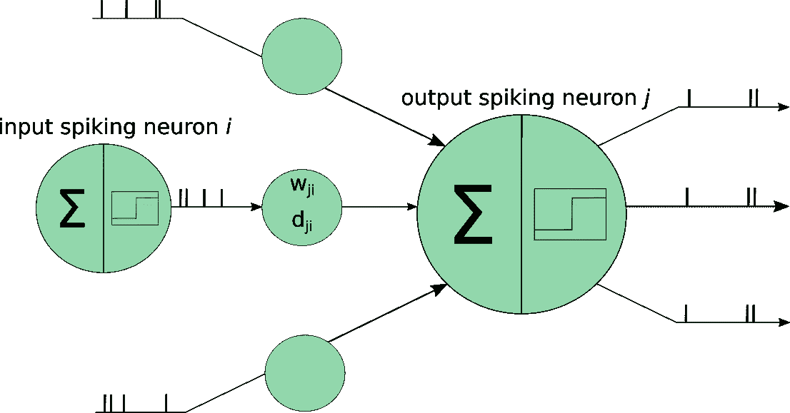
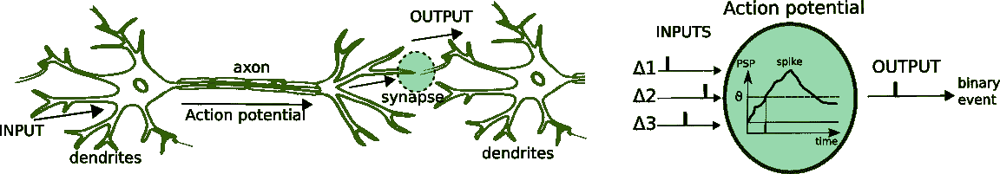

# 流学习场景中的脉冲神经网络

> 原文：<https://towardsdatascience.com/spiking-neural-networks-in-stream-learning-scenarios-7bf2112b0c35?source=collection_archive---------11----------------------->

## 在综合概述中合并两个字段

图 1:脉冲神经网络方案[1]

*脉冲神经网络已被证明是模拟大脑行为和学习潜力的最成功的方法之一，并利用它们来承担实际的在线学习任务[1]。*

## 流学习

在流学习(SL)中，也称为数据流挖掘或数据流的机器学习，应用程序(如移动电话、传感器网络、工业过程控制和智能用户界面等)以快速流的形式生成大量数据，随着 [**大数据**](https://en.wikipedia.org/wiki/Big_data) 和 [**物联网**](https://en.wikipedia.org/wiki/Internet_of_things) 时代的到来，这些应用程序获得了特殊的相关性。在这些情况下，算法无法显式访问所有历史数据，因为为此目的所需的存储容量变得无法管理。事实上，数据流既快又大(可能是无限的)，所以必须实时从中提取信息，因此有必要以在线方式学习[2]。

此外，这些场景中的一些会产生越来越普遍的非平稳数据流，并且生成数据的过程可能会随着时间而改变，从而产生要建模的模式的改变(*概念漂移*)。这导致在这些流数据上训练的预测模型变得过时，然后它们不能适应新的分布。因此，迫切需要新的算法来尽可能快地检测和/或适应这些变化，同时保持良好的性能分数[3]。

## 脉冲神经网络

仿生系统的计算能力越来越受到研究界的关注。尽管对大脑中涉及的信息处理缺乏共识，但生物过程已经成为最近计算模型的参考。如今被认为是第三代人工神经网络，SNNs 的出现是由更好地理解
哺乳动物大脑的信息处理技能的需要推动的，为此，社区致力于开发更复杂的生物学连接主义系统。

图 2:生物神经元及其与人工脉冲神经元的关联[4]

SNNs 包含一组计算单元(**神经元**)，它们通过有向边(神经元之间的**突触**)相互连接，根据一组指定的规则和方程(神经回路中的信息处理模型)处理信息。对其连通性或动力学的不同选择已经产生了大量不同类型的**模型**(如 Izhikevich、Hodgkin–Huxley 或 Leaky integrat-and-Fire 模型)，这些模型在过去几十年中已经在计算机科学中得到彻底研究，并且由于
深度学习的成功，近年来又重新引起了人们的兴趣[5]。

在将输入数据提供给 SNN 之前，必须将其编码成**尖峰**序列，以便应用神经元模型。编码部分旨在生成代表输入刺激的尖峰模式，这在神经科学中仍是一个未决问题(这样的尖峰时空模式包含什么信息？神经元用来传递信息的代码是什么？或者其他神经元如何解码信号？).产生棘波序列使得输入刺激的任务相关信息内容被保留变得至关重要。因此，决定什么信息被丢失，什么信息被保留，以及编码有多有效，这些都不是无关紧要的[6]。

在运动控制、基于机器人控制、轨迹跟踪、金融市场决策应用、空间导航和路径规划、决策和行动选择、康复、图像和气味识别、空间导航和环境的精神探索等领域，可以找到 SNNs 的许多实际应用。

## 用于流学习目的的脉冲神经网络

一些 snn 在第二语言研究社区中特别出名，因为它们具有持续和增量学习的能力，这解释了它们对不稳定和不断发展的环境的持续适应性。此外，他们还展示了捕捉流数据中时间变量之间的时间关联的能力。此外，snn 具有硬件实现的最佳特性，这是一个有趣的主题，因为可以实现在线操作和嵌入式硬件系统，从而扩大了 snn 可以应用的应用数量(例如，定制的 VLSI 芯片)。

数据流可能表现出类标签之间的时间依赖性，这有助于确定输入要素如何随着时间的推移而相互关联。SNNs 利用尖峰信息表示来构建尖峰时间学习规则，这些规则已经显示出捕捉流数据中时间变量之间的时间关联
的能力。在 SL [8]中使用一些 snn(例如，进化的 snn[7])允许非常快速的实时性，并降低了学习过程的计算复杂度，这是因为其局部性非常适合并行实现。就适应漂移而言，如果在变化的环境中使用，大多数现成的分类模型需要重新训练，并且不能适当地缩放。一些 snn 可以克服这一缺点，例如，eSNNs 的进化性质(基于相似神经元的合并过程)使得在数据可用时积累知识成为可能，而不需要存储和
用过去的样本重新训练模型。

## 工具

对于 **SL** :

*   [MOA](https://moa.cms.waikato.ac.nz/) :可能是用于这些目的的最流行的开源 Java 框架。
*   Scikit-Multiflow :受 MOA 启发，用 Python 实现，包含一系列机器学习算法、数据集、工具和用于 SL 评估的指标。
*   [Scikit-Learn](http://Scikit-Learn) :虽然它主要专注于批量学习，但这个框架也为研究人员提供了一些 SL 方法(多项式朴素贝叶斯、感知器、随机梯度下降分类器、被动积极分类器等)。
*   [Spark streaming](https://spark.apache.org/streaming/):Apache 项目，致力于构建可伸缩的容错流应用程序。
*   其他兴趣:弗林克，风暴，梁，萨姆扎，萨摩亚等。

对于 **SNNs** :

*   Brian :这是一个针对 SNNs 的开源 Python 模拟器
*   [Cypress](https://github.com/hbp-unibi/cypress) : ut 是一个 C++仿真环境，可以对 SNNs 进行高效的
    离散事件仿真。特别推荐用于涉及具有复杂解剖和
    生物物理特性的细胞的
    模拟。
*   [Nest](http://html) :这是一个模拟环境(C++，Python，Cython ),最适合关注神经系统的动态、大小和结构的模型，而不是关注单个神经元的详细形态和生物物理
    属性
*   [PyNN](http://neuralensemble.org/PyNN/) :神经元
    网络模型的模拟器无关规范。Python 实现。
*   其他兴趣:Neuron，NeuCube，PCSIM，ANNarchy。我们还可以在 SpiNNaker 和 BrainScaleS 中找到硬件规格。

## 结论

由于基于流数据的大量实际应用，特别是在数据受到非平稳事件影响的场景中，引发了所谓的概念漂移，因此 SL 是研究界的一个非常热门的话题。SNNs 被认为是第三代神经网络，并且已经表明它们是模拟大脑行为和学习潜力的最成功的方法之一，允许对大型网络进行非常快速的实时模拟，并且计算成本低。在漂移检测[9]和漂移适应[8]情况下，它们也表现出非常好的行为，这通常出现在 SL 场景中。所有这些让我们考虑这两个领域的一个非常有趣的交集。尽管如此，在这两个领域都必须取得很大进展，以应对各自的公开挑战，但我们应该意识到融合 SL 和 snn 的重要性，以便用这些生物启发系统的计算能力解决实际问题。

## 承认

我要感谢研究团队的其他成员(TECNALIA 的 Javier Del Ser、巴黎电信和怀卡托大学的 Albert Bifet 以及奥克兰理工大学的 Nikola Kasabov)。

## 参考

[1] *Lobo，J. L .，Del Ser，j .，Bifet，a .，& Kasabov，N. (2020)。脉冲神经网络和在线学习:概述和展望。神经网络，121，88–100。*

[2] *输，v，汉默，b .，&沃辛，H. (2018)。增量在线学习:最新算法的回顾和比较。神经计算，275，1261–1274。*

[3] *陆，j，刘，a，董，f，顾，f，伽马，j，&张，G. (2018)。概念漂移下的学习:一个综述。IEEE 知识与数据工程汇刊。*

[4]*郭士纳，w .，&Kistler，W. M. (2002 年)。脉冲神经元模型:单个神经元，群体，可塑性。剑桥大学出版社。*

[5] *塔瓦纳伊，a .、古德拉蒂，m .、赫拉德皮谢，S. R .、马斯克利尔，t .、&迈达，A. (2018)。脉冲神经网络中的深度学习。神经网络。*

[6] *Petro，b .，Kasabov，n .&Kiss，R. M. (2019)。脉冲神经网络时间脉冲编码方法的选择和优化。神经网络和学习系统汇刊。*

[7]*施里布，s .，&n .卡萨博夫(2013 年)。进化中的脉冲神经网络--综述。进化的系统，4(2)，87–98。*

[8] *Lobo，J. L .，laa，I .，Del Ser，j .，Bilbao，M. N .，& Kasabov，N. (2018)。用于漂移数据流在线学习的进化脉冲神经网络。神经网络，108，1–19。*

[9] *Lobo，J. L .，Del Ser，j .，laa，I .，Bilbao，M. N .，&n . Kasabov .(2018 年 10 月)。基于进化脉冲神经网络的非平稳数据流漂移检测。智能和分布式计算国际研讨会(第 82-94 页)。斯普林格，查姆。*

## 注意

*本文基于 2020 年发表在*神经网络*期刊上的科学手稿。可登陆[https://www . science direct . com/science/article/pii/s 0893608019302655](https://www.sciencedirect.com/science/article/pii/S0893608019302655)获取。