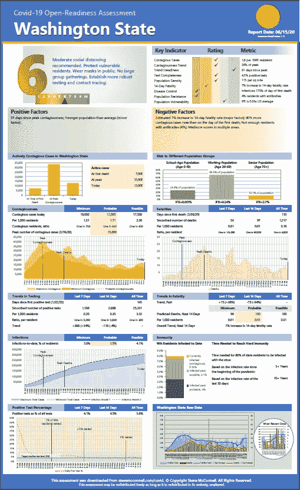
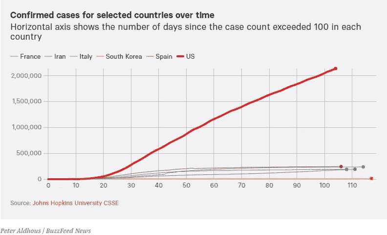
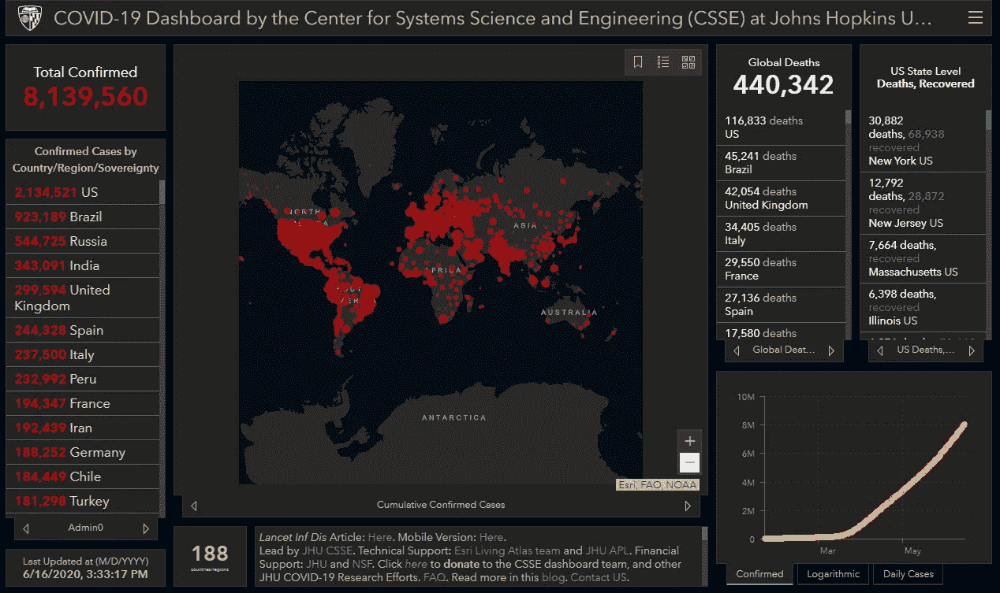
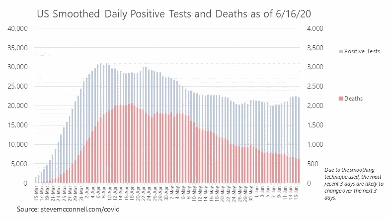
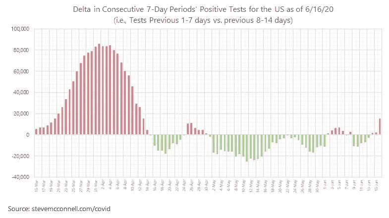
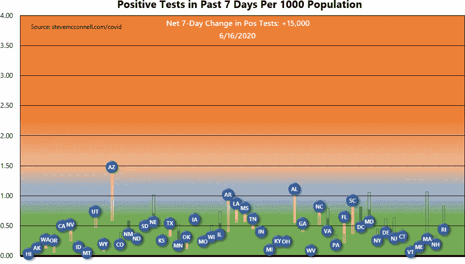

# 新冠肺炎的无自旋数据

> 原文：<https://towardsdatascience.com/spin-free-data-on-covid-19-3329bbc2efdb?source=collection_archive---------62----------------------->

## 在一个对健康和经济都有深远影响的疫情，获取及时、可理解的数据应该是普遍的。

# **总结:您有权获得可理解的数据**

关于新冠肺炎的数据并不缺乏。但呈现的通常是旋转第一，数据第二。这在任何时候都没有用，尤其是在疫情时期，当赌注如此之高时，这尤其令人沮丧。

对于与您最相关的数据，您知道您所在的州在抗击新冠肺炎方面做得有多好吗？各州在提供给居民的数据和提供数据的清晰程度上有很大差异。

我认为你有权知道——用你能理解的话来说——你的国家在抗击新冠肺炎的战斗中做得有多好。你也有权知道你的国家在做什么。

自二月份以来，我一直在参加一个数据科学讨论组，该讨论组研究了新冠肺炎数据的每个实际方面。该小组的任务是深入理解我们看到的数据。我们小心翼翼地避免政治讨论，因为*我们首先寻求不带偏见地理解数据*。每个成员都可以自由地得出他们自己的政治结论——但不是在我们的讨论组里。

为了让任何想要的人都可以获得数据(在我们小组讨论的大力支持下)，我为每个州创建了新冠肺炎开放准备评估。这是我所在州的一个例子。

图 1 —华盛顿州的开放就绪性评估

这些开放就绪性评估面向 50 个州和哥伦比亚特区，每周更新 2 到 3 次。你可以在我的[新冠肺炎信息中心](https://www.stevemcconnell.com/covid)看到他们。

我们小组对新冠肺炎的数据得出了一些结论。

## 累积图几乎毫无价值

显示阳性检测和死亡累计总数的图表，像这样的，除了震惊值之外，没有什么价值。

图 2 —累积阳性测试的典型图表。图片来自 [Buzzfeed 新闻](https://www.buzzfeednews.com/article/peteraldhous/coronavirus-updating-charts-us-world-compare)。

像这样的图表只是说阳性测试或死亡的数量随着时间的推移而增加。它没有描述情况是变好了还是变坏了。很难看出曲线的轨迹是否在变化。当我研究一个图表时，我会想，“这个图表向我暗示了什么问题？”对于这种类型的图表，答案是“没有”

## 热图也好不到哪里去

约翰霍普金斯大学提供了宝贵的服务，使新冠肺炎的数据随时可用。但是像无处不在的 JHU·新冠肺炎仪表盘这样的图像并不能提供太多信息。

图 3——JHU 无处不在的阳性检测热图。图片来自约翰·霍普金斯大学[系统科学与工程中心](https://coronavirus.jhu.edu/map.html)。

如果整个地图不是红色的，它可能会提出这样的问题，“为什么这个地区比那个地区受影响更大？”但是由于每个居住区都完全饱和，这是另一个没有提示任何问题的图表。

像这样的累积图相当于一辆汽车有里程表，但没有速度计。我们不经常需要里程表，但我们经常需要速度计。这些图表和地图提供了过去发生的事情的历史，但对现在发生的事情却鲜有说明。

## 增量(每日、每周)图更能提供信息

显示增量数据和趋势的图表更有意义，即显示每日或每周测试或死亡的图表。图 4 中的图表显示了每天的测试和死亡人数，经过平滑处理以弥补报告中每天的变化。图表清楚地表明，截至 6 月 16 日，阳性检测略有增加，但死亡人数仍在下降。它提出了这样一个问题，“为什么当阳性检测增加时，死亡却在减少？”它以一种热图和累积图所不具备的方式讲述了疫情的故事。

图 4 —增量(每日)阳性检测和死亡图表示例

## 显示一段时间内的增量(变化)的图表提供了大量信息

类似地，考虑如图 5 所示的疫情的故事。此图表跟踪与前 7 天相比，连续 7 天的阳性测试总数。

该图显示，病毒在 4 月初达到一个明显的拐点，在 4 月中旬迅速下降，此后经历了一系列起伏。从图 4 的增量图中不容易看出这个故事，从图 2 或图 3 的图像中也不可能看出。

图 5 —显示阳性测试趋势的图表示例

底线是增量数据和趋势数据比累积数据提供更多的信息。

## 基于人均数字的图表信息丰富

我们的数据科学小组还了解到，人均数字通常比总数更有用。对总数的共同关注意味着关于人口最多的州如纽约和德克萨斯的报道占据了新闻周期。但是当你检查人均数字时，你会看到各州表现的不同画面。

考虑图 6 中的图表，它显示了各州阳性测试的趋势。

图 6 —阳性测试的州级趋势数据

带有州缩写的标记显示了过去 7 天每个州每 1，000 名居民中阳性检测的数量。实线表示 7 天前的状态，透明线表示 7 天前的状态。

与 JHU 热图不同的是，该图可以方便地比较各州目前的状况，以及它们随时间变化的趋势。这张图表引发了许多问题:“哪些州正在恶化，哪些州正在好转？哪些州的变化最大？有没有什么模式可以说明哪些变得越来越差，哪些变得越来越好？”

目前，新闻报道强调得克萨斯州创造了每日新冠肺炎病例的记录。但上面的图表清楚地表明，最应该担心的州是亚利桑那州、阿肯色州和阿拉巴马州，其次是路易斯安那州和南卡罗来纳州。总数不能传达这一信息；人均数字确实如此。

## 动画可以提供特别多的信息

动画可以用静态图像无法做到的方式突出显示随时间的变化。上图的动画版本提供了对疾病传播的额外了解。

图 7 —阳性测试的动态状态级趋势数据

你可以看到这种疾病在华盛顿和密歇根慢慢开始。然后看到它在纽约及其周围的东北部各州强劲起飞。你可以看到，整个 4 月，病毒活动集中在东北部，但到了 5 月中旬和 6 月，病毒在全国各地显著下降。随后，在 6 月初，当早先遭受疫情的东北部各州将病毒控制住的时候，几个南部州却出现了疫情。目前，受影响最大的州在南部。

当数据被很好地呈现时，它可以提供令人难以置信的信息。

## **我的背景和数据来源**

我的个人背景是，20 年来我一直专注于理解软件开发的数据分析，包括质量、生产率和评估。我从处理噪音数据、坏数据、不确定性和预测中学到的技术都适用于新冠肺炎。

用于创建本文图表的数据可从 Covid 跟踪项目和 JHU 获得。虽然数据很容易访问，但它的原始形式不太容易理解。这就是我创建这些数据展示的原因。

## **为什么这对我个人很重要**

我对新冠肺炎的看法很简单:*我想知道事实，这样我才能做出自己的决定*。这在华盛顿州很难实现。我对我所在州的数据透明度(或缺乏透明度)的不满促使我向我的华盛顿同胞提供更好的数据，当我这样做时，其他州也很容易这样做。

请到我的[新冠肺炎信息中心](https://www.stevemcconnell.com/covid)查看内容，并随时与我在 stevemcc@construx.com 联系。