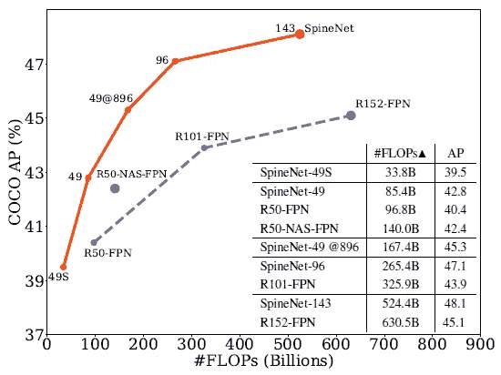
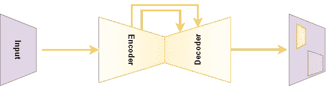
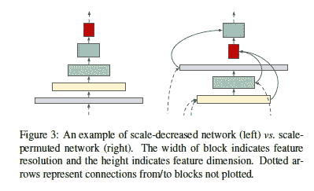
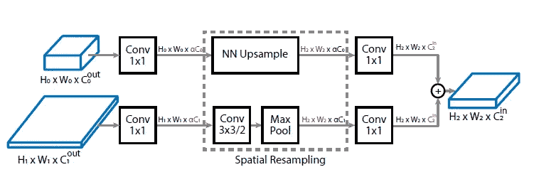
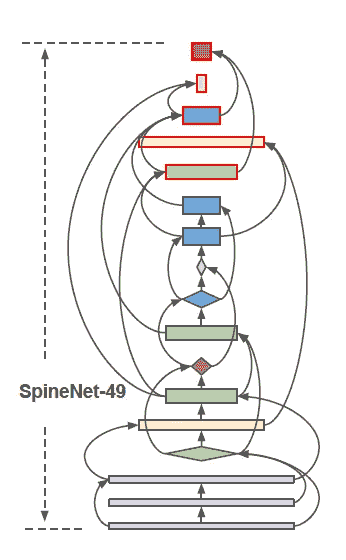
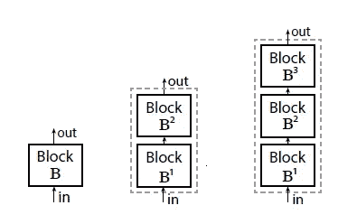

# 非常规神经网络的特征提取

> 原文：<https://towardsdatascience.com/spinenet-feature-extraction-object-detection-cdf9e57dbe0d?source=collection_archive---------42----------------------->

## 机器学习

## 尺度置换网络代替尺度递减网络

当你谈到任何一种图像分类或一种特征提取方法时，你脑海中浮现的是哪种神经网络？大概是这样的:给一个图像作为大小为 512x512 的输入，得到一个 10x1 的分类器输出。在这两者之间，有卷积和最大池层，它们会慢慢地降低图像分辨率，同时保留重要的特征。

现在，在 **CVPR-2020 期间，**谷歌研究和大脑团队提出了一个非常规的网络——[spine net](https://arxiv.org/abs/1912.05027)，而不是上面解释的典型神经网络。该网络由尺度置换的中间特征和交叉连接组成，这可能是许多需要特征提取的应用(如对象检测或图像分类)的可能解决方案。

## 结果

让我展示一下，谷歌不仅从一开始就重新定义了我们构建神经网络的方式，而且还改善了结果。

图一。Pic 鸣谢:SpineNet 研究论文

图一。显示了采用 SpineNet、ResNet-FPN 和 NAS-FPN 作为主干的 RetinaNet 模型(在 [COCO 数据集](https://cocodataset.org/#home)上)的比较。红线代表论文中解释的当前 SpineNet 模型(参数不同)，蓝色虚线代表与 SpineNet 模型对应的参数不同的 ResNet 网络。

乍看之下，它显示红色线比蓝色虚线具有更好的 AP(%)和更少的翻牌。头版的这个结果让我第一时间看到了方法。

他们还以表格形式显示了不同数据集的结果，并将它们与 ResNet 模型进行了比较。你可以仔细看看这些，我在这个博客的末尾附上了论文链接。

## 想法和动机

一般来说，目标检测的一个基本架构如图*图 2* 所示。

图二。基本编解码网络(自制)

其中，编码器用于提取特征(也可用于图像分类),解码器用于恢复这些特征以提供边界框的定位。编码器和解码器主要通过残差连接(ResNet)来使用不同分辨率的特征来保留重要信息。

这种编码器是一种比例递减网络，类似于在 [YOLOv3](https://arxiv.org/abs/1804.02767) 、 [Faster-RCNN](https://arxiv.org/abs/1506.01497) 等中使用的网络。，也就是通常所说的模特的*脊梁*。 [LeCun 等人](http://yann.lecun.com/exdb/publis/pdf/lecun-89e.pdf)解释了这种规模缩小的架构设计背后的动机:“*可能需要高分辨率来检测特征的存在，而不需要以同样高的精度来确定其确切位置。*”

为了在模型变得更深时保留空间信息并促进多尺度特征融合，本文提出了这种尺度置换网络。人们可以用图 3 中的*来捕捉这个想法。*

图三。来源: [SpineNet 研究论文截图](https://arxiv.org/abs/1912.05027)

从*图 3* 开始。，可以观察到传统的神经网络(比例缩小网络)在左侧。右边是一个规模置换网络的例子，各层和连接之间没有特定的顺序。

这种方法可能会产生许多理论和问题，本文试图回答其中的大部分。然而，为了使这篇文章简短扼要，我将把重点放在阅读摘要后想到的前两个问题上。

1.  **我们如何提出这样的架构或连接？**不幸的是，还没有定义好的方法或规则来做到这一点。在论文中，他们使用了**神经架构搜索(NAS)** 作为一种方法来寻找类似这样不同的可能架构。在过去，许多不同的公司和实验已经展示了 NAS 的使用，但是主要衍生了规模减小的网络。在没有 NAS 的情况下构建这种网络的可能性仍然不清楚，但人们可能会使用他们的最终网络输出(这将在后面显示)。
2.  **既然没有顺序，输入层的输出分辨率和特征尺寸如何匹配目标层的输入分辨率和特征尺寸？** 它们执行特征和空间重采样以匹配模型中目标层的特征和分辨率。从图 4 的*可以观察到。对于较小的图像，它们使用最近邻插值进行上采样，而它们使用步长(值为 2)、3×3 卷积进行下采样，以匹配模型的目标层。*

图 4。来源: [SpineNet 研究论文截图](https://arxiv.org/abs/1912.05027)

## 模型

图五。SpineNet-49，来源: [SpineNet 研究论文截图](https://arxiv.org/abs/1912.05027)

为了进行公平的比较，他们声称使用相同的 ResNet 架构层，并使用 NAS 来找到完美的置换组合。他们最终架构的一个版本(AP 最高，为 40.8%)如图*图 5* 所示。此外，如前所示，与原始 ResNet 网络相比，此版本使用的计算参数和触发器更少。

图六。通过块重复增加模型深度(来源: [SpineNet 研究论文](https://arxiv.org/abs/1912.05027)

为了增加模型深度，如 ResNet-100、ResNet-150，它们重复了相同的网络或顺序地组合网络，分别产生 SpineNet-96 或 SpineNet-143，如图 6 所示。

## 优势和可能的未来

1.  在这种方法的帮助下，可以创建一个更深的网络，可以增加或减少中间特征图的比例，而不会丢失空间信息。
2.  特征地图之间的连接应该能够跨越特征比例，从而有助于保留不同比例或分辨率的特征信息。
3.  它显示了以不同顺序连接层的可能性，这可能是研究和实验的新方向的开端。

## 可能的缺点

1.  该网络目前的一个缺点是，它是在 NAS 的帮助下建立的。由于不同连接背后的逻辑仍然不清楚，我们仍然不确定如何自己创建另一个类似的置换网络。
2.  虽然在论文中，他们已经表明它在对象检测和图像分类应用的情况下增强了性能。我们需要通过对不同网络的更多实验进行比较来确认 SpineNet-49 在其他情况下的表现。

希望这为您提供了这种有趣方法的一个很好的概述。如果您有任何疑问或想与我进一步讨论，请通过 [LinkedIn](https://www.linkedin.com/in/akashsachdeva15/) 联系我。

你也可以在这里 **访问全文 [**。**](https://arxiv.org/abs/1912.05027)**

**参考文献**

1.  杜先智-林逸， [SpineNet:用于识别和定位的学习标度-置换骨干网](https://arxiv.org/abs/1912.05027)，CVPR 2020
2.  约瑟夫·雷德蒙，阿里·法尔哈迪，[约洛夫 3:增量改进](https://arxiv.org/abs/1804.02767)，CVPR 2018
3.  Ren，s .，He，k .，Girshick，R.B .，，Sun，J. (2015)，[更快的 R-CNN:使用区域提议网络实现实时目标检测](https://www.semanticscholar.org/paper/Faster-R-CNN%3A-Towards-Real-Time-Object-Detection-Ren-He/424561d8585ff8ebce7d5d07de8dbf7aae5e7270#references)， *IEEE 模式分析和机器智能汇刊，39* ，1137–1149。
4.  Yann LeCun，Bernhard Boser，易小轩·登克，Donnie Henderson，Richard E Howard，Wayne Hubbard，和 Lawrence D Jackel，[应用于手写邮政编码识别的反向传播](http://yann.lecun.com/exdb/publis/pdf/lecun-89e.pdf)，神经计算，1989