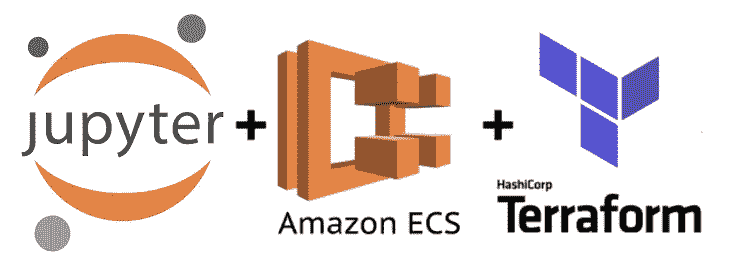

# 使用 Terraform 在 AWS 中将 Jupyter 笔记本电脑升级为 ECS 服务

> 原文：<https://towardsdatascience.com/spinning-up-jupyter-notebooks-as-ecs-service-in-aws-with-terraform-805ac111d74b?source=collection_archive---------28----------------------->



我们团队中的数据科学家需要经常运行耗时的 Python 脚本。根据任务的重复，我们决定是否将它 Dockerize 并在 AWS 上运行它。例如，如果一个脚本需要运行多次，我们会努力重写/重构代码，并将其封装到一个容器中，然后将其部署到 ECR，并将其调度为 Fargate 任务。如果这是一次性的，那么在本地运行脚本有时会更容易，但也有一些额外的缺点。

在本地运行(繁重的)脚本会消耗内存和 CPU，结果是在脚本运行时，您无法真正做其他对笔记本电脑要求很高的事情。我们长期使用的一个解决方案是启动 EC2 实例并在这些实例上运行脚本。在我看来，这不像是一个可维护的解决方案，但它是可行的，我们没有任何其他解决方案。

# Jupyter 笔记本

团队大量使用 Jupyter 笔记本(本地)。有 Docker 容器可用，像 [jupyter/scipy-notebook](https://hub.docker.com/r/jupyter/scipy-notebook) ，预装了很多依赖项，比如 pandas 和 scikit-learn。我们想出的一个主意是，基于该图像在 AWS 上轻松地旋转 Docker 容器，然后团队成员可以使用它。

因此，我们希望能够在没有太多麻烦的情况下在云中运行 Jupyter 笔记本，如果可能的话，甚至为每个人创建一个单独的实例，这样依赖关系、资源和文件就不会共享或混淆。笔记本应该或不应该与其他 AWS 资源交互。

我偶然发现了 [jupyterhub](https://github.com/jupyterhub/jupyterhub) Git 仓库的 wiki，在那里我找到了一个关于[产卵者](https://github.com/jupyterhub/jupyterhub/wiki/Spawners)的页面。有一个 [FargateSpawner](https://github.com/uktrade/fargatespawner) ，但是说实话，我错过了让它正常工作的文档。

【2020 年 6 月 9 日更新:你可能也会对我最近发布的一篇关于旋转 Polynote 笔记本的新文章感兴趣，这篇文章解决了我在 Jupyter 上遇到的一些问题。

[](/host-polynote-notebooks-with-basic-authentication-on-aws-fargate-with-terraform-65d4ff3ba730) [## 在 AWS Fargate 上使用 Terraform 进行基本身份验证的主机 Polynote 笔记本

### 本文将帮助您使用 Terraform 在 ECS 上轻松部署安全的 Polynote 环境。

towardsdatascience.com](/host-polynote-notebooks-with-basic-authentication-on-aws-fargate-with-terraform-65d4ff3ba730) 

# 将（行星）地球化（以适合人类居住）

> Terraform 是一个安全有效地构建、更改和版本控制基础设施的工具。Terraform 可以管理现有的和受欢迎的服务提供商以及定制的内部解决方案。
> 
> — [地形](https://terraform.io)

在过去的几个月里，我们对地形做了很多实验。我们心中有一个理想的情况，我们所有的资源和基础设施都通过 Terraform 以代码的形式建立和维护，但这还有很长的路要走。虽然它给了我们面对的问题一个新的视角。在对 Terraform 文件进行了一两个小时的工作后，我得到了一个可行的解决方案，目前正在我们的团队中进行测试！

# 旋转笔记本的地形脚本

我已经建立了一个 Git 存储库来共享我创建的脚本。你可以在这里找到 Git 库[，我会一路解释。在本文中，我不会在一个代码片段中提供整个 Terraform 脚本，为此，我想参考 Git 存储库。我将把脚本分成几块，并提供每个片段的信息。](https://github.com/sschrijver/spawn-jupyter-notebook-fargate)

## 先决条件

这需要一些先决条件(参考 [**main.tf**](https://github.com/sschrijver/spawn-jupyter-notebook-fargate/blob/master/main.tf) 脚本中的数据块)。我们已经在 AWS 中设置了以下服务:

*   ECS 集群
*   应用程序负载平衡器
*   Route53 内的托管区域和域

如果您没有这些东西，您可以选择通过 Terraform 来设置它们(我肯定会建议您在其他地方进行设置，在您定义和维护您的基础架构的地方)。但是当然，您也可以在 AWS 控制台中手动设置这些，就像我们之前所做的那样。

我尽可能地使用了变量。这是因为我们有多个 AWS 环境，我们希望能够在这些不同的环境中轻松运行笔记本电脑。我们还希望能够调整内存和 CPU，而不必更改 terraform 脚本。我的 **vars.tfvars** 和 **vars.tf** 看起来如下:

**vars.tfvars** (替换所有大写字母并重新访问其他变量值) **:**

```
vpc_id = "VPC_ID_HERE"
region = "REGION_HERE"
profile_name ="PROFILE_NAME_HERE"
ecs_cluster_name = "ECS_CLUSTER_NAME_HERE"
loadbalancer_arn = "LOAD_BALANCER_ARN_HERE"
hosted_zone_id = "ROUTE_53_HOSTED_ZONE_HERE"
fargate_subnets = [
  "SUBNET_1_HERE",
  "SUBNET_2_HERE",
  "SUBNET_3_HERE"]
jupyter_docker_tag = "latest" #Update July 2021: change this to "dc9744740e12"
cpu = 1024
memory = 2048
domain = "ROUTE_53_DOMAIN_NAME_HERE"
```

**vars.tf**

```
variable "vpc_id" {}
variable "region" {}
variable "profile_name" {}
variable "ecs_cluster_name" {}
variable "loadbalancer_arn" {}
variable "hosted_zone_id" {}
variable "fargate_subnets" {
  type = list(string)
}
variable "token" {}
variable "jupyter_docker_tag" {}
variable "memory" {}
variable "cpu" {}
variable "domain" {}
```

# 使用这个脚本

首先，如果你还没有安装 Terraform。安装完成后，可以在保存了 **main.tf** 、 **vars.tfvars** 和 **vars.tf** 的文件夹中运行以下命令(运行`terraform init`后):

```
terraform apply -var-file=vars.tfvars
```

它会要求您提供一个令牌，您可以使用它来访问笔记本，并要求您批准在您的 AWS 云环境中进行更改。几秒钟后，它会输出一个您可以用来访问环境的 url。Docker 映像真正运行并可访问可能需要几分钟时间，所以如果没有立即得到预期的响应，也不用担心。最初几分钟，您可能会收到 HTTP 503 响应。

## 撕下笔记本

当您使用完 Jupyter 环境后，只需运行下面的命令。提供您在设置环境时使用的相同令牌，不要键入“yes”来批准该命令。所有创建的资源都将被删除。如果您希望以后再次运行 Jupyter 笔记本，可以选择先将其保存在本地计算机上。

```
terraform destroy -var-file=vars.tfvars
```

在这里，我将进一步解释存储库中的内容，并将为每个代码片段提供额外的信息，说明脚本实际上是做什么的。

# **这个脚本是做什么的？**

假设你已经有了一些 Terraform 的经验或者愿意自己去查阅，我想告诉你这个脚本在做什么。有了数据块，我们就可以检索关于已经存在的 AWS 资源的信息。正如您在第一个数据块中看到的，我想检索已经存在的 ECS 群集的信息。

```
data "aws_ecs_cluster" "ecs_cluster" {
  cluster_name = var.ecs_cluster_name
}
```

我正在创建一个随机的字符串，稍后将被几个资源使用。这个随机字符串是这个脚本中的关键元素，它允许多个用户同时启动笔记本电脑。

```
resource "random_string" "random_string" {
  length = 8
  special = false
}
```

我们需要创建一个任务执行角色，该角色具有附加的策略，例如允许我们写入 CloudWatch。AWS 已经提供了该策略(参见下面的`data “aws_iam_policy" “amazon_ecs...."`块，但是我们仍然需要一个附加了该策略的角色。

```
resource "aws_iam_role" "ecs_task_execution_role" {
  name = "ecsTaskExecutionRole-jupyter-${random_string.random_string.result}"
  assume_role_policy = <<ASSUME_ROLE_POLICY
{
"Version": "2012-10-17",
"Statement": [
    {
      "Sid": "",
      "Effect": "Allow",
      "Principal": {
        "Service": "ecs-tasks.amazonaws.com"
      },
      "Action": "sts:AssumeRole"
    }
  ]
}
ASSUME_ROLE_POLICY
}data "aws_iam_policy" "amazon_ecs_task_execution_role_policy" {
  arn = "arn:aws:iam::aws:policy/service-role/AmazonECSTaskExecutionRolePolicy"
}resource "aws_iam_role_policy_attachment" "policy_role_attachment" {
  role = aws_iam_role.ecs_task_execution_role.name
  policy_arn = data.aws_iam_policy.amazon_ecs_task_execution_role_policy.arn
}
```

出于日志记录的目的，我创建了一个 CloudWatch 组，当然，你可以随意设置。

```
resource "aws_cloudwatch_log_group" "jupyter_ecs_log_group" {
  name = "/aws/ecs/jupyter-${random_string.random_string.result}"
}
```

ECS 上的每个 Fargate 或 EC2 服务/任务都需要一个任务定义，定义使用什么 Docker 容器，需要多少 CPU 和内存等等。你可以把它想象成一个蓝图。正如您在下面看到的，我将 jupyter/data science-notebook 指定为图像。我还更改了入口点，因此可以设置自定义令牌，否则它将生成一个随机令牌，不太容易从系统中检索到。

```
resource "aws_ecs_task_definition" "jupyter_task_definition" {
  family = "jupyter-${random_string.random_string.result}"
  requires_compatibilities = [
    "FARGATE"]
  network_mode = "awsvpc"
  cpu = var.cpu
  memory = var.memory
  execution_role_arn = data.aws_iam_role.ecs_task_execution_role.arn

  container_definitions = <<TASK_DEFINITION
  [
    {
        "entryPoint": ["start-notebook.sh","--NotebookApp.token='${var.token}'"],
        "essential": true,
        "image": "registry.hub.docker.com/jupyter/datascience-notebook:${var.jupyter_docker_tag}",
        "name": "jupyter-${random_string.random_string.result}",
        "portMappings": [
            {
                "containerPort": 8888,
                "hostPort": 8888
            }
        ],
        "logConfiguration": {
                "logDriver": "awslogs",
                "options": {
                  "awslogs-region": "${var.region}",
                  "awslogs-group": "${aws_cloudwatch_log_group.jupyter_ecs_log_group.name}",
                  "awslogs-stream-prefix": "${random_string.random_string.result}"
            }
        }
    }
  ]
  TASK_DEFINITION
}
```

正如我提到的，我们已经有了一个带有 HTTPS 监听器的负载平衡器，所以我们希望从它那里检索信息，以便以后使用(连同我们的 VPC 的信息)。当然，您也可以使用端口 80，但我的建议是使用端口 443。

```
data "aws_vpc" "vpc" {
  id = var.vpc_id
}

data "aws_lb" "lb" {
  arn = var.loadbalancer_arn
}

data "aws_lb_listener" "lb_listener" {
  load_balancer_arn = var.loadbalancer_arn
  port = 443
}
```

此设置还需要一个目标组，负载平衡器侦听器规则将指向该目标组。该目标组稍后将在`aws_ecs_service`资源块中使用。

```
resource "aws_lb_target_group" "jupyter_target_group" {
  name = "jupyter-${random_string.random_string.result}"
  port = 80
  protocol = "HTTP"
  vpc_id = data.aws_vpc.vpc.id
  target_type = "ip"
  health_check {
    matcher = "200,302"
  }
}
```

我们还需要将容器中的端口 8888 暴露给负载平衡器。我将端口 8888 暴露给连接到负载平衡器的安全组。

```
resource "aws_security_group" "jupyter_security_group" {
  name = "jupyter_${random_string.random_string.result}"
  vpc_id = data.aws_vpc.vpc.id

  ingress {
    description = "Incoming 8888"
    from_port = 8888
    to_port = 8888
    protocol = "tcp"
    security_groups = data.aws_lb.lb.security_groups
  }

  egress {
    from_port = 0
    to_port = 0
    protocol = "-1"
    cidr_blocks = [
      "0.0.0.0/0"]
  }

  tags = {
    Name = "jupyter_${random_string.random_string.result}"
  }
}
```

有了所有这些资源，我们终于可以定义我们的 ECS 服务了。

```
resource "aws_ecs_service" "jupyter_service" {
  name = "jupyter-${random_string.random_string.result}"
  cluster = data.aws_ecs_cluster.ecs_cluster.id
  task_definition = aws_ecs_task_definition.jupyter_task_definition.id
  desired_count = 1
  launch_type = "FARGATE"

  network_configuration {
    subnets = var.fargate_subnets
    security_groups = [
      aws_security_group.jupyter_security_group.id]
  }

  load_balancer {
    target_group_arn = aws_lb_target_group.jupyter_target_group.arn
    container_name = "jupyter-${random_string.random_string.result}"
    container_port = 8888
  }
  depends_on = [
    aws_lb_target_group.jupyter_target_group]
}
```

然后，在负载平衡器中添加转发规则。假设我们有以下域:`company.com`，随机字符串为`123`。如果主机头是`jupyter-123.company.com`，它将转发到 Jupyter 目标组。【2021 年 7 月更新: `field = "host-header"`仅适用于版本 2.41.0 之前的 AWS 提供程序，使用`[required_providers](https://registry.terraform.io/providers/hashicorp/aws/latest/docs)`锁定 AWS 提供程序或更新条件块，使其适用于[最新版本](https://registry.terraform.io/providers/hashicorp/aws/latest/docs/resources/lb_listener_rule)。

```
resource "aws_lb_listener_rule" "jupyter_lb_listener_rule" {
  listener_arn = data.aws_lb_listener.lb_listener.arn
  priority = null

  action {
    type = "forward"
    target_group_arn = aws_lb_target_group.jupyter_target_group.arn
  }

  condition {
    field = "host-header"
    values = [
      "jupyter-${random_string.random_string.result}.${var.domain}"]
  }
  depends_on = [
    aws_lb_target_group.jupyter_target_group]
}
```

然后在 Route53 中添加指向负载平衡器的 CNAME。继续前面的例子，CNAME 将是`jupyter-123.company.com`，它将指向我们的负载平衡器 url。

```
resource "aws_route53_record" "jupyter_cname" {
  zone_id = var.hosted_zone_id
  name = "jupyter-${random_string.random_string.result}.${var.domain}"
  type = "CNAME"
  records = [
    data.aws_lb.lb.dns_name]
  ttl = 300
}
```

现在一切就绪，我们当然想知道如何访问笔记本，因为一些字符串是随机生成的，我们在开始时已经设置了一个令牌。我们可以通过一个输出变量来实现。

```
output "url" {
  value = "${aws_route53_record.jupyter_cname.name}?token=${var.token}"
}
```

# 后续步骤

目前，Jupyter 笔记本无法访问其他 AWS 资源。因此，您必须在任务定义中提供一个任务角色。此外，当您想要访问 VPC 中的数据库时，您必须在数据库的安全组中添加入站/入站规则，该规则允许来自附加到 ECS 服务的安全组的传入流量。
状态现在被设置为本地，因此使用此脚本旋转笔记本的人也要负责销毁它们。

# 问题和反馈

如果您对本文有任何问题或反馈，请随时联系我或留下您的评论。

# 2021 年 7 月更新

由于 Jupyter docker 图像的版本在发布时并没有固定到本文中的特定版本，所以我在 **vars.tfvars** 中添加了一个注释。评论中的图片标签是在写这篇文章时 docker 图片的最新版本。当你想使用 docker 镜像的最新版本时:GitHub 用户 [mvtango](https://github.com/mvtango) 在我的存储库中创建了一个 [pull 请求](https://github.com/sschrijver/spawn-jupyter-notebook-fargate/pull/1)。据我了解，最新的图片默认使用的是 Jupyter Lab。