# 精彩的计算机视觉项目使你的照片三维！！！！！

> 原文：<https://towardsdatascience.com/splendid-computer-vision-project-makes-your-photo-3d-fac10e334b2f?source=collection_archive---------43----------------------->

# 你的照片在和你说话！

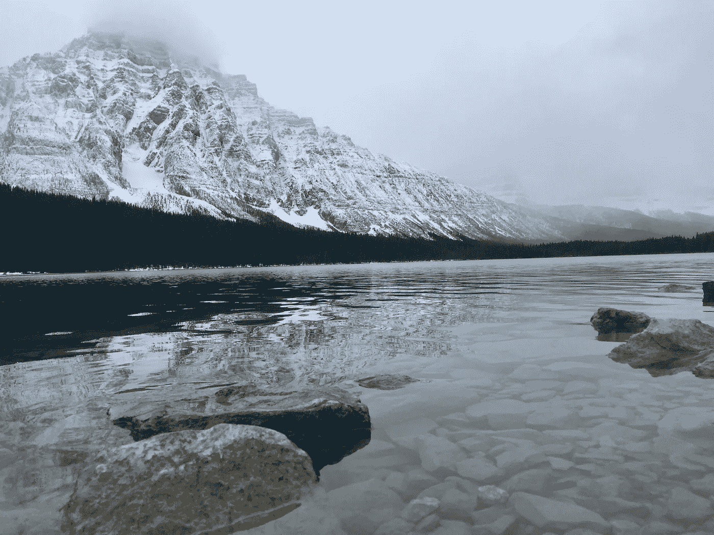

作者照片，在通往班夫的路上，2018 年 11 月

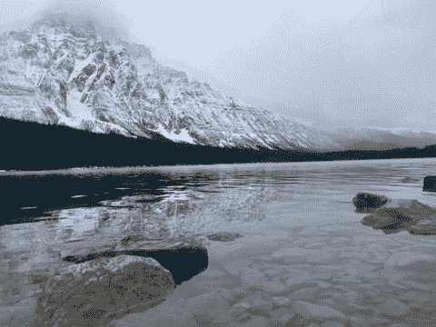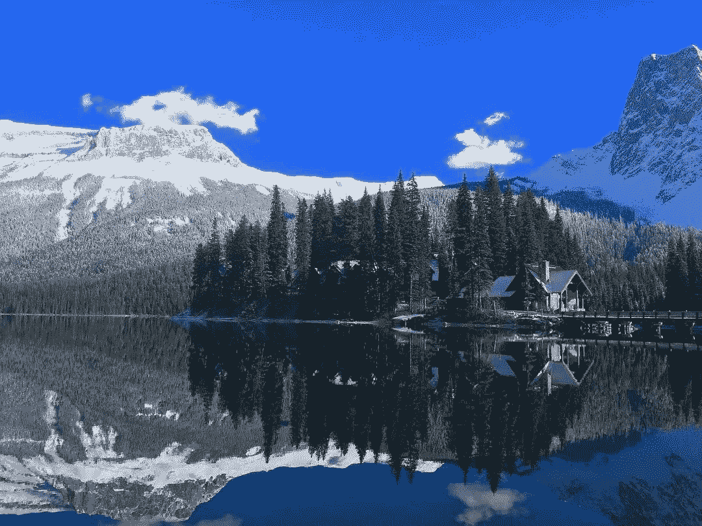

作者照片，班夫的 Yoho 国家公园，2018 年 11 月

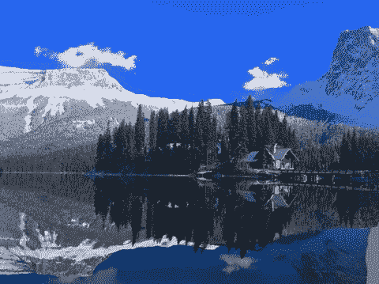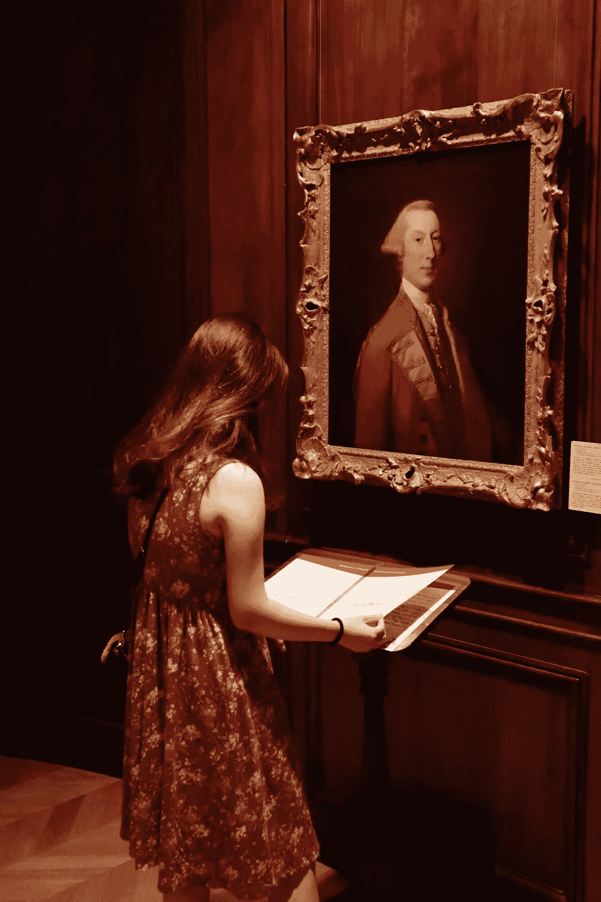

作者的照片，我在蒙特利尔的合作伙伴，2019 年 8 月

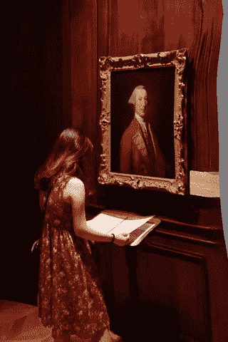

太棒了，对吧？我和你们一样惊讶。这个神奇的[项目](https://shihmengli.github.io/3D-Photo-Inpainting/)是由四位伟大的研究人员[施孟丽](https://shihmengli.github.io/)、[施](https://lemonatsu.github.io/)、[约翰内斯·科普夫](https://johanneskopf.de/)和[贾在](https://filebox.ece.vt.edu/~jbhuang/)[2020 年 IEEE 计算机视觉与模式识别大会(CVPR)上完成的。](https://filebox.ece.vt.edu/~jbhuang/project/3DPhoto/3DPhoto_paper.pdf)

想在你的照片上试试吗？如果你对计算机视觉和 CNN 完全没有概念也没关系，只要按照我在下面 ***设置*** 部分的步骤运行这个[链接](https://colab.research.google.com/drive/1706ToQrkIZshRSJSHvZ1RuCiM__YX3Bz)中的所有代码就可以了！我建议在 Colab 中设置，因为它需要一定数量的计算机资源来训练，并且 Colab 会为您缓存。

# 设置:

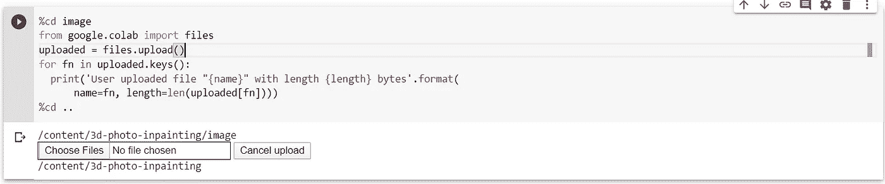

导入图像代码块

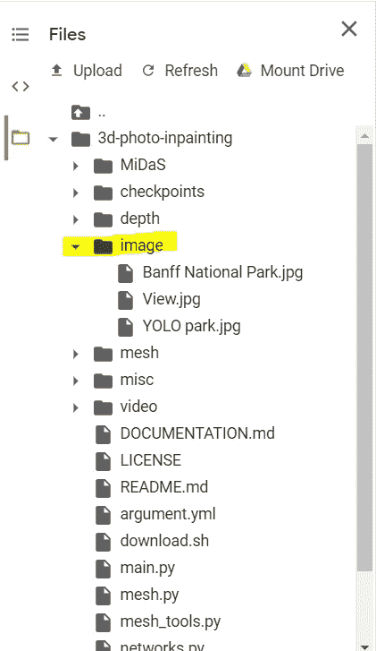

用于图像导入的文件夹

1.  运行该代码块之前的所有代码，将所有要制作 3D 的照片拖动到高亮显示的*图像*文件夹中，然后运行该代码块导入您上传的图像。
2.  然后只需运行下面的最后一个代码块:

```
!python main.py --config argument.yml
```

根据您的计算机规格和图片属性，每个训练批次需要等待 2-5 分钟。

3.然后你得到结果！

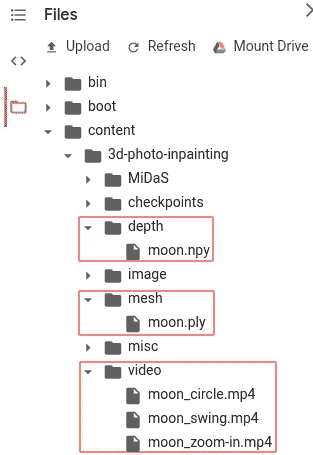

输出结果

您可以在指定区域找到您的结果。它将输出五个输出视觉效果，其中包括由 [MiDaS](https://github.com/intel-isl/MiDaS.git) 估计的深度图，修复的 3D 网格，以及在圆周、摆动和缩放运动中的 3D 视频演示。够简单了吧？想知道背后的逻辑就继续看下去吧！

# 理论:

一台机器如何从一张 2D 的照片中预测出 3D 视图？我的意思是，对于照片中的每个物体，如果你想“看到”它背后的东西，你必须以某种方式想象它是一个人。当人们看到一张照片时，他们不仅只是将它视为一个静态的图像，还会将它感知为一个有生命的 3D 物体，甚至会虚构一个想象的场景或回忆一些记忆。但是机器如何处理如此复杂的概念呢？它能不能“ ***想象*** ”？？

> 嗯，一台机器无法想象，但它可以“ ***学习*** ”到“ ***想象*** ”，或者换句话说，它可以像人类一样处理数据和输出。基本上，机器只是做他们擅长的事情:计算。

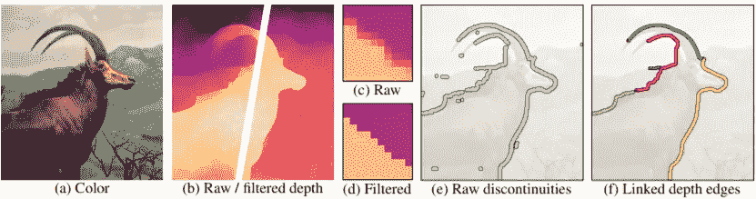

图片来自[使用上下文感知分层深度修复的 3D 摄影](https://filebox.ece.vt.edu/~jbhuang/project/3DPhoto/3DPhoto_paper.pdf)

通常人工智能学习 RGB-D 图像，其中 D 代表“深度”，以重温 3D 效果。目前，市场上大多数智能手机都有两个摄像头来分别捕捉颜色和深度。但是，没有深度的普通 RGB 图片怎么办？机器预测！通过一些标准的图像预处理步骤，我们可以很容易地找到深度图(a 到 d)

有了预测的深度，机器可以找到深度不连续的地方，然后分类，并分组到不同的颜色部分(e 到 f)。

有了所有的预处理准备，我们将从我们的 2D 照片修复三维视觉。我们正在使用的最重要的工具叫做***【LDI】***

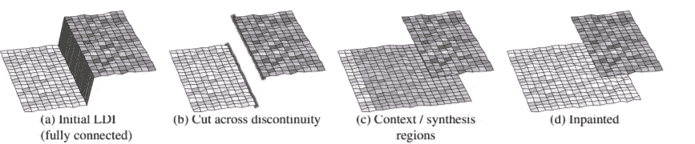

图片来自[使用上下文感知分层深度修复的 3D 摄影](https://filebox.ece.vt.edu/~jbhuang/project/3DPhoto/3DPhoto_paper.pdf)

在边缘上，像素由两边通过一个锐降(a)连接。该程序首先将拖放连接切割成绿色和红色区域(b)，我们称它们为前景轮廓和背景轮廓，基于背景轮廓或上下文区域(c)生成一个合成区域，然后合并到模型中。

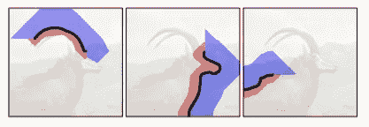

图片来自[使用上下文感知分层深度修复的 3D 摄影](https://filebox.ece.vt.edu/~jbhuang/project/3DPhoto/3DPhoto_paper.pdf)

现在，由于我们已经分离了两个区域(上下文区域和合成区域)，科学家使用三个修复代理来完成修复任务:边缘修复网络、颜色修复网络和深度修复网络。你可以查看下面的参考资料，详细了解这些修复网络是如何工作的。

边缘修复网络修复上下文区域和合成区域之间的轮廓，以预测被阻挡的边缘。然后机器使用颜色修复网络和深度修复网络分别*想象*被遮挡的颜色和深度。在这之后，我们将结果反馈给 LDI 模型，就这样！我们有结果了！

> 没有进一步的到期，玩模型，重温你的记忆！

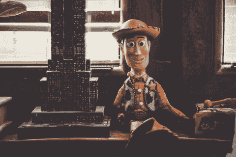

由 [Pixabay](https://pixabay.com/photos/toy-toy-story-childhood-little-2207781/) 的 [Coyot](https://pixabay.com/users/coyot-2009089/) 拍摄，作者加工

# 参考和资源:

## 相关项目:

*   迈达斯:[https://github.com/intel-isl/MiDaS](https://github.com/intel-isl/MiDaS)
*   [StereoConvNet](https://github.com/LouisFoucard/StereoConvNet)

## 论文和参考文献:

*   [使用上下文感知分层深度修复的 3D 摄影](https://filebox.ece.vt.edu/~jbhuang/project/3DPhoto/3DPhoto_paper.pdf)纸
*   [使用上下文感知分层深度修复的 3D 摄影](https://shihmengli.github.io/3D-Photo-Inpainting/)网站
*   [边缘修复网络](https://arxiv.org/pdf/1901.00212.pdf)纸张
*   [彩色修复网](https://arxiv.org/abs/1804.07723)纸张
*   [深度修复网络](https://arxiv.org/abs/1901.05945)论文