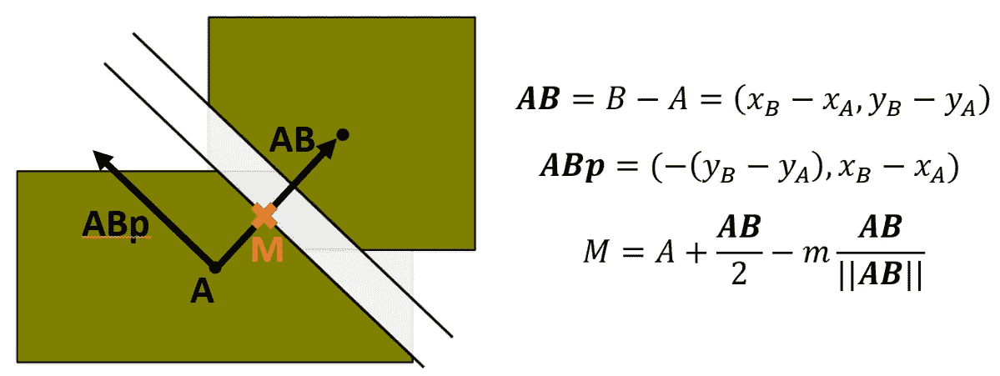
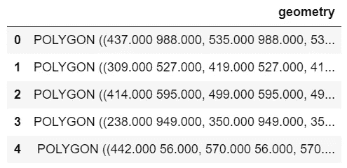
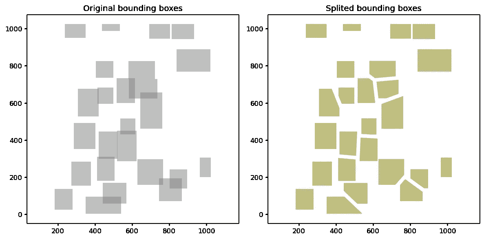

# 在 Python 中分割重叠的边界框

> 原文：<https://towardsdatascience.com/split-overlapping-bounding-boxes-in-python-e67dc822a285?source=collection_archive---------34----------------------->

## 从问题公式化到创建 PyPI 包，使用来自[全球小麦检测 Kaggle 竞赛](https://www.kaggle.com/c/global-wheat-detection)的数据进行测试，分 5 步完成教程。

在对象检测中，通常使用包围盒目标来识别图像中的对象。这些边界框有时可能会重叠。在一些像 **Mask RCNN** 的模型中，边界框被直接预测，边界框的重叠不成问题。另一种可能的方法是将边界框转换为遮罩，并使用语义分割模型，如 **U-Net** 。在这种情况下，如果最后你想分离单独的对象，重叠的遮罩可能是一个问题。

在这个故事中，我将讲述如何用 Python 开发一个算法来分离重叠的边界框，并在它们之间设置边距。我将使用来自全球小麦检测竞赛的数据。

请注意，我并不是说这种方法是小麦检测竞赛的最佳方法。将来，我可能会写另一个关于这个主题的故事。

## 目录

1.  问题定式化
2.  写数学
3.  用 Python 编写算法代码
4.  在现实问题中测试代码
5.  用 [fastai nbdev](https://github.com/fastai/nbdev) 创建一个 Python 包

## 1.问题定式化

让我们从考虑两个重叠边界框的情况开始。我们想要分开边界框，在它们之间留一些空白，如下图所示。

将两个边界框分开并留有一定边距的示例。图片由作者提供。

定义余量的程序如下:

*   考虑由点 A 和 B 定义的线——每个边界框的质心——我们称之为 AB。
*   然后考虑一条垂直于 A 和 B 之间中点的直线——设它为 ABp。
*   最后，上图中的两条线平行于 ABp，其距离由我们选择的边距值给出。

在第 4 节的后面，我将展示该代码可以很容易地应用于多个相交边界框的情况。

## 2.写数学

考虑下面的图像和等式，其中**粗体**符号表示向量。矢量 **AB** 就是在第一个等式中定义的从 A 到 B 的矢量。然后我们可以考虑一个垂直于 **AB** 的向量——我称之为**ABp**——使用第二个等式。最后，盒子 A 的边缘线上的点 M 可以由第三个等式定义。

边缘线的形成。图片由作者提供。

基本原理是:1)你从 A 开始；2)你向 **AB** 方向移动，但只到了中点的一半；3)你以因子 *m* 乘以 **AB** 方向的单位矢量，向同一个方向稍微向后移动；4)你到达的点就是我定义的 m 点。

使用点 M 和矢量 **ABp** it 直接定义边缘线，我将在下一节展示。

## 3.用 Python 编写算法代码

下面的函数接收两个边界框，并返回框 a 的切片区域。输入框为[形状良好的多边形](https://shapely.readthedocs.io/en/latest/)以及该函数返回的输出。现在让我们一行一行地深入代码。

*   第 1 行:输入是两个包围盒——类型为[形状多边形](https://shapely.readthedocs.io/en/latest/)的 **box_A** 和 **box_B** 。**边距**设置框之间的距离应该有多大，而 **line_mult** 只需要足够高，以保证线条完全穿过多边形。
*   第 3 行:向量 AB ( **vec_AB** )是用盒子的质心定义的。
*   第 4 行:类似于第 3 行，但垂直向量( **vec_ABp** )遵循第 2 节中的等式。
*   第 5 行:计算矢量 AB 的范数，因为稍后会用到它。
*   第 6 行:根据第 2 节的等式定义**分割点**(点 M)。
*   线 7:使用 shapely LineString 类定义线，该类允许定义给定两点的线。请注意，这些点也是形状优美的几何图形。因此，该线被定义为从点 M 减去矢量 ABp 的倍数直到点 M 加上矢量 ABp 的倍数。
*   第 8 行:一个 shapely 效用函数被用来将多边形一分为二。
*   第 10 行:对于第 8 行获得的每个多边形，检查是否包含中心点 a。
*   第 11–15 行:在这几行中，我分离了包含中心点的多边形(与此目的相关的一个)，并将其与另一个多边形(不包含中心点)和用于切片的线一起返回。额外返回的对象只是以防将来的应用程序会用到它。

## 4.在现实问题中测试代码

第 3 节中定义的代码仅适用于两个边界框。为了将它应用于几个边界框，我定义了下面的代码，现在我将简单解释一下。

*   **intersection _ list**-一个函数计算列表中所有多边形的交集。
*   **slice_all** —该函数接收包含图像所有边界框的[地理数据框](https://geopandas.org/reference/geopandas.GeoDataFrame.html)(见下表)作为输入，并为每个边界框调用 **slice_one** 。 **slice_one** 简单地对给定的 **box_A** 应用切片框功能，并考虑与之相交的所有框。当有几个相交的盒子时，使用 **intersection_list** 函数获得最终的多边形。

输入地理数据框的示例。图片由作者提供。

**slice_all** 的结果是一个类似的地理数据框，但带有切片框。下图显示了原始边界框(左)和 slice_all 的结果(右)。如您所见，原始数据中有几个重叠区域，但应用刚刚开发的方法后没有重叠区域。

原始边界框(左)和应用所述方法后的结果(右)。图片由作者提供。

## 5.用 fastai nbdev 创建一个 Python 包

fastai nbdev 可以说是创建 Python 包并将其上传到 PyPI 的最简单、最用户友好的方式。

*   当您开始一个新项目时，请转到 [nbdev](https://github.com/fastai/nbdev) instructions，并使用该链接为模板创建一个存储库。这会让你很容易开始。
*   然后你应该为你的本地机器克隆这个库，***pip install nbdev***并在项目目录下运行***nbdev _ install _ git _ hooks***。
*   现在你可以像往常一样打开 jupyter 笔记本了。 ***settings.ini*** 文件包含您需要填写的设置信息，例如项目名称、您的 github 用户名以及您的软件包要求。
*   nbdev 模板包括一个 ***index.ipynb*** 和一个***00 _ core . ipynb***。这个索引将是 GitHub***readme . MD***文件。
*   然后在 ***00_core.ipynb*** 上，你可以像往常一样开发你的代码，但是要记得在你的包 ***core.py*** 文件中的单元格顶部添加 *#export* 注释——这个文件是 nbdev 从笔记本上生成的。**你可以在他们的文档** **中详细阅读如何使用** [**nbdev。我强烈推荐！它将改变你编码的方式。**](https://nbdev.fast.ai/)
*   准备就绪后，您可以在终端上运行***nbdev _ build _ lib***和***nbdev _ build _ docs***。然后，您可以提交您的更改并推送到 github repo。检查回购，看看是否所有测试都通过了。导入外部包时，一个常见的错误是 ModuleNotFoundError。您需要将它们包含在 ***settings.ini*** 中的要求下，这样软件包将与所有需要的依赖项一起安装。
*   当一切正常时，你可以通过运行命令 ***make pypi*** 将你的包上传到 [PyPI](https://pypi.org/) 。但是，如果您以前没有这样做过，您需要在 PyPI 中创建一个帐户并设置一个配置文件(详细说明在 [nbdev 页面上，这里是](https://github.com/fastai/nbdev#adding-your-project-to-pypi))。

就是这样！我的包现在在 PyPI a[t https://pypi.org/project/splitbbox](https://pypi.org/project/splitbbox/)上，可以 pip 安装了。

## 结束语

*   生成上面图片的代码可以在[这个 Kaggle 内核](https://www.kaggle.com/mnpinto/boudingbox2mask-without-overlap)或者 [GitHub 库](https://github.com/mnpinto/splitbbox/blob/master/00_core.ipynb)中找到。
*   如果你对未来关于使用 [fastai2](https://github.com/fastai/fastai2) 进行[全球小麦检测 Kaggle 竞赛](https://www.kaggle.com/c/global-wheat-detection)的故事感兴趣，请通过突出显示这句话让我知道！

# 关于我

 [## 我的 3 年历程:从零 Python 到深度学习竞赛高手

### 自从 2017 年开始学习 Python 以来，我一直遵循的道路是成为一名独自参加 Kaggle 比赛的大师…

towardsdatascience.com](/my-3-year-journey-from-zero-python-to-deep-learning-competition-master-6605c188eec7) 

*感谢阅读！祝您愉快！*