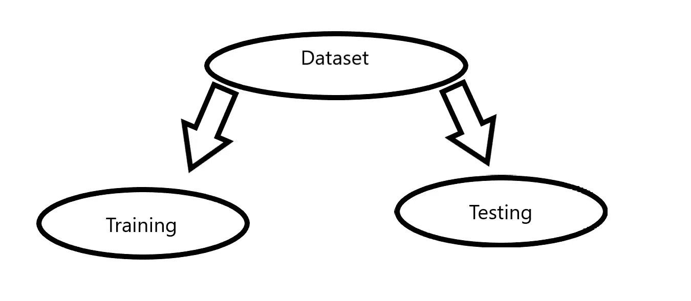

# 分割数据集

> 原文：<https://towardsdatascience.com/splitting-a-dataset-e328dab2760a?source=collection_archive---------6----------------------->

## 简要说明如何使用 sklearn 对数据集进行训练测试分割



作者图片

为了训练任何机器学习模型，无论使用哪种类型的数据集，都必须将数据集分为训练数据和测试数据。因此，让我们看看如何做到这一点？

在这里，我将使用 iris 数据集，并使用 sklearn 的“train_test_split”库对其进行分割

```
from sklearn.model_selection import train_test_splitfrom sklearn.datasets import load_iris
```

然后我将虹膜数据集加载到一个变量中。

```
iris = load_iris()
```

然后我用它将数据和目标值存储到两个独立的变量中。

```
x, y = iris.data, iris.target
```

在这里，我使用“train_test_split”以 80:20 的比例分割数据，即 80%的数据将用于训练模型，而 20%的数据将用于测试由此构建的模型。

```
x_train,x_test,y_train,y_test=train_test_split(x,y,test_size=0.2,random_state=123)
```

正如您在这里看到的，我在“train_test_split”中传递了以下参数:

1.  我们之前定义的 x 和 y
2.  test_size:设置为 0.2，因此定义测试大小为数据集的 20%
3.  random_state:它控制在应用分割之前应用于数据的混洗。将 random_state 设置为固定值将保证每次运行代码时生成相同的随机数序列。

当分割数据集时，有两个相互竞争的问题:
-如果你有较少的训练数据，你的参数估计有较大的方差。
-如果您的测试数据较少，您的性能统计就会有较大的差异。
数据应该这样划分，两者都不要太高，这更取决于你拥有的数据量。如果你的数据太小，那么没有分割会给你满意的方差，所以你必须做交叉验证，但是如果你的数据很大，那么你是选择 80:20 分割还是 90:10 分割真的没有关系(实际上你可以选择使用较少的训练数据，否则，它可能需要更多的计算)。