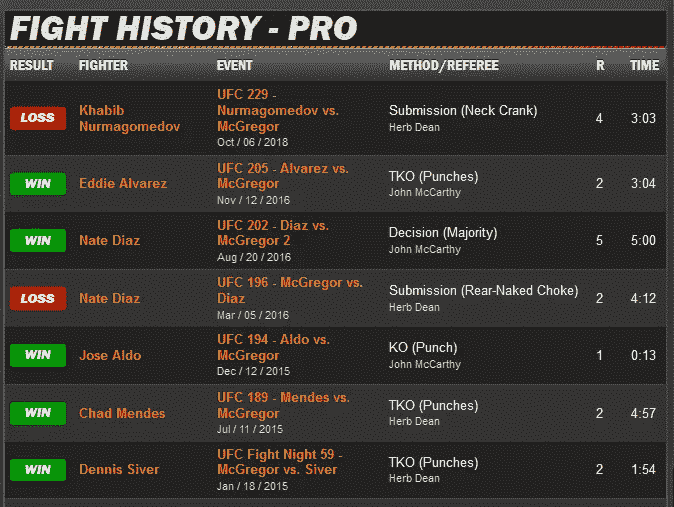
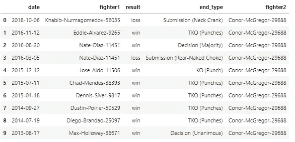
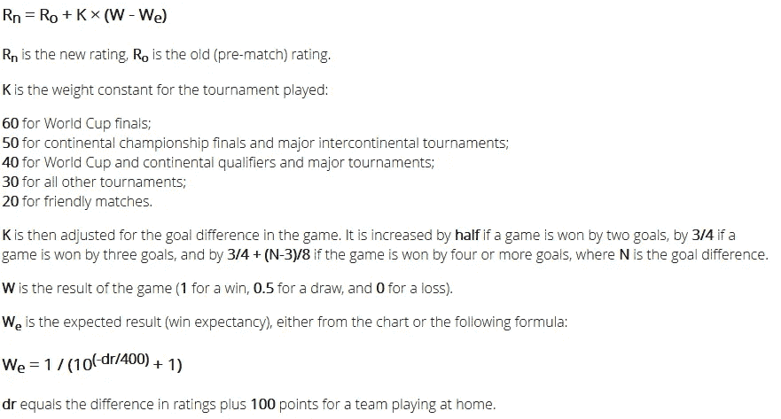
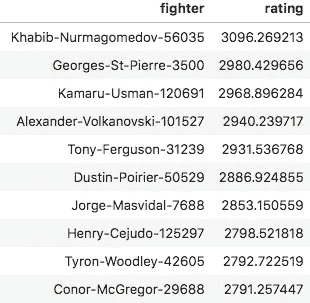
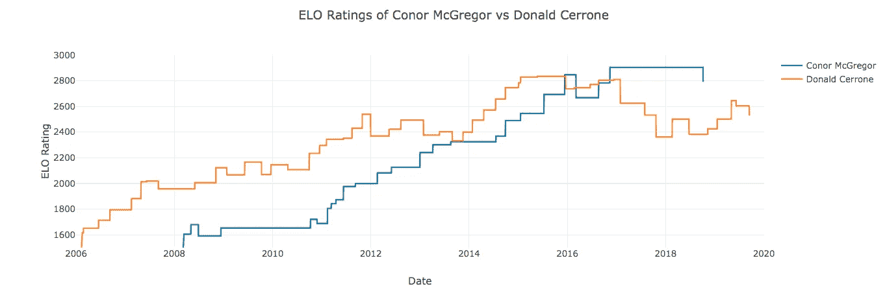

# 剧透警告:康纳·麦格雷戈 vs 牛仔？谁会赢？

> 原文：<https://towardsdatascience.com/spoiler-alert-conor-mcgregor-vs-cowboy-who-will-win-7c3eee6389b0?source=collection_archive---------18----------------------->

## 应用 Elo 评级系统预测 UFC 246

资料来源:ufc.com

2020 年 1 月 18 日，格斗运动中最大的赛事之一将在 UFC 246 举行。

综合格斗(MMA)历史上最受欢迎的拳手——**康纳·麦格雷戈**，将与粉丝最喜欢的——**“牛仔”唐纳德·塞罗恩**进行期待已久的对决。对于拳手、UFC 和下注的粉丝来说，将会有大量的金钱。

谁会赢？

**更新:这场战斗的结局符合我们的预测！**
观看赛后采访视频。

来源:[ufc.com](https://www.youtube.com/watch?v=6V0UxqD57WI)

与其随机下注，不如做一些数据科学的工作来预测赢家。

你准备好了吗？

是时候隆隆作响了！

## Elo 评级系统

[Elo 评分系统](https://en.wikipedia.org/wiki/Elo_rating_system)是一种计算零和游戏中玩家相对技能水平的方法。它主要用于国际象棋。但许多人已经在足球、篮球和拼字游戏等其他竞技游戏中应用了相同的算法。

在本文中，我们将使用 Python 基于 Elo 评级来预测这场 UFC 大战的获胜者。

## 收集数据

根据 Elo 评级系统，我们需要收集过去与 Conor 和 Cowboy 相关的所有打斗数据。我从 sherdog.com 那里搜集了历史资料。

这个过程从第[页开始，第](https://www.sherdog.com/fighter/Conor-McGregor-29688)页有康纳的战斗史。所有过去与他有关的打斗信息都被收集起来。此外，对于他的每个对手，所有与他们相关的战斗信息都是以类似的方式收集的。

资料来源:sherdog.com

鉴于康纳的一个对手(内特·迪亚兹)曾与牛仔打过仗，这些数据也包括了与牛仔有关的信息。最终我们会有康纳的对手，牛仔的对手，他们对手的对手等等的数据。

虽然 MMA 已经成为一项运动几十年了，但要收集整个数据集需要很长时间。所以当数据达到 36503 架，93778 架的时候我就停止了进程。对于我们的目的来说，这些数据应该足够了。

最后的数据如下所示:

来源:作者

## 应用 Elo 算法

Elo 算法的细节可以在[这里](http://www.eloratings.net/about)找到。

简而言之，该算法根据每个新的匹配更新战斗机的评级。下面的简单数学公式描述了这一过程:

资料来源:eloratings.net

*   **基本参数:K**

要调整的最重要的参数是 k。它决定在一场比赛后增加或减少多少评分点。更高的 K 值意味着更不稳定的评级。

举个例子，我们假设两个战士 A 和 b。

*战斗机 A 当前等级= 1500*

*B 战斗机当前等级= 1500*

假设他们之间的新一轮比赛以 A 获胜结束。我们需要相应地更新这两个拳手的评分。

当 K = 10 时:

战斗机 A 的新等级= 1500+10 *(1–0.5)= 1505

*战斗机 B 的新等级= 1500+10 *(0–0.5)= 1495*

当 K = 100 时:

*战斗机 A 的新等级= 1500+100 *(1–0.5)= 1550*

*战斗机 B 的新等级= 1500+100 *(0–0.5)= 1450*

我们可以看到，当 K 较大时，当新的信息进来时，战斗机的收视率变化快得多。

*   **额外参数:为 MMA 格斗定制**

一场 MMA 格斗有不同的结局。打架会以三种方式结束:

1.  结束——胜者在时间限制前通过击倒或提交来“结束”败者。
2.  一致决定——时限已过。三位评委一致认为获胜者是同一个拳手。
3.  分裂决策—时间限制已过。三位评委对获胜者的选择意见不一。占多数的战士获胜。

从胜利者的角度来看，一个完整的决定比一致的决定更令人印象深刻，而一致的决定比分裂的决定更令人印象深刻。

为了整合这些信息，我们在 K 中增加了三个乘数，关系如下:

*完成乘数≥一致决策乘数≥分裂决策乘数*

这些乘数有助于进一步区分不同战士的评级(基于他们结局的感人程度)。

例如，如果甲在终点击败了乙:

*战士 A 的新等级=战士 A 的当前等级+终结乘数* K *(1–We)*

*战士 B 的新等级=战士 B 的当前等级+完成乘数* K *(0–We)*

这样一来，战斗机 A 的收视率会比其他两种类型的结局上升更多。而战斗机 B 的收视率会比其他两种类型的结局下沉更多。

*   **参数选择**

首先，我们将参数的可能值范围设置如下:

*10 ≤ K ≤ 300*

*完成乘数≥ 1.0*

*一致决定乘数= 1.0*

*分割决策乘数≤ 1.0*

使用交叉验证方法测试了三个未决定参数 *(K、结束乘数、分割决定乘数)*的不同组合。

我们发现，就预测准确性而言，最佳值如下:

*K = 200**

*终点乘数= 1.05*

*一致决定乘数= 1.0*

*拆分决策乘数= 0.5*

**棒球、足球和象棋等运动的 K 值通常在 10 到 30 之间。K = 200 表明混合武术的收视率波动比其他运动大得多。*

既然我们已经完成了“无聊”的部分。我们可以简单地将参数值插入到 Elo 公式中，并用每个新的匹配更新战士的等级。

我们已经准备好看到结果了！

## 结果

*   **根据 Elo，谁是顶级拳手？**

根据算法，下面是我们的前 10 名战士:

名字后面的数字是战斗机的唯一标识符。来源:作者

尽管我们的数据包括所有组织的战士。排名前十的拳手都活跃在 UFC。这与 UFC 吸引最优秀的拳手的普遍观点不谋而合。

*   那么谁会赢得这场战斗呢？

现在我们也可以回答我们一开始问的问题了。康纳 vs 牛仔，谁会赢？

下图显示了两种战斗机的 Elo 等级:

来源:作者

尽管牛仔在过去更强大。康纳近年来的评分较高。

截至今天，康纳的收视率为 2791，而牛仔的收视率为 2529。康纳赢的几率是 82%！

来源:[giphy.com](https://giphy.com/gifs/mcgregor-conor-billionaire-C9DxGAnV0L8fm)

玩得开心！

***更多金钱和数据科学相关文章来自 Lianne & Justin:***

 [## 根据模拟，30 岁退休需要多少钱

### 很多人年纪轻轻就有辞掉工作的梦想，活在世上没有经济上的牵挂。怎么…

towardsdatascience.com](/how-much-do-you-need-to-retire-at-age-30-based-on-simulation-424fa9e0922b)  [## 买彩票的最佳时机是什么时候？

### 根据理性(或统计)分析

towardsdatascience.com](/when-is-the-best-time-to-buy-lottery-tickets-7735191b3c76)  [## 我将如何在我的狗身上花费 6 万多美元

### 我以前从未试图给我们的狗贴上价格标签。但是根据简单的分析，我最后会花…

medium.com](https://medium.com/@liannewriting/how-im-going-to-spend-over-60-000-on-my-dog-4860e5d8935c)