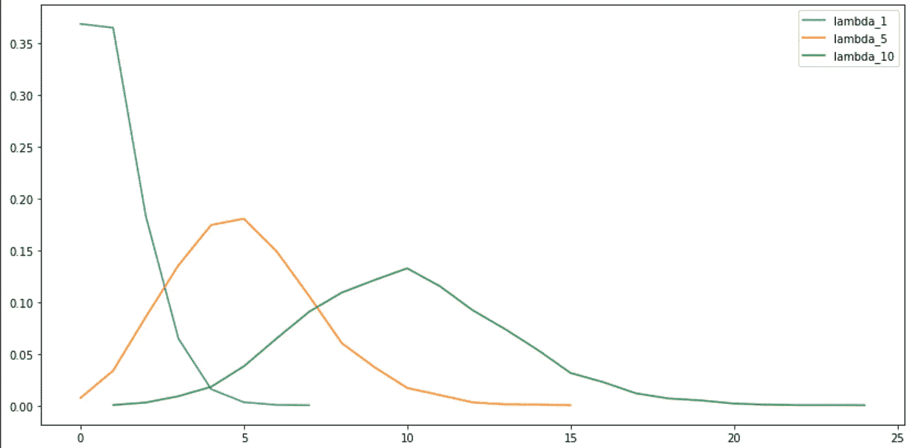
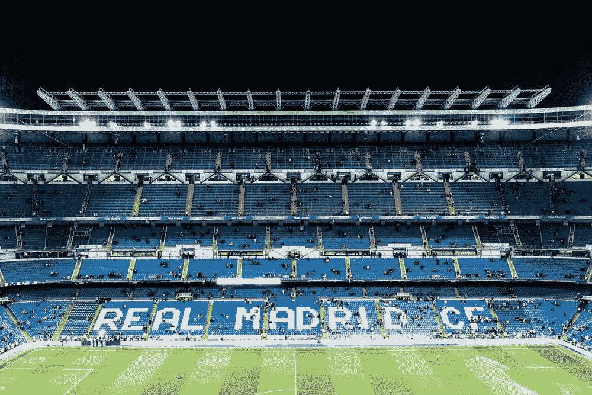
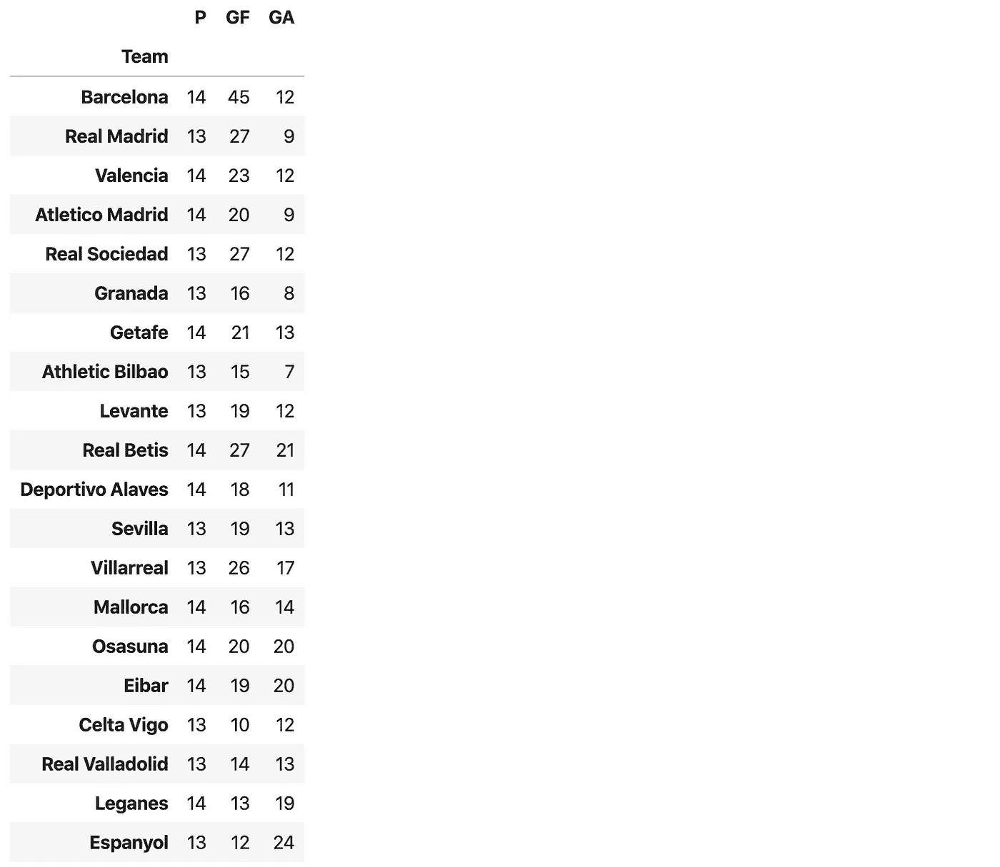
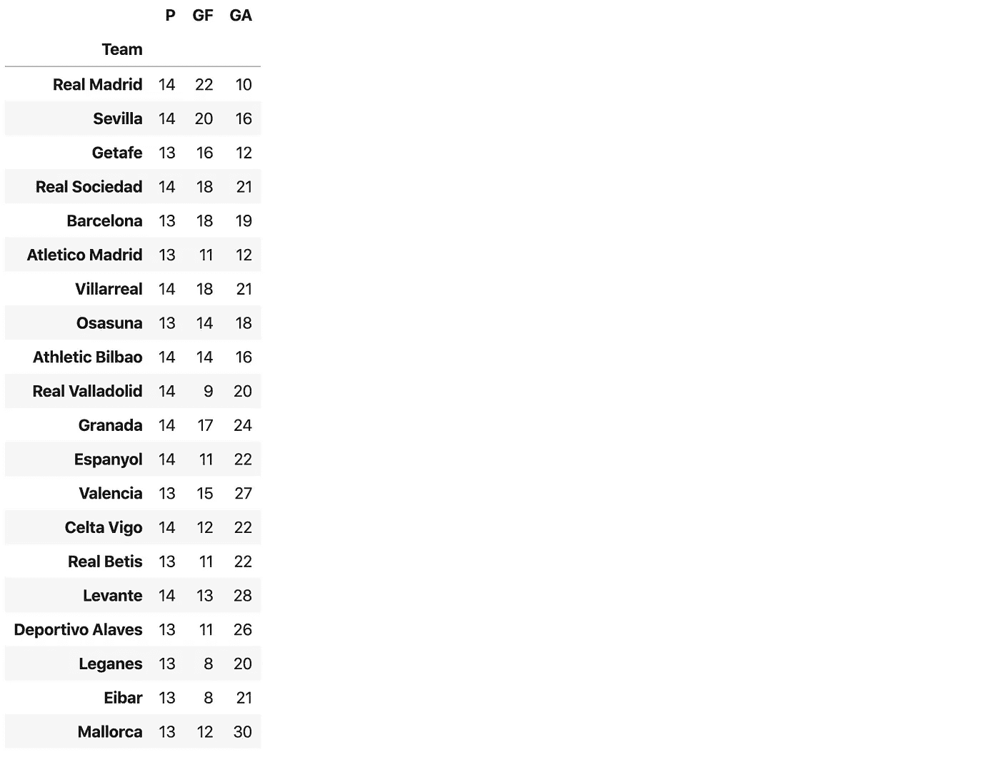
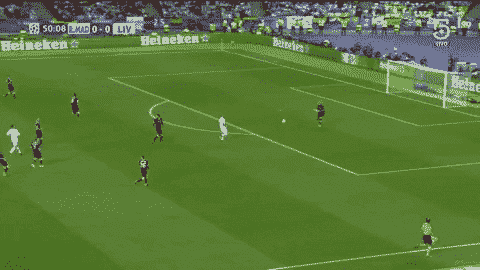
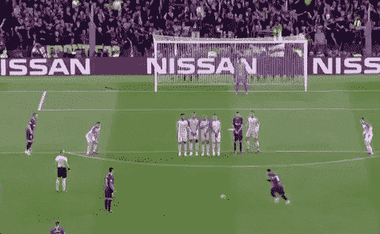
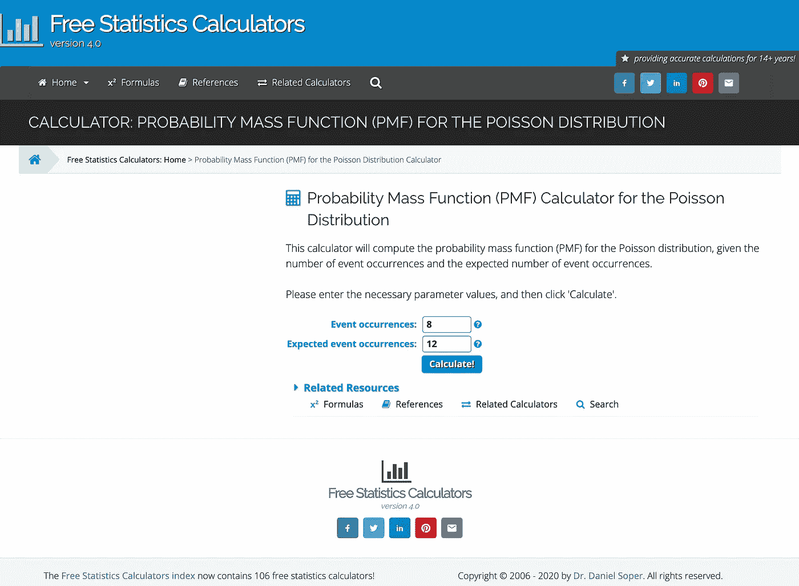
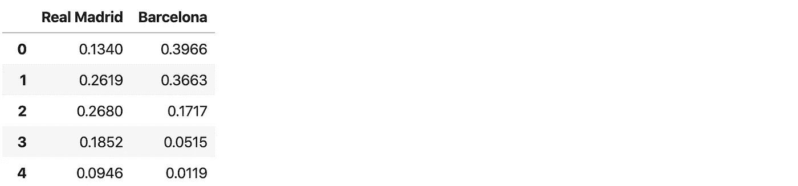
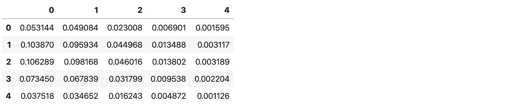
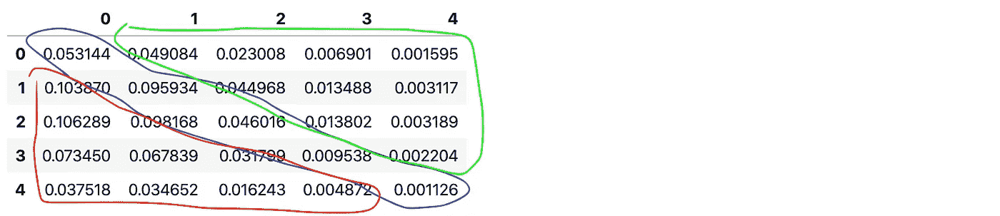

# 熊猫的体育分析

> 原文：<https://towardsdatascience.com/sports-analysis-with-pandas-real-vs-barca-94f85819bf6?source=collection_archive---------23----------------------->

## 如何计算足球比赛的赔率？这比你想象的要容易。不需要编码技能！


托马斯·塞勒在 [Unsplash](https://unsplash.com/s/photos/football?utm_source=unsplash&utm_medium=referral&utm_content=creditCopyText) 上的照片

你有没有想过足球比赛的赔率是如何计算的？那些 2.2 vs 3.1 的赔率是基于什么？我原以为这是一个复杂的过程，但令我惊讶的是，不用写任何代码就可以计算出概率和赔率。我在下面的例子中使用熊猫是因为我精通它，但是你也可以在 Excel 中甚至用计算器做同样的事情。

我写了大量关于熊猫数据分析的文章。看看我的熊猫系列:

[](https://medium.com/@romanorac/pandas-data-analysis-series-b8cec5b38b22) [## 熊猫数据分析系列

### 从提示和技巧，如何不指南到与大数据分析相关的提示，熊猫文章的精选列表。

medium.com](https://medium.com/@romanorac/pandas-data-analysis-series-b8cec5b38b22) 

# 如何计算概率？

> 一定数量的目标的概率用泊松分布计算，泊松分布以法国数学家西蒙·丹尼斯·泊松命名。

泊松分布是一种离散概率分布，它表示在固定时间间隔内发生的给定数量的事件的概率，如果这些事件以已知的恒定平均速率发生，并且与自上次事件以来的时间无关。

让我们用通俗的语言来解释这一点。离散概率分布给出了离散事件在 0 和 1 之间的概率，如足球示例中的进球数。一场足球比赛有一个固定的时间间隔(90 分钟的比赛)，进球以一个已知的恒定平均速率出现(我们可以计算出预期的进球数量)。一个目标也独立于前一个目标。

下图是泊松分布的概率质量函数(PMF ),显示了预期发生次数为 1、5 和 10 的事件的概率。简单来说，一支平均进 1 球的足球队，有一个:

*   36%的概率没有进球，
*   1 球 36%的概率，
*   18%概率 2 球等。



λ1、5 和 10 的泊松分布。

# El Clásico -谁有望获胜？



维也纳·雷耶斯在 [Unsplash](https://unsplash.com/s/photos/real-madrid?utm_source=unsplash&utm_medium=referral&utm_content=creditCopyText) 上拍摄的照片

让我们来计算一下永远的对手巴塞罗那和皇家马德里之间潜在对决的概率。这场比赛将在圣地亚哥伯纳乌进行，这意味着皇家马德里将在主场作战。

在我们可以使用泊松分布来估计概率之前，我们需要计算每支球队在比赛中可能得分的预期数量。

> 通过确定球队的进攻实力和防守实力来计算每支球队可能得分的预期目标数。

我根据 2019/2020 赛季西班牙 LaLiga 的在线统计数据组成了数据集。有两个数据集，一个用于主场比赛，一个用于客场比赛，其中:

*   p——玩游戏的次数，
*   GF——进球数，
*   GA——失球数。



拉利加 2019/2020 赛季主场统计。



拉利加 2019/2020 赛季客场数据。

## 攻击强度

计算进攻强度的第一步，我们计算联赛主客场球队的平均进球数。这是总进球数除以主客场比赛总数。

主场平均进球数:1.50。

**平均客场进球数:1.02。**

第二步，我们需要确定一支球队的进攻实力有多强。我们计算每支球队的平均进球数，然后除以赛季的平均进球数。

记住这场比赛是在圣地亚哥伯纳乌，所以皇马主场作战，巴塞罗那客场作战。皇马进了 27 个球，打了 13 场主场比赛。Real 的攻击强度是 1.37。

```
real attack strenght = 27 / 13 / 1.50
```

巴萨进了 18 个球，打了 13 场客场，所以攻击强度是 1.34。

```
barca attack strenght = 18 / 13 / 1.02
```

## 防御力量

进攻实力重在进球，防守实力重在失球。平均值是从上面的攻击强度简单倒置而来的:

**主场平均失球数:1.02 个。**

平均失球数:1.50 个。

竞争对手在 13 场主场比赛中对皇家马德里队进了 9 个球。皇马的主场防守强度为 0.67，巴萨的客场防守强度为 0.96。

```
real defense strenght = 9 / 13 / 1.02
barca defense strenght = 19 / 13 / 1.50
```

## 皇马有可能进多少球？



Gif 来自 [giphy](https://giphy.com/gifs/televisadeportes-real-madrid-liverpool-sRGEZCqd1q02ieKokd)

把这些数字放在一起，我们可以计算出皇马的预期进球数。我们只是简单地将皇马的主场进攻实力与巴萨的客场防守实力乘以在拉利加主场作战时的平均进球数。

```
expected goals for real = 1.37 * 0.96 * 1.50
```

皇马有望进 2.01 球。

## 巴萨有可能进几个球？



Gif 来自 [giphy](https://giphy.com/gifs/messi-goal-fk-8cyro9Vo2FNhZ5mucq)

使用与上述相同的程序，只是改变家与客场。我们用客场打拉利加时的平均进球数乘以巴萨的客场进攻实力和皇马的主场防守实力。

```
expected goals for barca = 1.34 * 0.67 * 1.02
```

巴萨有望进 0.93 球。

## 使用泊松分布预测结果



泊松分布在线[计算器](https://www.danielsoper.com/statcalc/calculator.aspx?id=79)

您可以使用在线[计算器](https://stats.areppim.com/calc/calc_poisson.php)计算泊松分布，以确定事件的概率。将巴萨的 ***平均发生率*** 设置为 0.93 目标，然后将 ***发生次数*** 设置为 0 到 5。我用熊猫来计算多种结果的概率。

下表显示皇马有 26%的机会进 2 球。



上表中的概率是独立的，这意味着我们可以将它们相乘，并计算多个结果的概率。横排的进球是皇马的，横排的是巴萨的。结果 2:0 对皇马有 10%的机会。



**计算赔率**

为了计算概率，我们需要计算每一个平局的结果(0:0，1:1，等等。)然后将这些概率相加。平局的几率很简单:



平局结果用蓝色标记，真正的胜利用红色标记，巴塞罗那获胜用绿色标记。

```
odd for draw = 1 / sum( all draw outcomes)
```

为了计算真实获胜的几率，我们对真实获胜的每一个结果重复这个过程(1:0，2:0，等等。)巴萨也一样。

最终的可能性是:

*   真实胜率:1.6
*   平局:4.85
*   巴萨获胜:6.14

请注意，这些赔率没有博彩保证金。

# 在你走之前

如果你想自己运行这些例子，你可以下载这个 [Jupyter 笔记本](https://github.com/romanorac/romanorac.github.io/blob/master/assets/notebooks/Sport%20analysis%20pandas.ipynb)。

在 [Twitter](https://twitter.com/romanorac) 上关注我，在那里我定期[发布关于数据科学和机器学习的](https://twitter.com/romanorac/status/1328952374447267843)消息。


康特尼·赫格尔在 [Unsplash](https://unsplash.com/?utm_source=medium&utm_medium=referral) 上拍摄的照片