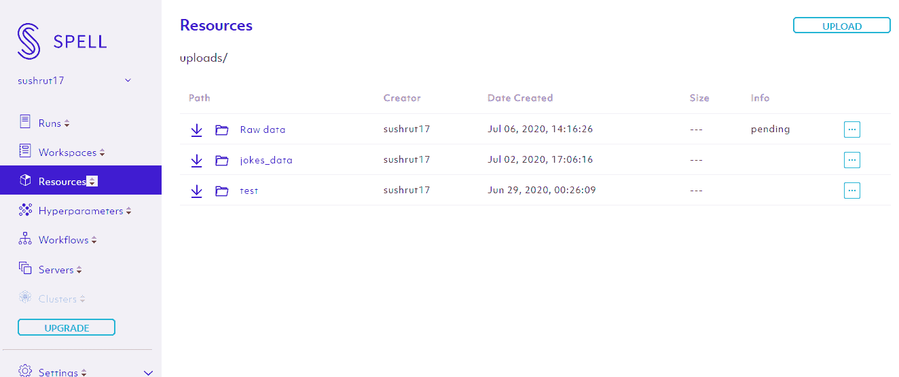
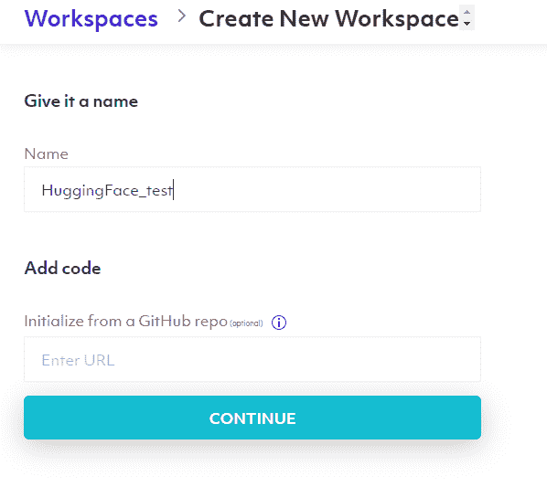
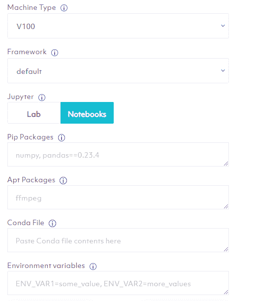

# 使用 HuggingFace 的 GPT-2 模块生成体育文章

> 原文：<https://towardsdatascience.com/sports-article-generation-with-huggingface-157314eadd9e?source=collection_archive---------40----------------------->

自然语言处理(NLP)将机器学习的应用扩展到了一个全新的领域。谁会想到统计模型可以应用于我们每天看到的文本，以产生商业见解和预测？在过去的两年里，NLP 经历了前所未有的复兴。

在 NLP 的先进方法中，人们对语言生成模型产生了极大的兴趣。Open AI 的 GPT-2 模型中的自动回归功能使得新的文本序列能够非常接近地代表人类思维的想法、说法和文字。这些基于变压器的神经网络模型显示出在提出令人信服的人类长篇文本方面的前景。

在这篇文章中，我们看看如何使用 HuggingFace 的 GPT-2 语言生成模型来生成体育文章。为了满足这个计算密集型任务，我们将使用来自 [Spell.ml](https://spell.ml/) MLOps 平台的 GPU 实例。


由[泰勒·安德森](https://unsplash.com/@tyleranderson_?utm_source=medium&utm_medium=referral)在 [Unsplash](https://unsplash.com?utm_source=medium&utm_medium=referral) 上拍摄的照片

**法术入门**

如上所述，语言生成模型在计算上可能变得很昂贵，并且对于具有 CPU 的普通机器来说不可能处理它们。为了解决这个问题，我们使用了 Spell 的 GPU 支持的 Jupyter 笔记本。Spell 是一个强大的机器学习和深度学习的 MLOps 平台。它负责基础设施，从而使开发人员和企业能够专注于简单、快速和有组织地执行他们的机器学习模型。

使用 Spell 进行设置非常简单。只需访问[https://spell.ml/](https://spell.ml/)并创建一个新账户。Spell 的每个新用户都可以获得 10 美元的免费使用积分。

在本练习中，我们将使用 UCI 机器学习库中的体育文章数据集。它包含 1000 个文本文件，每个文件中都有一篇体育文章。要上传文本文件，请在您的终端或命令提示符窗口中登录到 Spell，并导航到您解压缩文件的父文件夹，然后键入:

```
spell upload ‘Raw data’
```

这将把所需的文本文件上传到 Spell 的参考资料部分。[在这里了解更多关于上传文件到法术资源的信息](https://spell.ml/docs/resources/#uploading-resources)。



要打开 Jupyter 笔记本，请登录到拼写 web 控制台，然后单击工作区>创建工作区。

给这个新工作区起一个您自己选择的名字，然后点击 Continue。



在下一个屏幕中，Spell 为您提供了多个选项来定义您想要在其中运行代码的环境。例如，在“机器类型”下，您可以根据您的用途和预算从各种 CPU 和 GPU 选项中进行选择。此外，您可以在设置 Jupyter 之前选择要安装的框架、环境变量和库。

就本项目而言，我们在机器类型下选择“V100 ”;朱庇特名下的笔记本。



在下一个屏幕中，让我们单击“启动服务器”开始。完成后，我们会发现一个 Jupyter 基础架构，类似于我们在本地机器上的基础架构。点击新建> Python3。

**语言生成算法概述**

让我们从 HuggingFace 安装“变形金刚”并加载“GPT-2”模型。

```
!pip install -q git+https://github.com/huggingface/transformers.git!pip install -q tensorflow==2.1import tensorflow as tf
from transformers import TFGPT2LMHeadModel, GPT2Tokenizer

tokenizer = GPT2Tokenizer.from_pretrained("gpt2")

# add the EOS token as PAD token to avoid warnings
model = TFGPT2LMHeadModel.from_pretrained("gpt2", pad_token_id=tokenizer.eos_token_id)
```

这两个对象让你使用预先训练的 GPT-2。一般来说，我们利用 GPT-2 或 transformers 的方式是指定一个输入字符串/短语，这基本上是您文章的开头。然后，算法预测下一组单词，使它们与给定的初始字符串一致。

让我们试着理解不同类型的算法，以及 GPT-2 如何能够得出最像人类的文本段落。

先说贪婪搜索算法，这是单词预测的简单化方法之一。基于初始字符串，该算法贪婪地搜索最可能的下一个单词。使用这个新字符串，它基本上是初始字符串加上预测的单词，预测下一个单词。这个过程不断重复，直到我们得到想要的单词数。这种方法的缺点是，在文本的几行/几个单词之后，单词开始重复。这是因为它错过了隐藏在低概率单词后面的高概率单词。

波束搜索通过每次保持预定义数量的假设，并最终选择具有总体最高概率的假设来减轻这种情况。但是经过几次实验，发现它仍然存在可重复性的问题。

语言生成的最佳算法之一是采样算法。使用采样的语言生成是不确定的，因为它根据条件概率分布随机选取下一个单词。但是，据观察，考虑到随机性，采样有时会产生听起来不像人类的文本段落。

解决这个问题的一个技巧是在给定前一个 *i* 单词的情况下，锐化下一个单词的预测分布。在锐化的同时，我们还在绘制随机样本；但是另外，我们增加了高概率单词被选取的可能性，并且降低了低概率单词被选取的可能性。

另一个转变是引入 Top-K 采样，其中 K 个最可能的下一个单词被过滤，并且概率质量在这 K 个下一个单词中重新分配。这一简单而强大的概念被纳入 GPT-2 模型，是其成功的主要原因之一。GPT-2 模型的另一个补充是原子核取样。该模型不是只从最可能的 K 个单词中取样，而是从累积概率超过预定义概率 *p* 的最小可能单词集中进行选择。这个特性的引入确保了单词集的大小可以根据下一个单词的概率分布动态地增加和减少。

**使用 GPT-2 模型生成体育文本的示例**

了解了它的内部工作原理后，让我们深入了解 GPT-2 模型的工作原理和性能。请注意，在这一点上，我们使用的是 GPT-2 模型，而不是使用我们之前下载的体育数据。当我们在下一节中微调模型时，我们将更多地研究如何使用这些数据。

下面的代码演示了 GPT-2 采用的采样技术。“input_ids”是指给予模型的初始字符串。通过将' do_sample '指定为 True，我们告诉模型使用采样技术。“最大长度”对应于物品的期望长度。‘top _ K’和‘top _ p’分别对应于 K 个单词和核概率 p。最后，我们将名为“num_return_sequences”的参数指定为 2。这使用相同的初始字符串生成了两个不同的段落，并给了我们一个选项来选择我们更喜欢的输出。

```
#initial string
input_ids = tokenizer.encode('Manchester City agree deal to sell Leroy Sane', return_tensors='tf')

# set seed to reproduce results. Feel free to change the seed though to get different results
tf.random.set_seed(0)

# set top_k = 50 and set top_p = 0.95 and num_return_sequences = 3
sample_outputs = model.generate(
    input_ids,
    do_sample=True, 
    max_length=100, 
    top_k=50, 
    top_p=0.45, 
    num_return_sequences=3 )

print("Output:\n" + 100 * '-')
for i, sample_output in enumerate(sample_outputs):
  print("{}: {}".format(i, tokenizer.decode(sample_output, skip_special_tokens=True)))
```

以下是输出结果:

```
0: Manchester City agree deal to sell Leroy Sane

The Gunners are ready to sign Leroy Sane, who has been on loan at Tottenham for the past three seasons, from Chelsea.

The 21-year-old, who is in his first season at the club, has scored five goals in 14 games for the Blues this season.

The former Arsenal and Chelsea striker has been a target for Chelsea since he joined from Southampton in January 2013.

The deal is

1: Manchester City agree deal to sell Leroy Sane

Manchester City have agreed a £30million deal to sell Leroy Sane to Manchester United for £30million.

The move was confirmed by City sources.

Sane, 24, has scored nine goals in 20 Premier League appearances for the club since joining from Manchester United in January 2014.

He has scored seven goals in 16 Premier League appearances for United since joining from Manchester United in January 2014.
```

**定制 GPT-2:体育文章数据微调**

看了输出，我们可以说 GPT-2 已经能够把一个有凝聚力的文本放在一起。然而，它产生的事实陈述缺乏准确性。还有，整个段落没有给我们很运动的感觉。为了解决这些问题，我们试图训练和微调 GPT-2 特别是体育文章，而不是使用它。我们将使用我们之前上传的运动数据集。

我们的第一项工作是将文章整理成一个文本文件。为了做到这一点，我们启动了一个新的 Jupyter 笔记本。单击“文件”选项卡，然后单击“添加装载”。转到上传并选择您刚刚上传的“原始数据”文件夹。

回到笔记本，执行下面的代码来阅读文本文件并整理它们。

```
mypath = 'Raw data/'
import os
from os import listdir
from os.path import isfile, join
onlyfiles = [f for f in listdir(mypath) if isfile(join(mypath, f))]article_list = ''
for i in range(len(onlyfiles)):
  if onlyfiles[i][-3:] == 'txt':
    try:
      with open('Raw data/' + onlyfiles[i], 'r') as file:
        data = file.read()
      article_list = article_list + '\n' + data
    except:
      pass
```

完成后，我们需要使用字符串包中的' printable '函数过滤掉所有不属于 ASCII 的字符。

```
import string
article_list_str = ''.join(filter(lambda x: x in string.printable, article_list))
```

一旦数据达到所需的格式，让我们继续构建模型。我们安装“transformers”包并导入所需的包。

```
!pip install transformersimport logging
import os
import pickle
import random
import torch
import torch.nn as nn
import transformers
from torch.utils.data import DataLoader, Dataset, RandomSampler, SequentialSampler
from transformers import (
    GPT2Config,
    GPT2LMHeadModel,
    GPT2PreTrainedModel,
    GPT2Tokenizer,
    PreTrainedModel,
    PreTrainedTokenizer,
)

MODEL_CLASSES = {"gpt2": (GPT2Config, GPT2LMHeadModel, GPT2Tokenizer)}

logger = logging.getLogger(__name__)
```

接下来，我们定义一个类“SportsData”来微调体育数据集并获取其中的令牌。

```
class SportsData(Dataset):
    def __init__(
        self,
        tokenizer: PreTrainedTokenizer,
        #file_path: str,
        block_size=512,
        overwrite_cache=False,
    ):
        #assert os.path.isfile(file_path)

        block_size = block_size - (
            tokenizer.max_len - tokenizer.max_len_single_sentence
        )

        # change if args are added at later point
        cached_features_file = os.path.join(
           "gpt2" + "_" + str(block_size) + "_file.txt" 
        )

        if os.path.exists(cached_features_file) and not overwrite_cache:
            logger.info(
                f"Loading features from your cached file {cached_features_file}"
            )
            with open(cached_features_file, "rb") as cache:
                self.examples = pickle.load(cache)
                logger.debug("Loaded examples from cache")
        else:
            logger.info(f"Creating features from file")

            self.examples = []

            text = article_list_str
            tokenized_text = tokenizer.convert_tokens_to_ids(tokenizer.tokenize(text))

            for i in range(0, len(tokenized_text) - block_size + 1, block_size):
                self.examples.append(
                    tokenizer.build_inputs_with_special_tokens(
                        tokenized_text[i : i + block_size]
                    )
                )

            logger.info(f"Saving features into cached file {cached_features_file}")
            with open(cached_features_file, "wb") as cache:

                pickle.dump(self.examples, cache, protocol=pickle.HIGHEST_PROTOCOL)

    def __len__(self):
        return len(self.examples)

    def __getitem__(self, item):
        return torch.tensor(self.examples[item], dtype=torch.long)
```

最后，我们启动定制模型的训练并保存模型。

```
device = 'cpu'
if torch.cuda.is_available():
    device = 'cuda' tokenizer = GPT2Tokenizer.from_pretrained('gpt2-medium')
model = GPT2LMHeadModel.from_pretrained('gpt2-medium')
model = model.to(device)

dataset = SportsData(tokenizer= tokenizer )
article_loader = DataLoader(dataset,batch_size=1,shuffle=True)

BATCH_SIZE = 1
EPOCHS = 1
LEARNING_RATE = 0.0002
WARMUP_STEPS = 5000

from transformers import AdamW, get_linear_schedule_with_warmup

model = model.to(device)
model.train()
optimizer = AdamW(model.parameters(), lr=LEARNING_RATE)
scheduler = get_linear_schedule_with_warmup(optimizer, num_warmup_steps=WARMUP_STEPS, num_training_steps=-1)
script_count = 0
sum_loss = 0.0
batch_count = 0

for epoch in range(EPOCHS):
    print(f"EPOCH {epoch} started" + '=' * 30)
    for idx,script in enumerate(article_loader):
        outputs = model(script.to(device), labels=script.to(device))
        #outputs = torch.tensor(tokenizer.encode(script)).unsqueeze(0).to(device) 
        loss, logits = outputs[:2]                        
        loss.backward()
        sum_loss = sum_loss + loss.detach().data

        script_count = script_count + 1
        if script_count == BATCH_SIZE:
            script_count = 0    
            batch_count += 1
            optimizer.step()
            scheduler.step() 
            optimizer.zero_grad()
            model.zero_grad()

        if batch_count == 200:
            model.eval()
            print(f"sum loss {sum_loss}")
            sample_outputs = model.generate(
                                    bos_token_id=random.randint(1,30000),
                                    do_sample=True,   
                                    top_k=50, 
                                    max_length = 1000,
                                    top_p=0.95, 
                                    num_return_sequences=1
                                )

            print("Output:\n" + 100 * '-')
            for i, sample_output in enumerate(sample_outputs):
                  print("{}: {}".format(i, tokenizer.decode(sample_output, skip_special_tokens=True)))

            batch_count = 0
            sum_loss = 0.0
            model.train()output_dir = 'Raw data/'

from transformers import WEIGHTS_NAME, CONFIG_NAME
output_model_file = os.path.join(output_dir, WEIGHTS_NAME)
output_config_file = os.path.join(output_dir, CONFIG_NAME)

torch.save(model.state_dict(), output_model_file)
model.config.to_json_file(output_config_file)
tokenizer.save_vocabulary(output_dir)
```

现在，我们已经准备好了微调的模型，我们导入它并测试它如何针对我们之前使用的相同输入字符串工作。

```
model = GPT2LMHeadModel.from_pretrained(output_dir)
tokenizer = GPT2Tokenizer.from_pretrained(output_dir)

input_ids = tokenizer.encode('Manchester City agree deal to sell Leroy Sane', return_tensors='pt')

sample_outputs = model.generate(
                        input_ids= input_ids,
                        do_sample = True,
                        #num_beams= 5,
                        max_length = 100,
                        top_k = 50,
                        top_p=0.85, 
                        num_return_sequences=1
                    )

print("Output:\n" + 100 * '-')
for i, sample_output in enumerate(sample_outputs):
      print("{}: {}".format(i, tokenizer.decode(sample_output, skip_special_tokens=True)))
```

以下是输出结果:

```
Output:
----------------------------------------------------------------------------------------------------
0: Manchester City agree deal to sell Leroy Sane to Liverpool

Leroy Sane was among three players who were sold this summer and Liverpool boss Brendan Rodgers admitted he felt the need to replace the former Manchester City winger.

"We sold four players last year and I know I had to get another player in to improve our squad," Rodgers told Sky Sports News HQ.

"We had to sell players and a few of them we did but it was Leroy Sane.
```

我们注意到这段文字不仅听起来像人类，而且更流畅。经理的引语尤其给了这段文字一种更加真实的感觉，使它看起来非常类似于一篇真正的手写文章。请注意，增加“max_length”的值将允许我们获得更长的文本。

请注意，事实仍然不是完全正确的，但这些可以用我们的知识迅速纠正。重要的是，我们已经能够摆脱手工书写的过程。只要运行这个命令，编辑一些可能存在的事实差异，瞧，你就完成了。

要试用本教程，请使用[此链接](https://web.spell.ml/refer/sushrut17)登录 Spell 的 MLOps 平台，并在创建帐户后获得 10 美元的免费 GPU 点数。另外，请随时在这个[链接](https://chat.spell.ml/)上发布您的问题和疑问。

**参考文献:**

[https://colab . research . Google . com/github/hugging face/blog/blob/master/notebooks/02 _ how _ to _ generate . ipynb # scroll to = MQ huo 911 wft-](https://colab.research.google.com/github/huggingface/blog/blob/master/notebooks/02_how_to_generate.ipynb#scrollTo=mQHuo911wfT-)

[https://github . com/cdpierse/script _ buddy _ v2/tree/master/script _ buddy](https://github.com/cdpierse/script_buddy_v2/tree/master/script_buddy)