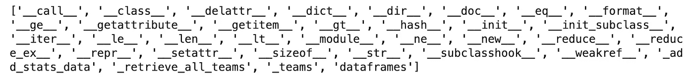
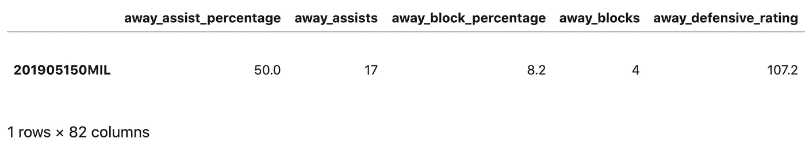
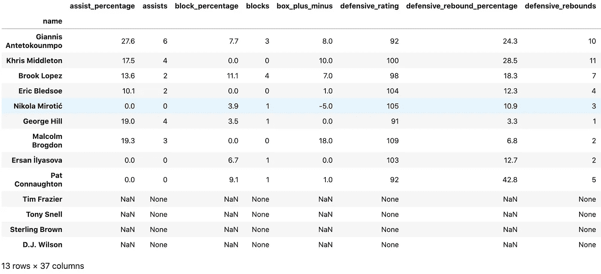
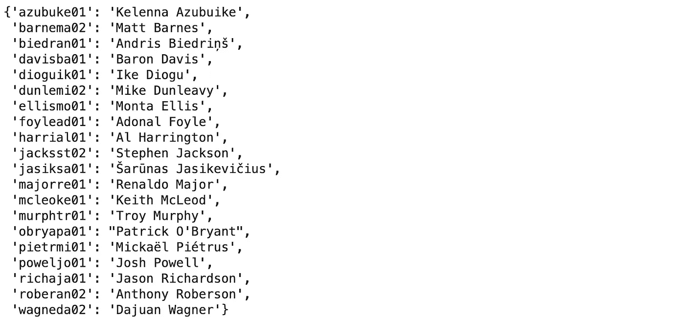
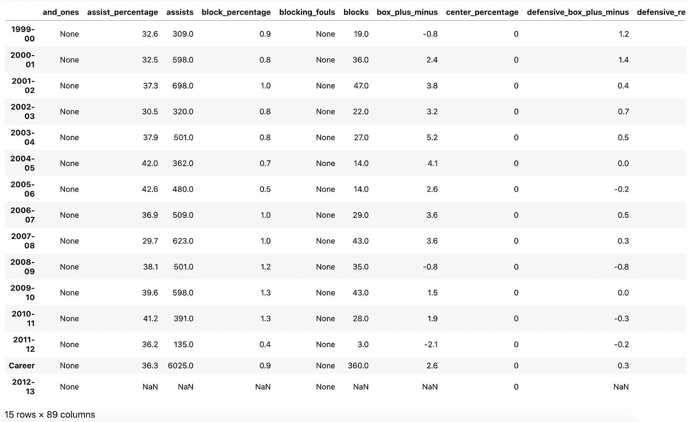

# 体育参考 API 简介

> 原文：<https://towardsdatascience.com/sports-reference-api-intro-dbce09e89e52?source=collection_archive---------15----------------------->

## 如何建立令人敬畏的体育数据集


照片由 [JC Gellidon](https://unsplash.com/@jcgellidon) 在 [UnSplash](https://unsplash.com/) 拍摄

这是我每周体育主题系列的第二部分。每周，我都会展示以体育为中心的数据科学应用。

上周，在我的文章[战胜困难](/beating-the-odds-8d26b1a83f1b)中，我展示了如何使用[体育参考 API](https://sportsreference.readthedocs.io/en/stable/) 建立一个关于 NBA 球队的数据集，然后使用该数据集找到那些超过常规赛积分差距的球队。本周我想深入探讨如何使用这个 API 为您的项目构建全面的数据集。

当我在网上浏览体育数据项目时，我看到很多人求助于从不同的来源下载表格，手动或通过网络搜集。然后通常需要将这些表连接起来，这是一个非常繁琐的过程，高度依赖于数据的质量。以这种方式构建大型数据集可能需要几天甚至几周的时间。不要成为那个人！令人欣慰的是，Sports Reference 的出色工程师构建了一个 API，可以方便快捷地访问 Sports Reference 关于 MLB、NBA、NFL、NHL、NCAAF、NCAAB 和世界各地许多足球联盟的海量数据库。

要开始使用 Sports Reference API，您需要使用`pip install sportsreference`像安装任何其他 python 包一样安装它。

Sports Reference API 的基本思想是使用模块来实例化类对象，这些类对象包含类属性中的相关数据。所有运动中常见的基本模块是团队、时间表、比分、花名册和运动员。NCAAB 和 NCAAF 也有排名和会议的模块。Football(英式足球)使用稍微不同的命名约定，但是一般的 API 结构是相同的。在后端，这些模块通过发送 HTTP 请求从 Sports Reference 的服务器上查询相关数据来创建类对象。没有必要担心把 100 年的棒球赛比分数据塞满你的硬盘(尽管我认为如果你真的想的话，你可以用 API 来做这件事)。

在接下来的部分中，我将展示 NBA API 的特性。如果你对另一项运动感兴趣，我鼓励你继续下去，因为基本的特征和过程本质上是一样的。该代码旨在在 Jupyter 笔记本上执行，但也可以很容易地适用于其他环境。

# 组

让我们从团队模块开始。以下命令创建 Teams 类的一个实例，并打印出它的所有方法和属性。

```
from sportsreference.nba.teams import Teamsteams2020 = Teams(year = '2020')
print(dir(teams2020))
```



团队类方法和属性

Teams 类的唯一公共属性是“dataframes”。该属性是一个 30 x 47 的数据帧，其中 2020 年的每个 NBA 球队都由一行表示。栏目包括得分、罚球次数、对手进攻篮板等。“dataframes”属性通常是访问高级团队信息的最简单方法。然而，也可以使用 Teams 类的实例作为迭代器。例如，下面的代码打印出每个队的名称和得分。团队数据框架的每一列也可以作为团队属性以这种方式访问。

```
for team in teams2020:
    print(team.name, 'Points Scored:', team.points)
```

# 日程安排

顾名思义，Schedule 模块用于访问关于团队日程的信息。这非常有用，因为 Teams 模块不包含关于赢/输记录的信息。让我们为密尔沃基雄鹿队 2019 赛季创建一个类的实例，并使用它返回一个包含每场比赛基本信息的数据帧。

```
from sportsreference.nba.schedule import Schedulemil2019 = Schedule('MIL', year = '2019')
mil2019.dataframe.head()
```


密尔沃基雄鹿队 2018-2019 赛季的前 5 场比赛

注意 boxscore_index 列，这些 boxscore 索引可以与 boxscore 类一起使用，以获得更详细的游戏信息。与 Teams 模块类似，Schedule 类的实例也可以用作迭代器。最后，Schedule 类有一个“dataframe_extended”属性，它返回一个 dataframe，其中每一行都是 Boxscore 类的一个实例。这为每个游戏提供了更丰富的数据，但由于构建了许多 Boxscore 类的实例，每个实例都需要单独的服务器请求，因此处理时间要长得多。

# Boxscore

让我们仔细看看密尔沃基雄鹿队 2019 年东部决赛第一场对阵多伦多猛龙队的比赛。从我们的时间表数据框架中，我们可以发现这场比赛的 boxscore_index 是“201905150MIL”。

```
from sportsreference.nba.boxscore import Boxscoregame_data = Boxscore('201905150MIL')
```

通过调用`print(dir(game_data))`,我们可以看到 Boxscore 类比 Teams 和 Schedule 类有更多的属性。命令`game_data.dataframe`将把这些属性编译成数据帧。



Boxscore 数据框架

嗯，这并不完全是我们习惯看到的 boxscore 类型，但这里仍然有很多有用的数据。为了构建更类似于传统 boxscore 的东西，我们需要使用 Boxscore 类属性‘home _ players’和‘away _ players’。通过执行`game_data.home_players`,我们看到这返回了一个 BoxscorePlayer 类对象的列表。此外，我们可以执行`print(dir(game_data.home_players[0]))`来查看这个子类所有可用方法和属性的列表。由于 BoxscorePlayer 类具有“dataframe”属性，因此可以通过连接每个单独的 BoxscorePlayer 数据帧来构建更传统的 boxscore 数据帧。下面的代码就是这样做的。

```
home_df = game_data.home_players[0].dataframefor player in game_data.home_players[1:]:
    home_df = pd.concat([home_df, player.dataframe], axis = 0)home_df['name'] = [x.name for x in game_data.home_players]
home_df.set_index('name', inplace = True)
home_df
```



2019 年密尔沃基雄鹿队主场迎战多伦多猛龙队 ECF 队第一场比赛的比分

通过检查该数据帧的列，我们可以看到，我们不仅获得了所有传统的 boxscore 统计数据，还获得了一些高级统计数据。这总结了 Boxscore 模块的基本用例。

# 花名册

花名册模块用于获取球队球员花名册的信息。让我们为 2007 年“我们相信”的勇士队创建一个花名册类的实例。

```
from sportsreference.nba.roster import Rostergsw2007 = Roster('GSW', year = '2007')
```

正如我在上面展示的，我们可以检查这个类对象的方法和属性，并看到只有一个属性，“players”。与我们刚刚为 Boxscore 模块查看的“home_players”属性非常相似,“players”属性是 Player 类实例的列表。我们稍后将更深入地讨论播放器模块。现在，让我们使用下面的代码片段简单地打印出名册上每个球员的姓名和球员 id。

```
for player in gsw2007.players:
    print(player.name, ':', player.player_id)
```

由于花名册类为花名册上的每个球员创建一个球员类的实例，并且构造每个实例需要向 Sports Reference 的服务器发出请求，所以使用花名册类来完成这样一个简单的任务会非常慢。如果我们想用这种方法打印某个赛季联盟中每个球员的名字，我们可能需要等待 5 分钟以上来创建所有球员类实例。作为替代，我们可以使用关键字参数`slim = True`调用花名册类。这将创建一个花名册类的实例，其中“players”属性只是一个字典，键是 player _ ids，值是名称。下面的代码演示了这一功能。

```
gsw2007slim = Roster('GSW', year = '2007', slim = True)
gsw2007slim.players
```



2006-07 赛季“我们相信”金州勇士队的名单

# 运动员

不足为奇的是，玩家模块用于获取单个玩家的信息。参考 API [文档](https://sportsreference.readthedocs.io/en/stable/nba.html#player)，我们可以看到播放器模块包含一个抽象类 AbstractPlayer，它由我们已经在 Boxscore 和花名册模块中看到的 BoxscorePlayer 和 Player 类继承。因此，获取球员数据的正确方式实际上是通过花名册和 Boxscore 模块。让我们使用为拜伦·戴维斯提取的 player_id 来获取他的统计数据。

```
from sportsreference.nba.roster import Playerbaron_davis = Player('davisba01')
baron_davis.dataframe
```



拜伦·戴维斯职业生涯和赛季统计

这段简单的代码为我们提供了拜伦·戴维斯职业生涯和每个赛季的 89 列数据。除了“dataframe”属性及其所有相关列之外，Player 类还包含诸如“birth_date”、“height”、“weight”、“nationality”等属性。此外，可以使用命令`baron_davis.points`查询单个职业统计数据，例如分数。类似地，我们可以使用命令`baron_davis('2007').points`查询拜伦·戴维斯在 2006–07 赛季的总积分。根据用例，以这种更直接的方式访问玩家统计数据可能更容易，并且避免处理数据帧。

# 创建 NBA 球员数据集

在这篇文章的结尾，我将演示如何使用球队、花名册和球员模块来构建一个庞大的 NBA 球员统计数据集。这个数据集将会在我的下一篇文章中使用，我将会在这篇文章中关注 NBA 职业生涯中球员的发展和最终的衰落。

第一步是导入相关的模块并定义一个函数，该函数创建一个带有一些我手动定义的额外字段的播放器数据帧。最重要的是球员在各自赛季的 1 月 1 日的年龄。

```
# Function to get player info from Player class object.def get_player_df(player):

    # helper function to get player age during each season.
    def get_age(year, bd):
        if year[0] == "Career":
            return None
        else:
            year_dt = datetime(int(year[0][0:4]) + 1, 1, 1)
            age_years = relativedelta(year_dt, bd).years + 
                        relativedelta(year_dt, bd).months/12
            return age_years

    # helper function to get year for each row and denote
    # rows that contain career totals.
    def get_year(ix):
        if ix[0] == "Career":
            return "Career"
        elif ix[0] == "1999-00":
            return "2000"
        else:
            return ix[0][0:2] + ix[0][-2:]

    # get player df and add some extra info
    player_df = player.dataframe
    player_df['birth_date'] = player.birth_date
    player_df['player_id'] = player.player_id
    player_df['name'] = player.name
    player_df['year'] = [get_year(ix) for ix in player_df.index]
    player_df['id'] = [player_id + ' ' + year for player_id,
                       year in zip(player_df['player_id'],
                       player_df['year'])]
    player_df['age'] = [get_age(year, bd) for year,
                        bd in zip(player_df.index,
                        player_df['birth_date'])]
    player_df.set_index('id', drop = True, inplace = True)

    return player_df
```

接下来，我使用上面定义的函数来收集过去 20 年中在 NBA 打球的每个球员的整个职业生涯的球员数据。数据分为两个数据框架，一个在季节级别聚合数据，另一个在职业级别聚合数据。这是通过使用球队和花名册模块来迭代从 2000 年到 2020 年的每个 NBA 花名册来完成的。注意，我使用关键字变量`slim = True`调用花名册类。如果没有这个设置，我将不得不为一个 NBA 球员的每个赛季创建一个球员实例，增加大约 10 倍的运行时间。

```
# initialize a list of players that we have pulled data for
players_collected = []
season_df_init = 0
career_df_init = 0
season_df = 0
career_df = 0# iterate through years.
for year in range(2020, 1999, -1):
    print('\n' + str(year))

    # iterate through all teams in that year.
    for team in Teams(year = str(year)).dataframes.index:
        print('\n' + team + '\n')

        # iterate through every player on a team roster.
        for player_id in Roster(team, year = year,
                         slim = True).players.keys():

            # only pull player info if that player hasn't
            # been pulled already.
            if player_id not in players_collected:

                player = Player(player_id)
                player_info = get_player_df(player)
                player_seasons = player_info[
                                 player_info['year'] != "Career"]
                player_career = player_info[
                                player_info['year'] == "Career"]

                # create season_df if not initialized
                if not season_df_init:
                    season_df = player_seasons
                    season_df_init = 1

                # else concatenate to season_df
                else:
                    season_df = pd.concat([season_df,
                                   player_seasons], axis = 0)

                if not career_df_init:
                    career_df = player_career
                    career_df_init = 1

                # else concatenate to career_df
                else:
                    career_df = pd.concat([career_df,
                                   player_career], axis = 0)

                # add player to players_collected
                players_collected.append(player_id)
                print(player.name)
```

最后一步是将生成的数据帧保存为您喜欢的文件格式。

```
season_df.to_csv('nba_player_stats_by_season.csv')
career_df.to_csv('nba_player_stats_by_career.csv')
```

总之，这个脚本应该在大约 30 分钟内编译并保存您的数据集。如果你理解了最后一节的所有代码，那么你应该已经准备好开始使用体育参考 API 构建你自己的数据集了。

下周当我使用这个数据集分析 NBA 职业生涯轨迹时，请务必关注我的文章，也请查看我上周的文章[战胜困难](/beating-the-odds-8d26b1a83f1b)。

我希望你喜欢这本书，保重。