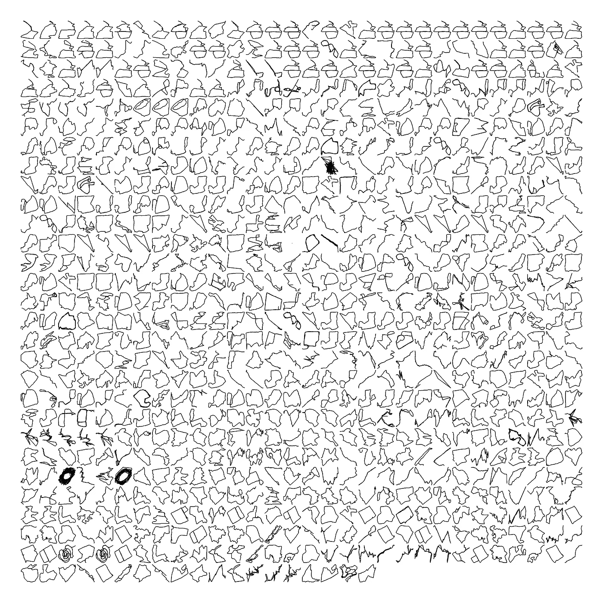
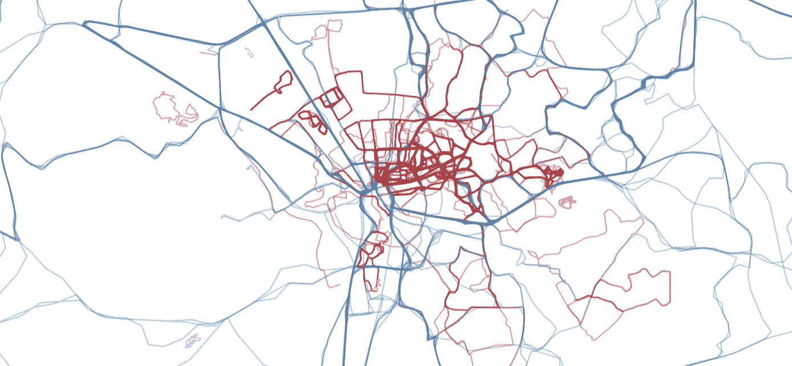
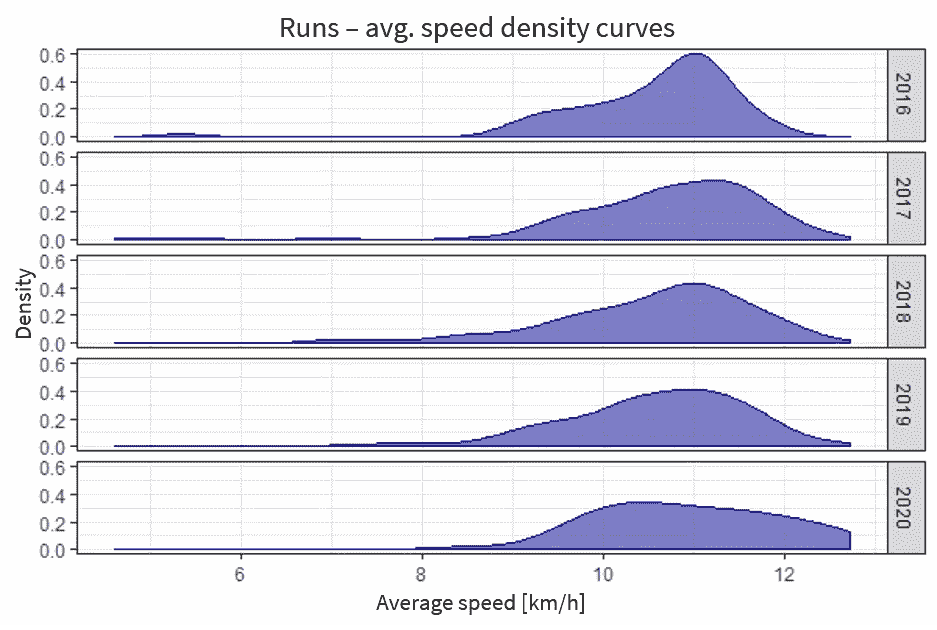
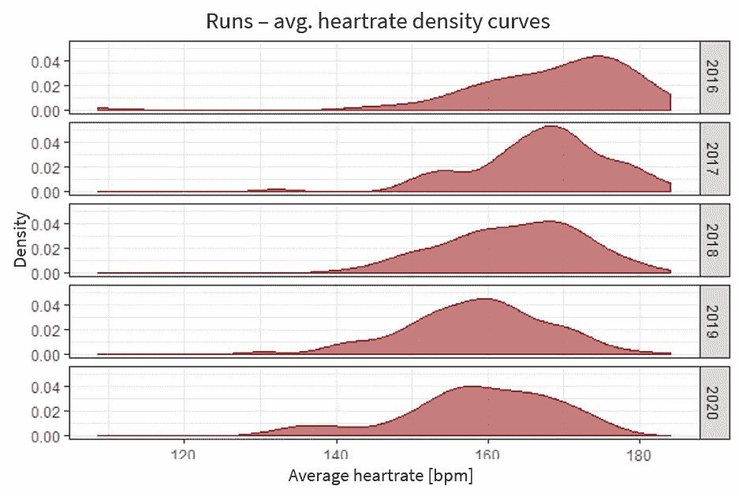
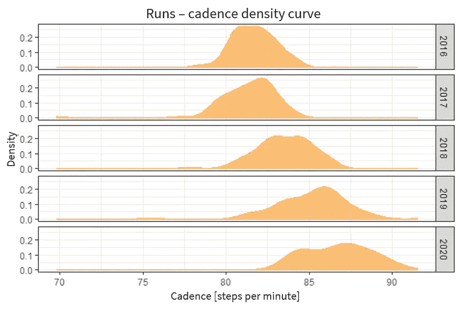

# 运动数据—分析我的 Strava 活动

> 原文：<https://towardsdatascience.com/sporty-data-analyzing-my-strava-activities-c34aab402069?source=collection_archive---------46----------------------->

我的斯特拉瓦体育活动的编辑分层立面图。

作为一个数据和体育迷，我在过去已经多次使用过 T2 的 Strava API。例如，制作精美的绘图或构建交互式仪表盘。最近，我还研究了我的综合体育活动数据。在这个博客中，我将分享我的一些发现。

## 制造奇特的情节

你可以用不同的方式绘制你的体育活动数据。例如，分层高程图，就像这篇博客标题中使用的那样，或者像下面所示的小倍数(归功于[马库斯·沃尔茨](https://marcusvolz.com/strava/))。对我来说，制作花哨的情节只是享受我的活动的结果(和生成的数据)的一种有趣的方式😁。

我所有体育活动的地图都被绘制成小倍数。

## 构建交互式仪表板

使用[闪亮的](https://shiny.rstudio.com/)，我制作了一个[交互式仪表盘](https://elkeklaassen.shinyapps.io/StravaApp/)，它使我能够更详细地研究不同功能的相关性。比如距离和平均速度的关系。对于跑步来说，这显然可以归结为:跑步时间越长，你会越慢，但是用交互式图表分析这一点有助于理解*慢了多少*。这可以作为建立未来起搏方案的参考。我还在仪表板中放入了我的活动热图。除了美学，它帮助我刷新了我去跑步和骑车的地方的记忆(就像一本相册😉).我在我的城市(荷兰埃因霍温)周围的活动热图如下所示。而且，正如你清楚地看到的，当你骑自行车时，你会走得更远🚴‍♀️.

我在我的城市(荷兰埃因霍温)附近跑步(红色)和骑车(蓝色)的热图。

## 汇总数据

这些年来，我喜欢不同的运动。作为主要运动，我以前打曲棍球，之后我开始更频繁地打壁球。我总是将这些运动与跑步和骑自行车结合起来。在过去的一年里，当我决定参加少女峰马拉松比赛时，我把跑步作为一个优先事项。随着跑步成为我最近的主要运动，我很想看看过去几年的表现趋势。为了找到答案，我研究了不同变量随时间的分布。下面列出了一些图表和我的一些观察。有些是我预料到的，有些是我以前没想过的。

我的平均速度密度曲线。

首先，平均速度曲线变平了💨。
这可能是因为训练中的变化较多，例如恢复跑和门槛跑。我特别喜欢 2020 年密度曲线的右侧，显示我更经常达到更高的平均速度😁。

我的平均心率密度曲线。

**其次，我的平均心率下降了不少💗**。
我就知道(max。)心率随着年龄的增长而降低。而且，我还记得“回到过去”(< 2017)每次跑步都感觉像一场比赛，而现在更多的是放松。这个图表清楚地说明了这两者😉。

我的距离密度曲线。

第三，更多的距离变化。回顾这篇博客的第一个情节，你可以看到在开始的时候我喜欢一遍又一遍地走同样的路线。缺乏变化并没有困扰我，因为我并不经常跑步。现在，我试着变得更多样。不仅仅是速度不同，还有路线和距离。一开始，我决定要么进行“短”跑，要么进行“长”跑，结果是+/- 5 公里或 10 公里。如今，它可以是“短”或“长”跑，基本上意味着 5k 或以上的任何东西。

我的节奏密度曲线。

**第四，更多步骤🏃‍♀️!** 看着抑扬顿挫密度图很明显我的抑扬顿挫上去了。高节奏有多种好处，所以我很高兴看到这种增长趋势💪。

每种鞋的平均速度密度。

**第五个也是最后一个，选哪双鞋👟。**在 Strava 上，你可以追踪你的装备。提醒我买双新的很有用(尽管我倾向于在旧的还没穿破的时候就买双新的)😬).接下来，你可以用数据来看看鞋的类型是如何影响速度的。我通常和 Asics Kayano 一起跑步。图中有不同的型号，当我没有跟踪时，我也穿着这双鞋。当我想跑得更快更短时，我倾向于切换到 *New Balance Vongo* 。对于试车，我使用*新百伦耶罗*(这里也有两种不同的型号)。在小路上，我通常会走得慢一点，如图所示！

这就是对体育和数据都感兴趣时会发生的事情😎。希望您获得了一些有趣的见解，或者受到启发，以类似的方式分析您的数据！如前所述，我使用了 [Strava API](https://developers.strava.com/) 并使用了 [rStrava 包](https://github.com/fawda123/rStrava)来访问数据。