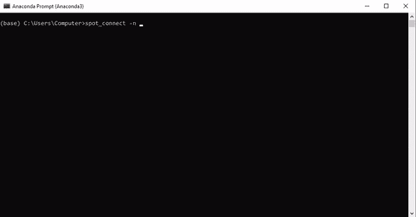

# 在 AWS 上进行深度学习，成本很低

> 原文：<https://towardsdatascience.com/spot-connect-with-aws-f95c964b0e92?source=collection_archive---------54----------------------->

## PYTHON 库简介

## python 的点连接模块简介


由[蒂姆·莫斯霍尔德](https://unsplash.com/@timmossholder?utm_source=unsplash&utm_medium=referral&utm_content=creditCopyText)在 [Unsplash](https://unsplash.com/s/photos/cloudy-skyscraper?utm_source=unsplash&utm_medium=referral&utm_content=creditCopyText) 上拍摄的照片

S **pot-connect** 是一个 python 模块，适用于任何正在寻找使用云计算的简单方法的程序员。

最初是为机器学习项目开发的， [spot-connect](https://github.com/losDaniel/spot-connect) 使得使用 Amazon Web Services 和 EC2 实例变得很容易。

AWS 提供的服务和设置帐户的步骤包含在旧文章的**了解 AWS** 和**设置您的 AWS 帐户**部分。

*如果您计划尝试点连接，并且尚未安装和配置 AWS 命令行(* `*pip install awscli*` *、* `*aws config*` *)，或者如果您尚未为 AWS 帐户创建访问密钥，请阅读参考章节。*

spot-instance 运行在 AWS 无法出租的硬件上。从来没有足够的需求来出租亚马逊的所有机器，所以他们以原价的一小部分出租多余的容量，以弥补他们的一些成本。

唯一的问题是，如果需求增加，你可能会被踢出实例，这在高端实例中更有可能发生(在你被踢出之前，你会得到 2 分钟的警告，以便你可以保存/转移你的工作)。

定点连接模块允许您创建和管理定点实例。它可以从命令行、脚本或 jupyter 笔记本中使用。它专注于管理 EC2 资源(AWS 的云计算服务),但提供了额外的功能来与弹性文件系统和 S3 等存储选项进行交互。

接下来是如何使用该模块的演练。

# 装置

```
pip install spot-connect 
```

使用 python 3。*

# 命令行用例

一旦你安装了模块，你可以在提示符下使用它

```
spot_connect -n instance_1 -p t2.micro -a True
```

在命令提示符下使用 spot_connect 还可以让您将提示符直接连接到实例。



使用 spot-connect 启动一个实例，然后使用链接提示符(个人屏幕截图)直接在实例上运行 linux 命令。

上面的例子用“t2.micro”概要文件创建了一个名为“instance_1”的实例。它连接到一个名为“stockefs”的弹性文件系统，并将提示符连接到新创建的实例。

gif 已经被加速了。启动一个实例通常需要几分钟或更长时间，这取决于规格。 ***如果您使用现有实例的名称进行连接，您将立即重新连接到该实例。***

命令提示符下对`spot_connect`最有用的参数是:

*   *名称* ( `-n`):现货实例的名称 *****
*   *配置文件* ( `-p`):配置文件的名称(指定实例类型、最高投标价格等的预设配置……更多信息请见下文)。 ******
*   *文件系统* ( `-f`):要连接的弹性文件系统。如果它不存在，将创建一个(不必与实例名相同)。
*   脚本 ( `-s`):一旦准备好就在实例上运行的脚本(如果在实例上使用 linux 操作系统，这必须是一个 bash 脚本……)。
*   *上传* ( `-u`):上传你想要的任何文件到实例中(对于小上传有用，否则使用 S3 传输，更多内容见下文)。
*   *远程路径* ( `-r`):上传将上传到实例上的这个路径。
*   *主动提示* ( `-a`):如果为真，将提示连接到实例(只能从命令提示符完成)。
*   *实例概要* ( `-ip`):实例的访问角色(不同于概要)。这授予**实例**访问其他 AWS 资源的权限，如 S3 。 ******

***** = *必需* ****** = *仅在创建实例时必需(不重新连接)*

能够将提示直接连接到实例对于排除脚本故障或运行任何其他检查非常有用。

# 选择实例类型

要用 spot-connect 启动一个实例，您只需给该实例一个名称和一个*概要文件*。

概要文件是预设的实例规范，它定义了诸如[实例类型](https://aws.amazon.com/ec2/instance-types/)、[最高投标价格](https://aws.amazon.com/ec2/spot/pricing/)、区域和其他连接选项等内容。这些可以在安装模块时随模块一起下载的 [profiles.txt](https://github.com/losDaniel/spot-connect/blob/master/spot_connect/profiles.txt) 文件中找到。

**可用实例类型、** [**定价**](https://aws.amazon.com/ec2/spot/pricing/) **、图片/AMI id 均随地区**变化。Spot-connect 附带了从 AWS 网站获取的区域实例数据和 AMI id 数据。

您可以使用点连接模块更改默认的配置文件设置:

```
from spot_connect import sutils 
sutils.reset_profiles()
```

`reset_profiles()`方法将向您显示一个区域列表，然后是一个 ami 列表，每次都要求您选择一个。然后您的本地副本 [profiles.txt](https://github.com/losDaniel/spot-connect/blob/master/spot_connect/profiles.txt) 将被更新以使用该区域和 AMI。

# 笔记本使用案例

对于笔记本和脚本来说，`SpotInstance`类相当于在命令提示符下使用`spot_connect`。

```
from spot_connect.spotted import SpotInstance
instance = SpotInstance('instance1', profile='t2.micro', price=0.01)
```

该命令创建或连接到“实例 1”实例。一个 *SpotInstance* 对象可以用与`spot_connect` **相同的参数进行实例化。此外， *SpotInstance* 还允许您指定配置文件参数，允许您覆盖像`price`这样的配置文件中的任何默认设置，这将允许您直接提交自定义的最高出价。**

使用`SpotInstance`您可以下载和上传文件，

```
instance.upload('test_run.py') # script creates a test.txt file
```

运行脚本，

```
instance.run('run_test.sh') # bash script is: "python test_run.py\n" 
```

直接在实例上运行命令，

```
instance.run('ls', cmd=True) # use the cmd option to pass commands
```

甚至终止实例。

```
instance.terminate()         # terminate the instance 
instance.refresh_instance()  # update the instance status 
```

使用`run(<command>, cmd=True)`方法直接在实例上运行命令。但是，请注意，这些命令总是在主目录中运行，这意味着在一次运行中更改目录并不意味着您在下一次运行中从该目录开始。

幸运的是，您可以使用`\n`一起运行连续的命令

```
instance.run('cd**\n**rm test.txt', cmd=True) 
```

这可以很容易地将复杂的脚本存储为可以在 python 中直接使用的函数。例如:

```
def transfer_script(bucket, efs_path):
    '''Download S3 data and place it in the EFS folder''' # The first command is the download
    # Use "nohup" to run the job in the background of the instance

    script ='nohup aws s3 sync '+bucket+' '+efs_path+'**\n**'

    # Use "curpid=$!" to get the job-id for the sync job

    script +='curpid=$!**\n**' # Three part command in linux 
    # 1) In the background, wait for all jobs to finish
    # 2) when finished, run command to shutdown the instance, 
    # 3) place all the output from the sync job in transfer.txt

    script +="nohup sh -c 'while ps -p $0 &> /dev/null;
              'do sleep 10; done && sudo shutdown -h now' 
              $curpid &> transfer.txt &**\n**" 

    return script script = transfer_script("s3://data", "/home/ec2-user/efs/")
instance.run(command, cmd=True)
```

# 实例管理器

启动一个实例很好，但是 spot-connect 的目标是便于在多个实例之间分配工作负载。这就是`InstanceManager`类出现的原因。

*实例管理器*允许您一次启动并跟踪多个实例。它还提供了在实例和 S3 之间传输文件、运行分布式工作负载等功能。

下面是如何跨多个实例组织执行任务的示例:

1。 用`efs='data'`实例化一个*实例管理器*，这样管理器创建的实例自动链接到名为“数据”的 EFS

```
from spot_connect.instance_manager import InstanceManager 
im = InstanceManager(efs='data')
```

2。使用`launch_instance`方法启动一个实例。用`im`创建的实例可以在`im.instances`中找到。

```
im.launch_instance('monitor', profile='t2.micro')
```

3。向`clone_repo`方法提交“monitor”实例，以将项目的 Github repo 克隆到 efs 中。

```
im.clone_repo(im.instances['monitor'], 
   '[https://github.com/FlorentF9/DeepTemporalClustering.git](https://github.com/FlorentF9/DeepTemporalClustering.git)',
              directory='/home/ec2-user/efs/') # default path
```

4。运行`cd efs`命令，然后运行`mkdir results`命令，在 EFS 中创建一个结果文件夹。

```
im.instances['monitor'].run('cd efs**\n**ls', cmd=True)
```

5。设计一个方法，它可以接受每个作业的参数，并返回一个可以在每个实例上运行的脚本。

```
def runDTC(n_clusters):
   '''Train a DTC model on the package data with n_clusters''' # Change the directory to the project directory 
   script = 'cd /home/ec2-user/efs/DeepTemporalClustering/**\n**' # Train the DTC algo in the background of the instance 
   script+= 'nohup python DeepTemporalClustering '+str(n_clusters)+' **--savedir** **/home/ec2-user/efs/results\n**' # Get the job ID for the training job 
   script +='curpid=$!**\n**' # Shut down the instance once that job is done  
   script +="nohup sh -c 'while ps -p $0 &> /dev/null; 'do sleep 10; done && sudo shutdown -h now' $curpid &> transfer.txt &**\n**" return script 
```

6。为一系列“n_cluster”值训练模型。使用`run_distributed_jobs`方法在单独的实例上训练每个模型。

```
# Get a list of scripts to run, one for each instance 
scripts = [runDTC(i) for i in range(10, 61, 10)]im.run_distributed_jobs(
   "DTC",               # prefix given to each instance name 
   len(scripts),        # number of instances to launch 
   scripts,             # the scripts to run on each instance 
   'p2.xlarge'          # use this instance type for each instance 
)
```

7。检查实例的状态，等待直到所有实例都终止(完成它们的作业)。

```
In [7]: im.show_instances()
Out[7]: {'monitor': 'running',  
         'DTC_1': 'terminated',  
         'DTC_2': 'terminated',  
         'DTC_3': 'terminated',  
         'DTC_4': 'shutting-down',  
         'DTC_5': 'running',  
         'DTC_6': 'running'}
```

8。使用`instance_s3_transfer`方法将结果上传到 S3。必须提供实例配置文件才能让实例访问 S3。

```
im.instance_s3_transfer("/home/ec2-user/efs/results",
                        "s3://bucket_data", 
                        "s3access")   # my instance profile
```

在 S3，您可以直接通过控制台或使用命令提示符下的`awscli`下载结果:

```
aws s3 sync "s3://bucket_data/results" "<local folder>"
```

在结束本节之前，有必要介绍一些有用的 bash 命令:

*   `nohup`:当放在命令的开头时，即使用户退出，命令也会完成。
*   `&`:当放置在您的命令之后时，会将命令发送到后台，以便您可以继续使用提示。
*   `> something.txt`:在命令的末尾，将命令生成的任何输出指向所需的文本。在`.txt`后添加另一个`&`来隐藏整行并继续使用提示。

# 总结

这就是 spot-connect 模块的基本功能。这里是这个项目的 [Github 回购](https://github.com/losDaniel/spot-connect.git)，在这里你可以找到一个[走查笔记本](https://github.com/losDaniel/spot-connect/blob/master/spot_connect_walkthrough.ipynb)(仍然需要更新以包括本文中的 DTC 示例)以及我用来从 AWS 收集价格和图像数据的[笔记本。](https://github.com/losDaniel/spot-connect/blob/master/amazon_price_and_image_scraper.ipynb)

我根据自己的时间表开发模块，但是本文中介绍的基本功能对我来说只是暂时的停止。非常欢迎投稿。以下是我认为值得追求的特性:

*   2 分钟关机警告处理
*   使用 boto3 的 AWS spot-fleet 功能
*   扩展存储管理功能(S3、EFS、EBS)
*   提供运行和协调数据同步代理的能力
*   提高代码的整体优雅性

感谢阅读！

:)