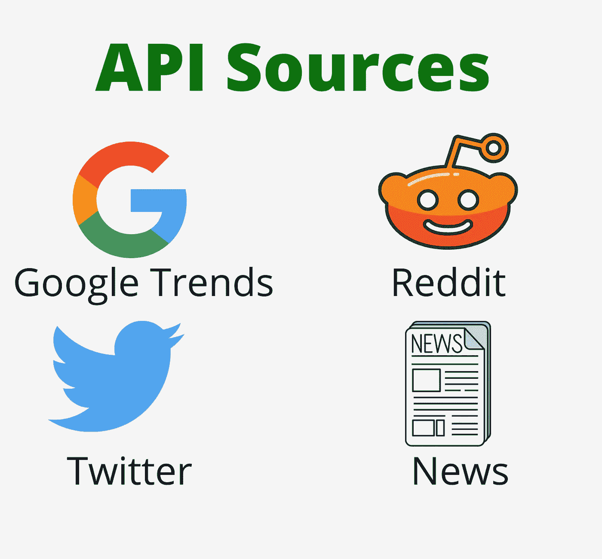
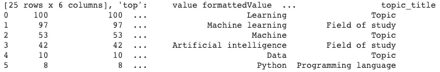
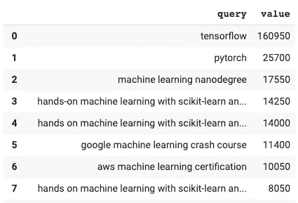
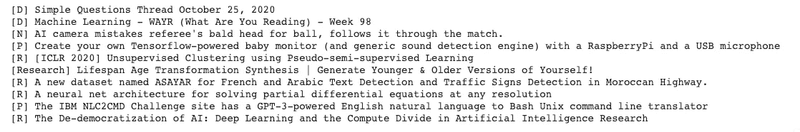
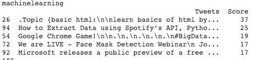
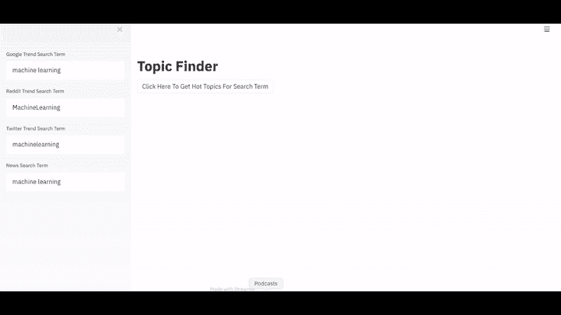
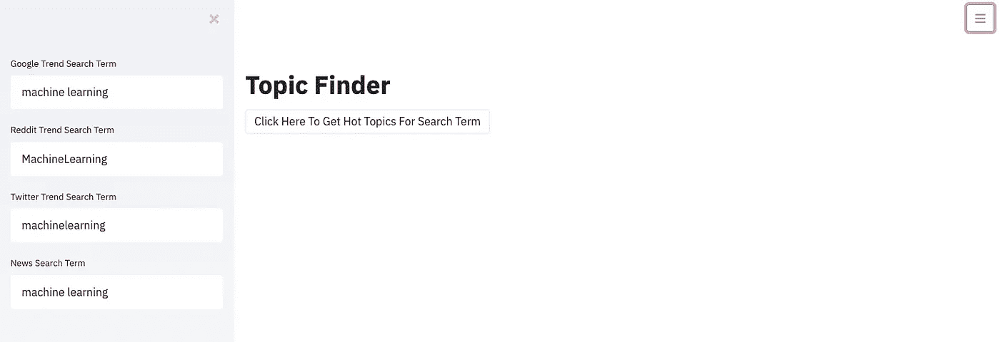
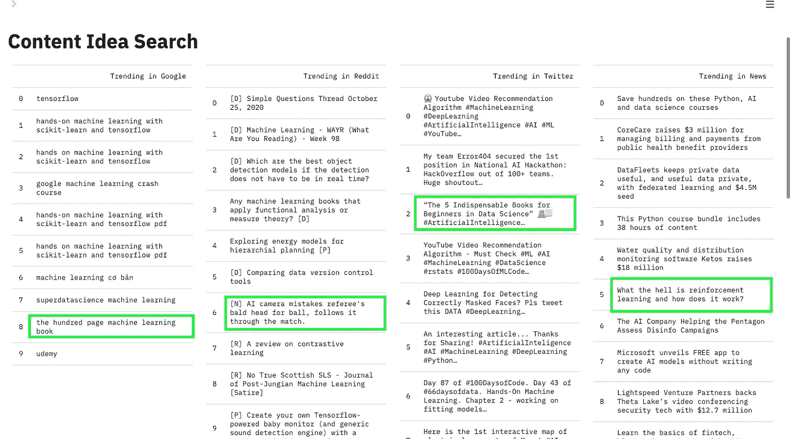

# 使用 Python 中的 4 个免费 API 发现内容创意

> 原文：<https://towardsdatascience.com/spot-content-ideas-using-4-free-apis-in-python-e18f53ef81af?source=collection_archive---------32----------------------->

## 使用 Google Trends、Reddit、Twitter 和新闻 API 创建内容查找器网站的指南


作者图片

那些每天都在写作，还能产出很棒内容的作家背后有什么秘密？

每个作家都有自己独特的方式，根据自己的个人品味来寻找话题。虽然每个作家都试图写一些他们关心的东西，但获得读者的关注是必不可少的。

作为一名数据分析师，我很好奇用我的技能解决这个问题的可能性。我想知道任何成功的作家是如何寻找主题的。尤其是当他/她没有主意的时候，他们找到话题的方法是什么。

9x 媒体顶级作家 Esat Artug 写了一篇[文章](https://medium.com/illumination/how-i-became-9x-top-writer-and-made-over-500-in-my-first-month-da1b051c1cea)，分享了他如何寻找话题的见解。他使用免费的可用资源，如谷歌趋势，亚马逊，回答公众，看看什么是趋势和人们如何互动。

我喜欢他的方法，因为它既简单又非常有效。因为你会看到热门趋势和搜索，它保证，你只选择人们感兴趣的话题。

身处数据科学领域，我立刻知道我可以让它变得更好、更简单。有很多像 Google，Reddit，Twitter 这样的资源提供免费的 API 来访问数据。**如果你能在一个屏幕上搜索并看到所有的数据，而不是一个一个地浏览，那将会节省很多时间**。

在这篇文章中，我将通过一步一步的方法来实现它。让我们深入研究一下。

# 四个 API:

在选择来源时，我决定记住两件事。

1.  应该能得到最新的结果。
2.  没有高级服务

因为这个想法是为了帮助作者找到内容主题，只有当他能看到当前流行的主题时才有帮助。这意味着绝对没有过时的数据。

例如，如果作者想在自然语言处理中搜索一个主题，并通过 [GPT](https://openai.com/blog/gpt-2-1-5b-release/) -2 得到推荐。这对一个作家来说没有太大的帮助，因为 GPT-3 的高级版本已经发布了。

因为我这么做主要是作为一个研究目的，所以我绝对不想花任何钱去获取这些数据。此外，API 提供的自由层数据应该足够了。



图片作者来自 [Canva](https://www.canva.com/) (Logo 来源 [Google](https://www.google.com/imgres?imgurl=https%3A%2F%2Fupload.wikimedia.org%2Fwikipedia%2Fcommons%2F5%2F53%2FGoogle_%2522G%2522_Logo.svg&imgrefurl=https%3A%2F%2Fcommons.wikimedia.org%2Fwiki%2FFile%3AGoogle_%2522G%2522_Logo.svg&tbnid=V-DX3bUxNp0CkM&vet=12ahUKEwiNnvamgOLsAhWIQRUIHQkwD4UQMygCegUIARCyAQ..i&docid=zyZ-ciwRabX18M&w=784&h=800&q=%20G&hl=en&safe=off&ved=2ahUKEwiNnvamgOLsAhWIQRUIHQkwD4UQMygCegUIARCyAQ) ， [Reddit](https://www.google.com/imgres?imgurl=https%3A%2F%2Fcdn.iconscout.com%2Ficon%2Ffree%2Fpng-512%2Freddit-164-675841.png&imgrefurl=https%3A%2F%2Ficonscout.com%2Ficon%2Freddit-164&tbnid=3RXy1haoO4gD4M&vet=12ahUKEwjw7dvvgOLsAhV1weYKHbFhAJ4QMygFegUIARCaAQ..i&docid=w9gHDmqm_M1TvM&w=512&h=512&q=reddit%20logo&hl=en&safe=off&ved=2ahUKEwjw7dvvgOLsAhV1weYKHbFhAJ4QMygFegUIARCaAQ) ， [Twitter](https://www.google.com/imgres?imgurl=https%3A%2F%2Fimage.shutterstock.com%2Fimage-photo%2Fkiev-ukraine-may-26-2015twitter-260nw-281505518.jpg&imgrefurl=https%3A%2F%2Fwww.shutterstock.com%2Fsearch%2Ftwitter%2Blogo&tbnid=csG-vEI8CyyEbM&vet=12ahUKEwisj63-gOLsAhVRThUIHUdeC1oQMygCegUIARD_AQ..i&docid=9RLUK3Oz5Fi30M&w=381&h=280&q=twitter%20logo&hl=en&safe=off&ved=2ahUKEwisj63-gOLsAhVRThUIHUdeC1oQMygCegUIARD_AQ) )

我为这个项目选择的 4 个 API 是

1.  谷歌趋势
2.  Reddit
3.  推特
4.  新闻 API

# 逐步实施

我使用 Python 提取和清理数据，并使用 [Streamlit](https://www.streamlit.io/) 创建了一个网站，用户可以使用关键字搜索并查看输出。

## 谷歌趋势:

我使用 [pytrends](https://pypi.org/project/pytrends/) 库访问 Google trends 数据。它的一个好处是你不必请求一个特殊的访问密钥。

确保使用`pip install pytrends`安装库，并使用`from pytrends.request import TrendReq`导入库

你需要通过调用`TrendReq()`来初始化它

从文档中我找到了`related_topics()`、`related_queries()`和`trending_searches()`函数，我认为我可以在这个项目中使用它们。

但是`related_topics()`只返回主题名称，这没有多大帮助。



related_topics()的示例输出(图片由作者提供)

`trending_searches()`返回当前热门话题，这同样没有太大帮助，因为我们正试图根据关键词查找热门搜索。

`related_queries()`返回基于输入关键字的热门和热门搜索的 json 输出。它给出了这个项目所需的准确信息。请参见下面的示例输出，了解如何提出对“机器学习”关键词搜索的查询。



related_queries()的输出(图片由作者提供)

你可以在下面看到从谷歌趋势获取数据的要点

## Reddit:

Reddit 的工作基于被称为 subreddit 的标签或页面，人们只能发布 subreddit 相关的主题。当搜索最新的帖子时，请确保使用流行的子编辑名称进行搜索，以获得最佳结果。

**访问键:**与 Google trends for Reddit 数据不同，您需要获得特定于用户的“访问键”。你可以使用这个链接 [reddit 应用](https://www.reddit.com/prefs/apps/)来创建你自己的访问密钥令牌。

一旦完成，前往 Python 编辑器，确保你安装了 PRAW 库，Reddit API 的 Python 包装器。你可以使用`pip install PRAW`来安装这个库。

导入库并在`praw.Reddit()`函数中输入访问密钥进行验证，然后您可以使用`reddit.read_only()`检查连接

`reddit.subreddit(keyword).hot(limit=10)`是用于获取子编辑中前 10 个热门话题的函数。

搜索子编辑“MachineLearning”的示例输出如下



Reddit 输出的热门话题(图片由作者提供)

你可以在下面看到从 Reddit 访问数据的要点。

## 推特

从 Twitter API 中，你可以获得基于关键词或标签的推文。在开始实现之前，请确保您有使用 Twitter API 的访问键。对于这个项目，自由层或标准 API 就足够了。

**访问密钥:**请参考 [slickremix](https://www.slickremix.com/docs/how-to-get-api-keys-and-tokens-for-twitter/) 获取在 Twitter 中创建访问令牌的简单指南。

我已经使用了`tweepy`库来访问 tweets，你可以使用`pip install tweepy`来安装这个库

导入 tweepy 后，您可以使用`tweepy.OAuthHandler()`和`set_access_token()`函数来验证 API。

接下来，您可以使用`tweepy.Cursor()`搜索和下载推文，我在查询中使用了“*-filter:retweets”*，因为我想获得只有原始推文的数据，并过滤掉转发。

```
tweets = tweepy.Cursor(api.search,
          q=keyword + **' -filter:retweets'**,
          lang=**"en"**,
          since=date_since).items(100)
```

然后使用下面的代码删除推文中的所有超链接

```
import re
clean_tweet = re.sub(**r'\w+:\/{2}[\d\w-]+(\.[\d\w-]+)*(?:(?:\/[^\s/]*))*'**, **''**, tweet.text)
```

为了获得热门推文，我使用了每条推文的收藏和转发次数。我为每条推文生成了一个分数，给予转发次数比最受欢迎次数更多的权重。

```
score = (retweet_count * 2 + favorite_count)
```

使用 tweets 评分，我对所有数据进行了排序，得到了前 10 条 tweets。请参见下面的输出



来自 Twitter 的推文(图片由作者提供)

你可以在下面看到从 Twitter 获取数据的要点

## 新闻宣传短片

[新闻 API](https://newsapi.org/) 是从多个新闻来源获取头条新闻的非常好的来源。

**访问密钥:**需要生成 API 访问密钥，访问是免费开发的。您可以使用[链接](https://newsapi.org/register)来生成您的密钥。

确保使用`pip install newsapi-python`安装库并导入库`from newsapi import NewsApiClient`

你需要使用函数`NewsApiClient(api_key='API_KEY')`来初始化它

使用`newsapi.get_everything()`您可以获得在给定日期范围内包含给定关键字的所有文章。我已经给出了 7 天的数据范围，以确保我们得到任何关键字搜索至少 10 篇文章。

```
newsapi.get_everything(q=keyword,
                       from_param=last_week,
                       to=today,
                       language=**'en'**)
```

您可以在下面看到从 NewsApi 访问数据的要点

## 创建网站

在我看来， [Streamlit](https://www.streamlit.io) 是创建网站和分享成果的最佳 python 库。如果你试图尽可能快地构建一个最小可行的产品，这是最好的。

> 你可以在下面看到网站的最终输出。



主题查找器(图片由作者提供)

在这里，我将从 API 的所有 4 个来源获取数据，然后相应地格式化数据，以显示在漂亮而简单的表格中。

**我想提供的网站功能有:**

1.  用户应该能够用关键字搜索找到主题
2.  允许用户点击并运行 API 的按钮

确保您已经安装了 streamlit。你可以用`pip install streamlit`安装它

网站标题'**主题查找器'**是使用`st.title(**“Topic Finder”**)`创建的

我已经使用`st.sidebar.text_input()`在侧边栏中创建了文本输入字段

为每个 API 源创建一个输入字段，使用户能够从每个源搜索不同的主题。参见下面的代码片段，了解侧栏文本输入的创建。

```
pytrend_word = st.sidebar.text_input(**"Google Trend Search Term"**,google_topic)
redtrend_word = st.sidebar.text_input(**"Reddit Trend Search Term"**,reddit_topic)
twtrend_word = st.sidebar.text_input(**"Twitter Trend Search Term"**,twitter_topic)
nwtrend_word = st.sidebar.text_input(**"News Search Term"**,news_topic)
```

我没有将所有的输入字段留空，而是创建了一个默认的文本值，名为' *machinelearning* '。

按钮是使用`st.button()`创建的

如果单击该按钮，那么从所有 API 获取数据的所有已定义函数都将运行并获取数据。

```
data = gtrends(pytrend_word)
gtrends_list = list(data[**'query'**][0:10])  *# gtrends Top 10* redtrends(redtrend_word) *#returns reddit trend search* twtrends(twtrend_word) *#twitter top list* tweets_df = pd.DataFrame(list(zip(tweet_text, score)), columns=[**'Tweets'**, **'Score'**])
tweets_df = tweets_df.sort_values(by=[**'Score'**], ascending=**False**)
tweets_list = list(tweets_df[**'Tweets'**].head(10))
newtrends(nwtrend_word)
```



**Wordcloud** :为了生成一个 Wordcloud，我将所有来源的文本加入到一个列表中，并使用 matplotlib 和 wordcloud 库生成了一个简单的 wordcloud。

```
*# Create and generate a word cloud image:* wordcloud = WordCloud().generate(comment_words)
fig, ax = plt.subplots()
*# Display the generated image:* ax.imshow(wordcloud, interpolation=**'bilinear'**)
ax.axis(**"off"**)
```

使用`streamlit run <script_name>.py`运行 streamlit。您应该能够在本地浏览器中看到如下所示的屏幕


你可以在下面的 gist 中看到代码

# 最终输出:

作为测试，我用关键词“**机器学习**”进行了搜索。我对结果非常满意，因为我得到了所有 API 的前 10 名搜索，我可以清楚地看到有很多有趣的想法可以使用。



最终输出(图片由作者提供)

> 我把自己放在一个内容查找器的位置，快速浏览输出，不到一分钟我就找到了我感兴趣的可以写的主题。我也确信我写的这些主题会有观众，因为它们已经成为流行趋势。

根据搜索结果，我可以写一些主题:

*   百页机器学习书— **来自 Google Trend**
*   人工智能摄像机将裁判的光头误认为是球，并在比赛中跟踪它。(我可以用这个有趣的例子来写训练数据的质量和重要性)——**来自 Reddit**
*   数据科学初学者不可或缺的 5 本书 **—来自 Twitter**
*   强化学习到底是什么东西，是怎么运作的？— **来自 NewsApi**

最后，我对结果非常满意。

# 结论:

在这篇文章中，我们介绍了如何使用 Google、Reddit、Twitter 和 NewsApi APIs 进行内容搜索。除此之外，我还想展示利用你作为数据爱好者所拥有的技能，将一个想法变成最终产品的方法。

如果你已经观察到这个项目中不涉及机器学习。如果你是一名数据科学家或机器学习工程师，我知道实现你对复杂模型的每一个想法的冲动。这就是为什么我们开发的很多模型没有投入生产。

我坚信，如果没有必要，不使用机器学习并不可耻。主要目标应该是使用数据，并以任何可能的方式提供可操作的见解。