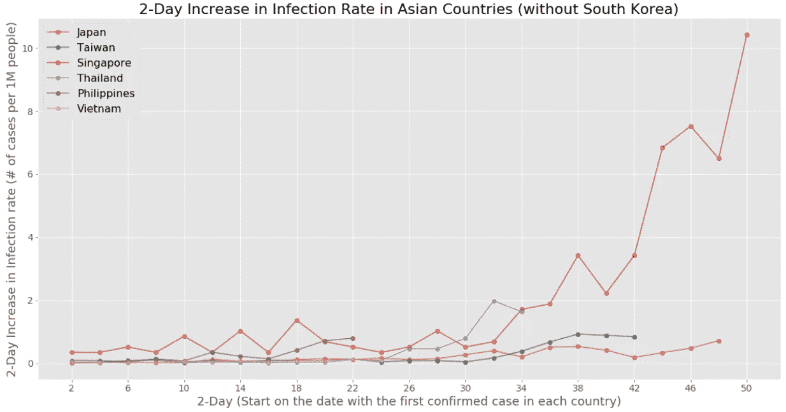
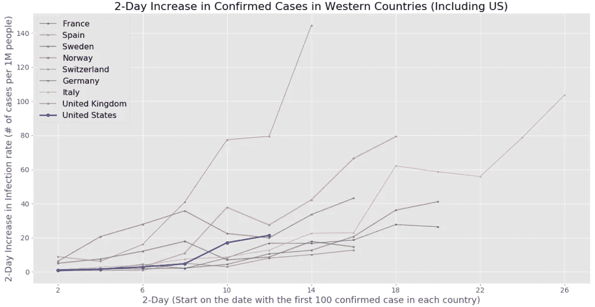

# 发现曲线:冠状病毒病例数据的可视化

> 原文：<https://towardsdatascience.com/spot-the-curve-visualization-of-cases-data-on-coronavirus-8ec7cc1968d1?source=collection_archive---------26----------------------->

## 通过可视化研究“曲线”的尝试


法比安·金特罗在 [Unsplash](https://unsplash.com?utm_source=medium&utm_medium=referral) 上的照片

【2020/6/4 更新|我用 Dash 和 Plotly 做了一个关于追踪最新数字的 web 应用。我会写另一篇文章，但请随时尝试。https://spot-the-curve-coronavirus.herokuapp.com/

在撰写本文时(2020 年 3 月 26 日)，冠状病毒(新冠肺炎)已经对我们的社会造成了严重破坏。尽管已经有一些关于 2019 年底在中国武汉发现的一种新病毒的消息，但西方国家的爆发才刚刚开始。在自我隔离期间，我想到，如果我们使用数据来比较每个国家的疫情，而不是被主流媒体的随机信息和数字轰炸，这将是有趣的，而且可能是鼓舞人心的。结果，我利用春假的时间投入到这个小项目中。

***编者按:*** [*走向数据科学*](http://towardsdatascience.com/) *是一份以数据科学和机器学习研究为主的中型刊物。我们不是健康专家或流行病学家，本文的观点不应被解释为专业建议。想了解更多关于疫情冠状病毒的信息，可以点击* [*这里*](https://www.who.int/emergencies/diseases/novel-coronavirus-2019/situation-reports) *。*

# 策划思路:“拉平曲线”

当我想把每个国家的情况可视化时，我首先想到的是“曲线”大约在游行开始时，社交网络和媒体突然充满了“拉平曲线”的想法。这个概念促进了公众对这种病毒的认识，它在西方社会中非常有效。


[https://www . vox . com/2020/3/10/21171481/冠状病毒-美国-病例-隔离-取消](https://www.vox.com/2020/3/10/21171481/coronavirus-us-cases-quarantine-cancellation)

在这篇受欢迎且优秀的[中帖(作者托马斯·普约)](https://medium.com/@tomaspueyo/coronavirus-act-today-or-people-will-die-f4d3d9cd99ca)中，作者解释得相当好。一般来说，曲线意味着社会需要照顾的活跃病人的分布。图表背后的逻辑是，我们不应该指望阻止所有的传播，而是要推迟，让国家有能力解决这些案件。

> 所以我们的目标不是消除冠状病毒的传染性。是为了推迟他们。托马斯·普约

因此，我决定根据这一概念绘制图表，**显示每个国家确诊病例的增长情况，变化不大。**

## 使用的数据

在写这篇文章的时候，引用最多的数据来源之一是[约翰·霍普斯金大学](https://github.com/CSSEGISandData/COVID-19)。它从不同国家的世卫组织和疾控中心收集数据，一些开源开发者也在其上构建 API。所以我选择使用它的数据集。


[https://github.com/CSSEGISandData/COVID-19](https://github.com/CSSEGISandData/COVID-19)

## 预处理和绘图的细节

我首先找到了每个国家的确诊病例数据来做数据清理，确保数据是时间序列格式的。然后我用 Python 可视化包(Matplotlib)做了图。

> 这里有一个小小的免责声明:由于数据处于非常不一致和不完善的状态，我已经在粒度级别上做出了妥协和个人决定，以使这成为可能。如果你对 ETL 的细节感兴趣，请查看 [GitHub](https://github.com/HiIamJeff/COVID19_Spot_the_Curve) 页面，或者如果我没有提到什么，就给我留言。这是一个没有任何预测模型的报告和 EDA 项目。

# 结合确诊病例进行探讨

## 寻找曲线

首先，为了得到第一个基线图，让我们只画出在中国，第一个发生地，和在其他亚洲国家的确诊病例。


然而，我马上注意到一些棘手的事情。首先，数据集只记录了从 1 月 22 日开始的病例数据。这使得不可能看到传播的完整趋势(中国早在 2019 年就出现了首例病例；资料中最早记录为 548 例确诊病例)。其次，数据是累积的，这意味着它应该只会上升。所以很难了解这个国家目前的疫情状况(传播速度有多快)。

## 改进版本:分解人口和调整 Viz 元素

为了解决代表性的问题，我决定重新检查数据。首先，我将累积案例的值转换成“每日增长”的形式。就确定一个国家的负担而言，我认为病例总数是一个不准确的指标，因为不同的人口水平可能会影响国家的公共卫生能力(例如护士与病人的比率)。

> 关于人口，我承认，传播的速度，在大多数情况下，与人口的水平(应该是人口密度)并不相关。因此，这里的要点是比较处理确诊病例的能力，而不是新冠肺炎在每个国家的“增长”。

相应的，我把它转换成一个新的叫做**“感染率”，每 100 万人确诊病例数**(按国家人口；[来源数据](https://www.worldometers.info/world-population/population-by-country/)，与不同种类的国家进行公平比较。此外，在图中，我将每日增加的病例数汇总到一个 2 天的格式中，并仅包括第一个病例后的记录，以平滑趋势(也是为了每个国家有一个公平的开始)。随着这一变化，可视化也将更加明显，因为当数字很大并且有太多可比数据时，它会变得混乱。

```
## Sample code for factoring population 
def data_process_avg(complete_df):
    for c in list(complete_df.columns):
        complete_df[c] = round(complete_df[c]/country_pop_dict.get(c)*1000000, 3)
    return complete_df
#country_pop_dict is the dictionary with country names and the  #accroding populations made by other data
#The source codes and data are included in the GitHub.
```

然后我选择了其他亚洲国家，因为它们也是第一批受到影响的国家，并且可能在这些天里“使曲线变平”。


从上面的图表中，我们可以看出大多数亚洲国家对冠状病毒的传播相当稳定。韩国以前曾有过重大的感染群，但在事件发生后成功地阻止了指数增长。**有趣的是，我们可以在图表上发现一些“曲线”,但这并不意味着它们不会在未来爆发。**从下面的情节来看(为了更好地观看，去掉了韩国)，因妥善处理疫情而受到称赞的新加坡和台湾，最近仍然面临着潜在的传播增长。



> p.s .印度还没有包括在这张图表中，因为它刚刚开始有更多关于确诊病例的数据，并且它的人口水平与其他国家有很大不同。我以后会单独研究它。

假设来说，严格的旅行禁令和强制隔离可以减缓病毒的传播。大多数国家(尤其是亚洲国家)已经颁布了相关政策。然而，由于 2 周的潜伏期和从国外返回的公民，我们应该预计效果还需要一两周才能发生(待更新)。

## 高度传播的国家现在是什么状况？

在第一次探索亚洲后，我们知道大多数亚洲国家现在有一个更温和的传播。接下来，我转向想象一些更严重的国家现在的情况。

为了确定传播最严重的国家，我继续使用相同的指标(感染率)，并根据最新感染率(3 月 23 日)对前 10 个国家进行了排名。

> 在绘图方面，我保持了相同的设置，但我只包括了第 100 个案例之后的记录，以平滑趋势(一些国家由于不规则的测试例程而出现峰值，一些国家也在晚些时候开始积极测试潜在的案例。)


3 月 25 日排名

事实证明，情况最严重的 10 个国家都来自欧洲(只有伊朗来自中东)。令人惊讶的是，**瑞士**实际上在其他国家中处于可怕的境地(超高的增长率使其在这两天超过了意大利。).相比之下，尽管美国受到了媒体的大量关注，但它目前在这一标准中排名第 15 位。尽管如此，与欧洲国家相比，它仍然处于病毒传播的早期阶段，所以我们应该期待它会有更多的变化(见下图)。

*2020 年 3 月 27 日更新:美国现在正经历着大量*的*测试实践，所以排名可能会在未来发生很大变化。*



# 未来步骤:测试数据和仪表板

尽管我们已经考虑了人口因素，但目前确诊病例的数量仍然与检测量密切相关。理想情况下，我们希望每个国家的新冠肺炎测试尽可能详细。但是，目前还没有关于这方面的官方数据库。

> p.s. [我们的数据世界](https://ourworldindata.org/coronavirus-testing-source-data)(来自牛津大学的一组研究人员)已经收集了这些信息的临时和不完整版本，并使其有可能在可视化中使用(请参见下面他们的图表之一)。


用案例数据测试数据

在未来，我将在这里的工作基础上继续添加新的东西，并在一个 web 应用程序上构建一个交互式和可自我控制的仪表板，以生成这些图表中的任何一个进行比较。

# 结论:还有很多工作要做

在这篇文章中，我们使用了一种更周到的方法来检查冠状病毒在特定国家的现状。我们发现了一些潜在的曲线，并认识到新冠肺炎在一些国家的严重性。然而，这些信息也表明，我们应该警惕在传播和数据方面的任何重大变化。

虽然内容看起来很少，但对于像我这样的流行病学和公共卫生新手来说，在这个问题上进行分析和假设实际上是一项很大的工作。除了领域知识，新冠肺炎的开放数据在这一点上是相当不发达的。我对数据看得越多，即使是来自被高度引用的来源，我就越沮丧，因为就目前而言，最可靠和可信的信息只是确认的病例(例如，JHU 的 GitHub 在数据中有一些令人讨厌的不一致；多个 API 不时地保持开启和关闭)。

话虽如此，仍有一群专业人士不断完善数据，并从中提炼出切实可行的见解。如果有人对这个项目感兴趣，你可以看看一些有用的文章和有趣的讨论。

[](https://medium.com/nightingale/ten-considerations-before-you-create-another-chart-about-covid-19-27d3bd691be8) [## 在你创建另一个关于新冠肺炎的图表之前，要考虑十点

### 总结一下——# viz responsible；这可能意味着根本不在公共领域发布你的可视化。

medium.com](https://medium.com/nightingale/ten-considerations-before-you-create-another-chart-about-covid-19-27d3bd691be8) [](https://medium.com/@joschabach/flattening-the-curve-is-a-deadly-delusion-eea324fe9727) [## 不要“把曲线弄平”，停下来！

### 到目前为止，你们都已经看到了新冠肺炎案例负载曲线的一个版本:

medium.com](https://medium.com/@joschabach/flattening-the-curve-is-a-deadly-delusion-eea324fe9727) 

> 现在，让我们给它更多的时间，尽我们的一份力量！

祝贺并感谢你的阅读！请随意查看我的 [Github](https://github.com/HiIamJeff/COVID19_Spot_the_Curve) 获取完整代码，并在 cl3883@columbia.edu 留言

杰夫