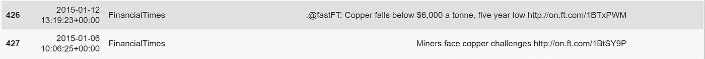

# 交易情绪:NLP 和情绪给现货铜市场打分

> 原文：<https://towardsdatascience.com/spot-vs-sentiment-nlp-sentiment-scoring-in-the-spot-copper-market-492456b031b0?source=collection_archive---------48----------------------->

## NLTK、Gensim 和 VADER 在金融出版物推文中搜索 Alpha


每日复合情绪得分与铜现货价格，美元/盎司。

***注来自《走向数据科学》的编辑:*** *虽然我们允许独立作者根据我们的* [*规则和指导方针*](/questions-96667b06af5) *发表文章，但我们不认可每个作者的贡献。你不应该在没有寻求专业建议的情况下依赖一个作者的作品。详见我们的* [*读者术语*](/readers-terms-b5d780a700a4) *。*

# 介绍

继铁和铝之后，铜是世界消耗最多的金属之一。铜是一种用途极其广泛的金属，其导电性和导热性、抗菌性和耐腐蚀性使其广泛应用于大多数经济部门。从电力基础设施、住宅和工厂到电子产品和医疗设备，全球经济对铜的依赖程度如此之深，以至于有时被称为“[铜博士](https://www.investopedia.com/terms/d/doctor-copper.asp)”，市场和大宗商品分析师也经常这样称呼铜，因为这种金属能够评估全球经济健康状况和活动。

从交易的角度来看，铜的定价是由金属交易所的供需动态决定的，特别是伦敦金属交易所(LME)和芝加哥商品交易所。然而，铜的交易价格受到无数因素的影响，其中许多因素很难同时衡量:

*   全球经济增长(GDP)
*   新兴市场经济体
*   中国经济([中国占全球铜需求的一半](https://asia.nikkei.com/Business/Markets/Commodities/Dr.-Copper-misdiagnoses-the-global-economy)
*   铜矿生产国的政治和环境不稳定
*   美国房地产市场
*   贸易制裁和关税
*   很多很多其他人。

除了上述基本面因素，铜价还可能受到对冲基金、投资机构、[保税金属](https://agmetalminer.com/2014/06/11/what-chinas-shadow-financing-market-aluminum-copper-collateral-means-for-metals-markets/)，甚至国内交易的人为影响。从系统交易的角度来看，当我们想要开发一个预测模型时，这是一个非常具有挑战性的情况。

然而，就以**新闻**形式公布的事件而言，短期机会可能存在。在整个美中贸易战期间，铜的现货和远期价格一直受到[的冲击，并且像所有市场一样，对重大消息几乎立即做出反应。](https://www.kitco.com/news/2020-07-15/METALS-Copper-slips-on-profit-taking-triggered-by-U-S-China-tensions.html)

如果发现得足够早，基于 NLP 的系统交易模型可以通过将公告解析为令牌向量，评估潜在情绪，并随后在预期的(如果适用)价格变动之前建仓，或者在价格变动期间建仓，以期利用潜在的修正来利用这些短期价格变动。

# 问题

在本文中，我们将从各种金融新闻出版物 Twitter feeds 中抓取历史(和当前)推文。然后，我们将分析这些数据，以了解每条推文背后的潜在情绪，得出情绪得分，并考察这一得分与过去五年铜现货价格之间的相关性。

我们将涵盖:

1.  **如何用 [GetOldTweets3](https://pypi.org/project/GetOldTweets3/) 获取历史推文**。
2.  **基本探索性数据分析** (EDA)技术与我们的 Twitter 数据。
3.  **文本数据预处理技术**(停用词、标记化、n 元语法、词干化&词条化等)。
4.  [**潜在狄利克雷分配**](https://en.wikipedia.org/wiki/Latent_Dirichlet_allocation) 到模型&使用[GenSim](https://pypi.org/project/gensim/)&[NLTK pyl Davis 探索主题和内容在我们的 Twitter 数据中的分布。](https://pypi.org/project/pyLDAvis/)
5.  **情感评分**使用 [NLTK 价觉词典和**情感**推理机(VADER)。](https://www.nltk.org/_modules/nltk/sentiment/vader.html)

我们不会在这项工作的基础上开发和测试一个成熟的交易策略，其语义超出了本文的范围。此外，本文旨在展示数据科学家可以用来从文本数据中提取有用信号的各种技术。

# 现货铜 NLP 策略模型

让我们从获取数据开始。

## 现货价格数据

我们将从获取现货铜价数据开始。我们选择使用铜的现货价格，而不是铜的远期合约(以今天商定的价格在商定的固定未来日期买卖固定数量金属的协议)的原因是现货价格对市场事件最具反应性——它是立即完成商品交易的报价(T2)。通常，我们会使用彭博终端来获取这些数据，但是，我们可以从[商业内幕](https://markets.businessinsider.com/commodities/copper-price)免费获得历史现货铜数据:

```
# Imports
import glob
import GetOldTweets3 as got
import gensim as gs
import os
import keras
import matplotlib.pyplot as plt
import numpy as np
import nltk
import pandas as pd
import pyLDAvis.gensim
import re
import seaborn as snsfrom keras.preprocessing.text import Tokenizer
from nltk.stem import *
from nltk.util import ngrams
from nltk.corpus import stopwords
from nltk.tokenize import TweetTokenizer
from nltk.sentiment.vader import SentimentIntensityAnalyzer
from sklearn.feature_extraction.text import CountVectorizer
from tensorflow.keras.preprocessing.sequence import pad_sequences# Get Cu Spot
prices_df = pd.read_csv(
    '/content/Copper_120115_073120',
    parse_dates=True,
    index_col='Date'
)
# To lower case
cu_df.columns = cu_df.columns.str.lower()#Plt close price
cu_df['close'].plot(figsize=(16,4))
plt.ylabel('Spot, $/Oz')
plt.title('Cu Spot Close Price, $/Oz')
plt.legend()
plt.grid()
```


现货铜，收盘价，2015 年 1 月 1 日至 2020 年 7 月 1 日，美元/公吨

虽然我们的价格数据看起来不错，但需要注意的是，我们正在考虑**每日价格**数据。因此，我们将自己限制在一个可能会丢失信息的时间范围内——市场对新闻事件的任何反应都可能在几分钟内发生，很可能是在新闻发布后的*秒*内。理想情况下，我们会使用 1-5 分钟的棒线，但是对于本文的目的来说，这样就可以了。

## 推特数据

我们将使用一个名为[**getoldtweets 3**](https://pypi.org/project/GetOldTweets3/)**(GOT)的库来提取我们的历史 tweet 数据。**与官方的 [Twitter API](https://developer.twitter.com/en/docs) 不同，GOT3 允许用户访问 Twitter 数据的大量历史记录。给定一个属于金融新闻媒体的 Twitter 句柄列表和一些相关的关键字，我们可以定义我们想要获取数据的搜索参数(**注意:**出于格式原因，我在下面发布了执行此操作所需逻辑的截图，而不是代码片段):


使用搜索参数获取指定句柄的历史 twitter 数据

方法`.setQuerySearch()`接受单个搜索查询，因此我们无法根据多个搜索标准提取 tweets。我们可以使用循环很容易地解决这个限制。例如，可以简单地为一个唯一查询的每次执行分配变量名，即“现货铜”、“铜价”等，但是对于本文的目的，我们可以满足于单个查询:

```
# Define handles
commodity_sources = ['reuters','wsj','financialtimes', 'bloomberg']# Query 
search_terms = 'spot copper'# Get twitter data
tweets_df = get_tweets(
  commodity_sources,
  search_term = search_terms,
  top_only = False,
  start_date = '2015-01-01',
  end_date = '2020-01-01'
).sort_values('date', ascending=False).set_index('date')tweets_df.head(10)
```


Twitter 历史数据

到目前为止一切顺利。

我们现在需要处理这些文本数据，以使其能够为我们的主题和情感模型所解释。

## 预处理和探索性数据分析

自然语言应用程序的文本数据预处理需要仔细考虑。从丢失的角度来看，从文本数据组成一个数字向量可能是具有挑战性的，当执行看似基本的任务时，如删除停用词，有价值的信息和主题上下文很容易丢失，我们将在下面看到。

首先，让我们删除标签和 URL 形式的冗余信息，即



来自媒体的推文通常包含句柄标签、标签和文章链接，所有这些都需要删除。

我们定义了几个单行的[](https://docs.python.org/3/tutorial/controlflow.html)**函数，这些函数使用[正则表达式](https://docs.python.org/2/library/re.html)来删除匹配我们想要删除的表达式的字母和字符:**

```
#@title Strip chars & urls
remove_handles = lambda x: re.sub(‘@[^\s]+’,’’, x)
remove_urls = lambda x: re.sub(‘http[^\s]+’,’’, x)
remove_hashtags = lambda x: re.sub('#[^\s]*','',x)tweets_df[‘text’] = tweets_df[‘text’].apply(remove_handles)
tweets_df[‘text’] = tweets_df[‘text’].apply(remove_urls)
tweets_df[‘text’] = tweets_df[‘text’].apply(remove_hashtags)
```

**接下来，我们通过检查 tweet 的组成对我们的 twitter 数据进行一些基本分析，例如单个 tweet 的长度(每条 tweet 的字数)、字符数等。**

****

**基本文本 EDA —单词和字符频率分布**

## **停止言语**

**显而易见，每条推文的平均长度相对较短(准确地说是 10.3 个单词)。这些信息表明，如果我们考虑潜在的信息损失，以计算复杂性和内存开销为代价，过滤停用词可能**而不是**是一个好主意。**

**最初，这个实验使用 NLTK 非常方便的停用词标准列表，从 Tweets 中删除所有停用词:**

```
# Standard tweet sw
stop_words_nltk = set(stopwords.words('english'))# custom stop words
stop_words = get_top_ngram(tweets_df['text'], 1)
stop_words_split = [
    w[0] for w in stop_words
    if w[0] not in [
        'price', 'prices',
        'china', 'copper',
        'spot', 'other_stop_words_etc'
    ] # Keep SW with hypothesised importance
]stop_words_all = list(stop_words_nltk) + stop_words_split
```

**然而，这种行为导致了许多错误分类的推文(从情感分数的角度来看),这支持了信息丢失的概念，因此最好避免。**

**在这一点上，当涉及到处理 Twitter 数据时，非常值得强调 NLTK 的*优秀的*库。它提供了一套全面的工具和功能来帮助解析社交媒体输出，包括表情符号解释！。你可以在 Twitter data [**这里**](http://www.nltk.org/howto/twitter.html) 找到一个真正有用的入门和使用 NLTK 的指南。**

## **N-grams**

**下一步是考虑词序。当我们将一系列符号矢量化成一个单词包(BOW——下一段将详细介绍)时，我们失去了这些单词在 tweet 中的顺序所固有的上下文和含义。我们可以通过检查最常见的 [n-grams](https://en.wikipedia.org/wiki/N-gram) 来尝试理解词序在我们的 tweets 数据框架中的重要性。**

**正如我们在上面的初步分析中观察到的，一条给定推文的平均长度只有 10 个词。根据这些信息，一条推文中词语的**顺序，特别是确保我们保留这种顺序中固有的上下文和含义，对于生成准确的情感评分**至关重要**。我们可以将记号的概念扩展到包括多单词记号，即 **n-grams** ，以便保留单词排序中的含义。****

**NLTK 有一个非常方便(也非常高效)的 n 元语法标记器:`from nltk.util import ngram`。n-gram 函数返回一个生成器，该生成器以元组的形式生成前“n”个 n-gram。然而，我们有兴趣探索这些 n 元语法在第一个实例中实际上是什么，所以将利用 Scikit-learn 的[计数矢量器](https://scikit-learn.org/stable/modules/generated/sklearn.feature_extraction.text.CountVectorizer.html#sklearn.feature_extraction.text.CountVectorizer.fit_transform)来解析我们的 tweet 数据:**

```
def get_ngrams(doc, n=None):
  """
  Get matrix of individual token counts for a given text document.
    Args:
      corpus: String, the text document to be vectorized into its  constituent tokens.
    n: Int, the number of contiguous words (n-grams) to return.      
    Returns:
      word_counts: A list of word:word frequency tuples.
  """
  # Instantiate CountVectorizer class
  vectorizer = CountVectorizer(ngram_range=
  (n,n)).fit(doc)
  bag_of_words = vectorizer.transform(doc)
  sum_of_words = bag_of_words.sum(axis=0)
  # Get word frequencies
  word_counts = [(word, sum_of_words[0, index])
      for word, index in vectorizer.vocabulary_.items()
  ]
  word_counts = sorted(word_counts, key=lambda x:x[1], reverse=True)
  return word_counts# Get n-grams
top_bigrams = get_ngrams(tweets_df['text'], 2)[:20]
top_trigrams = get_ngrams(tweets_df['text'], 3)[:20]
```

****

**连续词频(n 元语法)。**

**在检查我们的 n-gram 图时，我们可以看到，除了少数例外，基于 NLP 的预测模型将从我们的 n-gram 特征中学习到更多。例如，该模型将能够正确地将“铜价”解释为铜的实物价格的参考，或者将“中国贸易”解释为中国的贸易，而不是解释单个单词的含义。**

## **记号化和词条化。**

**我们的下一步是标记我们的 tweets，以便在我们的 LDA 主题模型中使用。我们将开发一个功能，对我们的 tweets 进行必要的分段(分词器的工作)和词汇化。**

**我们将使用 NLTK 的[**tweet tokenizer**](https://www.nltk.org/api/nltk.tokenize.html)来执行我们的推文的标记化，这是专门为解析推文和理解它们相对于这个社交媒体平台的语义而开发的。**

**鉴于每条推文相对简短的性质，降维对我们的模型来说并不是一个紧迫的问题。考虑到这一点，在试图消除单词的复数形式与所有格形式之间的细微意义差异时，不对我们的数据执行任何词干操作是合理的。**

**相反，我们将实现一个词条整理器，[**WordNetLemmatizer**](https://www.nltk.org/_modules/nltk/stem/wordnet.html)，对我们的 tweet 数据中的词进行规范化。对于我们的应用程序来说，lemma tion 可以说比词干提取更准确，因为它考虑了单词的**含义**。WordNetLemmatizer 还可以帮助提高我们的主题模型的准确性，因为它利用了词性(POS)标记。一个单词的词性标记表明了它在句子语法中的作用，例如区分名词词性和形容词词性，如“铜”和“铜的价格”。**

***注意:您必须在 WordNetLemmatizer 中手动配置 POS 标签。如果没有 POS 标签，它会认为你输入的所有东西都是名词。***

```
def preprocess_tweet(df: pd.DataFrame, stop_words: None):
  """
  Tokenize and Lemmatize raw tweets in a given DataFrame.
    Args:
      df: A Pandas DataFrame of raw tweets indexed by index of type       DateTime.
      stop_words: Optional. A list of Strings containing stop words         to be removed.
    Returns:
      processed_tweets: A list of preprocessed tokens of type          String.
  """
  processed_tweets = []
  tokenizer = TweetTokenizer()
  lemmatizer = WordNetLemmatizer()
  for text in df['text']:
    words = [w for w in tokenizer.tokenize(text) if (w not in    stop_words)]
    words = [lemmatizer.lemmatize(w) for w in words if len(w) > 2]        processed_tweets.append(words)
    return processed_tweets# Tokenize & normalise tweets
tweets_preprocessed = preprocess_tweet(tweets_df, stop_words_all)
```

**为了演示上述函数的效用，我们还将一个**停用词列表**传递到函数中。**

## **矢量化和连续词汇袋**

**我们现在需要使用一种称为单词的 B**ag(BOW)的文档表示方法，将我们的标记化 tweets 转换为向量。**为了执行这个映射，我们将使用 [Gensim 的字典类](https://radimrehurek.com/gensim/corpora/dictionary.html):**

```
tweets_dict = gs.corpora.Dictionary(tweets_preprocessed)
```

**通过将处理过的 tweets 列表作为参数传递，Gensim 的字典为每个唯一的规范化单词创建了一个唯一的整数 id 映射(类似于[哈希映射](https://en.wikipedia.org/wiki/Hash_table))。我们可以通过调用 tweets_dict 上的`.token2id()`来查看 word: id 映射。然后，我们计算每个不同单词的出现次数，将单词转换为其整数单词 id，并将结果作为稀疏向量返回:**

```
cbow_tweets = [tweets_dict.doc2bow(doc) for doc in tweets_preprocessed]
```

## **LDA 主题建模**

**现在是有趣的部分。**

**开发基于 NLP 的交易策略的前提是了解我们提取的数据是否包含与铜价相关的主题/信号，更重要的是，它是否包含我们可能交易的信息。**

**这要求我们检查和评估各种主题以及在我们的数据中代表这些主题的单词。垃圾进，垃圾出。**

**为了探索我们的 tweet 语料库中的各种主题(以及所述主题的主题)，我们将使用 Gensim 的[潜在狄利克雷分配](https://radimrehurek.com/gensim/models/ldamodel.html#gensim.models.ldamodel.LdaModel)模型。LDA 是一种生成概率模型，适用于文本等离散数据的集合。LDA 的功能相当于一个分层贝叶斯模型，其中集合中的每个项目都被建模为一组底层主题的有限混合。反过来，每个主题都被建模为一组潜在主题概率的无限混合物( [Blei，ng 等人，2003](https://ai.stanford.edu/~ang/papers/jair03-lda.pdf) )。**

**我们将新矢量化的推文`cbow_tweets`和将每个单词映射到 id 的字典`tweets_dict`传递给 Gensim 的 LDA 模型类:**

```
# Instantiate model 
model = gs.models.LdaMulticore(
  cbow_tweets,
  num_topics = 4,
  id2word = tweets_dict,
  passes = 10,
  workers = 2)# Display topics 
model.show_topics()
```

**您可以看到，我们需要通过`num_topics`超参数提供数据集内主题数量的估计值。据我所知，有两种方法可以确定主题的最佳数量:**

1.  **建立多个 LDA 模型，用[**相干模型**](https://radimrehurek.com/gensim/models/coherencemodel.html) **计算它们的**相干得分**。****
2.  **领域专长和直觉。**

**从交易的角度来看，这是领域知识和市场专业知识可以帮助的地方。我们希望我们的 Twitter 数据中的主题，记住它们是金融新闻出版物的产品，主要集中在以下主题:**

*   ****铜价(自然上涨)****
*   ****美中贸易战****
*   ****美国总统唐纳德·特朗普****
*   ****主要铜矿商****
*   ****宏观经济公告****
*   ****当地生产国国内/政治动乱****

**除此之外，在确定这个超参数时，应该使用自己的判断。**

**值得一提的是，其他超参数的整个**主机**存在。这种灵活性使得 Gensim 的 LDA 模型极其强大。例如，作为贝叶斯模型，如果我们对主题/单词概率有“先验”的信念，我们的 LDA 模型允许我们通过`init_dir_prior`方法，或者类似地通过`eta`超参数，为狄利克雷分布编码这些先验。**

**回到我们的模型，你会注意到我们使用了 Gensim 的多核版本`LdaModel`，它允许更快的实现(多核机器的操作并行化):**

****

**LDA 模型 show_topics()输出:注意编号为 0-4 的主题，其中包含单词及其相关权重，即它们对主题的贡献大小。**

**粗略地检查一下我们模型中的主题，会发现我们既有相关的数据，而且我们的 LDA 模型在对所述主题建模方面做得很好。**

**为了了解主题及其关键字的分布，我们将使用 pyLDAvis，它启动了一个交互式小部件，非常适合在 Jupyter/Colab 笔记本中使用:**

```
pyLDAvis.enable_notebook()
topic_vis = pyLDAvis.gensim.prepare(model, cbow_tweets, tweets_dict)
topic_vis
```

****

**LDA 模型——Twitter 新闻数据，话题分布。**

## **LDA 模型结果**

**在检查产生的主题图时，我们可以看到我们的 LDA 模型在捕捉 Twitter 数据中的突出主题及其组成词方面做得很好。**

****什么构成了健壮的主题模型？****

**一个好的主题模型通常展示大的、不同的主题(圆圈),没有重叠。所述圆圈的面积与语料库(即我们的 Twitter 数据)中“N”个总标记中的主题比例成比例。每个主题圆的中心在两个维度上设置:PC1 和 PC2，它们之间的距离由在主题间距离矩阵上运行的降维模型(准确地说是多维标度)的输出来设置。pyLDAvis 主题视觉背后的数学细节的完整解释可以在[这里](https://cran.r-project.org/web/packages/LDAvis/vignettes/details.pdf)找到。**

****解读我们的结果****

**在记住**而不是**忽略我们试图解决的问题的同时，具体来说，了解我们的推文数据中是否有任何**有用的信号**可能影响铜的现货价格，我们必须进行定性评估。**

**详细检查各个主题，我们可以看到一组有希望的结果，特别是出现在各个主题中的热门词汇，它们在很大程度上符合我们上面预期的主题标准:**

****题目编号:****

1.  ****铜矿开采&铜出口国****

**热门词汇包括主要铜矿商(必和必拓、安托法加斯塔、英美资源集团和力拓)，以及主要铜出口国，即秘鲁、智利、蒙古等。**

**2.**中国贸易&制造业活动****

**热门词汇包括“铜”、“铜价”、“中国”、“自由港”和“上海”。**

**3.**美中贸易战****

**热门词汇包括“铜”、“价格”、“中国”、“特朗普”、“美元”和“美联储”，但也有一些不常见的术语，如“智利”和“视频”。**

**基于上述结果，我们决定继续我们的 NLP 交易策略，因为我们的 twitter 数据展示了足够多的与铜现货价格相关的信息。更重要的是，我们可以确信我们的 Twitter 数据与铜价的*相关性*——我们的 LDA 模型发现的主题符合我们对数据中应该出现的 ***预期主题*** 的看法。**

## **验证 LDA 模型**

**作为数据科学家，我们知道我们必须验证任何模型的完整性和稳健性。我们的 LDA 模型也不例外。我们可以通过检查模型的一致性(如上所述)来做到这一点。通俗地说，连贯性衡量的是一个主题内单词之间的相对距离。关于数学背后的数学细节精确地说*这个分数是如何计算的可以在这篇 [**论文**](http://svn.aksw.org/papers/2015/WSDM_Topic_Evaluation/public.pdf) **中找到。为了简洁起见，我省略了重复各种表达。*****

***一般来说，介于 0.55 和 0.70 之间的分数表示一个熟练的主题模型:***

```
*# Compute Coherence Score
coherence_model = gs.models.CoherenceModel(
    model=model,
    texts=tweets_preprocessed,
    dictionary=tweets_dict,
    coherence='c_v')coherence_score = coherence_model.get_coherence()
print(f'Coherence Score: {coherence_score}')*
```

******

***基于确认度量‘c _ v’(与 UMass 相反)，计算我们的 LDA 模型的一致性分数。***

***在 0.0639 的一致性分数下，我们可以合理地确信我们的 LDA 模型已经在正确数量的主题上被训练，并且在每个主题中的高分单词之间保持足够程度的语义相似性。***

***我们对分数测量的选择，在上述一致性模型逻辑的签名中可以观察到，是由 [Roder，Both & Hindeburg](http://svn.aksw.org/papers/2015/WSDM_Topic_Evaluation/public.pdf) 的论文中的结果激发的。您可以看到，我们已经选择根据`coherence = 'c_v`度量对我们的模型进行评分，而不是使用*‘u _ mass’，‘c _ v’，‘c _ UCI’。*等。发现“c_v”分数测量返回优于其他测量的结果，特别是在小词集的情况下，限定了我们的选择。***

## ***情感得分:VADER***

***在对我们的 twitter 数据包含足够相关的信息以潜在地预测短期铜价走势感到满意后，我们继续进入我们问题的[](https://en.wikipedia.org/wiki/Sentiment_analysis)****部分。*******

*****我们将使用 NLTK 的 Valence Aware 字典和情感推理器(VADER)来分析我们的推文，并根据每条推文中每个词的潜在强度总和，生成一个介于-1 和 1 之间的情感得分。*****

*****不管我们在 NLP 模型中使用单个标记、ngrams、词干还是词条，基本上，我们 tweet 数据中的每个标记都包含一些信息。可能这些信息中最重要的部分是单词的*情感。******

*****VADER 是一个受欢迎的启发式的、基于规则的(由人类创作的)情感分析模型，由[休顿和](https://www.nltk.org/_modules/nltk/sentiment/vader.html)吉尔伯特开发。它在社交媒体文本上使用特别准确(并且是专门为此应用程序设计的)。因此，在我们的项目中使用它似乎是合理的。*****

*****VADER 的实现非常简单:*****

```
*****# Instantiate SIA class
analyser = SentimentIntensityAnalyzer()sentiment_score = []for tweet in tweets_df[‘text’]:
  sentiment_score.append(analyser.polarity_scores(tweet))*****
```

*****`SentimentIntensityAnalyzer`包含一个令牌和它们各自分数的字典。然后，我们为 tweets 数据框架中的每条 tweets 生成一个情感分数，并访问由 VADER 模型生成的四个独立分数部分的结果(一个字典对象):*****

*   *****文本的否定比例*****
*   *****正文的正面比例*****
*   *****文本的中性比例&*****
*   *****上述情绪极性的综合强度，即“复合”得分*****

```
*****#@title Extract Sentiment Score Elementssentiment_prop_negative = []
sentiment_prop_positive = []
sentiment_prop_neutral = []
sentiment_score_compound = []for item in sentiment_score:
  sentiment_prop_negative.append(item['neg'])
  sentiment_prop_positive.append(item['neu'])
  sentiment_prop_neutral.append(item['pos'])
  sentiment_score_compound.append(item['compound'])# Append to tweets DataFrame
tweets_df['sentiment_prop_negative'] = sentiment_prop_negative
tweets_df['sentiment_prop_positive'] = sentiment_prop_positive
tweets_df['sentiment_prop_neutral'] = sentiment_prop_neutral
tweets_df['sentiment_score_compound'] = sentiment_score_compound*****
```

**********

*****推文数据情绪得分:负面，正面，复合，每日。*****

*****在绘制了各种成分的滚动分数、负分数、正分数和复合分数(我们不考虑中性分数)之后，我们可以进行一些观察:*****

*   *****显然，情感得分非常嘈杂/不稳定——我们的 Twitter 数据可能只包含冗余信息，少数信息会导致得分大幅飙升。然而，这就是信号发现的本质——我们只需要那一条显著的信息。*****
*   *****我们的 Twitter 数据看起来主要是正面的:平均负面得分是 0.09，而平均正面得分是 0.83。*****

## *****情绪得分与铜现货价格*****

*****现在我们必须评估我们的努力是否得到了回报:**我们的情绪得分是否能预测铜的现货价格！*******

*****乍一看，现货价格和我们的综合得分之间似乎没有任何关联:*****

**********

*****复合情绪得分 vs 现货铜($/Mt)，每日。*****

*****然而，当我们应用经典的平滑技术并计算我们情绪得分的滚动平均值时，我们看到了一个不同的画面:*****

**********

*****滚动 21d 平均复合情绪得分与现货铜(美元/公吨)，每日。*****

*****这现在看起来更有希望。除了 2017 年 1 月至 8 月期间，我们可以很容易地观察到我们的 21 天滚动平均复合得分和铜现货价格之间近乎对称的反比关系。*****

# *****结论*****

*****在这种情况下，我们停下来考虑我们可用的选项，即我们希望我们的模型如何处理和分类一段文本数据中的潜在情绪，以及关键的是，模型将如何根据其交易决策对这种分类采取行动。*****

*****与[奥卡姆剃刀](https://en.wikipedia.org/wiki/Occam%27s_razor)原则一致，我们实现了一个开箱即用的解决方案来分析 twitter 数据中的潜在情绪。除了探索一些著名的 EDA 和预处理技术作为先决条件，我们还使用了 [NLTK 的 Valence Aware 字典和**情绪** Reasoner (VADER)](https://www.nltk.org/_modules/nltk/sentiment/vader.html) ，为每条推文生成相关的情绪得分，并检查了所述得分与简单的相应铜现货价格运动的相关性。*****

*****有趣的是，我们观察到滚动复合情绪得分和铜价之间存在相关性。当然，这并不意味着因果关系。此外，它可能只是新闻数据跟踪铜价，而我们的推文数据只是报告其走势。尽管如此，仍有进一步工作的余地。*****

# *****观察、批评和进一步分析*****

*****事实上，系统交易策略的设计需要更多的数学和分析的严谨性，以及大量的专业知识。人们通常会投入大量时间来设计一个合适的标签，最好地包含信号和价格运动的幅度(如果有的话！)在所述信号中发现，尽管对信号本身进行了彻底的研究。*****

*****关于我们的问题，存在大量非常有趣的进一步工作和分析的空间:*****

1.  *******神经网络嵌入:**作为一个例子，为了更好地理解一个 NLP 模型和一个相关的标签(或多个标签)是如何做出交易决策的，我们可以用[嵌入层](https://www.tensorflow.org/api_docs/python/tf/keras/layers/Embedding)来训练一个神经网络。然后，我们可以检查经过训练的嵌入层，以了解模型如何根据具有类似编码和标签的层来处理层中的各种标记。然后，我们可以可视化模型如何根据单词对我们希望预测的类别的影响对单词进行分组，即 0 表示负价格变动，1 表示正价格变动。例如，TensorFlow 的嵌入投影仪是可视化此类嵌入的无价工具:*****

**********

*******2。多项式朴素贝叶斯*******

*****我们使用 VADER 来解析和解释我们的 Twitter 数据的潜在情绪，它做了合理的工作。然而，使用 VADER 的缺点是**它不会考虑文档中的所有单词，实际上只有大约 7500 个。**鉴于商品交易及其相关术语的复杂性，我们可能会遗漏重要信息。*****

*****作为替代，我们可以使用朴素贝叶斯分类器来寻找预测我们目标的关键词集，无论是铜价本身还是情绪得分。*****

*******3** 。**日内数据*******

*****由于引言中提到的原因，在设计 NLP 交易策略模型时，几乎所有情况下的日内数据都是必须的。当试图利用基于新闻/事件的价格变动时，时间和交易执行是非常重要的。*****

*****感谢你花时间阅读我的文章，我希望你觉得有趣。*****

*****请不要客气，我非常欢迎评论和建设性的批评。*****

# *****参考*****

1.  *****[休顿，C.J. &吉伯特，E.E. (2014)。VADER:基于规则的社交媒体文本情感分析的简约模型。第八届网络日志和社交媒体国际会议。密歇根州安阿伯，2014 年 6 月。](https://www.nltk.org/_modules/nltk/sentiment/vader.html)*****
2.  *****莱恩、霍华德、哈普克(2019):自然语言处理在行动。*****
3.  *****[Moneyweek (2019):金属市场的周期:锌&铜什么时候发光](https://moneyweek.com/516039/the-cycles-in-the-metals-market-when-will-zinc-and-copper-shine)。*****
4.  *****[《日经亚洲评论》(2020):《铜博士》误诊了全球经济](https://asia.nikkei.com/Business/Markets/Commodities/Dr.-Copper-misdiagnoses-the-global-economy)。*****
5.  *****[Kitco 2020:美中紧张局势引发的获利回吐导致铜价下跌。](https://www.kitco.com/news/2020-07-15/METALS-Copper-slips-on-profit-taking-triggered-by-U-S-China-tensions.html)*****
6.  *****[Metal Miner，(2020):中国影子金属融资对市场意味着什么](https://agmetalminer.com/2014/06/11/what-chinas-shadow-financing-market-aluminum-copper-collateral-means-for-metals-markets/)。*****