# 通过交互式数据可视化传播新冠肺炎

> 原文：<https://towardsdatascience.com/spread-of-covid-19-with-interactive-data-visualization-521ac471226e?source=collection_archive---------22----------------------->

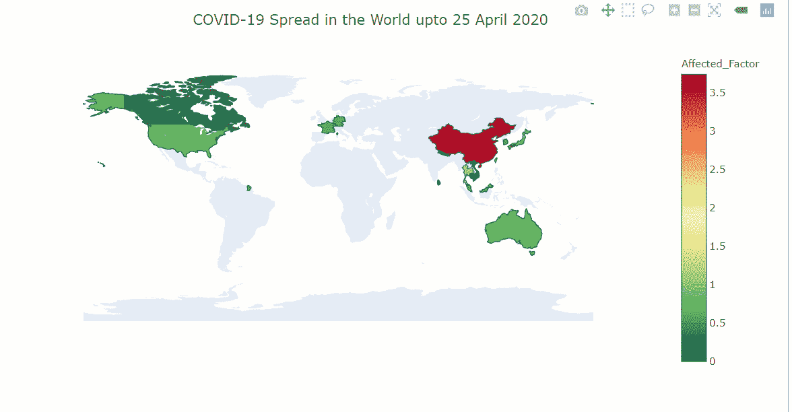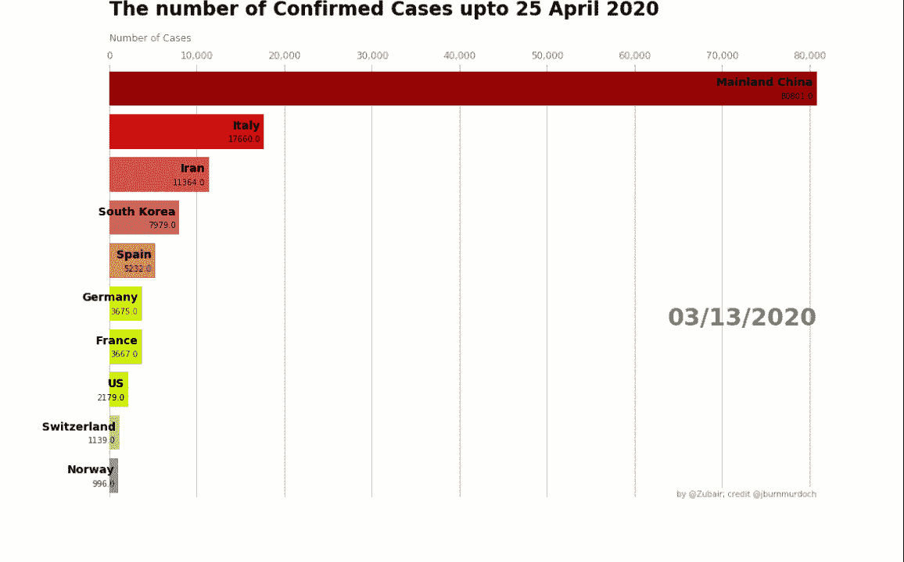

新冠肺炎传播的条形图比赛和交互式 Choropleth 地图

## 一个完整的指南条形图比赛和互动 Choropleth 地图新冠肺炎疫情与 Python。

> *“视觉化给你你不知道的问题的答案”——*[本·施耐德曼](https://www.cs.umd.edu/users/ben/)

在数据科学时代，我们必须说数据就是美。我们甚至无法想象没有数据的日子。现代技术或多或少都依赖于数据驱动的流程。但是只有原始数据在经过处理之前对我们没有任何吸引力。当数据被处理时，我们从中获得信息。信息可以是视觉的、统计的、预测的等等。如果我们能从美学角度将数据可视化，我们就能轻松洞察数据。它提供了数据的概述。适当的视觉化使人对人脑中的整个场景有一个清晰的直觉。

> “我们大多数人需要听音乐才能理解它有多美。但这通常是我们展示统计数据的方式:我们只展示音符，不演奏音乐”——汉斯·罗斯林

汉斯·罗斯林指出了数据可视化的实际思想。数据可视化对于每一个职业都是必不可少的。在这篇文章中，我们将尽最大努力代表新冠肺炎的情况，在世界各地。同时，我们将学习一些使用 python 的交互式绘图技术。

Python 提供了如此多的库，让我们的生活变得简单而美好。我们将通过新冠肺炎数据集学习一些有趣的绘图技术。

当你看完整篇文章时，你将能够创建动画，如文章中较难的部分所示。阅读文章不需要背景知识。它只不过是几行 python 代码。让我来引导。

## 路标

Python 为我们提供了使用不同库完成不同任务的灵活性。这里，我们将使用`matplotlib` 和`plotly` 库，通过[新冠肺炎](https://www.kaggle.com/sudalairajkumar/novel-corona-virus-2019-dataset#time_series_covid_19_deaths.csv)数据集获得带有条形图 race 和 choropleth map 的可视化输出。

*   为我们想要的图进行少量的数据预处理。
*   使用[新冠肺炎](https://www.kaggle.com/sudalairajkumar/novel-corona-virus-2019-dataset#time_series_covid_19_deaths.csv)数据集对确诊、恢复和死亡病例进行时尚的条形图竞赛。
*   具有新冠肺炎数据集的交互式 choropleth 地图

让我们进入下一步…

## 我们期望的数据可视化的✴Data 预处理

从 kaggle 下载[新冠肺炎数据集。数据组织得很好，每天都在更新。我使用的数据集最后更新于 2020 年 4 月 25 日。](https://www.kaggle.com/sudalairajkumar/novel-corona-virus-2019-dataset#time_series_covid_19_deaths.csv)

*   进口熊猫与`dataframe`、`numpy` 一起进行不同的数学运算，与`matplotlib` 一起进行条形图比赛。

```
import pandas as pd
import numpy as np
import matplotlib.ticker as ticker
import matplotlib.pyplot as plt
```

该数据集包含所有受影响国家的冠状病毒确诊阳性病例、死亡病例和康复病例。如果我们想看到数据，它会是这样的。

```
covid = pd.read_csv('covid_19_data.csv')
covid.head(5)
```

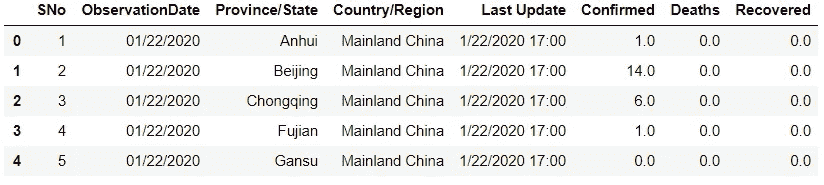

新冠肺炎数据集的前 5 行

现在，我们想要重命名这些列，因为这将有助于我们更容易地操作数据。

```
covid.rename(columns={'ObservationDate':'Date','Province/State':'State','Country/Region':'Country'},inplace=True)
```

从数据集的前 5 行，我们知道有一些冗余和不必要的列，我们将离开这些列，只保留必要的列。

```
covid=covid[["Date","State","Country","Confirmed","Deaths","Recovered"]]
```

我们的主要目标是制作一个基于国家的条形图比赛，这样我们可以按日期对国家进行分组，以找出一个国家的病例总数。

```
grouped = covid.groupby(['Country','Date'])
covid_confirmed = grouped.sum().reset_index().sort_values(['Date'],ascending=False)
```

我们将输出数据帧保存到`covid_confirmed` ，如下所示。

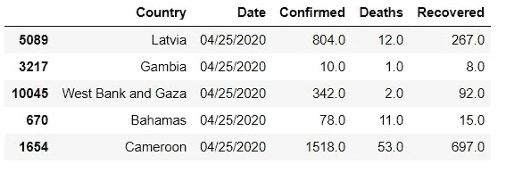

找出冠状病毒确诊病例最多的十个国家，绘制初步柱状图。我们正在步入条形图竞赛的台阶。

```
df = (covid_confirmed[covid_confirmed['Date'].eq("04/25/2020")].sort_values(by="Confirmed",ascending=False).head(10))
```

输出

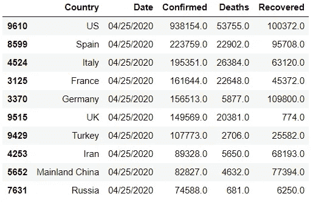

# 第一部分

**与冠状病毒传播的 matplotlib 进行条形图竞赛**

## 用 matplotlib 制作的✴Step 逐级竞速条形图

```
#plotting the initial horaizontal barchart 
fig, ax = plt.subplots(figsize=(15, 8))
ax.barh(df['Country'], df['Confirmed'])
plt.xlabel('Number of Confirmend Cases')
plt.ylabel('Country')
```

这几行代码将使用`matplotlib.`生成以下输出

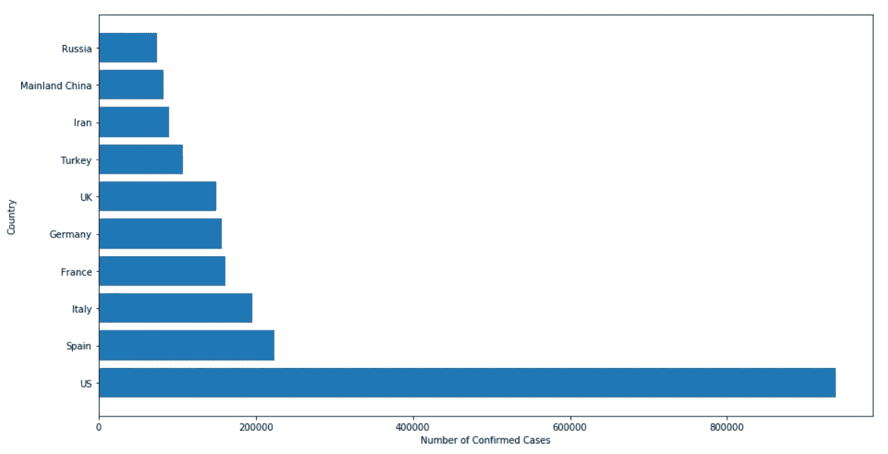

前 10 个受影响国家的条形图(从下到上)

但是我们想把最高确诊病例放在最上面。为此，我们需要翻转数据框。`df[::-1] ,`这段代码将翻转数据帧`df`

```
dff=df[::-1]
fig, ax = plt.subplots(figsize=(15, 8))
ax.barh(dff['Country'], dff['Confirmed'])
plt.xlabel('Number of Confirmed Cases')
plt.ylabel('Country')
```

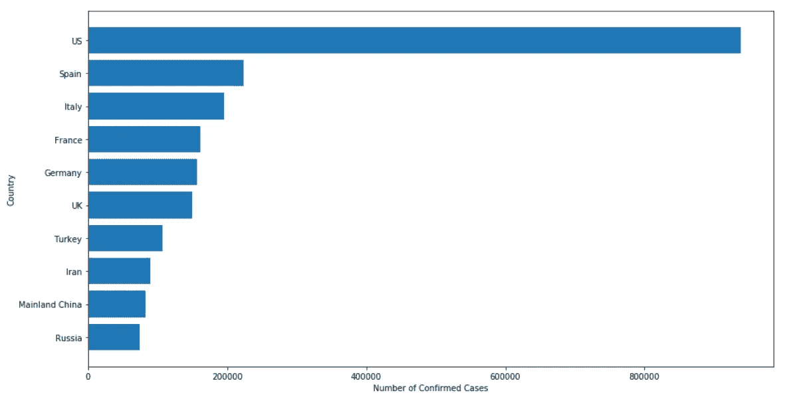

前 10 个受影响国家的条形图(从上到下)

哇！我们比预期的产量领先了几步。上面的条形图似乎不太好。我们需要图表中更多的信息和视觉色彩。为此，我们可以遵循以下技巧

> I .用*不同颜色*对每个国家进行颜色编码
> 
> 二。具有固定数量颜色的颜色代码
> 
> 三。十大受影响国家的 10 种不同颜色。

我会向你展示每一步。

*   用字典用不同的颜色给每个国家编码。

国家随机颜色编码代码

`colors`保存国家名称的字典作为关键字，颜色代码是每个国家的值。

*   您也可以使用以下方法。

```
colors = dict(zip(df_date_series.Country.unique(),['#adb0ff', '#ffb3ff', '#90d595', '#e48381', '#f7bb5f','#fb6b19','#1fb1fb'] * 31
))
```

*   只需为 10 个受影响的国家设置 10 种颜色代码

该方法用于功能部分显示的`draw_barchart`功能。

```
color=["#980505","#CD1212","#D84E4E","#CB6262","#D39B5F","#F7EC10","#D0F710","#9CF710","#B4D67F","#969C8E"]
```

但是，我对下面的条形图使用第一种方法。

彩色条形图代码

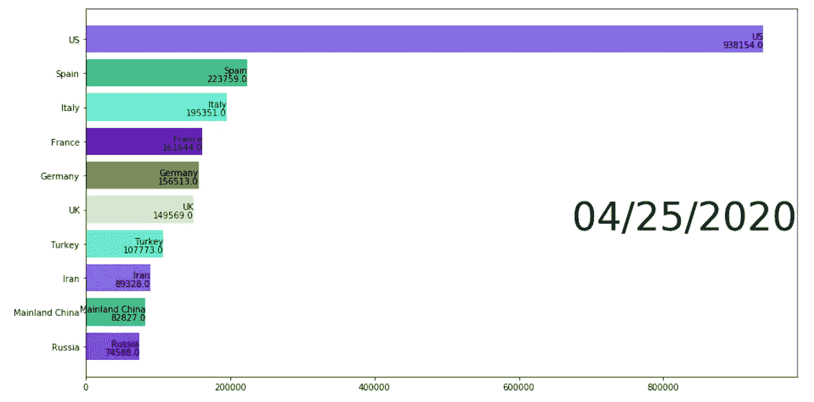

**恭喜**！我们正处于新冠肺炎数据集条形图竞赛的最后一步。我们将创建一个功能与上述所有代码和一些时尚的集成。

[“用 Matplotlib 进行 Python 中的条形图竞赛](/bar-chart-race-in-python-with-matplotlib-8e687a5c8a41)”这篇文章对我帮助很大。获得更好的条形图样式。我从文章中引用了一些波兰风格的功能，

*   **文本:**更新字体大小、颜色、方向
*   **轴**:移动 X 轴到顶部，添加颜色&字幕
*   **网格**:在横条后添加线条
*   **格式**:逗号分隔值和轴标记
*   添加标题、致谢名单、装订线空间
*   **移除**:盒框、y 轴标签

我们将使用这些东西为我们的条形图比赛进行美学设计。

***功能***

在`draw_barchart`函数中，我实现了第三个颜色代码选项。我用 10 种颜色代码列表为前 10 个受影响的国家设置了固定颜色。

对于单个函数调用，对于`draw_barchart(“04/25/2020”).`，函数将输出如下

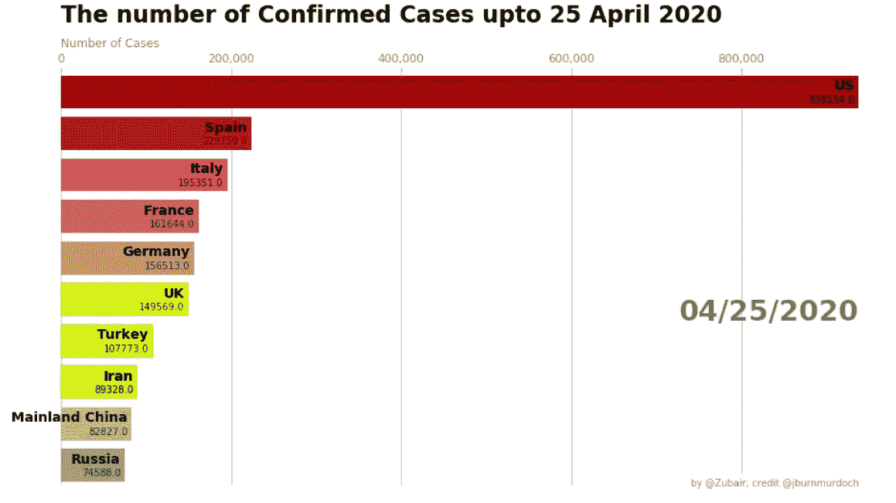

确诊病例的时尚条形图

制作一部动画是我们的最终目标，我们打算这么做。你准备好了吗？这是你的动画代码。

用 draw_barchart 函数制作动画的代码

现在我们有了下面的动画。

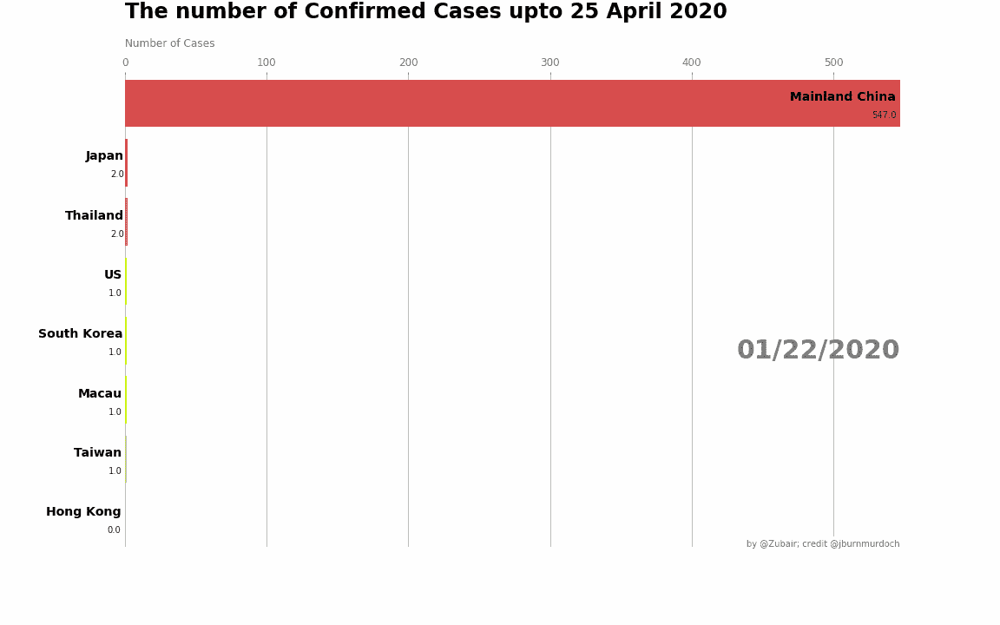

条形图竞赛动画

除了使用 HTML，还可以使用`animator.save()` 方法保存动画。如果将参数`case` 改为`Deaths` 或`Recovered` ，动画将显示`Deaths` 和`Recovered`的条形图比赛。

# 第二部分

**互动动画冠状病毒分布图**

在本文的最后，我们将创建一个交互式 choropleth 地图，如下图所示。


使用新冠肺炎数据集的交互式动画

## 数据分析和预处理的✴Little 位

我们不需要与任何没有确诊电晕病例的国家打交道。因此，我们将删除没有冠状病毒确诊病例的行。

```
modified_confirmed = covid_confirmed[covid_confirmed.Confirmed > 0]
```

为了制作有效的冠状动脉分布图，我们必须有可区分数量的冠状病毒感染病例。让我们对带有核密度图的新冠肺炎数据集有一些直觉。

kde 绘图的代码

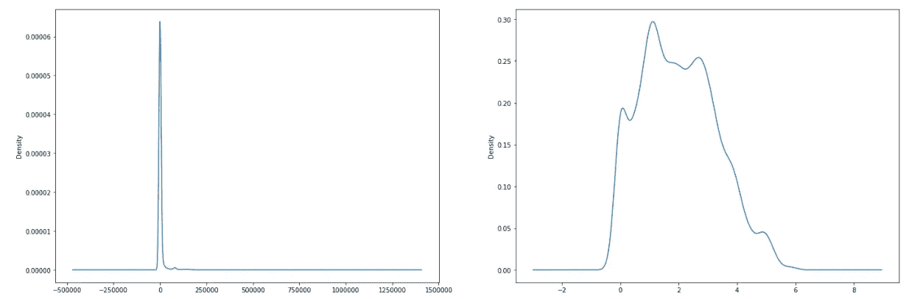

包含原始确诊病例和 log10 确诊病例的 kde 图

第一幅图显示了大多数国家的价值观被浓缩到一个点上。但是当我们用 log10 值来绘制这些值时，它显示了更多的自然分布。这表明，如果我们使用原始的确诊病例数，我们无法区分地图的颜色。因为大多数国家都会用相似类型的颜色来绘制。为了获得更好的结果，我们必须包含数据集的`log10` 值。让我们开始吧。

```
modified_confirmed['Affected_Factor'] = np.log10(modified_confirmed.Confirmed)
```

现在，我们的 modified_confirmed 数据集如下所示。

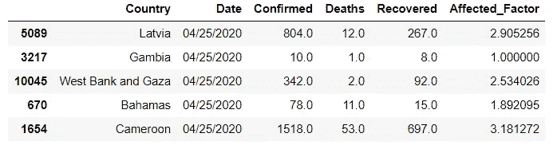

修改确认数据帧的前 5 行

是啊！我们根据确诊病例的`log10` 值在数据框中添加了一个名为`Affected_Factor` 的列。我们离最终的交互式 choropleth 地图仅一步之遥。

## ✴Creating Choropleth 地图使用 Plotly

**关于 Plotly 库**

`plotly` Python 库(`[plotly.py](https://plotly.com/python/)`)是一个交互式的[开源](https://github.com/plotly/plotly.py)绘图库，支持 40 多种独特的图表类型，涵盖了广泛的统计、金融、地理、科学和三维用例。

**安装**

如果您使用 anaconda 环境，您可以在`conda` 注释提示符下使用下面的`conda` 命令安装这个库。

```
conda install -c plotly plotly
```

[你也可以查看 anaconda 的官网了解安装过程。](https://anaconda.org/plotly/plotly)对于其他环境，可以使用`pip install`。

```
$ pip install plotly
```

**导入必要的模块**

```
import plotly as py
import plotly.express as px
```

我们将使用带有`**plotly.express**` 模块的新冠肺炎数据集绘制交互式等值线图。现在我们将为交互式地图编写最终代码。

交互式 choropleth 的代码

我们已经向`plotly.express` 对象`px.`传递了一些参数

下面是参数的简短描述。

`Dataframe:` 我已经用`[::-1]`反转了数据帧`modified_confirmed`。因为数据帧是根据最近到过去的日期排序的，但我们需要显示冠状病毒开始影响人类的日期的动画。

`location` 根据国家栏设置参数。

所有其他参数定义都作为注释嵌入到代码中。

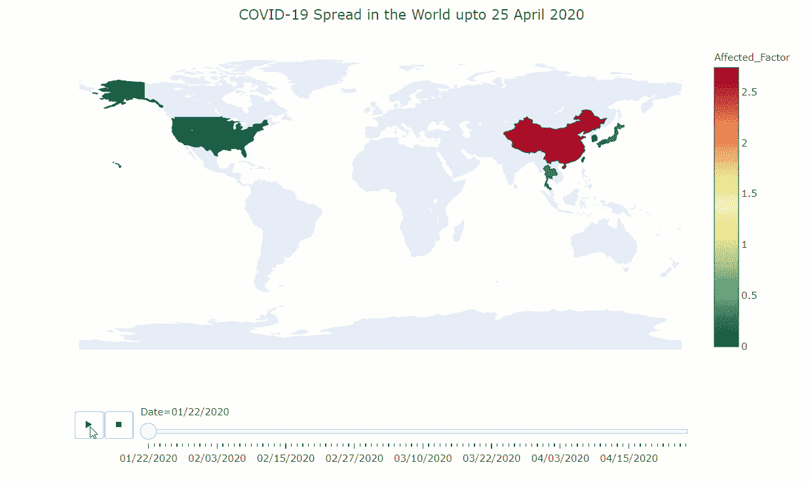

新冠肺炎传播的交互式 choropleth 地图

**剧情中的** `**Affected_Factor**` **传说预示着什么？**

虽然我在预处理部分提到过，但图例`Affected_Factor` 可能会令人困惑。这是确诊病例的`log10` 值。从核密度图中，我们得到了对确诊病例值的直觉。不同国家的确诊病例数非常接近。如果用确诊病例的数量来区分不同国家的颜色，我们可能无法区分颜色的变化。大多数国家将被标上相似的颜色。为了减少问题，我们计算了确诊病例的`log10` 值。更容易辨别。第二个内核密度图也表明了这一事实。也可以自己去查一下。

现在，我们的交互式 choropleth 地图已经准备好了。这张地图提供了新冠肺炎教在全世界传播的信息。随着时间的推移，随着确诊冠状病毒病例的增加，地图的颜色也在发生变化。我们也可以通过鼠标指针找到所有的信息。地图还支持放大和缩小。

## **结论**

数据可视化是一目了然地呈现任何事物总体状况的最佳方式。丰富 python 库使我们变得更容易。我们只需要知道如何使用它，功能如何工作。官方文档在这方面可以帮到你很多。

如果您想获得完整的项目，只需访问 [GitHub 库。](https://github.com/Zubair063/Data-Visualization/blob/master/Covid%20visualization/Covid19_viz.ipynb)你也可以从[这里](https://nbviewer.jupyter.org/github/Zubair063/Data-Visualization/blob/master/Covid%20visualization/Covid19_viz.ipynb)查看整个 jupyter 笔记本。

Python 支持这么多可视化库。其中最流行的是 matplotlib，它是一个巨大的库。您还可以找到其他可视化库的文档，如 [seaborn](http://seaborn) 、 [geopandas](https://geopandas.org/) 、 [geopy](https://geopy.readthedocs.io/en/stable/) 、 [plotly](https://plotly.com/) 等。更美观的数据绘图。

如有任何疑问，请在评论区告诉我。

*感谢您花时间阅读本文。*

**【注** : [走向数据科学](http://towardsdatascience.com/)是一份主要基于数据科学和机器学习研究的媒体出版物。我们不是健康专家或流行病学家，本文的观点不应被解释为专业建议。要了解更多关于疫情冠状病毒的信息，你可以点击[这里](https://www.who.int/emergencies/diseases/novel-coronavirus-2019/situation-reports)。**】**