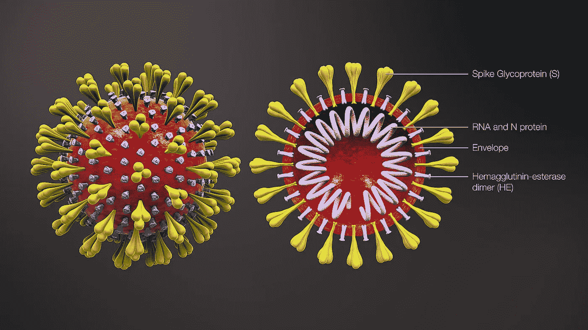

# 用冠状病毒传播禽流感

> 原文：<https://towardsdatascience.com/spreading-ai-with-coronavirus-f97727fe0873?source=collection_archive---------19----------------------->

来源:[https://it . Wikipedia . org/wiki/File:3D _ medical _ animation _ corona _ virus . jpg](https://it.wikipedia.org/wiki/File:3D_medical_animation_corona_virus.jpg)

## 对人有害的东西对机器也有好处。该病毒如何帮助推动人工智能的发展，并使一些有问题的应用程序合法化。

致命病毒以前从未发生过的事情是使用人工智能(AI)来对抗它。应用范围令人印象深刻。我们先来看看:

# 监督

## 中国

在社交媒体上流传的一段视频显示，一位中国老太太身后跟着一架无人机，指导她如何戴上口罩，这直接来自未来主义电影。

“是的，阿姨，这架无人机在和你说话。你不应该不戴口罩就到处走。你最好回家，别忘了洗手，”无人机告诉她，根据中国国有的[环球时报](https://twitter.com/globaltimesnews/status/1223218977570078721)的翻译。

很吸引人，对吧？

面部识别摄像头在中国被广泛使用，[报道](https://www.aljazeera.com/programmes/newsfeed/2020/02/coronavirus-china-facial-recognition-infrared-scanners-200224092119453.html)半岛电视台:估计有 3 . 5 亿个监控设备被用在机场、地铁站和街道上。新技术——包括用于帮助控制冠状病毒传播的红外温度扫描仪——使当局能够跟踪、存储和分析公民的旅行历史以及他们的医疗状况。

抗击病毒传播的崇高目标让政府的监控看起来合情合理，但却令人权活动人士担忧。

一些使用该国卫生和交通部门数据的移动应用程序可以提供坐在正在遭受或即将遭受病毒感染的患者附近的人的名单。告诉我你和谁坐在一起，我会告诉你你是否会生病。

## 韩国

有趣的是，在韩国，帮助追踪病例和显示受污染者所在位置的应用程序不是由政府开发的，而是由私人软件开发商开发的。在 Coronamap.live 上点击一个标有“看看我是否安全”的按钮，你就可以看到你附近是否有任何已知的快速传播病毒的病例。

我一个来自首尔的朋友告诉我，当局使用这些应用程序来追踪和消毒病毒可能被许多人感染的地方。

还有短信提醒居民他们所在地区的确诊病例，告诉他们疑似感染者去过哪里，何时去过。

# 预测系统

人工智能健康预测有一些历史:2008 年，谷歌推出了一项服务，试图使用人们的搜索查询来发现流感爆发。后来人们发现，他们实际上比美国卫生官员提前两周左右标记了 2009 年疫情猪流感，尽管他们的方法被发现一贯高估了患病人数。

如今，许多研究人员和公司试图使用人工智能来准确预测疾病的传播。一家加拿大公司 BlueDot 目前似乎是最成功的。根据 Vox 上发表的信息[，它使用大量数据来评估公共健康风险。它使用自然语言处理(NLP)和机器学习(ML)，每天浏览和分析 65 种语言的约 100，000 篇文章，以跟踪 100 多种传染病。早在 2019 年 12 月，他们就在美国疾病控制和预防中心之前第一个通知他们的客户冠状病毒爆发。为了预测疾病的传播，他们还使用旅行者行程信息、社交媒体和新闻报道等数据。](https://www.vox.com/recode/2020/1/28/21110902/artificial-intelligence-ai-coronavirus-wuhan)

约翰·霍普金斯大学一直在使用 Twitter 收集关于疾病发生地点的实时信息。但是这种类型的数据是相当嘈杂的。

可以收集和分析用于预测疾病传播的其他类型的数据是零售购买、浏览模式和私人信息中的关键字。

与只能通过具体症状做出判断的医生相比，机器能够发现隐藏的、人类无法注意到的迹象。

其他人工智能应用程序也可用于此目的。英国《每日电讯报》[报道](https://www.telegraph.co.uk/technology/2020/01/21/ai-could-combat-spread-chinas-deadly-coronavirus/)，“一项研究发现，人工智能分析的脸书状态是个体健康状况的“重要”线索，发现攻击性语言(如“哑巴”和“婊子”)有助于预测药物成瘾，奇怪的是，宗教语言(如“上帝”和“祈祷”)有助于预测糖尿病。”

我不知道脸书状态中的哪些关键词可能指向冠状病毒，但很容易想象人工智能至少可以分析冠状病毒的提及次数，让研究人员知道可能发生恐慌的内容和地点。

# 人工智能扫描阅读和药物发现

深度学习——与人脸识别和自动驾驶技术相同——可以帮助更快地诊断受感染的人。总部位于北京的 [Infervision](https://www.crunchbase.com/organization/infervision) 将其用于 CT 扫描分析。通常，病人和医生需要几个小时才能得到 CT 结果，但人工智能有助于加快检测过程，并更有效地监测疾病。医生仍然需要跟进实验室测试和其他检查，但当病毒传播如此之快时，节省时间至关重要。

人工智能的另一个用途是药物发现，这被证明是非常有前途的。对于冠状病毒，研究人员能够在几周内对新病毒的基因进行测序。像 [Exscientia 有限公司](https://www.bloomberg.com/quote/1541245D:LN)这样的公司研发药物的速度比以前快得多。如果以前开发一种药物需要数年时间，那么这些算法可以将时间缩短到 12-18 个月。对付冠状病毒这样的疫情病毒可能还需要很长时间，但值得一试。

初创公司 [Healx](https://healx.io/) 利用机器学习为现有药物寻找新用途。它现在没有解决冠状病毒，但算法搜索化合物和预测新药的能力肯定会用于未来的爆发。

但有一个问题:人工智能无法加快临床测试的速度。证明一种药物的有效性和安全性，以及监管机构审查使用该药物的结果，可能仍需要数年时间。因此，基于人工智能的药物设计者面临一项新任务:提前思考，预测未来可能给世界带来浩劫的病毒。

# 信息援助

在经历了 2011 年 3 月 11 日袭击日本的毁灭性地震后，香月明美·常贺受到启发，创建了一个名为 [Bespoke](https://www.be-spoke.io/index.html) 的聊天机器人:“根据我在那场灾难中的个人经历，我想创建一种可以在任何紧急情况下帮助人们的服务。我理解人们的恐惧，也理解他们无论身在何处都需要获得即时、准确的信息。”

今天，聊天机器人的多语言顾问向人们通报冠状病毒爆发的最新消息，分享统计数据，传播率和政府联系信息。它还提供关于不同健康和病毒相关查询的信息，包括症状、预防措施和治疗程序。

相反，脸书过滤信息以防止虚假的希望和欺诈。在脸书和 Instagram 上，他们禁止“提及冠状病毒并制造紧迫感，如暗示限量供应或保证治愈或预防”的产品广告。例如，像口罩这样声称 100%保证防止病毒传播的广告将不会被允许。”这是他们支持世界卫生组织努力的方式。

# 人工智能的发展和伦理问题

对于如何将人们的隐私权与政府阻止致命疾病传播的责任结合起来，人们仍然没有达成共识。由于政府对如此多的应用程序进行监控和跟踪，现在可以获得大量数据，这些数据为人工智能提供了养分，并让它以几乎与病毒传播相当的速度发展。

人工智能允许整合所有数据源，世界各地产生的数据量将让数据科学家实验和测试他们的模型。希望在未来，如果不是现在，训练过的模型将更早地揭示流行病的迹象，并有助于防止它们的传播--甚至可能更快地治愈。

该病毒正在帮助推动人工智能的发展，并使一些有问题的应用程序合法化。这是一个重要的问题，即我们将来如何处理这个问题。