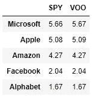
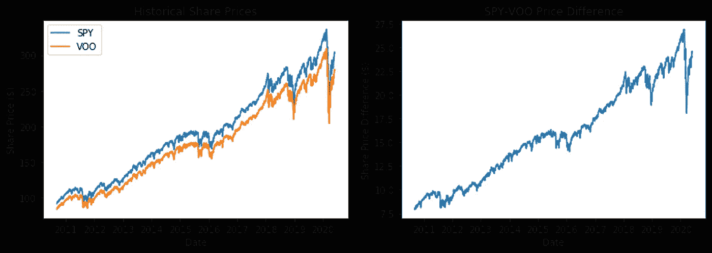
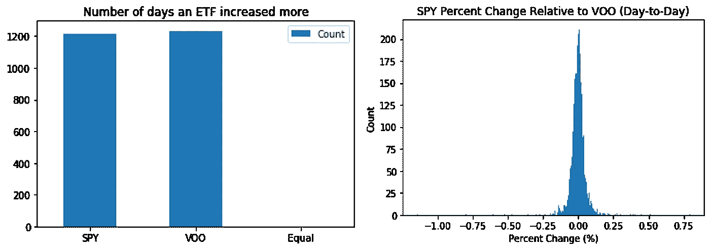
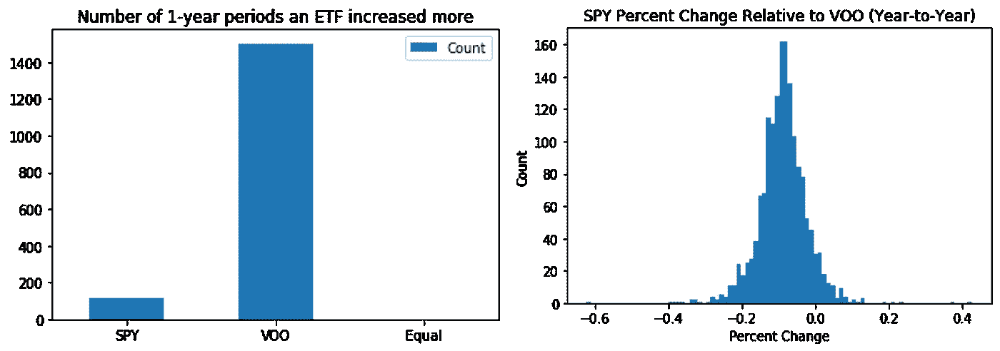
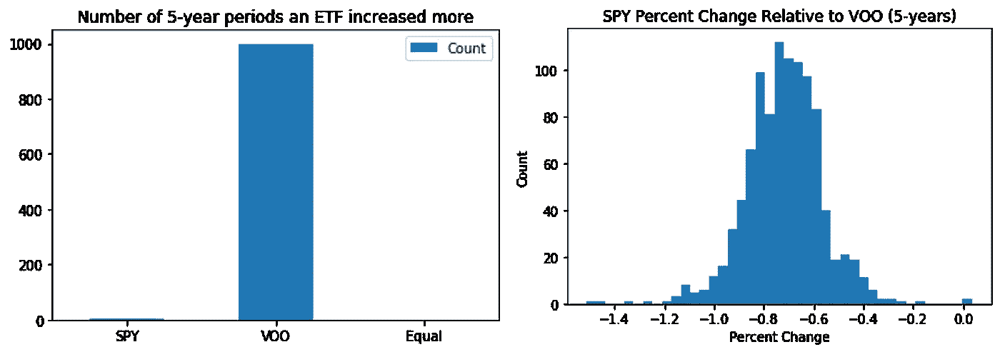
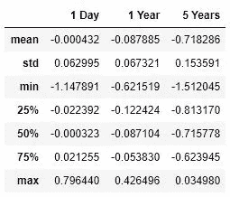

# 间谍大战 VOO:有什么不同吗？

> 原文：<https://towardsdatascience.com/spy-vs-voo-is-there-any-difference-437defc2c3f3?source=collection_archive---------0----------------------->


杰森·布里斯科在 [Unsplash](https://unsplash.com?utm_source=medium&utm_medium=referral) 上的照片

## 两种流行的标准普尔 500 ETF 的分析与比较

在我之前的[文章](/monte-carlo-simulation-with-dollar-cost-averaging-653ae47ec7d5)中，我用 Python 实现了一个关于美元成本平均策略的蒙特卡洛模拟。我研究了两只标准普尔 500 指数的交易所交易基金(ETF ),看看随着时间的推移，投资者可以期待什么样的回报。当我第一次查看两只基金(间谍基金和 VOO 基金)的时间序列时，我发现它们的曲线几乎完全相同，只是股价略有偏移。


历史时间序列显示几乎相同的曲线

这让我开始思考这两个基金之间是否有任何明显的区别。我买哪一个有关系吗？对于普通投资者来说，大多数人不会眨一下眼睛，不加思索就选择一个。当然，经过一些研究后，我发现人们经常附和说，你买哪家都没关系，因为两家都是由拥有类似资产的相同公司组成的。唯一的主要区别是费用率(拥有基金的成本)，VOO 的费用为 0.03%，而 SPY 为 0.09%。

回顾一下，标准普尔 500 交易所交易基金是由股票市场上 500 家最大的公司组成的基金。然而，并不是每家公司在基金中都被赋予了同等的权重(资产持有的百分比)。例如,《间谍》和《VOO》的前五大持股公司是微软、苹果、亚马逊、脸书和 Alphabet(谷歌),而这些公司恰好也是美国和世界上市值最大的公司。500 家公司中的这五家合计占该基金总资产的近 20%。前五大持股之间的配置差异很大，但各基金之间的配置几乎相同。



ETF 中资产持有的百分比

如此相似，我买哪一个都没关系。为了更好地衡量，让我们通过 Python 中的分析来更仔细地看看这是如何转化为现实世界的。

# 数据

SPDR 标准普尔 500 ETF 信托基金(SPY)和先锋标准普尔 500 ETF (VOO)调整后的收盘股价数据从雅虎上撤下金融。日期范围限于 2010 年 9 月 9 日(VOO 可获得的第一个数据点)和当前日期，以便进行 1:1 的比较，因为 SPY 从 1993 年开始交易。

```
import datetime
import calendar
import pandas as pd
import pandas_datareader.data as web# Start date
start_date = datetime.datetime(2010,9,9)# Today’s Date
end_date = datetime.date.today()# Pull Data
df_spy = web.DataReader(‘SPY’,’yahoo’,start_date, end_date)
df_voo = web.DataReader(‘VOO’,’yahoo’,start_date,end_date)# Adjusted Close Price dataframe
df_both['SPY'] = df_spy['Adj Close']
df_both['VOO'] = df_voo['Adj Close']
```

# 分析

## 每日价格差异

正如我们在第一张图中看到的，这两只基金之间似乎存在股价抵消。当我计算每天两种股票价格之间的差异时，我们看到差异随着时间的推移而增加。九年前，间谍只比 VOO 多 10 美元。如今，差价扩大了 250%，达到 25 美元。另一方面，与此同时，我们可以看到这两只股票的估值都翻了三倍。



历史股价显示了明显的价格差异(左)。基金之间的价格差异随着时间的推移而增加(右)。

这是一个良好的开端，但它只向我们展示了原始的价格变化。查看百分比变化可能更有用。

## 每日百分比变化

我们可以通过每天的百分比变化来分析每天的股价波动情况。使用简单的百分比变化计算，我们可以得到两个基金相对于 SPY 的变化分布。



ETF 有较大百分比变化的 1 天周期数(左)。1 天后相对于 VOO 的间谍百分比变化分布(右)。

基于这一点，很明显，这些股票每天的变化基本上没有什么不同。看起来，在任何一天，这两只基金都有 50%的几率比另一只增长更多。然而，即使一个比另一个增加得多，随着相对百分比的变化，我们看到两个基金之间的每日波动差异很小(在+/- 0.25%之内)。

## 逐年百分比变化

但长期呢，因为我们大多数人会购买这些基金，期待它们随着时间的推移而升值，而不是日内交易它们。我重新计算了一下，查看了相隔一年的不同日期的股价的年度百分比变化。



对于 1 年的时间跨度，间谍相对百分比变化的中心趋势向负方向移动了一点，大约为-0.1%。这导致 VOO 在绝大多数时间里每年都有更大的增长。这与我们之前看到的每日百分比变化有很大不同，我们之前看到的两种基金都有相同数量的增加期。

## 5 年百分比变化

当我们把投资持续时间增加到 5 年，我们可以看到 VOO 几乎每 5 年就能打败间谍。在历史数据中，只有几个 5 年的时期，间谍击败了 VOO，即使是那些也仅仅是大于 0%的差异。平均相对百分比变化继续向负方向移动，这意味着与 VOO 相比，SPY 一直“表现不佳”(增长较少)。随着时间的推移，VOO 似乎变得更好了。



当我们比较 1 天、1 年和 5 年期间的统计数据时，SPY 和 VOO 之间的平均百分比变化随着投资期限的增加而增加。中值 1 天百分比变化差异显示为 0.0003%，而 1 年期和 5 年期分别增加到 0.0871%和 0.7158%。范围和标准差也随着持续时间的增加而增加。



统计数据:相对于 VOO 的间谍百分比变化

最后，我将持续时间延长到数据集给出的从 2010 年 9 月 9 日到当前日期的最大值，发现间谍增加了 234.1%，而 VOO 增加了 236.5%，导致 10 年间的差异为 2.4%。

# 外卖食品

那么这一切意味着什么呢？哪个更好？应该买哪个 ETF？从不同角度看这些数据后，短期来看，SPY 和 VOO 之间的差别很小。这两只股票之间的每日变化几乎相同。然而，将投资期限延长到 1 年甚至 5 年，会将微小的差异放大成更大的差异。尽管间谍软件和 VOO 软件之间的平均 5 年百分比变化只有 0.72%，但这在实践中可能是一大笔钱。在 VOO，10 万美元的间谍投资相当于 100，720 美元。在整个一生或职业生涯中，根据最初的投资，这可能会比退休时多几千美元。无论如何，由于两者的相似性，潜在投资者可以放心买入。

如果你有兴趣查看我的代码，请查看我的 [GitHub](https://github.com/matchin/spy_vs_voo) ！

如果你觉得这很有趣或有启发性，请看看我做的其他分析:

*   [星巴克美元成本平均法](https://medium.datadriveninvestor.com/dont-buy-coffee-invest-instead-73c1d7d47b16)
*   [间谍大战 QQQ](https://themakingofamillionaire.com/spy-vs-qqq-investing-in-different-indexes-782714e03643)
*   [蒙特卡洛模拟的美元成本平均法](/monte-carlo-simulation-with-dollar-cost-averaging-653ae47ec7d5)