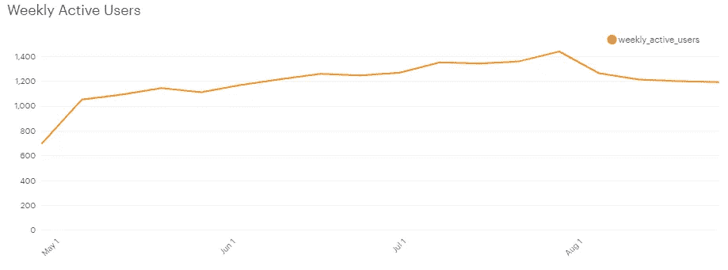
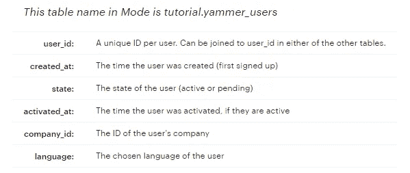
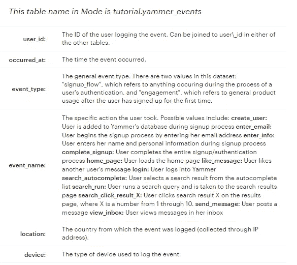
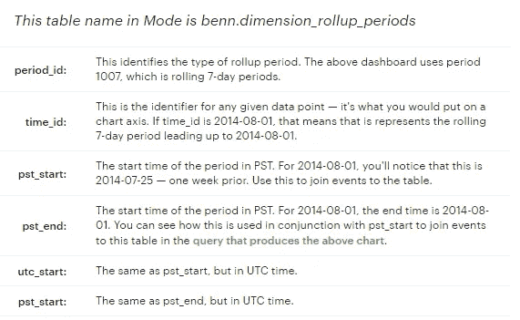
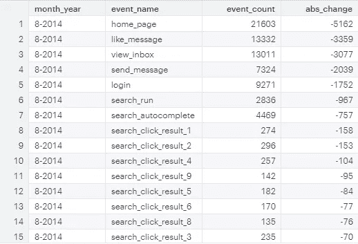
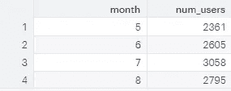
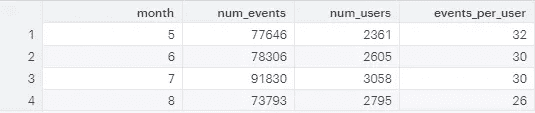
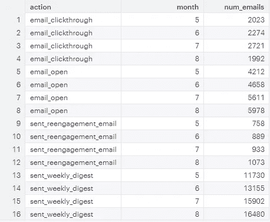
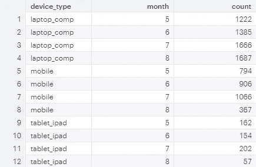
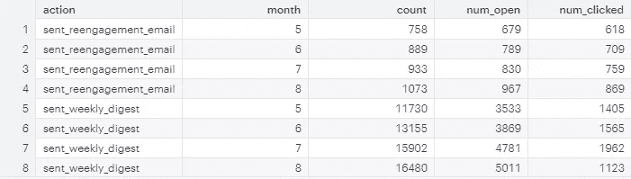

# SQL 案例研究:调查用户参与度的下降

> 原文：<https://towardsdatascience.com/sql-case-study-investigating-a-drop-in-user-engagement-510b27d0cbcc?source=collection_archive---------14----------------------->

## 现实生活中的数据分析师案例研究


图片由[皮克斯拜](https://pixabay.com/?utm_source=link-attribution&utm_medium=referral&utm_campaign=image&utm_content=1445489)的 Gerd Altmann 提供

# 目录

1.  问题
2.  集思广益潜在原因
3.  数据
4.  分析:事件级聚合
5.  分析:用户级聚合
6.  分析:按地理位置划分的参与度
7.  分析:电子邮件活动和点击率
8.  分析:按设备划分的点击率
9.  分析:每周文摘与重新参与电子邮件
10.  摘要
11.  建议
12.  进一步的步骤

# 问题

*这个案例可以在这里找到*[](https://mode.com/sql-tutorial/sql-data-types/)**如果你想自己尝试或者跟随。**

*Yammer 是一个与同事交流的社交网络。个人通过在群组中发布来共享文档、更新和想法。Yammer 可以无限期免费使用，但如果公司希望获得管理控制，包括与 ActiveDirectory 等用户管理系统的集成，则必须支付许可费。*

*Yammer 注意到每周活跃用户数下降，“从当天开始的一周内至少记录一次参与事件的用户数”。**约定**定义为通过与产品交互进行某种类型的服务器调用(在数据中显示为“约定”类型的事件)。*

*我的目标是确定下图中下降的原因。*

**

# *集思广益潜在原因*

*敬业度下降的潜在原因包括:*

*   ***产品相关问题**。产品中可能有一个缺陷，阻止了用户使用该产品。同样，Yammer 可能在 8 月初发布了一个产品更新，但有相当一部分用户不喜欢。*
*   ***一年的时间**。八月可能只是一个有很多用户去度假的月份。如果很大一部分用户是父母，这种情况可能会发生，因为他们倾向于在 9 月开学前度假。*
*   ***竞争对手**。可能是竞争对手在 8 月初推出了竞争产品，或者竞争对手发布了现有产品的重大更新，导致用户流失。*
*   *没有正确跟踪数据。有可能是数据管道没有工作，因此数据没有被正确跟踪。这是内部引起的问题，需要数据工程师的帮助来解决。*
*   ***营销事件。**当推出大型促销活动时，公司会因为提供的折扣而吸引低质量的客户，这是正常的。因此，8 月份的下跌有可能是 7 月份一次大型营销活动的后遗症。*

# *数据*

## *表 1:用户*

*每行代表一个用户，信息与每个用户相关联。*

**

## *表 2:事件*

*每行代表一个事件，这是用户在 Yammer 上执行的一个操作。这些事件包括登录事件、消息事件、搜索事件、用户通过注册漏斗时记录的事件，以及与收到的电子邮件相关的事件。*

**

## *表 3:电子邮件事件*

*此表包含与已发送电子邮件相关的事件数据。它在结构上类似于上面的事件表。*

**

## *表 4:累计期间*

*最后一个表是用于创建滚动时间段的查找表。*

**

# *分析*

## *事件级聚合*

*我想看的第一件事是什么事件被归类为“参与”。*

```
*SELECT DISTINCT event_name, event_type
FROM tutorial.yammer_events
ORDER BY event_type, event_name ASC*
```

*归类为“参与”的事件如下:*

*   *主页*
*   *喜欢 _ 消息*
*   *注册*
*   *搜索 _ 自动完成*
*   *搜索 _ 点击 _ 结果 _1*
*   *搜索 _ 点击 _ 结果 _2*
*   *搜索 _ 点击 _ 结果 _3*
*   *搜索 _ 点击 _ 结果 _4*
*   *搜索 _ 点击 _ 结果 _5*
*   *搜索 _ 点击 _ 结果 _6*
*   *搜索 _ 点击 _ 结果 _7*
*   *搜索 _ 点击 _ 结果 _8*
*   *搜索 _ 点击 _ 结果 _9*
*   *search_click_result_10*
*   *搜索 _ 运行*
*   *发送消息*
*   *查看 _ 收件箱*

```
*with one as (
SELECT 
  EXTRACT('month' FROM occurred_at) as month,
  count(event_name) as event_count
FROM tutorial.yammer_events
GROUP BY
  month
)SELECT 
  *,
  (event_count - LAG(event_count) OVER (ORDER BY month ASC)) as diff
FROM one*
```

*使用上面的查询，我们可以推断出 7 月和 8 月之间的雇佣差异是 18，037。*

*我想做的下一件事是逐月统计每个“参与”事件的发生次数，看看是否有任何重大事件导致了 7 月 28 日之后的下降。*

```
*with two as (
with one as (
SELECT 
  CONCAT( EXTRACT('month' FROM occurred_at), '-', EXTRACT('year' FROM occurred_at)) as month_year,
  event_name,
  count(event_name) as event_count
FROM tutorial.yammer_events
WHERE event_type = 'engagement'
GROUP BY
  event_name,
  month_year
)
SELECT 
  *,
  CASE
    WHEN month_year = '5-2014'
      THEN 0
    WHEN month_year != '5-2014'
     THEN (event_count - LAG(event_count) OVER (ORDER BY event_name ASC, month_year ASC))
    ELSE NULL END AS abs_change
FROM one
)
SELECT *
FROM two
WHERE
  month_year = '8-2014'
  AND abs_change < 0
ORDER BY abs_change asc*
```

**

*参与度的下降主要归因于主页、like_message_ view_inbox、send_message 和登录。似乎所有这些事件的减少都与用户登录减少有关。*

*接下来，我想在用户层面上分析数据，看看这种下降是由于用户数量的下降还是由于每用户参与次数的下降。*

## *用户级聚合*

```
*SELECT
  EXTRACT('month' from occurred_at) as month,
  count(DISTINCT user_id) as num_users
FROM tutorial.yammer_events
WHERE event_type = 'engagement'
GROUP BY month*
```

*使用上面的代码，我发现了每月活跃用户的数量。*

**

*我们可以看到用户数量从 7 月份的 3058 下降到 8 月份的 2795，下降了 8.6%。这可能是参与度事件下降的原因，特别是主页、like_message、view_inbox、send_message 和 login。*

*我还观察了每个用户的参与度是否也下降了。*

```
*SELECT
  EXTRACT('month' from occurred_at) as month,
  count(event_name) as num_events,
  count(DISTINCT user_id) as num_users,
  count(event_name)/count(DISTINCT user_id) as events_per_user
FROM tutorial.yammer_events
WHERE event_type = 'engagement'
GROUP BY month*
```

**

*每个用户的活动数量从 30 个下降到 26 个，这意味着参与度下降了 13%，这也是一个相当大的数字。*

*因此，我们需要找出为什么活跃用户数量下降，以及每个用户的参与度下降。*

## *电子邮件活动和点击率*

```
*SELECT
  action,
  EXTRACT('month' FROM occurred_at) AS month,
  count(action) as num_emails
FROM tutorial.yammer_emails
GROUP BY
action, month
ORDER BY
action, month*
```

*我想对电子邮件活动进行汇总，看看发送的电子邮件、点击率(CTR)或其他可能导致非活跃用户减少的因素是否有所变化。*

**

*很快，我注意到发送的邮件数量(每周摘要和重新参与)和打开的邮件数量稳步增长，但点击率有所下降。从 7 月到 8 月，打开的电子邮件增加了 6.5%，但点击率下降了 27%。*

## *按设备划分的点击率*

*我想更深入地了解点击率，看看这种下降是否与设备有关。这可能与操作系统的类型(IOS 对 Android)或移动对桌面有关。*

```
*with emails as(
SELECT 
  *,
  CONCAT(EXTRACT('day' FROM occurred_at), '-', EXTRACT('month' FROM occurred_at), '-',  EXTRACT('year' FROM occurred_at)) as date,
  EXTRACT('month' FROM occurred_at) as month
FROM tutorial.yammer_emails emails
), events as (
  SELECT DISTINCT 
    user_id,
    CONCAT(EXTRACT('day' FROM occurred_at), '-', EXTRACT('month' FROM occurred_at), '-',  EXTRACT('year' FROM occurred_at)) as date,
    device,
    EXTRACT('month' FROM occurred_at) as month
  FROM tutorial.yammer_events
  ORDER BY user_id ASC
)
SELECT 
  device,
  emails.month,
  count(emails.user_id)
FROM emails
LEFT JOIN events ON
  emails.user_id = events.user_id
  AND emails.date = events.date
WHERE action = 'email_clickthrough'
GROUP BY device, emails.month*
```

*使用上面的查询，我注意到从 7 月到 8 月，笔记本电脑和电脑的点击率保持稳定，但平板电脑和手机的点击率不稳定。*

*通过将设备名称分为“手机”、“平板电脑”和“笔记本电脑”，我可以确定这是否属实。*

```
*with emails as(
SELECT 
  *,
  CONCAT(EXTRACT('day' FROM occurred_at), '-', EXTRACT('month' FROM occurred_at), '-',  EXTRACT('year' FROM occurred_at)) as date,
  EXTRACT('month' FROM occurred_at) as month
FROM tutorial.yammer_emails emails
), events as (
  SELECT DISTINCT 
    user_id,
    CONCAT(EXTRACT('day' FROM occurred_at), '-', EXTRACT('month' FROM occurred_at), '-',  EXTRACT('year' FROM occurred_at)) as date,
    device,
    EXTRACT('month' FROM occurred_at) as month
  FROM tutorial.yammer_events
  ORDER BY user_id ASC
)
SELECT 
  CASE
    WHEN device IN ('amazon fire phone', 'nexus 10', 'iphone 5', 'nexus 7', 'iphone 5s', 'nexus 5', 'htc one', 'iphone 4s', 'samsung galaxy note', 'nokia lumia 635', 'samsung galaxy s4') THEN 'mobile'
    WHEN device IN ('ipad mini', 'samsung galaxy tablet', 'kindle fire', 'ipad air') THEN 'tablet_ipad'
    WHEN device IN ('dell inspiron desktop', 'macbook pro', 'asus chromebook', 'windows surface', 'macbook air', 'lenovo thinkpad', 'mac mini', 'acer aspire desktop', 'acer aspire notebook', 'dell inspiron notebook', 'hp pavilion desktop') THEN 'laptop_comp'
    ELSE null end as device_type,
  emails.month,
  count(emails.user_id)
FROM emails
LEFT JOIN events ON
  emails.user_id = events.user_id
  AND emails.date = events.date
WHERE action = 'email_clickthrough'
GROUP BY device_type, emails.month*
```

**

*事实上，点击率的下降似乎特别归因于移动设备和平板电脑。*

## *每周文摘 vs 再次接洽电子邮件*

*到目前为止，我认为缺乏参与的原因是 7 月到 8 月电子邮件点击率的下降。为了收集更多的信息，我想看看我们是否可以通过电子邮件类型进一步缩小问题的范围。*

```
*with one as (
SELECT 
  *,
  EXTRACT('month' from occurred_at) as month,
  CASE WHEN (LEAD(action, 1) OVER (PARTITION BY user_id ORDER BY occurred_at ASC)) = 'email_open' THEN 1 ELSE 0 END AS opened_email,
  CASE WHEN (LEAD(action, 2) OVER (PARTITION BY user_id ORDER BY occurred_at ASC)) = 'email_clickthrough' THEN 1 ELSE 0 END AS clicked_email
FROM
  tutorial.yammer_emails
)SELECT 
  action,
  month,
  count(action),
  sum(opened_email) as num_open,
  sum(clicked_email) as num_clicked
FROM
  one
WHERE action in ('sent_weekly_digest','sent_reengagement_email')
GROUP BY
  action,
  month
ORDER BY
  action,
  month*
```

**

*很明显，点击率的下降是由于每周摘要邮件，而不是重新参与电子邮件。*

# *摘要*

*通过我的分析，我可以得出以下结论:*

*参与度的下降主要归因于五个参与度事件(主页、like_message_ view_inbox、send_message 和登录)的下降。*

*然后，我发现事件的减少是由总活跃用户 MoM 的减少以及每个用户参与度的降低引起的。*

*在我查看了电子邮件表之后，我注意到从 7 月到 8 月，尽管打开的电子邮件数量有所增加，但点击率却显著下降。*

*通过按设备类型(手机、平板电脑、笔记本电脑)划分点击率，我注意到点击率的下降归因于手机和平板电脑设备。*

*最后，点击率的下降归因于每周摘要电子邮件，而不是重新参与电子邮件。*

# *建议*

*我的建议是立即深入查看专门针对移动设备和平板电脑的每周摘要邮件。这可能是一个技术问题，让用户很难点击电子邮件，或者只是一个 UX 问题，即电子邮件的内容和布局无法吸引用户点击。一个好的第一步是看看从 7 月到 8 月发生了什么变化，并向后追溯。*

# *进一步分析*

*其他一些可以考虑的因素包括:*

*   *查看变化是否归因于少数用户(Pareo 原则)*
*   *群组分析，了解原因是否是由于用户生命周期短*
*   *按语言分析*
*   *按地理分析*

# *感谢阅读！*

## *特伦斯·申*

**[*ShinTwin*](https://shintwin.com/)*|让我们连线上* [*LinkedIn*](https://www.linkedin.com/in/terenceshin/)**