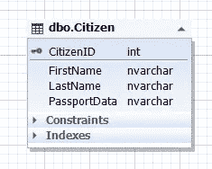
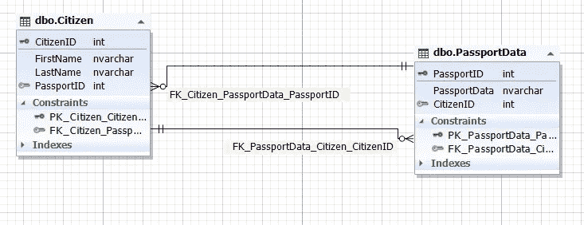
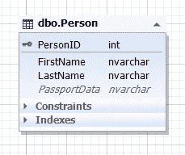
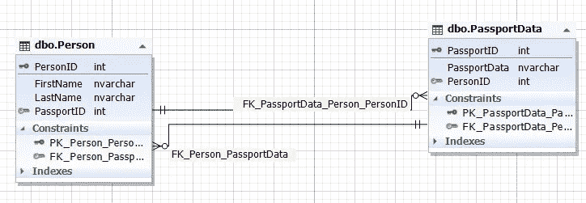
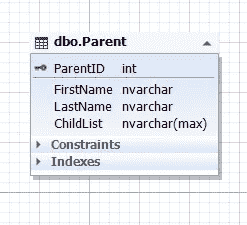
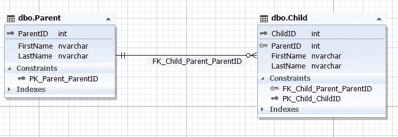
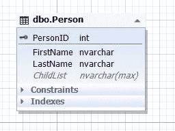
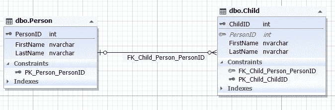
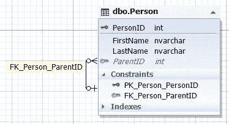
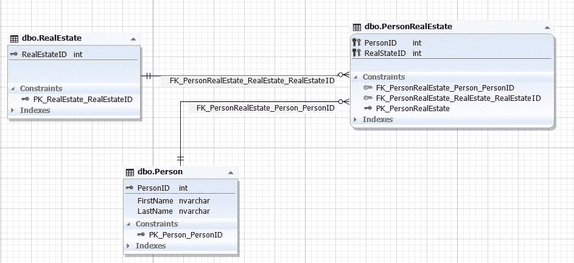

# SQL 数据库设计基础及示例

> 原文：<https://towardsdatascience.com/sql-database-design-basics-with-example-8dcce4b0c687?source=collection_archive---------41----------------------->

## 这篇文章解释了数据库设计的基本概念，并通过一个生动的例子展示了如何创建数据库模式。

图片来自 [Piqsels](https://www.piqsels.com/en/public-domain-photo-jzwoe) (CC0)

DB 架构师必须设计一个适合特定解决方案的关系数据库，这是一种常见的做法。

一个星期五的晚上，我乘通勤火车下班回家，我在想创建一种招聘服务。据我所知，现有的服务都不允许对候选人进行快速评估，对某些技能、项目或职位进行复杂的筛选，或者排除某些技能、职位或项目。最大使用范围是按公司过滤，部分按技能过滤。

在这一系列文章中，我将稍微放纵一下自己，用一些来自我生活中的非技术例子来尝试打破严谨的技术写作。

在这一部分中，我将讲述关系数据库设计的基础知识，并举例说明一个招聘服务的 [MS SQL Server 数据库设计](https://www.devart.com/dbforge/sql/studio/sql-server-database-designer.html)。

现在，在接下来的文章中，我将向您展示如何通过 SQL Server 的[数据生成器](https://www.devart.com/dbforge/sql/data-generator/)向数据库填充数据，并使用免费的 [dbForge Search](https://www.devart.com/dbforge/sql/search/) 工具搜索数据库数据和对象。我将使用[db forge Studio for SQL Server](https://www.devart.com/dbforge/sql/studio/)来实现我的示例的图表，使用 [dbForge 数据泵](https://www.devart.com/dbforge/sql/data-pump/)来导入和导出数据。

# 数据库设计基础

为了设计数据库模式，让我们回忆一下 7 种范式以及规范化和反规范化的概念。它们是所有设计规则的基础。

我来详细描述一下 7 种范式:

## 1.一对一的关系:

1.1 强制性关系:

一个例子是一个有护照的公民(每个公民都必须有一本护照，而护照是每个公民的)

这种关系通过两种方式实现:

1.  1.1 在一个实体中(表):

**Img.1 .“公民”实体**

这里，公民表表示公民实体，PassportData 属性(字段)包含公民的所有护照数据，不能为空(非 NULL)

1.  1.2.在两个不同的实体(表)中:

**img . 2 . Citizen 和 PassportData 实体之间的关系**

Citizen 表表示公民实体，PassportData 表表示公民护照数据的实体。citizen 实体包含 PassportID 属性(字段),该属性引用 PassportData 表的主键。然而，passport 数据实体具有 CitizenID 属性(字段),该属性引用公民表的 CitizenID 主键。

保证 CitizenID 字段和 PassportData 表的完整性也很重要，以提供一对一的关系。也就是说，Citizen 表中的 PassportID 字段和 PassportData 表中的 CitizenID 字段必须引用相同的记录，就像第 1.1.1 段中说明的一个实体(表)一样。

1.2 可选关系:

这里的一个例子是，一个人可能有护照数据，但可能没有指定的国家。所以，在第一种情况下，他是某个国家的公民，而在第二种情况下，他不是。

这种关系通过两种方式实现:

1.  2.1 在一个实体中(表):

**Img.3 .人实体**

这里，person 表表示 Person 实体，PassportData 属性(字段)包含个人的所有护照数据，可以为空(NULL)

1.2.2 在两个实体(表格)中:

**img . 4 . Person 和 PassportData 的关系**

这里，person 表表示 Person 实体，passport 数据表表示人员的 passport 数据实体(即 Passport 本身)。person 实体包含 PassportID 属性(字段),该属性引用 PassportData 表的主键。然而，护照数据实体在 Person 表中有 PersonID 属性(字段)。Person 表的 PassportID 字段可以为空(NULL)。

保证 PersonID 字段和 PassportData 表的完整性也很重要，以提供一对一的关系。也就是说，Person 表的 PassportID 字段和 PassportData 表的 PersonID 字段必须引用相同的记录，就像它是第 1.2.1 段中所示的一个实体(表)一样，或者这些字段必须是未指定的，即包含 NULL。

## 2.一对多关系

2.1 强制性关系:

父母和他们的孩子就是一个例子。每个父母至少有一个孩子。

您可以通过两种方式实现这种关系:

2.1.1 在一个实体中(表):

**Img.5 .母实体**

在这里，父表代表父实体，ChildList 属性(字段)包含关于子级的信息，即子级本身。此字段不能为空(非 NULL)。ChildList 字段类型通常是半结构化数据(NoSQL ),如 XML、JSON 等。

2.1.2 在两个实体(表格)中:

**Img.6 .父子实体的关系**

这里父表代表父实体，子表代表子实体。子表的 ParentID 字段引用父表的主 ParentID 键。子表的 ParentID 字段不能为空(非 NULL)。

2.2)可选关系:

例如，一个人可能有孩子，也可能没有孩子。

这种关系通过两种方式实现:

2.2.1 在一个实体中(表):

**Img.7 .人实体**

这里，父表表示父实体，而 ChildList 属性(字段)包含有关子级的信息，即子级本身。该字段可以为空。通常的 ChildList 字段类型是半结构化数据(NoSQL ),如 XML、JSON 等。

2.2.2 在两个实体(表格)中:

**Img.8 .个人和子实体之间的关系**

这里父表代表父实体，子表代表子实体。子表的 ParentID 字段引用父表的主 ParentID 键。子表的 ParentID 字段可以为空(NULL)。

此外，如果子实体和父实体(表)具有相同的属性(字段)集，而不引用父实体，则存在引用自身的第三种单实体实现方式:

**Img.9 .具有自我参照的人实体**

这里，Person 实体(表)包含 ParentID 属性(字段),该属性引用同一个表 Person 的主要 PersonID 键，并且可以有一个空值(NULL)。

这是具有可选性质的多对一关系的实现。

## 3.多对一关系

这种关系反映了上述一对多关系。这是子实体和父实体之间的关系，如果孩子至少有一个父母，这种强制性关系是可能的，如果我们收留所有的孩子，包括孤儿之家的孩子，那么这种关系就具有选择性。

通过添加引用相应实体主键的必要属性，一对多和多对一关系也可以通过两个以上的实体来实现。该实现类似于上面第 1.1.2 和 1.2.2 段中的示例。

## 4.多对多关系

在这种情况下，可以由一个人或几个人拥有的房地产就是一个例子。同时，一个人可以拥有多套房屋，也可以拥有多套房屋的所有权份额。

您可以按照上面针对前面的关系描述的方式来实现与 NoSQL 的关系。然而，在关系模型中，这种关系通常通过 3 个实体(表)来实现:

**Img.10 .该人与不动产实体之间的关系**

在这里，person 和 RealEstate 表相应地表示了 Person 和 real estate 的实体。这些实体(表)通过 PersonRealEstate 实体(表)的 PersonID 和 RealEstateID 属性(字段)相关联，这些属性相应地引用 Person 表的 PersonID 和 RealEstate 表的 RealEstateID 的主键。注意这对(PersonIDRealEstateID)对于 PersonRealEstate 表总是唯一的，因此它可以是 PersonRealEstate 链接实体(表)的主键。

通过添加引用相应实体的主键的必要属性，这种关系可以通过 3 个以上的实体来实现。这种实施类似于段落 1.1.2 和 1.2.2 中描述的示例。

你可能会想，这 7 种范式在哪里？

嗯，他们在这里:

1.  Par.1 (par.1.1 和 par.1.2)是第一个和第二个正式规则。
2.  第 2 款(第 2.1 款和第 2.2 款)是第三条和第四条正式规则。
3.  第 3 段(类似于第 2 段)是第五条和第六条正式规则。
4.  第四杆是第七条正式规则。

只是这 7 个范式在上面的文本中被分组为 4 个功能块。

标准化消除了数据冗余，因此降低了数据异常的风险。但是，分解实体(表)时的规范化会导致为数据操作(插入、更新、选择和删除)构建更复杂的查询。

相反的过程是反规格化。它通过添加冗余数据简化了数据访问的查询处理(例如，在上面的 par。2.1.1 和 2.2.1 借助半结构化数据(NoSQL))。

你确定你掌握了 7 种范式的要点吗？你真的懂了，而不仅仅是熟悉它。问问你自己，在几个小时内，你是否能够为任何数据域或任何信息系统设计一个数据库模型，即使有过多的实体。您可以稍后通过询问分析和客户代表来润色复杂和细节。

如果这个问题让你措手不及，你认为完成这个任务是非常不可能的，那么你知道 7 种范式，但不理解它们。

不知何故，资料中没有说明，实体之间的这些关系不仅仅是虚构的，而是被发现的。也就是说，从一开始，它们实际上就存在于主体和客体之间的现实世界中。

除此之外，这些关系可以改变，从一对一到一对多，或多对一，或多对多，改变它们的强制性质或保留它。

我认为你应该试着观察人们，并发现主体之间以及主体和客体之间的现有关系(上面的例子说明了公民和护照是一对一的关系，具有强制性质，而人和护照是一对一的关系，是可选的)。

当您深入了解了 7 种范式后，您就可以轻松地为任何信息系统设计任何复杂程度的数据库模型。

除此之外，你将会知道你可以用许多不同的方式实现这些关系，而且这些关系本身也可以改变。因此，数据库模型(模式)是某个时间点实体之间关系的快照。因此，有必要指定两个实体，它们是真实世界或领域对象的映像，并考虑到未来的变化来指定它们之间的关系。

一个设计良好的数据库模型，适当考虑现实和主题领域中的关系变化，在很长一段时间内不需要任何更改。这对于数据存储尤其重要，在数据存储中，变化涉及到重新保存大量数据，从几千兆字节到几兆兆兆字节。

***注:*** 在关系数据库模型中，是实体之间的关系，行(元组)就是这些关系的例子。但是为了简单起见，我们通常用表来表示实体，用行来表示实体的实例，用外键关系来表示实体之间的关系。

# 为招聘设计数据库模式

在本文的第一部分描述了数据库设计基础之后，现在让我们为招聘创建一个数据库模式。

首先，我们需要定义哪些信息对于搜索求职者的公司员工来说是重要的:

1.  对于人力资源经理:

1)申请人曾经工作过的公司。

2)申请人曾经在这些公司担任的职位。

3)申请人在工作中使用的技能，他们在每个公司和每个职位的就业时间，每种技能使用的时间。

2.对于技术专家:

1)申请人以前工作过的职位。

2)申请人在工作中使用的技能。

3)申请人参与的项目。除此之外，了解申请人在每个职位和每个项目中的工作时间以及每项技能的使用时间也很重要。

让我们首先确定必要的实体:

公司和雇员具有多对多的关系，因为雇员可以为不同的公司工作，而这些公司有许多雇员。

这同样适用于职位和员工，因为许多员工可以在一个公司的一个职位上工作，也可以在不同的公司工作。因此，一个雇员可以在一个公司或许多不同的公司的不同岗位上工作。因此，职位和公司之间也是多对多的关系。

“项目”实体遵循相同的逻辑:项目以多对多的方式与上述所有其他实体相关。

为了简单起见，让我们假设一个雇员在一个项目中使用一套技能。然后，项目和技能的关系也是多对多。

考虑到指定员工在这家或那家公司、特定职位和特定项目中任职时间的重要性，我们的数据库模式可能具有以下 ER 图:

**Img.11 .招聘服务的数据库模式**

在这里，JobHistory 表表示每个雇员的工作历史的实体，即实现雇员、公司、职位和项目之间多对多关系的简历。

项目和技能是多对多的关系，因此，它们在 ProjectSkill 实体的帮助下联系在一起。

如果您理解了主题之间、主题和对象之间的关系，即数据库设计规范，您可以在一个小时之内在一张纸上创建一个类似的模式。

在这里，如果我们通过 XML、JSON 形式的半结构化数据(NoSQL)将技能放入项目实体中，或者简单地用分号列出技能的名称，我们可以简化模式和数据添加。但是这将使按技能选择分组和按特定技能筛选变得困难。

# 结论

如您所见，设计系统只是将对象和主体从现实变为数据库实体，其中这些实体之间的关系在某个时间点是固定的，并考虑到未来的变化。我们究竟从现实中获取什么并作为一个模式实体来实现，以及我们在模型中建立什么样的关系，这取决于我们现在和将来对信息系统的总体要求。也就是说，我们想要获得当前时刻和未来某个时间的哪些数据。

*原载于 2020 年 7 月 22 日*[*【https://blog.devart.com】*](https://blog.devart.com/sql-database-design-basics-with-example.html)*。*