# 面向初学者的 SQL

> 原文：<https://towardsdatascience.com/sql-for-beginners-2fcd2d6c8667?source=collection_archive---------46----------------------->

安妮·斯普拉特在 [Unsplash](https://unsplash.com/?utm_source=unsplash&utm_medium=referral&utm_content=creditCopyText) 上的照片

## 从美国广播公司的热门节目【单身汉 的有趣数据中学习 SQL 的基础知识

在去年夏天学习数据科学并第一次学习编码后，我主要使用 Python，我喜欢它。我仍然更习惯使用 Python，但是一旦我开始找工作，我很快就知道作为一名数据专业人员了解 SQL 的重要性。在我读过的所有入门级数据工作描述中，SQL 熟练程度往往被要求，而且肯定比 Python 更频繁。我在数据科学训练营中学习了这种语言，但只是皮毛。我知道我需要深入一点，所以我自学了。然后我被聘为数据分析师，在工作中我学到了更多。

这一课将有助于任何很少或没有 SQL 经验的人。

如果您想继续学习，我正在使用 DB Browser for SQLite，您可以通过点击与您的计算机操作系统相对应的链接在此处免费下载。我还使用了我创建的三个 CSV 文件，其中充满了*学士*的数据，你可以从我的 GitHub [这里](https://github.com/rachelkoenig10/bachelor_project/tree/master/data)下载它们，或者如果你有不同的感兴趣的主题，你也可以使用你自己的文件。打开 SQLite 后，您需要:

1.  通过点击左上角的按钮创建一个新的数据库。
2.  以您喜欢的任何名称保存在一个文件夹中，以便您以后可以找到它。我叫我的*学士 _ SQL _ 教程*但是真的没关系。接下来会要求您创建一个表，只需单击 cancel。我们将在接下来的步骤中导入这些表。
3.  转到文件>导入> CSV 文件中的表格…
4.  一次选择一个 CSV，以便每个 CSV 都是自己的表。将出现一个弹出屏幕，您可以在其中检查您的数据看起来是否正确，即在继续之前，列有标题并由逗号分隔。
5.  最后，您可以通过点击表格名称，然后点击**数据库结构**选项卡中的修改表格来编辑表格。在这里，您可以修改任何数据类型，分配主键，重命名或删除列，以及调整表中列的顺序。

## 开始前需要知道的几件重要事情:

*   查询是一个问题，之所以这样称呼 SQL 查询，是因为它向数据库传递一个问题
*   数据库是由多个表组成的集合。在这种情况下，有 3 张桌子，但通常也可能是 100 张或 1000 张。通常，您应该能够访问某种数据字典，它将解释每个表/列中的数据的含义，和/或 ERD(实体关系图),它显示表之间的关系。

单身女郎——所有女性演职人员及其属性

单身汉—所有男性演职人员及其属性

家乡——带有 id #的城市、州和国家

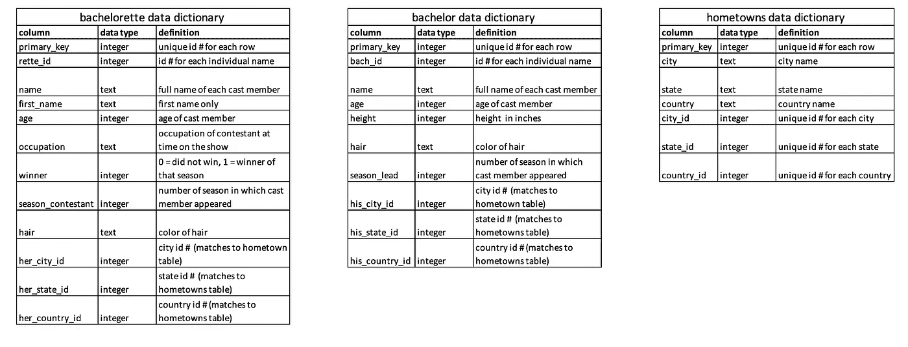

数据字典

诱发反应测定器

*   每个表都有一个主键，它为每一行分配一个唯一的编号，任何一行都不应该与另一行完全相同
*   编写查询时，顺序很重要，大小写无关紧要。您将始终以 select 和 FROM 语句开始，但是如果您编写 SELECT 或 SELECT，则不区分大小写。只是要做好准备，如果在工作场所使用 SQL，许多公司会有他们更喜欢的风格，你必须适应。我最常看到的方式是大写子句后面跟着小写语句。

请注意，术语可能会有所不同，但出于本教程的目的，我将把下面的作为子句，后面的短语作为语句。子句的顺序必须始终如下。我学会的帮助我记住顺序的助记法是**S**ome**F**rench**W**aiters**G**row**H**ealthy**O**ranges&Lemons。这有点奇怪，需要试着记几遍，但对我来说很有效！

挑选

从

加入

在哪里

分组依据

拥有

以...排序

限制

您至少需要 SELECT 和 FROM 语句，但如果您需要其余的语句，这将取决于您试图提取的内容。SELECT 是输入要返回的列名的地方，FROM 是指定从哪些表中提取数据的地方。

当您第一次使用新的数据库时，探索并熟悉不同的列和其中的数据总是一个好主意。您可以使用 SELECT *查看表中的所有列。

现在我们已经准备好移动到**执行 SQL** 选项卡并开始编写查询！现在让我们看看*单身女子*表中的所有列。在屏幕的白色顶部输入 SELECT * FROM *单身汉*。要执行，您可以点按蓝色小三角形按钮或按住键盘上的 command + enter。

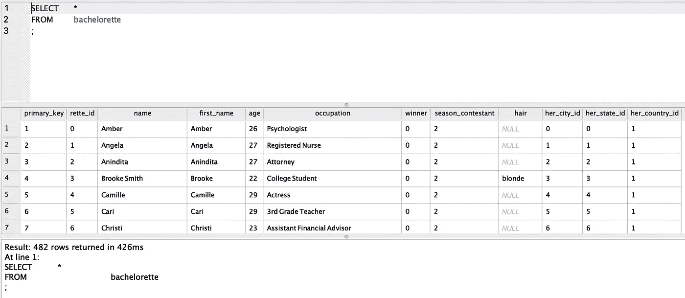

如果我们只想查看姓名、年龄、职业和季节列，它应该是这样的

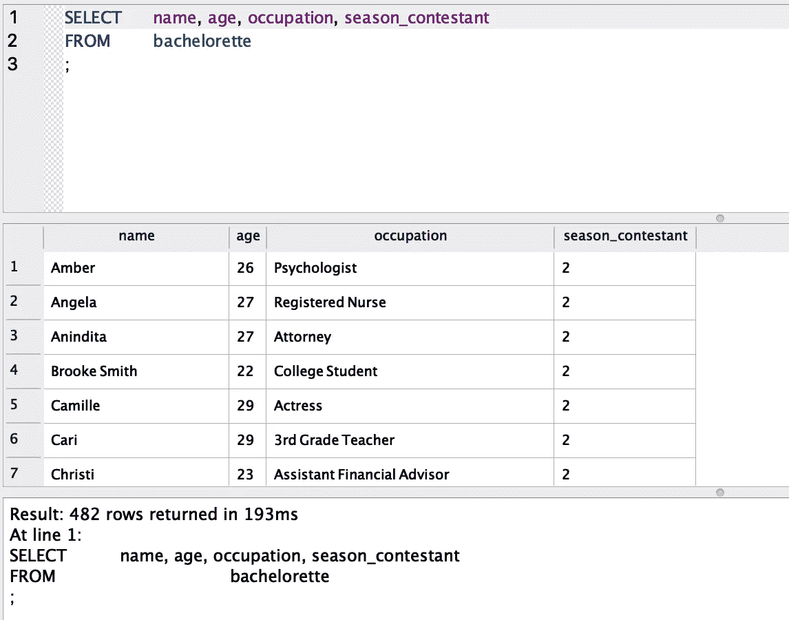

如您所见，season _ contactor 行有重复的数据。假设我们想看看表中有多少个独特的季节。我们可以使用 DISTINCT 对每个值只查看一次。

## 添加位置

WHERE 子句允许我们通过添加关于我们想要查看哪些行的细节来过滤数据。语法是:

列名+过滤运算符+具体要求

最常用的过滤器运算符有:

LIKE —当您希望行中的数据匹配字符串或字符串的一部分时使用。通常在开头和/或结尾与通配符(%)一起使用。

BETWEEN 用于过滤某个范围内的数字列

IN-返回与列表或子查询中的字符串完全匹配的任何行

= —完全匹配

<>而且！= —两者都表示不等于

>和

≥和≤ —大于或等于、小于或等于

如果需要多个筛选器，请使用 AND 或 or 将语句链接在一起。

我们来做几个例子！假设我们想知道哪些单身女子是 30 岁以下的护士，头发是棕色还是黑色。

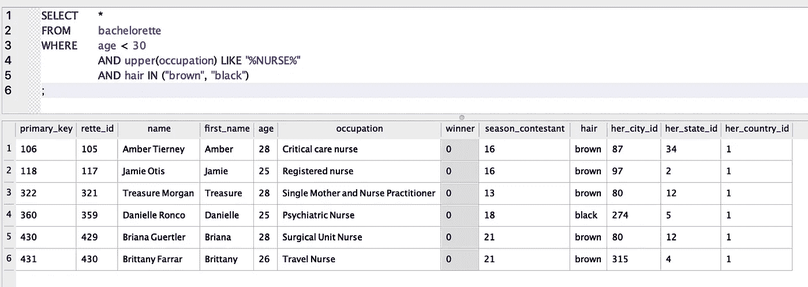

注意，我使用 UPPER 将职业列中的所有字符串都大写，因为数据中的大小写格式不一致，这是一个常见的问题

或者，如果我们想知道第 15 季中哪些选手的年龄在 28 到 32 岁之间，是金发还是名字以 r 开头。

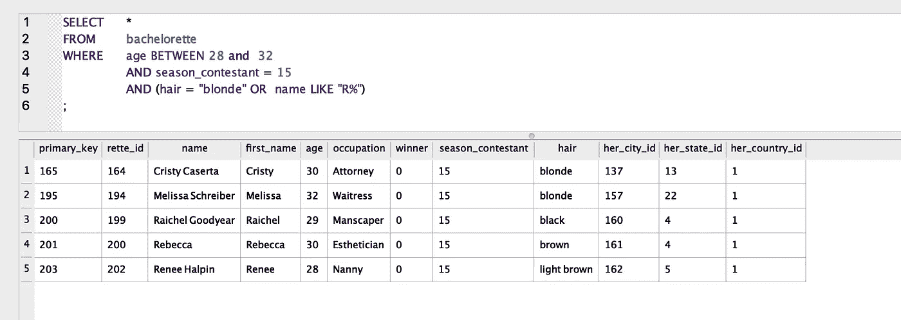

或者最后，让我们看看有多少获奖者不是金发碧眼的？

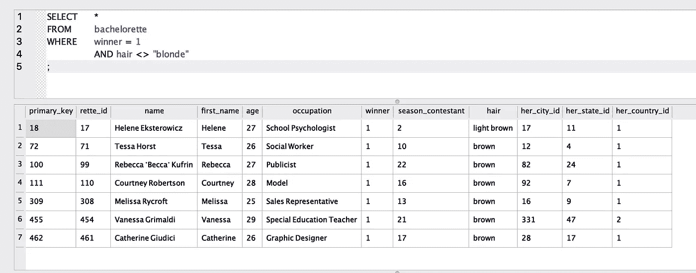

只有 7 个！

您还将使用 WHERE 子句来查找空值或 NaN 值，如下所示:

## GROUP BY 子句和聚合函数

有时，您会希望查询的答案只是一个数字，例如一行的平均值或总数。这叫做聚集。最常见的聚合函数有

*   `COUNT — returns the total # of rows`
*   `AVG — returns the average of a column. Sometimes written as AVERAGE depending on which version of SQL you are using.`
*   `MIN — returns the smallest number in a column`
*   `MAX — returns the largest number in a column`
*   `SUM — adds all the numbers in a column and returns the total`

例如，假设你想知道单身汉的平均年龄。

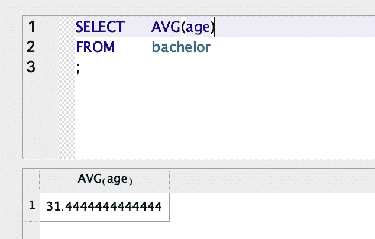

注意:可以在开头加上 ROUND 函数，在结尾加上小数位数，得到一个实数。例:四舍五入(AVG(年龄)，0)

通常，我们希望在运行聚合之前对数据进行分组。就像如果我们想知道每个季节单身女性的平均年龄，我们会按季节分组。

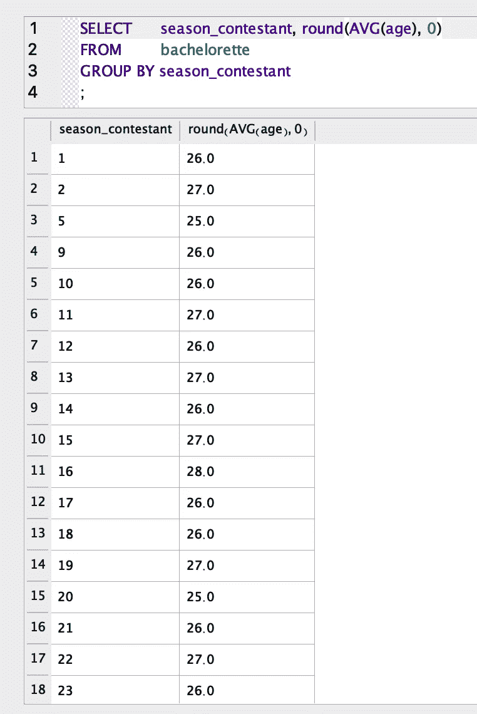

我们可以结合 WHERE 子句添加其他条件。SELECT 语句中的 COUNT(*)将对符合查询规范的每一行进行计数。这里我们就用它来统计一下有多少 30 岁以上的单身汉有每种颜色的头发。

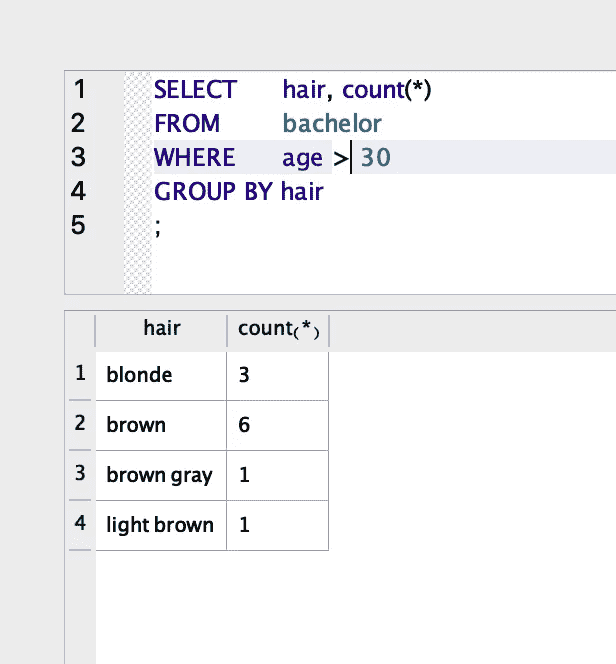

另一个例子是找出赢得赛季冠军的女孩的平均年龄。

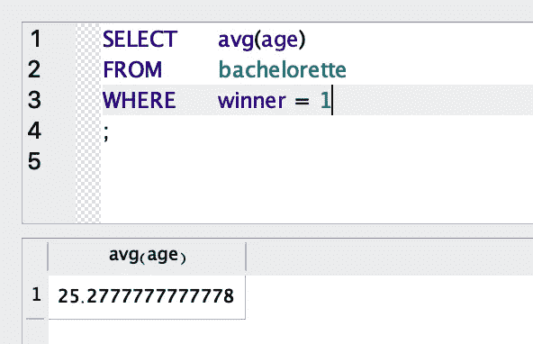

如果我们想知道谁是最高或最矮的单身汉，我们会用 MAX 或 MIN。

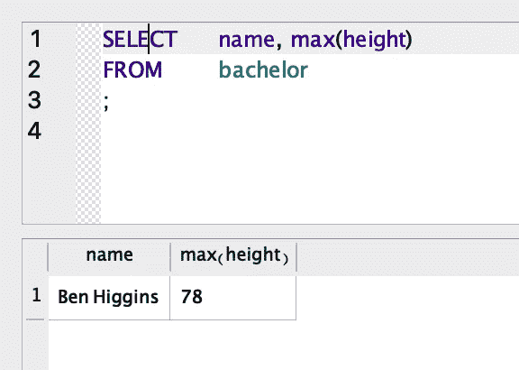

## 拥有

HAVING 是另一种筛选数据的方法，比如 WHERE，除了使用聚合数据。比方说，我们想看看哪一季的参赛者最大年龄不超过 30 岁。

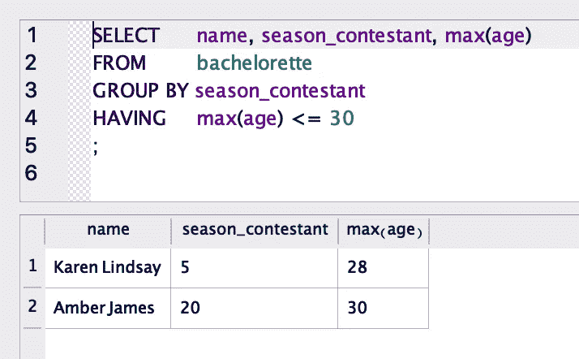

不幸的是，我的数据中没有太多好的例子。不过，在工作场所，您可能会看到这样一个例子:如果您需要查找平均月销售额低于 10 万美元的月份。或者，如果您正在提取一个客户列表，这些客户去年的总销售额大于 1000 美元。

## 以...排序

很多时候，您会希望数据按照一定的顺序返回。ORDER BY 可能是最常用的子句之一。它可以按数字或字母顺序排序。默认情况下是升序、从小到大或 A-Z，但是您可以在语句末尾添加 DESC，以反向/降序排序。我们已经完成的一些示例将受益于 ORDER BY 语句。例如当我们观察所有不同的季节时。

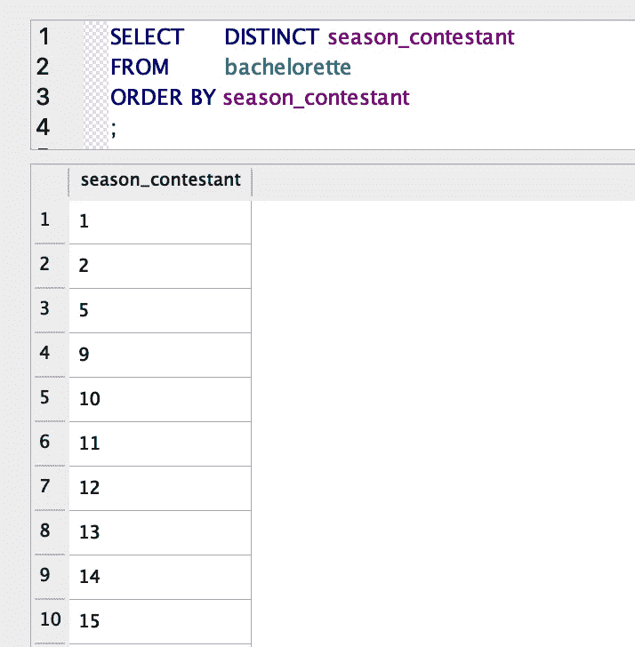

或者当我们想知道哪些单身女子是不到 30 岁的护士，有棕色或黑色的头发，但按名字的字母顺序排列。

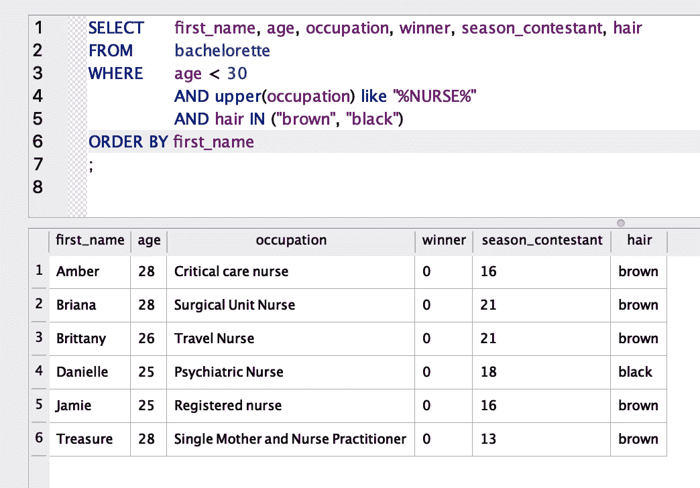

也许我们想按年龄从大到小，按季节来看所有的女孩。可以按多列排序。因此，在这种情况下，首先是季节，然后是年龄，结果将按季节排序，然后在季节内按年龄排序。

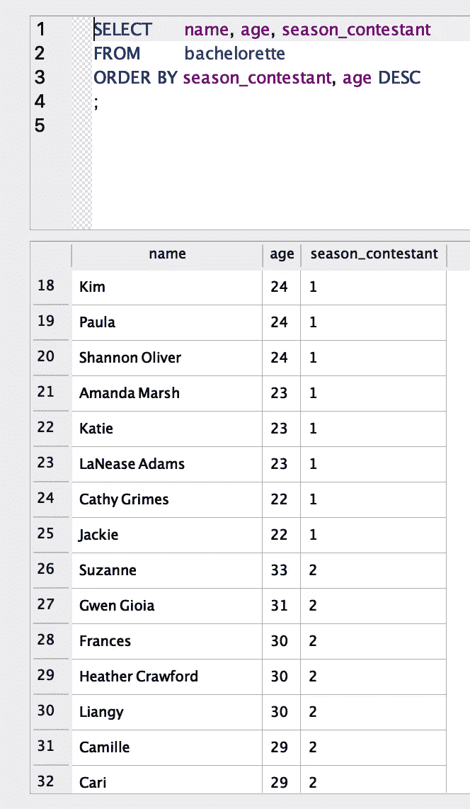

我们也可以根据身高和年龄对男人进行分类。让我们按从高到矮的顺序排列它们，任何两个一样高，按从年轻到年长的顺序排列。

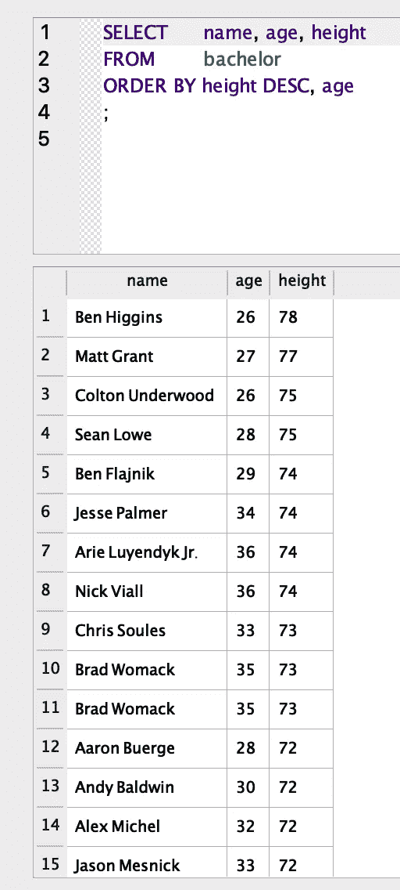

## 连接和别名

您是否觉得已经掌握了从一个表中提取数据的技巧？是时候将两个(或更多)结合在一起了！您可能想知道为什么我们还没有查看城市、州和国家字段。在*单身女郎*和*单身汉*的表格中，城市、州和国家 id 本身对我们来说毫无意义。为了找出每个人来自哪里，我们需要加入到*家乡*表中。加入也是提出别名的好时机。有时当您联接表时，它们会有同名的列。为了在整个查询中区分它们，您需要编写 table.column 名称(这称为命名空间)。由于表名可能很长，所以为表指定一个只有一两个字母的新名称更容易。下面你会看到，我把*的未婚女子*命名为 *b* ，把*的家乡*命名为 *h* 。这就是混叠。

连接将始终遵循 FROM 子句。您将声明要将哪个表连接到原始表，然后必须声明哪些列匹配。在这种情况下，我们希望将 *hometowns* 表连接到*单身女郎*表，并将 city_id 匹配到她的 city _ id，state_id 匹配到她的 state _ id，country_id 匹配到她的 country _ id。在 SELECT 语句中，我省略了 id，只选择查看位置本身，这样我们可以很容易地看到女孩的家乡。我先按国家字母顺序排序，然后按季节排序，但前提是这些女孩不是加拿大人。

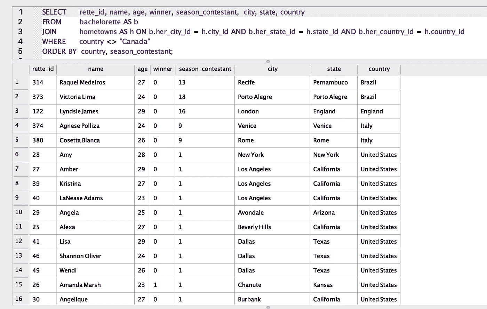

我们还可以做一些事情，比如计算数据库中每个县有多少女孩。别名也适用于聚合。下面，我将 COUNT(*)列重命名为 total_girls。您再次看到 GROUP BY 是因为我们有一个聚合，而 ORDER BY 是因为我想按参与者从高到低的顺序看到各个国家。

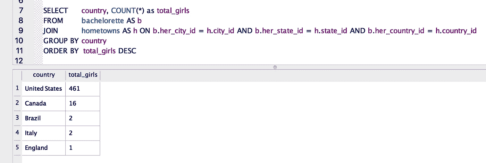

我们还可以把*单身女郎*桌加入到*单身贵族*桌，看看哪个女孩出现在哪个单身贵族季。对于这个例子，我们需要匹配 *b* 。season_lead = *g* 。赛季 _ 选手。在 SELECT 语句中，我只包含了他们的姓名和年龄，但是正如您所看到的，我仍然能够按照他的身高进行排序。杰克·帕维尔卡是最矮的单身汉，所以他和他的姑娘们是最矮的。

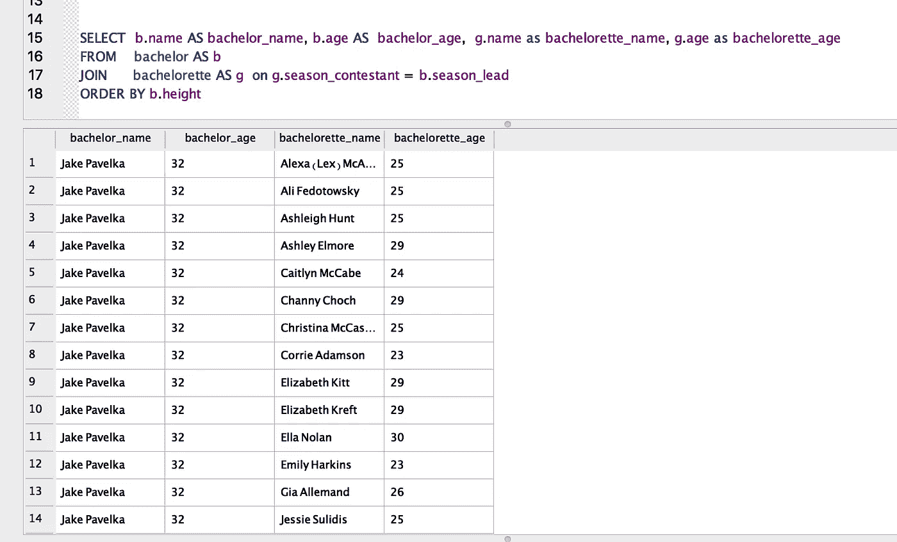

重要的是要知道连接比这更复杂。有几种类型，内部、右侧、左侧、外部、联合和多重联接。我不打算在这篇文章中详细介绍它们，但是如果你喜欢这篇文章并且想要一篇关于连接的文章，请在评论中告诉我！现在，只需要知道 INNER 是最常见的连接，也是默认连接。提取的数据将包括两个表中的行，其中连接列匹配且不为空。

## 限制

最后但肯定不是最不重要的是限制。这可能是 SELECT 和 FROM 之后最常用的子句。LIMIT 允许您只查看一个子集，而不是返回每一行。当浏览超过 100K 行的大型数据集时，这有利于提高速度，因为您可以设置 100 或 1000 的限制，以便查看您正在处理的内容。如果你只想看到最好的结果，不管是前 10 个最高的单身汉还是前 25 个销售额最高的商店(在现实世界中)，它也可以是一个工具。

现在就把我们学过的都放在一起吧！下面我们找到了年龄最大的 5 位棕发单身汉，他们的单身女性来自加利福尼亚、德克萨斯、纽约或佛罗里达，平均年龄不到 27 岁。

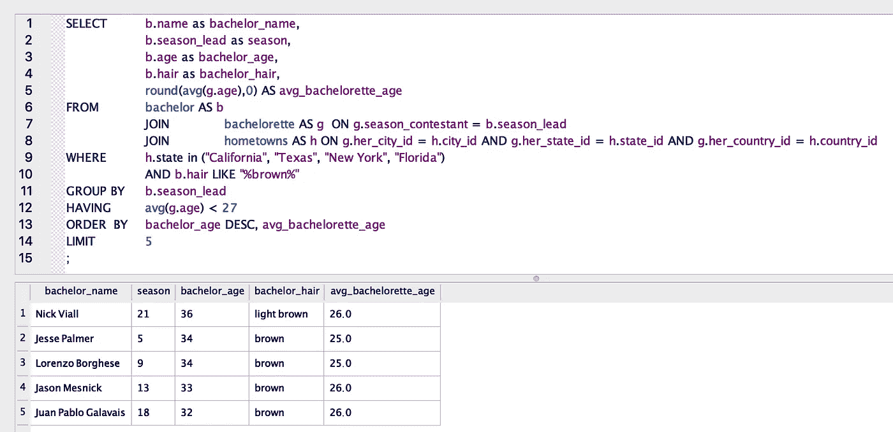

在这里，我们统计了在单身汉至少 6 英尺 2 英寸的季节里，来自每个州的单身女郎的数量，按照最高计数排序，然后按照字母顺序排列家乡州，并限定前 10 个结果。

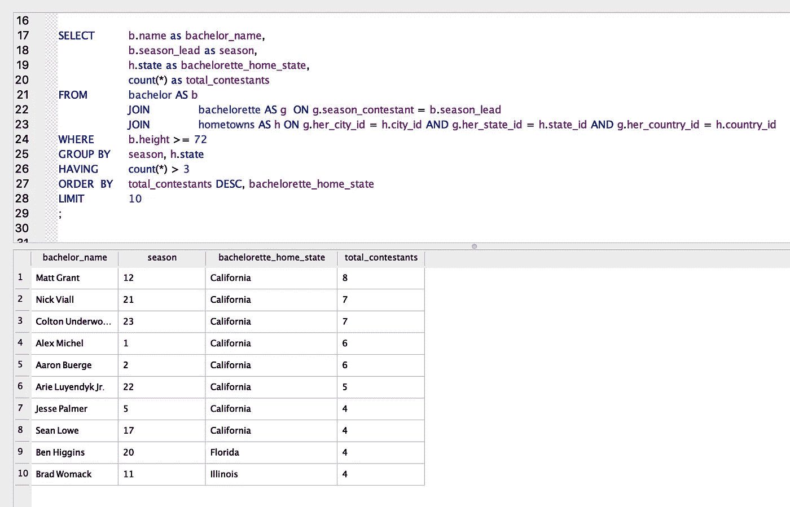

## 其他重要的实践资源

*   [SQL 教学](https://www.sqlteaching.com/)
*   [Udacity:用于数据分析的 SQL](https://www.udacity.com/course/sql-for-data-analysis--ud198)

我从维基百科收集数据，用 excel 和 python 清理并格式化。